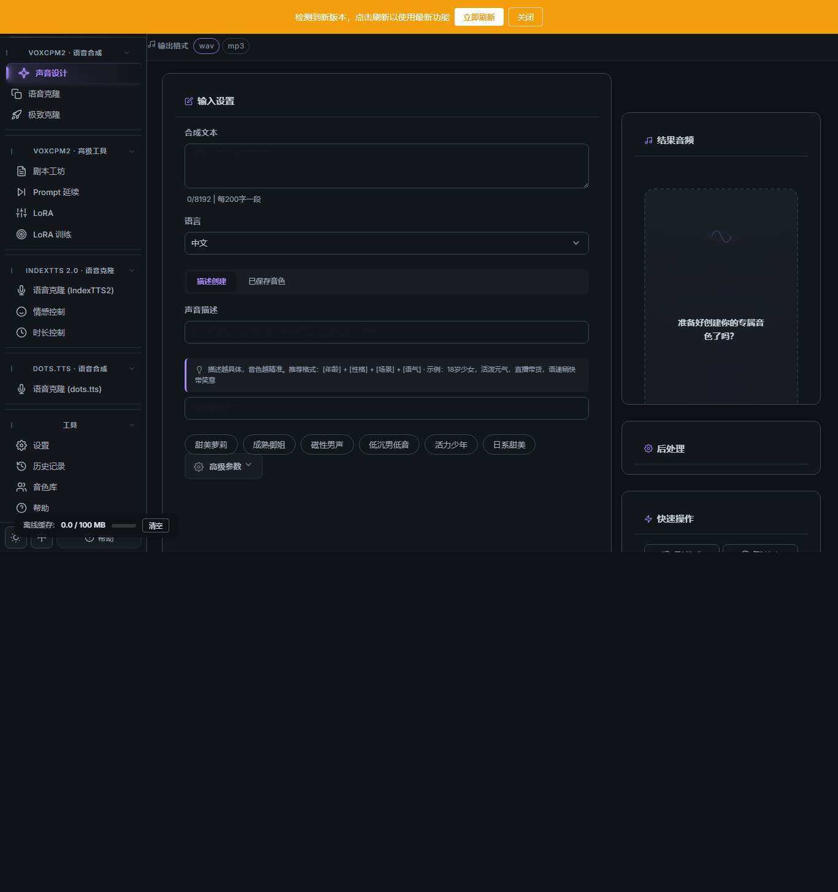
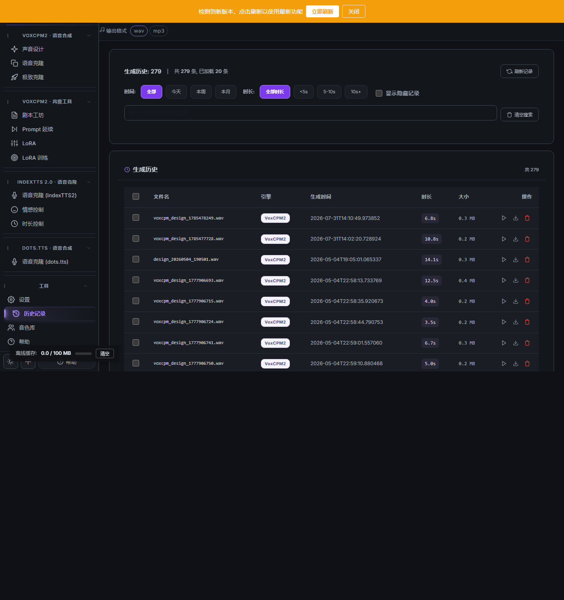

<div align="center">

# TTS MultiModel

**多模型语音合成平台 | Multi-Model Text-to-Speech Platform**

基于 VoxCPM2、IndexTTS 2.0 和 dots.tts 的开源语音合成平台，支持声音克隆、声音设计、LoRA 微调与多角色剧本配音

A powerful open-source multi-model Text-to-Speech platform with voice cloning, voice design, LoRA fine-tuning, and multi-character script dubbing

[](LICENSE)
[](https://www.python.org/downloads/)
[](https://fastapi.tiangolo.com/)
[](https://pytorch.org/)
[](https://www.docker.com/)
[](https://github.com/ReSerendipity/TTS_MultiModel/actions/workflows/ci.yml)

[English](#english) · [中文](#中文) · [Features](#-features) · [Quick Start](#-quick-start) · [Documentation](#-documentation) · [API](#-api-endpoints) · [Contributing]

</div>

---

<a id="中文"></a>

## Why TTS MultiModel?

| 优势 | 说明 |
|------|------|
| **一站式平台** | 集成 VoxCPM2 + IndexTTS2 + dots.tts 多引擎，声音克隆、声音设计、剧本配音、LoRA 微调，无需在多个工具间切换 |
| **极低门槛** | 内置 WinPython + 一键安装脚本，Windows 用户开箱即用；Docker 部署仅需一行命令 |
| **完整工具链** | 从数据准备到模型训练到推理部署，覆盖 TTS 全生命周期 |
| **开源透明** | Apache 2.0 许可，可商用，可二次开发，社区驱动 |
| **多语言界面** | 支持中文、英文、日文、韩文，国际化开箱即用 |

## Demo

<div align="center">

| 声音设计 | 声音克隆 |
|:--------:|:--------:|
|  |  |

| 极致克隆 | 剧本配音 |
|:--------:|:--------:|
|  |  |

| LoRA 管理 | 系统设置 |
|:---------:|:--------:|
|  |  |

</div>

### 暗色主题 / Dark Theme

<div align="center">

| 声音设计 (暗) | 历史记录 (暗) |
|:-------------:|:-------------:|
|  |  |

</div>

> 欢迎在 [Discussions](https://github.com/ReSerendipity/TTS_MultiModel/discussions) 中分享你的使用体验！

## 功能亮点

| 功能 | 描述 |
|------|------|
| **多引擎架构** | VoxCPM2 + IndexTTS 2.0 + dots.tts 多 TTS 引擎，灵活切换 |
| **声音克隆** | 仅需少量音频样本即可克隆声音（可控克隆 + 极致克隆） |
| **声音设计** | 通过文字描述生成目标音色的语音 |
| **剧本配音** | 多角色对话剧本自动分配说话人，批量生成配音 |
| **流式生成** | 长文本实时流式音频输出（SSE） |
| **LoRA 微调** | 自定义数据集 LoRA 微调训练 |
| **Web 界面** | FastAPI + HTMX + Jinja2 现代化响应式 Web UI |
| **批量处理** | 支持批量音频生成 |
| **历史管理** | SQLite 历史记录，支持搜索、筛选、分页 |
| **多语言界面** | 支持中文、英文、日文、韩文界面切换 |
| **多 GPU 后端** | NVIDIA CUDA / Apple MPS / CPU |
| **自定义音色库** | 支持用户保存和管理自定义音色 |

## 环境要求

| 项目 | 要求 |
|------|------|
| 操作系统 | Windows 10/11 (64-bit) 或 Linux |
| Python | 3.12+（Windows 内置 WinPython，也可自行安装） |
| GPU | NVIDIA (CUDA) / Apple Silicon (MPS)，推荐 6.5GB+ VRAM |
| VC 运行库 | Windows 需安装 Visual C++ Redistributable（项目内含） |
| SoX（音频效果处理） | Windows 需下载 SoX 14.4.2 并解压到 `bin/sox-14.4.2-win32/sox-14.4.2/`（见下方说明） |

> **SoX 下载（Windows）**：从 https://sourceforge.net/projects/sox/files/sox/14.4.2/ 下载 `sox-14.4.2-win32.zip`，解压后确保目录结构为 `bin/sox-14.4.2-win32/sox-14.4.2/sox.exe`（`clean_launch.py` 会自动将其加入 PATH）。Linux/macOS 可通过包管理器安装（`apt install sox` / `brew install sox`）。

## 快速开始

### Windows 安装

**方式一：使用内置 WinPython（推荐）**

```bash
git clone https://github.com/ReSerendipity/TTS_MultiModel.git
cd TTS_MultiModel

# 安装 VC 运行库（首次运行）
# 双击 VC 运行库\VC_redist.x64.exe

# 安装依赖
install.bat

# 下载模型（见下方"模型下载"章节）

# 启动应用
start.bat
```

**方式二：使用自己的 Python 环境**

```bash
git clone https://github.com/ReSerendipity/TTS_MultiModel.git
cd TTS_MultiModel
pip install -r requirements.txt

# 下载模型后启动
python bin\clean_launch.py
```

### Linux 安装

```bash
git clone https://github.com/ReSerendipity/TTS_MultiModel.git
cd TTS_MultiModel
chmod +x install.sh && ./install.sh

# 下载模型后启动
chmod +x start.sh && ./start.sh
```

### Docker 部署

```bash
# Docker Compose 一键启动
docker compose up -d

# 或手动构建
docker build -t tts-multimodel .
docker run -d --gpus all -p 7869:7869 \
  -v ./pretrained_models:/app/pretrained_models \
  -v ./outputs:/app/outputs \
  -v ./personas:/app/personas \
  tts-multimodel
```

访问 `http://localhost:7869` 即可使用。Docker 部署需要 nvidia-docker runtime。

## 模型下载

模型需单独下载并放入 `pretrained_models/` 目录：

### VoxCPM2 引擎所需模型

| 模型 | 说明 | 存放目录 |
|------|------|----------|
| VoxCPM2 | 主 TTS 模型 | `pretrained_models/VoxCPM2/` |
| SenseVoiceSmall | ASR 语音识别模型 | `pretrained_models/SenseVoiceSmall/` |
| speech_zipenhancer | 音频降噪模型 | `pretrained_models/speech_zipenhancer/` |

### IndexTTS 2.0 引擎所需模型

| 模型 | 说明 | 存放目录 |
|------|------|----------|
| IndexTTS2 | IndexTTS 2.0 TTS 模型 | `pretrained_models/IndexTTS2/` |

### dots.tts 引擎所需模型

| 模型 | 说明 | 存放目录 |
|------|------|----------|
| dots.tts | dots.tts TTS 引擎（第三方/开源实现） | `pretrained_models/dots_tts/` |

从 [HuggingFace](https://huggingface.co/) 或 [ModelScope](https://modelscope.cn/) 下载。

快捷下载脚本：
```bash
python scripts/download_indextts2.py
```

详细说明见 [模型下载指南](docs/MODEL_DOWNLOADS.md)。

## 配置

编辑 `config.yaml` 自定义参数：

- **生成参数**: `cfg_value`（引导系数）、`inference_timesteps`（推理步数）、`normalize`（文本归一化）、`denoise`（降噪）
- **服务设置**: 端口（默认 7869）、主机地址、GPU 设置
- **API 认证**: `api_auth` 区域配置 token 认证

详见 [参数调整指南](docs/ADJUSTABLE_PARAMETERS.md)。

## 技术栈

| 层级 | 技术 |
|------|------|
| Web 框架 | FastAPI + Uvicorn |
| 前端 | HTMX + Jinja2 + Bootstrap |
| TTS 引擎 | VoxCPM2 + IndexTTS 2.0 + dots.tts |
| ASR 引擎 | SenseVoiceSmall |
| 音频处理 | speech_zipenhancer + FFmpeg + SoX |
| 深度学习 | PyTorch + Transformers + FunASR |
| 数据库 | SQLite |
| 容器化 | Docker + Docker Compose |

## API 端点

| 端点 | 方法 | 说明 |
|------|------|------|
| `/api/system/health` | GET | 健康检查 |
| `/api/system/gpu` | GET | GPU 利用率信息 |
| `/api/generate/voxcpm2/clone` | POST | 声音克隆 (VoxCPM2) |
| `/api/generate/voxcpm2/design` | POST | 声音设计 (VoxCPM2) |
| `/api/generate/voxcpm2/script` | POST | 剧本配音 (VoxCPM2) |
| `/api/generate/voxcpm2/streaming_sse` | POST | 流式生成 (SSE) |
| `/api/generate/indextts2/synthesize` | POST | TTS 合成 (IndexTTS 2.0) |
| `/api/generate/dots/synthesize` | POST | TTS 合成 (dots.tts) |
| `/api/model/load` | POST | 加载模型 |
| `/api/model/unload` | POST | 卸载模型 |
| `/api/history` | GET | 生成历史 |

> 生产环境建议在 `config.yaml` 的 `api_auth` 区域启用 API 认证。

## 项目结构

```
TTS_MultiModel/
├── bin/                          # 应用程序代码
│   ├── integrated_app/          # 主应用模块
│   │   ├── routes/             # API 路由处理
│   │   │   ├── generate/       # TTS 生成路由 (VoxCPM2, IndexTTS2, dots.tts)
│   │   │   └── system/         # 系统路由 (健康检查，GPU, 设置)
│   │   ├── engines/            # TTS 模型引擎
│   │   │   ├── voxcpm2/       # VoxCPM2 引擎实现
│   │   │   └── indextts2_engine.py  # IndexTTS 2.0 引擎
│   │   │   └── dots_engine.py        # dots.tts 引擎实现（示例）
│   │   ├── training/           # 模型训练模块
│   │   ├── middleware/         # HTTP 中间件 (CSRF, 请求 ID)
│   │   ├── templates/          # Jinja2 HTML 模板
│   │   │   ├── locales/            # i18n 翻译文件 (zh, en, ja, ko)
│   │   │   └── ui/                 # UI 组件
│   ├── clean_launch.py         # 清理启动脚本
│   └── ffmpeg.exe / ffplay.exe # 音频工具
├── data/                        # 运行时数据
├── docs/                        # 项目文档
├── examples/                    # 训练示例数据
├── personas/                    # 自定义音色文件
├── scripts/                     # 工具和调试脚本
├── tests/                       # 测试套件
├── config.yaml                  # 应用配置
├── pyproject.toml               # Python 项目元数据
├── Dockerfile                   # Docker 构建配置
├── docker-compose.yml           # Docker Compose 配置
└── LICENSE                      # Apache 2.0 许可证
```

## 故障排除

| 问题 | 解决方案 |
|------|----------|
| VC 运行库错误 (Windows) | 安装 `VC 运行库\VC_redist.x64.exe` |
| 模型未找到 | 确保模型下载到 `pretrained_models/` 且目录结构正确 |
| GPU 未检测到 | 安装对应 PyTorch 版本 (CUDA/MPS)，更新驱动 |
| 端口被占用 | 应用会自动选择可用端口，查看控制台输出 |
| Docker GPU 访问 | 确保安装 nvidia-docker runtime |

详细日志查看 `logs/app.log`。

## 参与贡献

欢迎贡献！参与方式：

1. **报告 Bug** - 提交 Issue 并附上复现步骤
2. **功能建议** - 提交带 `enhancement` 标签的 Issue
3. **提交代码** - Fork → Branch → Commit → Push → Pull Request
4. **改进文档** - 修复错别字、添加示例、翻译内容

详见 [贡献指南](CONTRIBUTING.md)。

## 许可证

本项目基于 [Apache License 2.0](LICENSE) 开源。

Copyright (c) 2026 ReSerendipity

## 文档

- [模型下载指南](docs/MODEL_DOWNLOADS.md) - 模型下载与配置
- [模型扩展指南](docs/MODEL_EXTENSION_GUIDE.md) - 添加新 TTS 引擎
- [IndexTTS2 集成指南](docs/INDEXTTS2_INTEGRATION_GUIDE.md) - IndexTTS 2.0 集成详情
- [项目架构](docs/PROJECT_ARCHITECTURE.md) - 系统架构概览
- [参数调整](docs/ADJUSTABLE_PARAMETERS.md) - 配置参数参考
- [UI 开发指南](docs/UI 开发指南_README.md) - Web UI 开发指南
- [改进手册](docs/IMPROVEMENT_GUIDBOOK.md) - 优化和改进建议

## 相关项目

以下开源项目在功能、架构或技术上与本项目有较高参考价值：

| 项目 | 说明 | Stars |
|------|------|-------|
| [VoxCPM](https://github.com/OpenBMB/VoxCPM) | OpenBMB 多语言 TTS，本项目 VoxCPM2 引擎的上游 | ~29.6k |
| [Fish Speech](https://github.com/fishaudio/fish-speech) | Fish Audio 多语言 TTS，80+ 语言支持，RL 对齐 | ~70k+ |
| [GPT-SoVITS](https://github.com/RVC-Boss/GPT-SoVITS) | 少样本 TTS，完整训练工具链 | ~50k |
| [ChatTTS](https://github.com/2noise/ChatTTS) | 对话式 TTS，精细韵律控制 | ~37.5k |
| [OpenVoice](https://github.com/myshell-ai/OpenVoice) | MyShell 即时语音克隆，风格控制 | ~25k+ |
| [CosyVoice](https://github.com/FunAudioLLM/CosyVoice) | 阿里多语言 TTS，Flow Matching + vLLM 加速 | ~18.6k |
| [Chatterbox](https://github.com/resemble-ai/chatterbox) | Resemble AI 低延迟 TTS，模型分级策略 | ~19.2k |

## 致谢

- [VoxCPM2](https://github.com/OpenBMB/VoxCPM) - OpenBMB 开源 TTS 模型
- [IndexTTS2](https://github.com/IndexTeam/IndexTTS2) - IndexTeam 开源 TTS 模型
- [dots.tts](https://github.com/dots-tts/dots) - dots.tts 引擎及实现
- [FastAPI](https://fastapi.tiangolo.com/) 和 [HTMX](https://htmx.org/) - Web 框架
- 所有开源贡献者

---

<div align="center">

**如果这个项目对你有帮助，请给个 Star 支持一下！**

</div>
