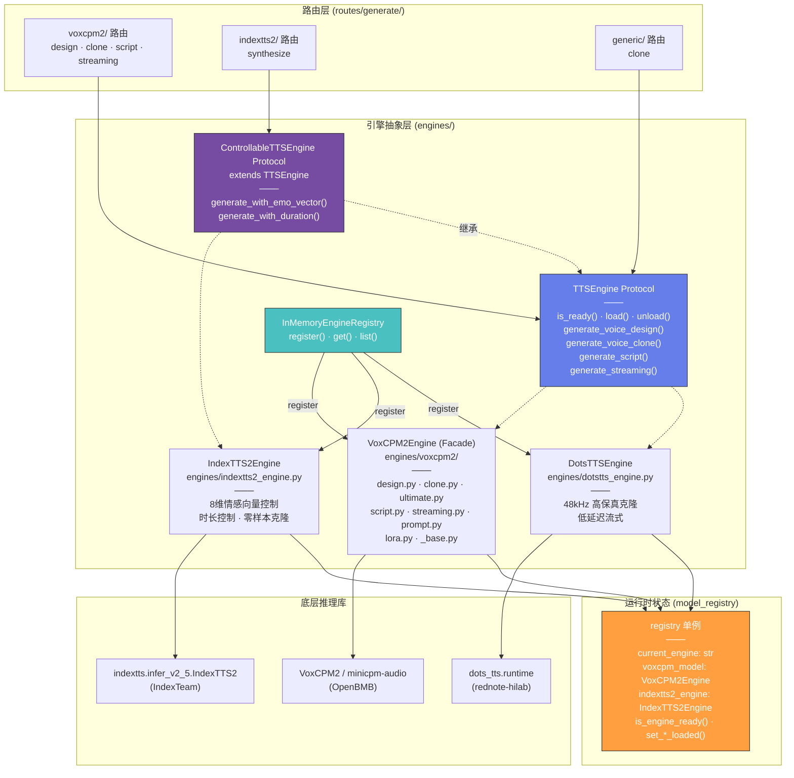
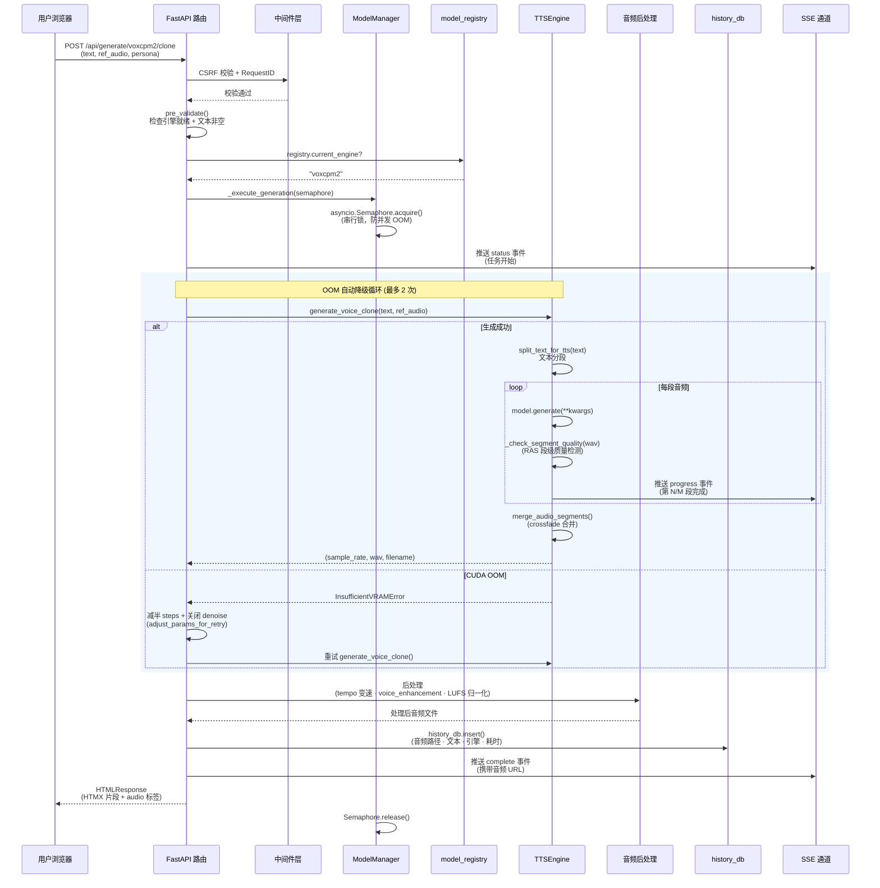
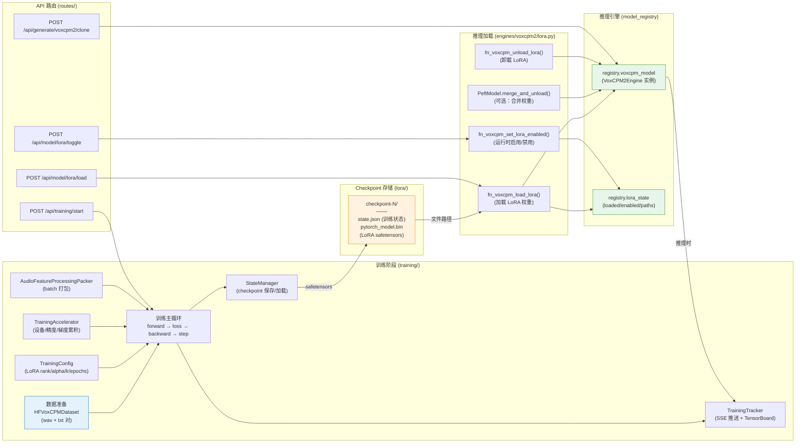

# TTS MultiModel 总体架构文档

> 本文档面向新加入项目的贡献者，用 Mermaid 图描述三大核心架构关系。
> 建议配合 [ADR 架构决策记录](adr/) 和 [AGENTS.md](../AGENTS.md) 阅读。

---

## 一、系统分层总览

```
┌─────────────────────────────────────────────────────────┐
│                    对外接口层                              │
│  WebUI (Jinja2+Alpine.js+htmx)  │  OpenAI 兼容 API  │  MCP Server │
├─────────────────────────────────────────────────────────┤
│                    路由层 (routes/)                        │
│  generate/ │ system/ │ model/ │ training/ │ sse/ │ pages/ │
├─────────────────────────────────────────────────────────┤
│                    服务层                                  │
│  model_manager │ generation │ audio_processing │ history_db │
│  persona_manager │ task_queue │ cache │ watermark         │
├─────────────────────────────────────────────────────────┤
│                    引擎抽象层 (engines/)                    │
│  TTSEngine Protocol + EngineRegistry                      │
│  ┌──────────┐ ┌──────────────┐ ┌───────────┐            │
│  │ VoxCPM2  │ │ IndexTTS 2.5 │ │ dots.tts  │            │
│  └──────────┘ └──────────────┘ └───────────┘            │
├─────────────────────────────────────────────────────────┤
│                    基础设施层                               │
│  gpu_backend │ config │ monitor │ middleware │ security   │
│  text_frontend │ ras_sampling │ bad_case_retry            │
└─────────────────────────────────────────────────────────┘
```

---

## 二、引擎抽象层（Mermaid 图 1）

三个 TTS 引擎通过 `TTSEngine` Protocol 统一接口，路由层无需感知具体引擎实现。
`InMemoryEngineRegistry` 管理引擎类的注册与发现，`model_registry` 持有运行时引擎实例。



**关键设计点**：

1. **Protocol 而非继承**：`TTSEngine` 是 `typing.Protocol`（鸭子类型），引擎无需显式继承，降低耦合
2. **Facade 模式**：`VoxCPM2Engine` 是外观类，将调用转发至 `voxcpm2/` 子包内各功能模块
3. **运行时注册**：`engine_registry.register()` 在 `engines/__init__.py` 模块加载时自动执行
4. **统一状态管理**：`model_registry.registry` 全局单例持有当前引擎引用，路由层通过 `registry.current_engine` 判断可用引擎

---

## 三、TTS 请求完整流程（Mermaid 图 2）

以"声音克隆"为例，展示从用户输入到音频返回的完整请求流程，包含 SSE 进度推送、
OOM 自动降级、音频后处理和历史记录。



**流程要点**：

1. **串行锁**：`_execute_generation` 通过 per-engine `asyncio.Semaphore`（默认容量 1）保证同一引擎不并发推理，防止显存溢出
2. **文本分段**：`split_text_for_tts` 按标点和长度切分，避免超过模型 `max_len` 限制
3. **RAS 质量检测**：每段生成后检测时长/RMS/方差三重指标，退化时自动递增 `cfg_value` 重试
4. **OOM 降级**：捕获 `InsufficientVRAMError` 后自动减半推理步数、关闭降噪重试
5. **SSE 实时推送**：进度通过独立 SSE 端点 `/api/sse/events` 推送，不阻塞主响应
6. **原子写入**：音频文件通过 tempfile + `os.replace` 原子写入，防止进程中断产生损坏文件

---

## 四、训练 → 推理权重流转（Mermaid 图 3）

LoRA 微调训练产生的权重如何加载回推理引擎，实现从训练到推理的闭环。
训练模块（`training/`）与推理模块（`engines/`）通过 checkpoint 文件解耦。



**权重流转要点**：

1. **训练独立**：`training/` 模块在训练过程中不直接操作推理引擎，仅产出 checkpoint 文件
2. **Checkpoint 格式**：`state.json`（可序列化训练状态）+ `pytorch_model.bin`（LoRA safetensors 权重）
3. **断点续训**：`StateManager.load_latest()` 恢复 `TrainingState`，从中断 epoch 继续
4. **运行时加载**：`fn_voxcpm_load_lora()` 将 LoRA 权重注入已加载的 `registry.voxcpm_model`
5. **动态启停**：`fn_voxcpm_set_lora_enabled()` 可在推理时热切换 LoRA 效果，无需重新加载模型
6. **权重合并**：可选调用 `merge_and_unload()` 将 LoRA 权重合并到基础权重，消除推理开销

---

## 五、关键模块速查表

| 模块 | 位置 | 职责 |
|------|------|------|
| `engine_interface.py` | `bin/integrated_app/` | `TTSEngine` Protocol + `InMemoryEngineRegistry` |
| `model_registry.py` | `bin/integrated_app/` | 全局引擎状态单例 |
| `model_manager.py` | `bin/integrated_app/` | 模型加载/卸载/切换管理（RLock 串行） |
| `generation.py` | `bin/integrated_app/` | 文本分割、音频合并、WAV 保存 |
| `gpu_backend.py` | `bin/integrated_app/` | GPU 后端抽象（CUDA/MPS/CPU） |
| `config.py` / `config_models.py` | `bin/integrated_app/` | 配置加载/验证/原子写入 |
| `history_db.py` | `bin/integrated_app/` | SQLite 异步历史记录 |
| `mcp_server.py` | `bin/integrated_app/` | MCP Server（Model Context Protocol） |
| `monitor.py` | `bin/integrated_app/` | HealthMonitor（显存/利用率/泄漏检测） |
| `task_queue.py` | `bin/integrated_app/` | 异步生成任务队列 |
| `watermark.py` / `audio_watermark.py` | `bin/integrated_app/` | FFT 频域水印嵌入/检测 |
| `ras_sampling.py` | `bin/integrated_app/` | RAS 重复感知采样（Fish Speech 借鉴） |
| `bad_case_retry.py` | `bin/integrated_app/` | 坏案例重试（参数调整 + 种子轮换） |

---

*文档生成时间：2026-08-10 | 基于 TTS MultiModel v2.2.0*
