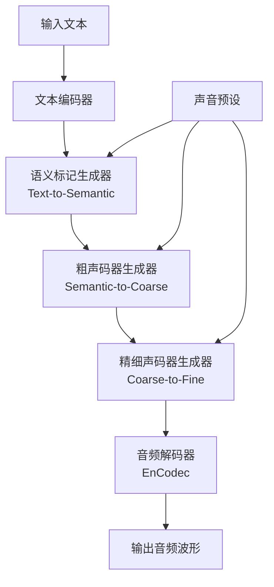

# Bark 技术学习报告

## 一、项目概述

**Bark** 是 Suno 公司开发的开源文本转音频（Text-to-Audio）模型，基于 Transformer 架构。它不仅能生成高逼真的多语言语音，还能生成音乐、背景噪音和简单音效，甚至支持非语言交流（如笑声、叹息、哭泣）。Bark 采用完全生成式方法，直接将文本转换为音频，无需中间音素表示。

### 主要特点
- **多语言支持**：支持 13 种语言（包括中文、英文、日文、韩文等）
- **全生成式架构**：基于 GPT 风格，类似 AudioLM 和 Vall-E
- **非语言音频生成**：支持笑声、叹息、音乐等非语音内容
- **声音预设库**：提供 100+ 种说话人预设
- **低显存支持**：可通过小模型版本在 8GB 显存下运行

## 二、核心架构分析

### 2.1 整体架构

Bark 采用三级级联生成架构：



### 2.2 关键模块职责

| 模块 | 文件 | 职责 |
|------|------|------|
| **API 接口** | `api.py` | 对外提供 `generate_audio` 等高层接口 |
| **生成逻辑** | `generation.py` | 核心生成流程，包含三个阶段的生成函数 |
| **模型定义** | `model.py` | GPT 模型定义（基于 NanoGPT） |
| **精细模型** | `model_fine.py` | 精细声码器生成模型 |
| **命令行** | `cli.py` | 命令行接口 |

## 三、关键代码模块深度解析

### 3.1 三级生成流程

#### 3.1.1 语义标记生成（Text-to-Semantic）
- **输入**：文本 + 声音预设
- **输出**：语义标记序列（语义率 49.9Hz）
- **关键技术**：
  - 使用 BertTokenizer 进行文本分词
  - 支持 KV 缓存加速自回归生成
  - 早停机制（`min_eos_p`）
  - Top-k/Top-p 采样

#### 3.1.2 粗声码器生成（Semantic-to-Coarse）
- **输入**：语义标记 + 声音预设
- **输出**：2 个粗声码器代码本（75Hz）
- **关键技术**：
  - 滑动窗口生成（`sliding_window_len=60`）
  - 历史上下文管理（`max_coarse_history`）
  - 代码本扁平化处理

#### 3.1.3 精细声码器生成（Coarse-to-Fine）
- **输入**：粗声码器代码 + 声音预设
- **输出**：8 个精细声码器代码本
- **关键技术**：
  - 非因果模型（支持双向注意力）
  - 分块处理长序列
  - 历史上下文窗口（最大 512）

### 3.2 模型管理策略

```python
# 全局模型缓存
models = {}  # 存储已加载模型
models_devices = {}  # 存储模型设备信息

# 延迟加载
def preload_models():
    """预加载所有必要模型"""
    load_model(model_type="text", ...)
    load_model(model_type="coarse", ...)
    load_model(model_type="fine", ...)
    load_codec_model(...)

# CPU 卸载支持
if OFFLOAD_CPU:
    models_devices[model_key] = device
    device = "cpu"  # 模型加载到 CPU
```

### 3.3 显存优化技术

1. **小模型支持**：通过环境变量 `SUNO_USE_SMALL_MODELS=True` 启用
2. **CPU 卸载**：`SUNO_OFFLOAD_CPU=True` 将模型卸载到 CPU
3. **混合精度**：自动检测并使用 bfloat16
4. **KV 缓存**：减少重复计算
5. **显存清理**：使用 `torch.cuda.empty_cache()` 和垃圾回收

### 3.4 音频编解码

使用 Facebook 的 **EnCodec** 模型进行音频编码/解码：
- **采样率**：24kHz
- **代码本大小**：1024
- **粗声码器代码本数**：2
- **精细声码器代码本数**：8
- **带宽目标**：6.0 kbps

## 四、技术亮点与创新点

### 4.1 完全生成式架构
- **无需音素转换**：直接从文本生成音频，避免了传统 TTS 的音素转换步骤
- **多模态输出**：同一模型可生成语音、音乐、音效
- **创意自由度**：GPT 风格的生成允许模型在生成过程中进行“创意发挥”

### 4.2 三级级联生成
- **语义层**：捕获文本的语义和韵律信息
- **声码器层**：生成音频的声学细节
- **优势**：解耦语义和声学建模，提高生成质量

### 4.3 声音预设系统
- **100+ 种预设**：覆盖多种语言和说话人风格
- **易于使用**：通过字符串标识符选择预设
- **可扩展**：支持自定义 `.npz` 预设文件

### 4.4 低资源优化
- **小模型版本**：参数量减少，显存需求降低
- **CPU 卸载**：支持在低显存设备上运行
- **动态模型加载**：按需加载模型，减少内存占用

## 五、可借鉴之处

### 5.1 可整合到 TTS_MultiModel 的技术

#### 5.1.1 模型管理策略
- **延迟加载模式**：按需加载模型，减少启动时间
- **全局模型缓存**：避免重复加载
- **设备感知卸载**：自动在 GPU/CPU 间迁移模型

```python
# 可借鉴的模型管理类
class ModelManager:
    def __init__(self):
        self.models = {}
        self.devices = {}
    
    def load_model(self, model_type, use_gpu=True, use_small=False):
        device = self._get_device(use_gpu)
        if model_type not in self.models:
            self.models[model_type] = self._load_model(model_type, device)
        return self.models[model_type]
```

#### 5.1.2 显存优化技术
- **环境变量配置**：通过环境变量控制模型大小和设备
- **显存监控**：定期清理显存，防止内存泄漏
- **混合精度推理**：自动检测并使用最优精度

#### 5.1.3 生成流程优化
- **KV 缓存**：加速自回归生成
- **早停机制**：避免生成过长序列
- **温度控制**：支持生成多样性调节

### 5.2 架构模式与最佳实践

1. **模块化设计**：清晰的生成阶段分离
2. **配置驱动**：通过环境变量和配置文件控制行为
3. **错误处理**：健壮的模型加载和生成逻辑
4. **进度反馈**：使用 tqdm 提供生成进度

### 5.3 需要注意的兼容性问题

1. **依赖管理**：Bark 依赖特定版本的 transformers 和 encodec
2. **模型格式**：使用 PyTorch 的 checkpoint 格式
3. **音频采样率**：固定 24kHz，可能需要重采样

## 六、参考资源

### 6.1 论文与研究
- [AudioLM: A Language Modeling Approach to Audio Generation](https://arxiv.org/abs/2209.03143)
- [VALL-E: Neural Codec Language Models are Zero-Shot Text to Speech Synthesizers](https://arxiv.org/abs/2301.02111)
- [EnCodec: High Fidelity Neural Audio Compression](https://arxiv.org/abs/2210.13438)

### 6.2 代码仓库
- [Bark GitHub 仓库](https://github.com/suno-ai/bark)
- [nanoGPT](https://github.com/karpathy/nanoGPT) - Bark 的 GPT 实现基础
- [EnCodec](https://github.com/facebookresearch/encodec) - 音频编解码器

### 6.3 预训练模型
- **HuggingFace 模型**：`suno/bark`
- **声音预设库**：[Notion 文档](https://suno-ai.notion.site/8b8e8749ed514b0cbf3f699013548683?v=bc67cff786b04b50b3ceb756fd05f68c)

### 6.4 相关项目
- [CosyVoice](https://github.com/FunAudioLLM/CosyVoice) - 阿里巴巴的 TTS 项目
- [GPT-SoVITS](https://github.com/RVC-Boss/GPT-SoVITS) - 少样本语音转换
- [ChatTTS](https://github.com/2noise/ChatTTS) - 对话式 TTS

---

**报告生成时间**：2026-07-24  
**分析版本**：Bark v0 (MIT License)  
**适用场景**：多语言语音生成、创意音频内容制作、研究用途