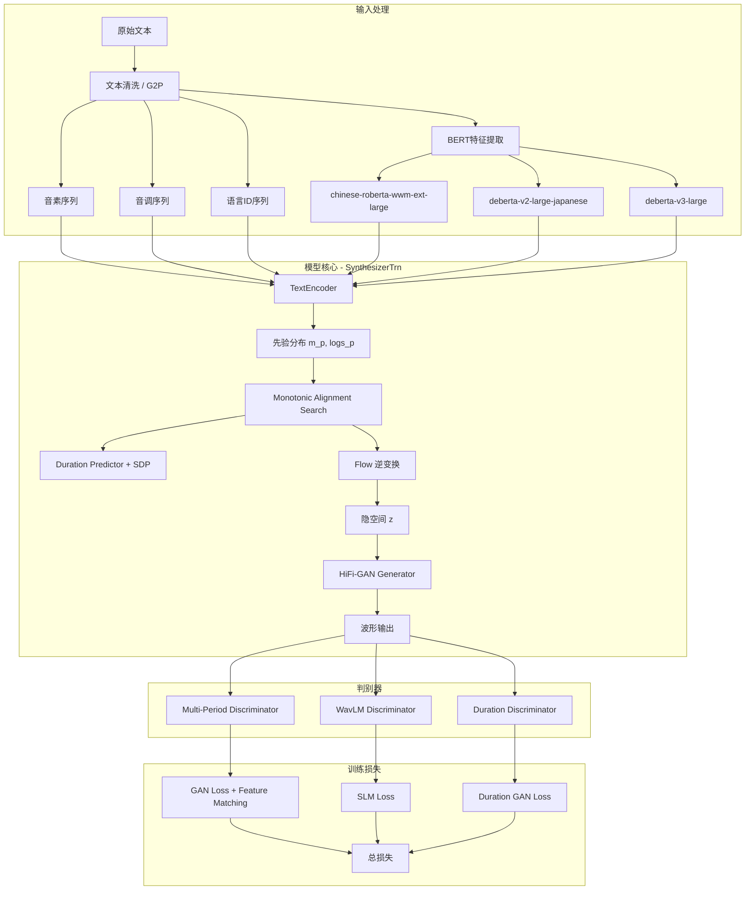

# Bert-VITS2 技术学习报告

> 基于 `reference_repos/Bert-VITS2` 仓库的深度代码分析
> 分析日期：2026-07-24

---

## 1. 项目概述

### 1.1 仓库定位

Bert-VITS2 是由 [FishAudio](https://github.com/fishaudio) 团队维护的开源端到端语音合成系统，核心思路来源于 [anyvoiceai/MassTTS](https://github.com/anyvoiceai/MassTTS)。项目在 VITS2 骨架网络基础上集成了多语言 BERT 嵌入，实现了高质量的中日英三语语音合成。

**当前状态**：项目已停止维护，官方推荐迁移到全新的自回归 TTS 方案 [Fish-Speech](https://github.com/fishaudio/fish-speech)。

### 1.2 主要功能

| 功能 | 说明 |
|------|------|
| 多语言 TTS | 中文（ZH）、日文（JP）、英文（EN）三语合成 |
| 混合语言合成 | 支持 mix 模式（多语言拼接）和 auto 模式（自动语种识别） |
| 多说话人 | 通过 speaker embedding 支持多角色 |
| 风格控制 | 支持文本提示（Text Prompt）和音频提示（Audio Prompt） |
| 情感控制 | BERT 特征混合实现风格迁移 |
| 模型压缩 | 支持 FP16 半精度导出和 ONNX 导出 |
| 版本兼容 | 1.0 ~ 2.3 全版本推理兼容 |

### 1.3 技术栈

| 层级 | 技术 |
|------|------|
| 深度学习框架 | PyTorch 2.0+（支持 Flash Attention、TF32） |
| 模型架构 | VITS2 + 多语言 BERT + WavLM |
| 文本处理 | pypinyin（中文）、pyopenjtalk（日文）、CMU dict（英文） |
| BERT 模型 | chinese-roberta-wwm-ext-large、deberta-v2-large-japanese、deberta-v3-large |
| 语音特征 | WavLM-base-plus（SLM 判别器） |
| Web UI | Gradio 3.50.2 |
| 分布式训练 | PyTorch DDP（支持 NCCL/gloo 后端） |
| 模型导出 | ONNX（多版本支持） |

---

## 2. 核心架构分析

### 2.1 整体架构图



### 2.2 关键模块职责与交互

```
Bert-VITS2/
├── models.py            # 模型定义（SynthesizerTrn、判别器等）
├── train_ms.py          # 多说话人训练脚本（DDP）
├── infer.py             # 推理入口（版本兼容路由）
├── data_utils.py        # 数据加载（Dataset + BucketSampler）
├── text/                # 文本处理管线
│   ├── __init__.py      # 符号转换 + BERT 调度
│   ├── symbols.py       # 多语言音素符号表
│   ├── chinese.py       # 中文 G2P（pypinyin）
│   ├── chinese_bert.py  # 中文 BERT 特征提取
│   ├── japanese.py      # 日文 G2P（pyopenjtalk）
│   ├── japanese_bert.py # 日文 BERT 特征提取
│   ├── english.py       # 英文 G2P（CMU dict）
│   └── english_bert_mock.py  # 英文 BERT 特征提取
├── attentions.py        # 注意力机制（相对位置编码、FFT）
├── modules.py           # 基础模块（WN、ResBlock、Flow层等）
├── losses.py            # 损失函数（GAN、KL、WavLM）
├── commons.py           # 工具函数（mask、slice、grad clip）
├── config.py            # 全局配置管理
├── bert_gen.py          # BERT 特征预计算脚本
├── compress_model.py    # 模型压缩（移除优化器状态 + FP16）
├── webui.py             # Gradio Web UI
└── onnx_modules/        # ONNX 导出（多版本）
```

---

## 3. 关键代码模块深度解析

### 3.1 模型训练流程

#### 3.1.1 训练架构

训练使用 4 个独立的网络和优化器（[train_ms.py](file://c:/Users/HONOR/TTS_MultiModel/reference_repos/Bert-VITS2/train_ms.py)）：

| 网络 | 优化器 | 检查点前缀 | 职责 |
|------|--------|-----------|------|
| `SynthesizerTrn` (net_g) | optim_g | G_ | 生成器（文本编码 + Flow + HiFi-GAN） |
| `MultiPeriodDiscriminator` (net_d) | optim_d | D_ | 声学判别器 |
| `WavLMDiscriminator` (net_wd) | optim_wd | WD_ | 语言模型判别器 |
| `DurationDiscriminator` (net_dur_disc) | optim_dur_disc | DUR_ | 时长判别器（可选） |

#### 3.1.2 训练损失函数

生成器总损失构成（[train_ms.py#L588-599](file://c:/Users/HONOR/TTS_MultiModel/reference_repos/Bert-VITS2/train_ms.py#L588-L599)）：

```python
loss_gen_all = (
    loss_gen          # GAN 生成器损失
    + loss_fm         # 特征匹配损失
    + loss_mel        # Mel 频谱重建损失（加权 c_mel）
    + loss_dur        # 时长预测损失（DP + SDP）
    + loss_kl         # KL 散度损失（加权 c_kl）
    + loss_lm         # WavLM 特征匹配损失
    + loss_lm_gen     # WavLM 判别器生成损失
)
```

#### 3.1.3 分布式训练优化

```python
# Flash Attention 加速（train_ms.py 开头）
torch.backends.cuda.sdp_kernel("flash")
torch.backends.cuda.enable_flash_sdp(True)
torch.backends.cuda.enable_mem_efficient_sdp(True)

# TF32 加速矩阵运算
torch.backends.cuda.matmul.allow_tf32 = True
torch.backends.cudnn.allow_tf32 = True

# BF16 混合精度训练
scaler = GradScaler(enabled=hps.train.bf16_run)
with autocast(enabled=hps.train.bf16_run, dtype=torch.bfloat16):
    # 前向传播
```

#### 3.1.4 BERT 特征冻结策略

训练时可选择性冻结 BERT 编码器（[train_ms.py#L204-218](file://c:/Users/HONOR/TTS_MultiModel/reference_repos/Bert-VITS2/train_ms.py#L204-L218)）：

```python
if getattr(hps.train, "freeze_ZH_bert", False):
    for param in net_g.enc_p.bert_proj.parameters():
        param.requires_grad = False
# 类似地可冻结 EN_bert 和 JP_bert
```

### 3.2 数据处理管线

#### 3.2.1 预处理流程

```
原始音频 ──→ 重采样(44100Hz) ──→ 文本清洗/G2P ──→ BERT特征预计算 ──→ 训练数据
  │              resample.py        preprocess_text.py    bert_gen.py
  │                                                          │
  │                                                    *.bert.pt 文件
  │                                                    (与音频同目录)
```

#### 3.2.2 数据加载器

[TextAudioSpeakerLoader](file://c:/Users/HONOR/TTS_MultiModel/reference_repos/Bert-VITS2/data_utils.py#L16-L183) 的数据格式：

```
文件路径|说话人ID|语言|文本|音素|音调|word2ph
```

每条数据包含 9 个张量：
- `phones`: 音素 ID 序列
- `spec`: 线性频谱图
- `wav`: 原始波形
- `sid`: 说话人 ID
- `tone`: 音调 ID
- `language`: 语言 ID
- `bert`: 中文 BERT 特征 (1024, T)
- `ja_bert`: 日文 BERT 特征 (1024, T)
- `en_bert`: 英文 BERT 特征 (1024, T)

#### 3.2.3 Bucket 采样策略

[DistributedBucketSampler](file://c:/Users/HONOR/TTS_MultiModel/reference_repos/Bert-VITS2/data_utils.py#L277-L405) 按音频长度分桶：

```python
boundaries = [32, 300, 400, 500, 600, 700, 800, 900, 1000]
# 将样本按频谱长度分入不同桶，同桶内样本长度相近
# 减少 padding 浪费，提升训练效率
```

#### 3.2.4 BERT 特征提取

以中文为例（[chinese_bert.py](file://c:/Users/HONOR/TTS_MultiModel/reference_repos/Bert-VITS2/text/chinese_bert.py#L15-L60)）：

```python
def get_bert_feature(text, word2ph, device, style_text=None, style_weight=0.7):
    # 加载 chinese-roberta-wwm-ext-large
    inputs = tokenizer(text, return_tensors="pt")
    res = models[device](**inputs, output_hidden_states=True)
    # 取倒数第 3 层隐状态（1024维）
    res = torch.cat(res["hidden_states"][-3:-2], -1)[0].cpu()

    # 风格混合：将 style_text 的 BERT 特征与主文本加权混合
    if style_text:
        style_res = models[device](**style_inputs, output_hidden_states=True)
        style_res_mean = style_res.mean(0)  # 全局风格均值
        repeat_feature = (
            res[i].repeat(word2phone[i], 1) * (1 - style_weight)
            + style_res_mean.repeat(word2phone[i], 1) * style_weight
        )
    return phone_level_feature.T  # (1024, T)
```

**关键设计**：`word2ph` 映射将词级别的 BERT 特征扩展到音素级别，每个词对应若干音素，特征在音素维度上复制。

### 3.3 推理流程（从文本到语音）

#### 3.3.1 推理管线

[推理入口 infer.py](file://c:/Users/HONOR/TTS_MultiModel/reference_repos/Bert-VITS2/infer.py#L151-L332) 的完整流程：

```
输入文本
  │
  ├──→ clean_text() ──→ 音素、音调、word2ph
  │
  ├──→ get_bert() ──→ BERT 特征 (1024, T)
  │     ├── 中文: chinese-roberta-wwm-ext-large
  │     ├── 日文: deberta-v2-large-japanese
  │     └── 英文: deberta-v3-large
  │
  ├──→ cleaned_text_to_sequence() ──→ phone IDs, tone IDs, lang IDs
  │
  └──→ SynthesizerTrn.infer()
        │
        ├── enc_p() ──→ 先验均值/方差 (m_p, logs_p)
        │     └── BERT特征 + 词嵌入 + 音调嵌入 + 语言嵌入 → Transformer Encoder
        │
        ├── SDP + DP ──→ 时长预测
        │     └── w = sdp_ratio * SDP(x) + (1-sdp_ratio) * DP(x)
        │
        ├── generate_path() ──→ 对齐路径 → 扩展先验
        │
        ├── flow.reverse() ──→ 从先验采样 z_p → 隐空间 z
        │
        └── dec() ──→ HiFi-GAN 生成波形
```

#### 3.3.2 SDP/DP 比率控制

推理时通过 `sdp_ratio` 参数控制语音的多样性（[models.py#L1052-1054](file://c:/Users/HONOR/TTS_MultiModel/reference_repos/Bert-VITS2/models.py#L1052-L1054)）：

```python
logw = self.sdp(x, x_mask, g=g, reverse=True, noise_scale=noise_scale_w) * (
    sdp_ratio
) + self.dp(x, x_mask, g=g) * (1 - sdp_ratio)
```

- `sdp_ratio = 0`：纯确定性时长预测（结果更稳定）
- `sdp_ratio = 1`：纯随机时长预测（结果更多样）
- 典型值 `0.5`：平衡稳定性与多样性

#### 3.3.3 多语言混合推理

[infer_multilang](file://c:/Users/HONOR/TTS_MultiModel/reference_repos/Bert-VITS2/infer.py#L335-L438) 支持多段不同语言文本的拼接：

```python
for idx, (txt, lang) in enumerate(zip(text, language)):
    temp_bert, temp_ja_bert, temp_en_bert, temp_phones, ... = get_text(txt, lang, ...)
    # 跳过首尾标记（skip_start/skip_end），实现无缝拼接
    bert.append(temp_bert)
    phones.append(temp_phones)
# 拼接后统一送入模型
bert = torch.concatenate(bert, dim=1)
phones = torch.concatenate(phones, dim=0)
```

### 3.4 优化技术

#### 3.4.1 模型压缩

[compress_model.py](file://c:/Users/HONOR/TTS_MultiModel/reference_repos/Bert-VITS2/compress_model.py) 实现了模型压缩：

```python
def removeOptimizer(config, input_model, ishalf, output_model):
    # 1. 移除后验编码器 enc_q（推理不需要）
    keys = [k for k in new_dict_g["model"].items() if "enc_q" not in k]

    # 2. 可选 FP16 半精度
    new_dict_g = {k: new_dict_g["model"][k].half() for k in keys} if ishalf else ...

    # 3. 重新打包为标准格式
    torch.save({"model": new_dict_g, "iteration": 0, ...}, output_model)
```

#### 3.4.2 ONNX 导出

[onnx_modules/](file://c:/Users/HONOR/TTS_MultiModel/reference_repos/Bert-VITS2/onnx_modules/__init__.py) 支持多版本 ONNX 导出：

- 版本覆盖：V200、V210、V220、V230、V240
- 语言专用版本：V240_ZH（中文）、V240_JP（日文）
- 每个版本包含独立的模型定义和推理代码

#### 3.4.3 推理时内存优化

```python
# 推理完成后主动释放（infer.py#L320-331）
del x_tst, tones, lang_ids, bert, x_tst_lengths, speakers, ja_bert, en_bert
if torch.cuda.is_available():
    torch.cuda.empty_cache()
```

---

## 4. 技术亮点与创新点

### 4.1 BERT 嵌入融合——核心创新

Bert-VITS2 的核心创新是在 VITS2 文本编码器中融合多语言 BERT 嵌入（[models.py#L333-400](file://c:/Users/HONOR/TTS_MultiModel/reference_repos/Bert-VITS2/models.py#L333-L400)）：

```python
class TextEncoder(nn.Module):
    def __init__(self, ...):
        self.emb = nn.Embedding(len(symbols), hidden_channels)       # 音素嵌入
        self.tone_emb = nn.Embedding(num_tones, hidden_channels)     # 音调嵌入
        self.language_emb = nn.Embedding(num_languages, hidden_channels)  # 语言嵌入
        self.bert_proj = nn.Conv1d(1024, hidden_channels, 1)         # 中文 BERT 投影
        self.ja_bert_proj = nn.Conv1d(1024, hidden_channels, 1)      # 日文 BERT 投影
        self.en_bert_proj = nn.Conv1d(1024, hidden_channels, 1)      # 英文 BERT 投影

    def forward(self, x, x_lengths, tone, language, bert, ja_bert, en_bert, g=None):
        # 5路特征相加：音素 + 音调 + 语言 + 中文BERT + 日文BERT + 英文BERT
        x = (
            self.emb(x) + self.tone_emb(tone) + self.language_emb(language)
            + bert_emb + ja_bert_emb + en_bert_emb
        ) * math.sqrt(self.hidden_channels)
```

**优势**：
- BERT 提供了丰富的上下文语义信息，显著提升韵律自然度
- 三语独立 BERT 投影层，避免跨语言干扰
- 非活跃语言用随机噪声填充，保持维度一致

### 4.2 WavLM 语言模型判别器

引入预训练 WavLM 模型作为判别器（[losses.py#L63-154](file://c:/Users/HONOR/TTS_MultiModel/reference_repos/Bert-VITS2/losses.py#L63-L154)），这在当时是非常先进的设计：

```python
class WavLMLoss(torch.nn.Module):
    def __init__(self, model, wd, model_sr, slm_sr=16000):
        self.wavlm = AutoModel.from_pretrained(model)  # 冻结的 WavLM
        self.wd = wd  # 可训练的 WavLM 判别器
        self.resample = torchaudio.transforms.Resample(model_sr, slm_sr)

    def forward(self, wav, y_rec):
        # 真实音频特征（no_grad）
        wav_embeddings = self.wavlm(input_values=wav_16, output_hidden_states=True).hidden_states
        # 合成音频特征
        y_rec_embeddings = self.wavlm(input_values=y_rec_16, output_hidden_states=True).hidden_states
        # 多层特征 L1 匹配
        for er, eg in zip(wav_embeddings, y_rec_embeddings):
            floss += torch.mean(torch.abs(er - eg))
```

**设计亮点**：
- WavLM 提取多层次语音表示，捕捉语音的语义和声学特征
- 真实音频特征冻结（no_grad），合成音频特征可训练
- 在 16kHz 下采样后处理，减少计算量

### 4.3 噪声缩放 MAS

VITS2 引入的噪声缩放单调对齐搜索（[models.py#L867-870](file://c:/Users/HONOR/TTS_MultiModel/reference_repos/Bert-VITS2/models.py#L867-L870)）：

```python
self.use_noise_scaled_mas = kwargs.get("use_noise_scaled_mas", False)
self.mas_noise_scale_initial = kwargs.get("mas_noise_scale_initial", 0.01)
self.noise_scale_delta = kwargs.get("noise_scale_delta", 2e-6)
# 训练过程中噪声逐渐衰减
current_mas_noise_scale = mas_noise_scale_initial - noise_scale_delta * global_step
```

**作用**：训练初期添加噪声使对齐更鲁棒，后期噪声衰减使对齐更精确。

### 4.4 Transformer Coupling Flow

VITS2 用 Transformer Coupling Layer 替代了 VITS 的 WaveNet Coupling Layer（[models.py#L82-145](file://c:/Users/HONOR/TTS_MultiModel/reference_repos/Bert-VITS2/models.py#L82-L145)）：

```python
class TransformerCouplingBlock(nn.Module):
    def __init__(self, ...):
        for i in range(n_flows):
            self.flows.append(modules.TransformerCouplingLayer(...))
            self.flows.append(modules.Flip())
        # 可选参数共享
        self.wn = attentions.FFT(...) if share_parameter else None
```

**优势**：
- Transformer 的全局注意力比 WaveNet 的局部感受野更适合建模长距离依赖
- 支持参数共享，减少模型参数量

### 4.5 版本兼容架构

[推理入口](file://c:/Users/HONOR/TTS_MultiModel/reference_repos/Bert-VITS2/infer.py#L42-L70) 通过映射表实现多版本兼容：

```python
SynthesizerTrnMap = {
    "2.2": V220SynthesizerTrn,
    "2.1": V210SynthesizerTrn,
    "2.0": V200SynthesizerTrn,
    "1.1.1": V111SynthesizerTrn,
    "1.0": V101SynthesizerTrn,
}
```

每个版本有独立的模型定义、符号表和推理函数，通过版本号路由到对应的实现。

---

## 5. 可借鉴之处

### 5.1 可整合到 TTS_MultiModel 的具体技术

#### 5.1.1 BERT 特征增强文本编码

**适用场景**：VoxCPM2 或 IndexTTS2 的文本前端增强

```python
# 借鉴 Bert-VITS2 的 BERT 投影模式
class BertEnhancedTextEncoder(nn.Module):
    def __init__(self, bert_dim=1024, hidden_dim=512):
        self.bert_proj = nn.Conv1d(bert_dim, hidden_dim, 1)

    def forward(self, text_features, bert_features):
        # 将 BERT 语义特征与文本音素特征融合
        bert_emb = self.bert_proj(bert_features).transpose(1, 2)
        return text_features + bert_emb
```

**集成点**：在 [engine_interface.py](file://c:/Users/HONOR/TTS_MultiModel/bin/integrated_app/engine_interface.py) 的 `generate_voice_clone` 中，可以在文本处理阶段提取 BERT 特征并传入模型。

#### 5.1.2 文本风格混合

借鉴 BERT 特征加权混合实现风格控制：

```python
# 风格混合公式（来自 chinese_bert.py）
output_feature = text_bert * (1 - style_weight) + style_bert_mean * style_weight
```

可应用于 TTS_MultiModel 的 Persona 系统，实现更精细的风格控制。

#### 5.1.3 模型压缩工具

[compress_model.py](file://c:/Users/HONOR/TTS_MultiModel/reference_repos/Bert-VITS2/compress_model.py) 的压缩策略可直接复用：
- 移除训练专用模块（如后验编码器）
- FP16 半精度转换
- 清理优化器状态

#### 5.1.4 Bucket 采样策略

[DistributedBucketSampler](file://c:/Users/HONOR/TTS_MultiModel/reference_repos/Bert-VITS2/data_utils.py#L277-L405) 的分桶策略可用于 TTS_MultiModel 的训练数据加载优化。

### 5.2 架构模式与最佳实践

| 模式 | Bert-VITS2 实现 | TTS_MultiModel 适配建议 |
|------|-----------------|------------------------|
| 版本路由 | `SynthesizerTrnMap` 字典映射 | 可用于引擎版本管理 |
| 配置管理 | YAML + dataclass 分层配置 | 参考 `config.py` 的配置类设计 |
| BERT 预计算 | 离线生成 `.bert.pt` 文件 | 避免推理时重复计算 |
| 模型检查点 | G_/D_/WD_/DUR_ 四文件分离 | 考虑检查点分层保存策略 |
| 混合精度 | BF16 + GradScaler | TTS_MultiModel 已有 GPU 后端可扩展 |

### 5.3 需要注意的兼容性问题

1. **BERT 模型体积**：chinese-roberta-wwm-ext-large 约 1.3GB，加载需要额外显存/内存
2. **G2P 依赖链**：
   - 中文：pypinyin + jieba
   - 日文：pyopenjtalk + mecab + fugashi + unidic-lite
   - 英文：CMU dict + g2p_en
3. **采样率约束**：Bert-VITS2 使用 44100Hz，而 TTS_MultiModel 的引擎各有不同采样率
4. **PyTorch 版本**：Flash Attention 需要 PyTorch 2.0+，SDP kernel 需要 CUDA 支持
5. **Windows 兼容性**：分布式训练在 Windows 上需要使用 gloo 后端替代 NCCL

---

## 6. 参考资源

### 6.1 关键论文

| 论文 | 链接 | 说明 |
|------|------|------|
| VITS | [jaywalnut310/vits](https://github.com/jaywalnut310/vits) | 端到端 TTS 基础架构 |
| VITS2 | [p0p4k/vits2_pytorch](https://github.com/p0p4k/vits2_pytorch) | VITS2 改进（Transformer Flow、Duration Discriminator） |
| MassTTS | [anyvoiceai/MassTTS](https://github.com/anyvoiceai/MassTTS) | BERT 融合 TTS 的核心思路来源 |
| WavLM | Microsoft | 预训练语音语言模型，用于 SLM 判别器 |
| chinese-roberta-wwm-ext-large | HFL | 中文 BERT 嵌入 |
| DeBERTa V2 | Microsoft | 日文 BERT 嵌入 |
| HiFi-GAN | [jik876/hifi-gan](https://github.com/jik876/hifi-gan) | 声码器（Generator） |

### 6.2 项目文档

- 项目仓库：[fishaudio/Bert-VITS2](https://github.com/fishaudio/Bert-VITS2)
- 技术演示：[Bilibili BV1zJ4m1K7cj](https://www.bilibili.com/video/BV1zJ4m1K7cj)
- 替代项目推荐：[Fish-Speech](https://github.com/fishaudio/fish-speech)（自回归 TTS，开源 SOTA）

### 6.3 依赖库版本

核心依赖（[requirements.txt](file://c:/Users/HONOR/TTS_MultiModel/reference_repos/Bert-VITS2/requirements.txt)）：

```
transformers      # BERT 模型加载
vector_quantize_pytorch  # VQ 层（V2.1+）
pyopenjtalk-prebuilt    # 日文 G2P
pypinyin               # 中文 G2P
gradio==3.50.2         # Web UI
torchaudio             # 音频处理（WavLM 需要）
```

---

## 附录：核心模型参数配置示例

```yaml
# configs/config.json 中的模型配置片段
model:
  use_spk_conditioned_encoder: true
  use_noise_scaled_mas: true
  use_duration_discriminator: true
  use_transformer_flow: true
  flow_share_parameter: false
  n_flow_layer: 4
  n_layers_trans_flow: 4
  hidden_channels: 192
  filter_channels: 768
  n_heads: 2
  n_layers: 6
  kernel_size: 3
  p_dropout: 0.1
  resblock: "1"
  resblock_kernel_sizes: [3, 7, 11]
  resblock_dilation_sizes: [[1, 3, 5], [1, 3, 5], [1, 3, 5]]
  upsample_rates: [10, 10, 2, 2]
  upsample_initial_channel: 512
  upsample_kernel_sizes: [16, 16, 4, 4]
  gin_channels: 256
  slm:
    model: "microsoft/wavlm-base-plus"
    hidden: 768
    nlayers: 13
    initial_channel: 64
    sr: 16000
```
