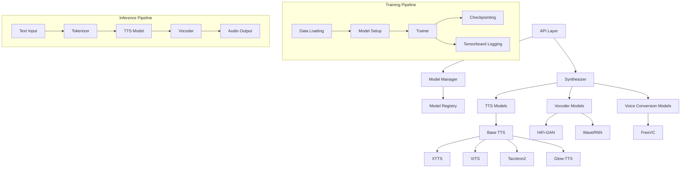

# Coqui-TTS 技术学习报告

## 1. 项目概述

### 1.1 仓库定位
Coqui-TTS 是一个开源的文本转语音（TTS）库，由 Coqui.ai 开发和维护。该项目旨在提供高性能的深度学习模型，用于生成高质量的语音。Coqui-TTS 支持超过 1100 种语言，提供预训练模型和工具，用于训练新模型和微调现有模型。

### 1.2 主要功能
- **多语言支持**：支持超过 1100 种语言的预训练模型
- **多说话人支持**：支持多说话人 TTS 模型
- **语音克隆**：支持基于参考音频的语音克隆
- **语音转换**：支持语音转换模型
- **模块化设计**：支持多种 TTS 模型架构
- **训练工具**：提供完整的训练流程和工具
- **服务器部署**：提供 Flask 服务器用于模型部署

### 1.3 技术栈
- **深度学习框架**：PyTorch
- **配置管理**：Coqpit（数据类配置）
- **训练框架**：Trainer（自定义训练器）
- **音频处理**：Librosa、Torchaudio
- **文本处理**：Pysbd、Grüut、Jieba
- **模型管理**：自定义模型管理系统
- **部署**：Flask、Docker

## 2. 核心架构分析

### 2.1 整体架构图



### 2.2 关键模块职责与交互

#### 2.2.1 API 层（`TTS/api.py`）
- **职责**：提供统一的 Python 接口，简化模型加载和推理
- **关键功能**：
  - 模型列表和下载管理
  - 多说话人/多语言模型支持
  - 语音克隆和语音转换
  - 批量推理支持

```python
# 示例：使用 API 进行语音合成
from TTS.api import TTS

# 初始化 TTS
tts = TTS("tts_models/multilingual/multi-dataset/xtts_v2").to("cuda")

# 语音合成
wav = tts.tts(
    text="Hello world!",
    speaker_wav="my/cloning/audio.wav",
    language="en"
)
```

#### 2.2.2 模型管理器（`TTS/utils/manage.py`）
- **职责**：管理预训练模型的发现、下载和缓存
- **关键功能**：
  - 模型注册和发现
  - 自动下载和缓存
  - 版本管理
  - 依赖检查

#### 2.2.3 合成器（`TTS/utils/synthesizer.py`）
- **职责**：协调 TTS 模型、声码器和语音转换模型
- **关键功能**：
  - 模型加载和初始化
  - 文本分句处理
  - 推理流程协调
  - 音频后处理

#### 2.2.4 基础 TTS 模型（`TTS/tts/models/base_tts.py`）
- **职责**：定义所有 TTS 模型的基础接口
- **关键功能**：
  - 多说话人/多语言支持
  - 数据加载器配置
  - 损失计算接口
  - 模型保存和加载

## 3. 关键代码模块深度解析

### 3.1 模型训练流程

#### 3.1.1 训练入口（`TTS/bin/train_tts.py`）
训练流程采用配置驱动的设计，核心步骤包括：

```python
def main():
    # 1. 解析训练参数
    train_args = TrainTTSArgs()
    parser = train_args.init_argparse(arg_prefix="")
    args, config_overrides = parser.parse_known_args()
    
    # 2. 加载配置
    if args.config_path:
        config = load_config(args.config_path)
        config.parse_known_args(config_overrides, relaxed_parser=True)
    
    # 3. 加载数据集
    train_samples, eval_samples = load_tts_samples(
        config.datasets,
        eval_split=True,
        eval_split_max_size=config.eval_split_max_size,
        eval_split_size=config.eval_split_size,
    )
    
    # 4. 初始化模型
    model = setup_model(config, train_samples + eval_samples)
    
    # 5. 启动训练
    trainer = Trainer(
        train_args,
        model.config,
        config.output_path,
        model=model,
        train_samples=train_samples,
        eval_samples=eval_samples,
    )
    trainer.fit()
```

#### 3.1.2 模型初始化（`setup_model` 函数）
- **职责**：根据配置初始化对应的模型架构
- **支持的模型**：XTTS、VITS、Tacotron2、Glow-TTS 等

```python
# 模型初始化示例
def setup_model(config, data):
    # 根据配置选择模型类
    if config.model == "xtts":
        from TTS.tts.models.xtts import Xtts
        model = Xtts.init_from_config(config)
    elif config.model == "vits":
        from TTS.tts.models.vits import Vits
        model = Vits.init_from_config(config)
    # ... 其他模型
    
    # 初始化多说话人支持
    model.init_multispeaker(config, data)
    
    # 初始化多语言支持
    if hasattr(config, 'languages') and config.languages:
        model.init_multilingual(config, data)
    
    return model
```

### 3.2 数据处理管线

#### 3.2.1 数据集加载（`TTS/tts/datasets/__init__.py`）
数据处理采用统一的格式化器模式：

```python
def load_tts_samples(
    datasets: Union[List[Dict], Dict],
    eval_split=True,
    formatter: Callable = None,
    eval_split_max_size=None,
    eval_split_size=0.01,
) -> Tuple[List[List], List[List]]:
    """
    Args:
        datasets: 数据集配置列表
        eval_split: 是否创建验证集
        formatter: 数据格式化函数
    
    Returns:
        训练样本和验证样本
    """
    all_samples = []
    
    for dataset in datasets:
        # 根据数据集名称选择格式化器
        if formatter is None:
            formatter = get_formatter(dataset["name"])
        
        # 格式化数据集
        samples = formatter(
            root_path=dataset["path"],
            meta_file=dataset["meta_file_attn"],
            unidecode_control=True,
        )
        
        # 添加语言和数据集名称信息
        samples = add_extra_keys(
            samples, 
            dataset["language"], 
            dataset["name"]
        )
        
        all_samples.extend(samples)
    
    # 分割训练集和验证集
    if eval_split:
        eval_samples, train_samples = split_dataset(
            all_samples, 
            eval_split_max_size, 
            eval_split_size
        )
        return train_samples, eval_samples
    
    return all_samples, []
```

#### 3.2.2 数据集类（`TTSDataset`）
- **职责**：处理音频加载、特征提取和批量处理
- **关键功能**：
  - 音频文件加载和预处理
  - 频谱图计算
  - 填充和截断处理
  - 批量数据加载

### 3.3 推理流程（从文本到语音）

#### 3.3.1 XTTS 推理流程
XTTS 是 Coqui-TTS 的旗舰模型，采用 GPT 架构进行自回归生成：

```python
# XTTS 推理示例
class Xtts(BaseTTS):
    def inference(
        self,
        text,
        language,
        speaker_wav=None,
        gpt_cond_latent=None,
        speaker_embedding=None,
    ):
        """
        XTTS 推理流程：
        1. 文本分词
        2. 条件编码（说话人/语言）
        3. GPT 自回归生成音频 token
        4. 声码器解码生成波形
        """
        # 文本分词
        text_tokens = torch.tensor(
            [self.tokenizer.encode(text, language)]
        ).to(self.device)
        
        # 说话人条件编码
        if speaker_wav is not None:
            # 从参考音频提取说话人嵌入
            gpt_cond_latent, speaker_embedding = (
                self.get_conditioning_latents(speaker_wav)
            )
        
        # GPT 自回归生成
        out = self.gpt.inference(
            text_tokens,
            gpt_cond_latent,
            speaker_embedding,
        )
        
        # 声码器解码
        mel = out["mel"]
        wav = self.hifigan_decoder(mel)
        
        return wav
```

#### 3.3.2 通用推理流程
`TTS/tts/utils/synthesis.py` 提供了通用的推理函数：

```python
def synthesis(
    model,
    text,
    CONFIG,
    ap,
    speaker_id=None,
    style_wav=None,
    style_text=None,
    d_vector=None,
    language_id=None,
):
    """
    通用推理流程：
    1. 文本预处理
    2. 模型推理
    3. 后处理
    """
    # 文本预处理
    if hasattr(model, "tokenizer"):
        inputs = model.tokenizer(text)
    else:
        inputs = text_to_sequence(text, CONFIG.characters)
    
    # 模型推理
    outputs = run_model_torch(
        model,
        inputs,
        speaker_id=speaker_id,
        d_vector=d_vector,
        language_id=language_id,
    )
    
    return outputs
```

### 3.4 优化技术

#### 3.4.1 内存优化
- **梯度检查点**：减少内存使用
- **混合精度训练**：使用 AMP 加速训练
- **动态批处理**：根据序列长度调整批大小

#### 3.4.2 计算优化
- **KV 缓存**：XTTS 模型使用 KV 缓存加速自回归生成
- **流式生成**：支持流式语音生成，降低延迟
- **批量推理**：支持批量文本推理

#### 3.4.3 模型优化
- **模型量化**：支持 INT8/FP16 量化
- **蒸馏**：支持知识蒸馏
- **剪枝**：支持模型剪枝

## 4. 技术亮点与创新点

### 4.1 独特算法或架构设计

#### 4.1.1 XTTS 架构
- **创新点**：结合 GPT 和 HiFi-GAN 的混合架构
- **优势**：
  - 支持 16 种语言
  - 语音克隆能力
  - 流式生成（<200ms 延迟）
  - 高质量语音合成

#### 4.1.2 多说话人/多语言支持
```python
# 多说话人初始化示例
def init_multispeaker(self, config, data):
    if config.use_speaker_embedding:
        # 嵌入层方式
        self.speaker_embedding = nn.Embedding(
            self.num_speakers,
            config.d_vector_dim
        )
    elif config.use_d_vector_file:
        # 预计算 d-vector 方式
        self.speaker_manager = SpeakerManager(
            d_vectors_file=config.d_vector_file
        )
```

#### 4.1.3 模型管理架构
- **创新点**：基于 JSON 的模型注册和发现系统
- **优势**：
  - 模型版本管理
  - 自动依赖解析
  - 跨平台兼容性

### 4.2 性能优化策略

#### 4.2.1 训练优化
- **分布式训练**：支持多 GPU 和多节点训练
- **混合精度**：使用 PyTorch AMP 加速训练
- **动态批处理**：根据序列长度调整批大小

#### 4.2.2 推理优化
- **KV 缓存**：加速自回归生成
- **流式生成**：支持实时语音生成
- **批量推理**：提高吞吐量

#### 4.2.3 内存优化
- **梯度检查点**：减少内存使用
- **模型量化**：支持 INT8/FP16
- **动态加载**：按需加载模型组件

### 4.3 用户体验创新

#### 4.3.1 简单的 API 设计
```python
# 用户友好的 API 设计
from TTS.api import TTS

# 一行代码完成语音合成
tts = TTS("tts_models/en/ljspeech/tacotron2-DDC")
tts.tts_to_file("Hello world!", file_path="output.wav")
```

#### 4.3.2 丰富的模型选择
- **模型库**：提供多种预训练模型
- **模型发现**：自动列出可用模型
- **一键下载**：自动下载和缓存模型

#### 4.3.3 灵活的部署选项
- **Python API**：直接调用 Python 接口
- **命令行**：提供 `tts` 命令行工具
- **服务器**：提供 Flask HTTP 服务器
- **Docker**：提供 Docker 镜像

## 5. 可借鉴之处

### 5.1 可整合到 TTS_MultiModel 的具体技术

#### 5.1.1 模型管理系统
**Coqui-TTS 实现**：
```python
class ModelManager:
    def __init__(self, models_file):
        self.models_dict = self.read_models_file(models_file)
    
    def download_model(self, model_name):
        # 自动下载和缓存模型
        model_path = os.path.join(self.output_prefix, model_name)
        if not os.path.exists(model_path):
            self._download_model(model_name, model_path)
        return model_path, config_path, model_item
```

**TTS_MultiModel 整合建议**：
- 实现类似的模型注册系统
- 支持模型版本管理
- 自动处理模型依赖关系

#### 5.1.2 配置管理系统
**Coqui-TTS 实现**：
```python
# 基于 Coqpit 的配置系统
@dataclass
class VitsConfig(BaseTTSConfig):
    model: str = "vits"
    model_args: VitsArgs = field(default_factory=VitsArgs)
    audio: VitsAudioConfig = field(default_factory=VitsAudioConfig)
    # ... 其他配置
```

**TTS_MultiModel 整合建议**：
- 采用类似的数据类配置系统
- 支持 JSON/YAML 配置文件
- 配置继承和覆盖机制

#### 5.1.3 数据集处理框架
**Coqui-TTS 实现**：
```python
# 统一的格式化器接口
def ljspeech_formatter(root_path, meta_file, **kwargs):
    """LJSpeech 数据集格式化器"""
    items = []
    with open(os.path.join(root_path, meta_file), "r") as f:
        for line in f:
            parts = line.strip().split("|")
            items.append({
                "text": parts[1],
                "audio_file": os.path.join(root_path, "wavs", parts[0] + ".wav"),
                "speaker_name": "ljspeech"
            })
    return items
```

**TTS_MultiModel 整合建议**：
- 实现统一的数据集格式化器接口
- 支持多种数据集格式
- 自动处理数据集分割

### 5.2 架构模式或最佳实践

#### 5.2.1 模块化设计模式
**Coqui-TTS 的模块化设计**：
```
TTS/
├── tts/           # TTS 模型
├── vocoder/       # 声码器模型
├── encoder/       # 说话人编码器
├── vc/            # 语音转换
└── utils/         # 工具函数
```

**TTS_MultiModel 建议**：
- 采用类似的模块化目录结构
- 每个模块独立，便于扩展
- 统一的接口设计

#### 5.2.2 配置驱动开发
**Coqui-TTS 的配置驱动**：
- 所有模型和训练参数通过配置文件定义
- 支持配置继承和覆盖
- 配置与代码分离

**TTS_MultiModel 建议**：
- 采用配置驱动的设计模式
- 支持多种配置格式（JSON、YAML）
- 配置版本管理

#### 5.2.3 插件式模型扩展
**Coqui-TTS 的模型扩展**：
```python
# 模型注册机制
def register_config(model_name: str) -> Coqpit:
    """动态查找和注册模型配置"""
    config_class = find_module("TTS.tts.configs", f"{model_name}_config")
    return config_class
```

**TTS_MultiModel 建议**：
- 实现类似的模型插件系统
- 支持动态模型加载
- 模型版本兼容性管理

### 5.3 需要注意的兼容性问题

#### 5.3.1 Python 版本兼容性
- Coqui-TTS 支持 Python 3.9-3.11
- TTS_MultiModel 需要确保兼容性

#### 5.3.2 依赖版本管理
**Coqui-TTS 的依赖管理**：
```txt
# requirements.txt
numpy>=1.24.3;python_version>"3.10"
torch>=2.1
torchaudio
# ... 其他依赖
```

**TTS_MultiModel 建议**：
- 使用 `pyproject.toml` 管理依赖
- 指定版本范围而非固定版本
- 定期更新依赖

#### 5.3.3 模型格式兼容性
- Coqui-TTS 使用 PyTorch 格式（.pth）
- TTS_MultiModel 需要考虑模型格式转换
- 支持多种模型格式（ONNX、TensorRT）

## 6. 参考资源

### 6.1 关键论文
1. **XTTS**：基于 GPT 的多语言 TTS 模型
2. **VITS**：端到端 TTS 模型
3. **Tacotron2**：序列到序列 TTS 模型
4. **Glow-TTS**：基于流的 TTS 模型
5. **HiFi-GAN**：高质量声码器

### 6.2 文档链接
- [Coqui-TTS 官方文档](https://tts.readthedocs.io/)
- [GitHub 仓库](https://github.com/coqui-ai/TTS)
- [模型列表](https://github.com/coqui-ai/TTS/blob/main/TTS/.models.json)
- [API 文档](https://tts.readthedocs.io/en/latest/api.html)

### 6.3 示例代码
- [Python API 示例](https://github.com/coqui-ai/TTS#-python-api)
- [命令行示例](https://github.com/coqui-ai/TTS#-command-line-tts)
- [训练示例](https://github.com/coqui-ai/TTS/tree/main/recipes)

### 6.4 社区资源
- [Discord 社区](https://discord.gg/5eXr5seRrv)
- [GitHub Discussions](https://github.com/coqui-ai/TTS/discussions)
- [TTS Notebooks](https://github.com/coqui-ai/TTS/wiki/TTS-Notebooks-and-Tutorials)

## 总结

Coqui-TTS 是一个功能强大、架构清晰的 TTS 框架，提供了从模型训练到部署的完整解决方案。其模块化设计、配置驱动开发和插件式架构为 TTS_MultiModel 项目提供了宝贵的参考。

**主要借鉴点**：
1. **模块化架构**：清晰的目录结构和模块划分
2. **配置系统**：基于数据类的配置管理
3. **模型管理**：自动化的模型发现和下载
4. **数据处理**：统一的数据集格式化器
5. **训练流程**：基于 Trainer 的训练框架

**整合建议**：
1. 采用类似的模块化目录结构
2. 实现配置驱动的开发模式
3. 建立模型注册和管理系统
4. 开发统一的数据处理接口
5. 借鉴训练流程的最佳实践

通过整合 Coqui-TTS 的优秀设计模式，TTS_MultiModel 可以构建更加健壮、可扩展的 TTS 系统。