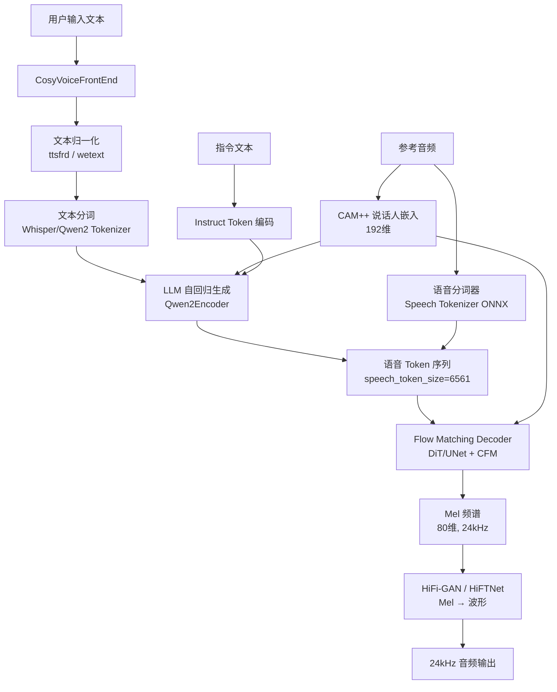

# CosyVoice 技术学习报告

> 基于 `reference_repos/CosyVoice` 仓库的深度代码分析
> 分析日期：2026-07-24

---

## 1. 项目概述

### 1.1 仓库定位

CosyVoice 是由阿里巴巴 FunAudioLLM 团队开源的**基于大语言模型（LLM）的多语言零样本文本转语音系统**。项目经历了三个大版本迭代（v1/v2/v3），是目前开源 TTS 领域的标杆项目之一。仓库地址：https://github.com/FunAudioLLM/CosyVoice

### 1.2 主要功能

- **多语言支持**：覆盖 9 种通用语言（中/英/日/韩/德/西/法/意/俄）及 18+ 种中国方言/口音
- **零样本语音克隆**：通过少量参考音频（<30s）即可克隆任意音色
- **跨语言合成**：使用一种语言的参考音频合成另一种语言的语音
- **Instruct 控制**：支持通过自然语言指令控制语言、方言、情感、语速、音量等
- **流式推理**：双向流式（文本输入流式 + 音频输出流式），延迟低至 150ms
- **发音修复（Hotfix）**：支持中文拼音和英文 CMU 音素级别的发音修正
- **文本归一化**：无需传统前端模块即可处理数字、特殊符号等
- **语音转换（VC）**：支持说话人音色迁移
- **vLLM 加速**：支持 vLLM 0.9.0+ 和 TensorRT-LLM 加速推理

### 1.3 技术栈

| 层级 | 技术 | 用途 |
|------|------|------|
| LLM 骨干 | Qwen2ForCausalLM (0.5B) | 自回归语音 token 生成 |
| Flow Matching | Conditional Flow Matching + DiT/UNet | 离散 token → 连续 Mel 频谱 |
| 声码器 | HiFi-GAN / CausalHiFTNet | Mel 频谱 → 波形 |
| 语音分词器 | ONNX Speech Tokenizer (v1/v2/v3) | 语音 → 离散 token（监督语义 token） |
| 文本分词器 | Whisper Tokenizer / Qwen2 Tokenizer | 文本编码 |
| 说话人嵌入 | CAM++ (ONNX) | 说话人特征提取 |
| 流匹配引擎 | Matcha-TTS (第三方子模块) | CFM 基础实现 |
| 加速推理 | vLLM, TensorRT-LLM, TorchScript JIT | 推理加速 |
| 文本归一化 | ttsfrd (阿里) / WeTextProcessing (开源) | 文本前端处理 |
| 训练框架 | PyTorch + DeepSpeed + Lightning | 分布式训练 |
| 配置管理 | HyperPyYAML | 声明式配置 |
| 开发语言 | Python 3.10 | 主开发语言 |
| 深度学习框架 | PyTorch 2.3.1 | 模型训练与推理 |

---

## 2. 核心架构分析

### 2.1 整体架构图



### 2.2 关键模块职责与交互

#### 核心模块关系图

```
CosyVoice (cosyvoice.py) — 统一入口，AutoModel 工厂
├── CosyVoiceFrontEnd (frontend.py) — 文本/音频前端处理
│   ├── Tokenizer — 文本分词（Whisper Tiktoken / Qwen2 AutoTokenizer）
│   ├── Speech Tokenizer (ONNX) — 语音 → 离散 token
│   ├── CAM++ (ONNX) — 说话人嵌入提取
│   ├── feat_extractor — Mel 频谱提取
│   └── text_normalize — 文本归一化（ttsfrd/wetext/内置）
├── CosyVoiceModel / CosyVoice2Model / CosyVoice3Model (model.py)
│   ├── TransformerLM / Qwen2LM / CosyVoice3LM (llm.py) — LLM 自回归生成
│   │   ├── Qwen2Encoder — Qwen2ForCausalLM 封装
│   │   ├── text_embedding + text_encoder — 文本编码
│   │   ├── speech_embedding — 语音 token 嵌入
│   │   └── llm_decoder — 线性投影头 (hidden → speech_token_size)
│   ├── MaskedDiffWithXvec / CausalMaskedDiffWithXvec / CausalMaskedDiffWithDiT (flow.py)
│   │   ├── encoder (Conformer/PreLookaheadLayer) — token 编码
│   │   ├── length_regulator — 长度对齐（v1 使用）
│   │   ├── ConditionalCFM / CausalConditionalCFM (flow_matching.py) — 流匹配
│   │   │   └── estimator (UNet1D / DiT) — 速度场估计器
│   │   └── decoder — 流匹配 ODE 求解
│   └── HiFTGenerator / CausalHiFTGenerator (generator.py) — Mel → 波形
│       ├── F0 Predictor — 基频预测
│       ├── Source Module (SineGen + NSF) — 激励源生成
│       └── ISTFTNet — 逆短时傅里叶变换
└── AutoModel() — 自动检测模型版本并实例化
```

| 模块 | 文件 | 职责 |
|------|------|------|
| **CosyVoice** | `cli/cosyvoice.py` | 统一入口，管理模型加载和推理方法分发 |
| **FrontEnd** | `cli/frontend.py` | 文本归一化、分词、音频特征提取、说话人嵌入 |
| **CosyVoiceModel** | `cli/model.py` | 推理调度器，管理 LLM→Flow→HiFi-GAN 流水线 |
| **TransformerLM** | `llm/llm.py` | CosyVoice v1 的 Conformer-based LLM |
| **Qwen2LM** | `llm/llm.py` | CosyVoice v2 的 Qwen2-based LLM，支持 bi-stream |
| **CosyVoice3LM** | `llm/llm.py` | CosyVoice v3 的 LLM，统一嵌入空间 |
| **Flow** | `flow/flow.py` | 流匹配模块，token → Mel 频谱 |
| **Flow Matching** | `flow/flow_matching.py` | CFM 求解器，支持 CFG 和缓存 |
| **DiT** | `flow/DiT/dit.py` | CosyVoice3 的 DiT 速度场估计器 |
| **HiFi-GAN** | `hifigan/generator.py` | Mel → 波形声码器，含 NSF 激励源 |
| **Tokenizer** | `tokenizer/tokenizer.py` | 文本分词器封装 |

---

## 3. 关键代码模块深度解析

### 3.1 模型训练流程

CosyVoice 的训练分为三个阶段，每个阶段独立训练一个子模块：

#### 阶段一：Speech Tokenizer 训练（离线）

语音分词器是 CosyVoice 的核心创新之一。它使用监督语义 token（Supervised Semantic Tokens），而非传统的无监督 VQ-VAE。

训练流程：
1. 使用 Whisper 的 log_mel_spectrogram（128维）作为输入
2. 通过编码器和 FSQ（有限标量量化）生成离散 token
3. 训练完成后导出为 ONNX 格式

#### 阶段二：LLM + Flow 联合训练

```python
# bin/train.py 核心训练循环
for epoch in range(start_epoch + 1, max_epoch):
    if gan is True:
        executor.train_one_epoc_gan(model, ...)  # HiFi-GAN 训练
    else:
        executor.train_one_epoc(model, ...)  # LLM/Flow 训练
```

**LLM 训练目标**：给定文本 token 和说话人嵌入，自回归预测语音 token 序列。

```python
# llm.py - TransformerLM.forward()
# 1. 编码文本 token
text_token = self.text_embedding(text_token)
text_token, text_token_len = self.encode(text_token, text_token_len)

# 2. 说话人嵌入投影
embedding = F.normalize(embedding, dim=1)
embedding = self.spk_embed_affine_layer(embedding)

# 3. 构建 LM 输入序列: [SOS] + [SpeakerEmb] + [Text] + [TaskID] + [Speech]
lm_input = torch.concat([sos_emb, embedding, text_token, task_id_emb, speech_token], dim=1)

# 4. LM 前向传播 + 交叉熵损失
lm_output, lm_output_mask = self.llm(lm_input, lm_input_len)
logits = self.llm_decoder(lm_output)
loss = self.criterion_ce(logits, lm_target)
```

**Flow Matching 训练目标**：给定语音 token 编码和说话人嵌入，学习从噪声到 Mel 频谱的映射。

```python
# flow.py - MaskedDiffWithXvec.forward()
# 1. Token 编码 + 长度调节
token = self.input_embedding(torch.clamp(token, min=0))
h, h_lengths = self.encoder(token, token_len)
h = self.encoder_proj(h)
h, h_lengths = self.length_regulator(h, feat_len)

# 2. 条件生成训练
conds = torch.zeros(feat.shape, device=token.device)
# 随机遮蔽部分条件（训练时的 classifier-free guidance）
for i, j in enumerate(feat_len):
    if random.random() < 0.5:
        continue
    index = random.randint(0, int(0.3 * j))
    conds[i, :index] = feat[i, :index]

# 3. Flow Matching 损失
loss, _ = self.decoder.compute_loss(feat, mask, h, embedding, cond=conds)
```

#### 阶段三：HiFi-GAN 训练（GAN 模式）

HiFi-GAN 使用标准的 GAN 训练流程：

```yaml
# cosyvoice3.yaml - GAN 训练配置
train_conf_gan:
    optim: adam
    optim_conf:
        lr: 0.0002
    scheduler: constantlr
    accum_grad: 1  # GAN 训练必须为 1
```

训练数据管线额外包含 `truncate` 和 `compute_f0` 步骤，用于生成 F0 基频特征。

### 3.2 数据处理管线

CosyVoice 使用流式数据管线，每个处理步骤是一个 Python 生成器函数：

```python
# cosyvoice3.yaml - 数据处理管线
data_pipeline: [
    parquet_opener,      # 打开 Parquet 格式数据文件
    tokenize,            # 文本分词
    filter,              # 过滤过长/过短样本
    resample,            # 重采样到 24kHz
    compute_fbank,       # 提取 Mel 频谱
    parse_embedding,     # 提取说话人嵌入
    compute_whisper_fbank, # 提取 Whisper 特征（用于在线 token 提取）
    shuffle,             # 局部洗牌
    sort,                # 按长度排序
    batch,               # 动态批处理
    padding,             # 填充到统一长度
]
```

**动态批处理**（Dynamic Batching）：

```python
# processor.py - dynamic_batch
def dynamic_batch(data, max_frames_in_batch=12000, mode='train'):
    buf = []
    longest_frames = 0
    for sample in data:
        new_sample_frames = sample['speech_feat'].size(0)
        longest_frames = max(longest_frames, new_sample_frames)
        frames_after_padding = longest_frames * (len(buf) + 1)
        if frames_after_padding > max_frames_in_batch:
            yield buf
            buf = [sample]
            longest_frames = new_sample_frames
        else:
            buf.append(sample)
    if len(buf) > 0:
        yield buf
```

### 3.3 推理流程（从文本到语音）

CosyVoice 的推理分为三个串行阶段，通过多线程实现流水线并行：

#### 完整推理管线

```python
# model.py - CosyVoiceModel.tts() 核心调度
def tts(self, text, flow_embedding, llm_embedding, prompt_text, ...):
    this_uuid = str(uuid.uuid1())
    
    # 初始化会话缓存
    self.tts_speech_token_dict[this_uuid], self.llm_end_dict[this_uuid] = [], False
    self.hift_cache_dict[this_uuid] = None
    
    # 1. 启动 LLM 线程（异步生成 token）
    p = threading.Thread(target=self.llm_job, args=(...))
    p.start()
    
    # 2. 流式消费 token → Flow → HiFi-GAN → 音频
    if stream is True:
        while True:
            if len(self.tts_speech_token_dict[this_uuid]) >= token_hop_len + overlap:
                this_tts_speech_token = torch.tensor(tokens[:hop+overlap])
                this_tts_speech = self.token2wav(token=this_tts_speech_token, ...)
                yield {'tts_speech': this_tts_speech.cpu()}
            if self.llm_end_dict[this_uuid] is True and remaining < hop + overlap:
                break
        # 处理剩余 token
        yield {'tts_speech': self.token2wav(..., finalize=True).cpu()}
    else:
        p.join()  # 等待 LLM 完成
        yield {'tts_speech': self.token2wav(..., finalize=True).cpu()}
```

#### 阶段一：LLM 自回归生成语音 Token

```python
# llm.py - Qwen2LM.inference()
@torch.inference_mode()
def inference(self, text, text_len, prompt_text, prompt_text_len,
              prompt_speech_token, prompt_speech_token_len, embedding, ...):
    device = text.device
    
    # 1. 拼接 prompt_text 和 text
    text = torch.concat([prompt_text, text], dim=1)
    
    # 2. 通过 Qwen2 的 embedding 层编码
    text_emb = self.llm.model.model.embed_tokens(text)
    
    # 3. 拼接 LLM 输入: [SOS] + [TextEmb] + [TaskID] + [PromptSpeechEmb]
    lm_input = torch.concat([sos_emb, text_emb, task_id_emb, prompt_speech_token_emb], dim=1)
    
    # 4. 逐 token 解码
    for token in self.inference_wrapper(lm_input, sampling, min_len, max_len, uuid):
        yield token
```

**Bi-Stream 推理**（CosyVoice v2+ 独有）：文本和音频交替生成，实现双向流式。

```python
# llm.py - Qwen2LM.inference_bistream()
# mix_ratio = [5, 15] 表示每 5 个文本 token 对应 15 个语音 token
# fill_token 用于标记交替边界
```

#### 阶段二：Flow Matching 生成 Mel 频谱

```python
# flow_matching.py - ConditionalCFM.solve_euler()
def solve_euler(self, x, t_span, mu, mask, spks, cond):
    for step in range(1, len(t_span)):
        # Classifier-Free Guidance (CFG)
        x_in[0] = x  # 有条件
        x_in[1] = x  # 无条件
        mu_in[0] = mu  # 有条件
        mu_in[1] = zeros  # 无条件
        
        dphi_dt = self.forward_estimator(x_in, mask_in, mu_in, t_in, spks_in, cond_in)
        dphi_dt, cfg_dphi_dt = torch.split(dphi_dt, [batch, batch])
        
        # CFG 公式: (1 + cfg_rate) * conditioned - cfg_rate * unconditioned
        dphi_dt = (1.0 + self.inference_cfg_rate) * dphi_dt - self.inference_cfg_rate * cfg_dphi_dt
        x = x + dt * dphi_dt
    return sol[-1]
```

**关键参数**：
- `n_timesteps=10`：ODE 求解步数
- `inference_cfg_rate=0.7`：Classifier-Free Guidance 强度
- `t_scheduler='cosine'`：时间步调度策略

#### 阶段三：HiFi-GAN 生成波形

```python
# generator.py - HiFTGenerator.inference()
@torch.inference_mode()
def inference(self, speech_feat, cache_source):
    # 1. Mel → F0 (基频预测)
    f0 = self.f0_predictor(speech_feat)
    
    # 2. F0 → 激励源 (SineGen + NSF)
    s = self.f0_upsamp(f0[:, None]).transpose(1, 2)
    s, _, _ = self.m_source(s)
    
    # 3. 使用缓存避免 glitch
    if cache_source.shape[2] != 0:
        s[:, :, :cache_source.shape[2]] = cache_source
    
    # 4. Mel + Source → 波形 (ISTFT)
    generated_speech = self.decode(x=speech_feat, s=s)
    return generated_speech, s
```

### 3.4 优化技术

#### 3.4.1 TensorRT 加速

Flow Matching 的 estimator（UNet/DiT）可以导出为 TensorRT 引擎：

```python
# model.py - CosyVoiceModel.load_trt()
def load_trt(self, flow_decoder_estimator_model, flow_decoder_onnx_model, trt_concurrent, fp16):
    if not os.path.exists(flow_decoder_estimator_model) or os.path.getsize(flow_decoder_estimator_model) == 0:
        convert_onnx_to_trt(flow_decoder_estimator_model, self.get_trt_kwargs(), flow_decoder_onnx_model, fp16)
    self.flow.decoder.estimator = TrtContextWrapper(estimator_engine, trt_concurrent=trt_concurrent)
```

TensorRT 引擎支持多流并发执行，`trt_concurrent` 参数控制并发数。

#### 3.4.2 vLLM 加速

CosyVoice v2+ 支持 vLLM 加速 LLM 推理：

```python
# model.py - CosyVoice2Model.load_vllm()
def load_vllm(self, model_dir):
    export_cosyvoice2_vllm(self.llm, model_dir, self.device)
    from vllm import EngineArgs, LLMEngine
    engine_args = EngineArgs(model=model_dir,
                             skip_tokenizer_init=True,
                             enable_prompt_embeds=True,
                             gpu_memory_utilization=0.2)
    self.llm.vllm = LLMEngine.from_engine_args(engine_args)
```

#### 3.4.3 Repetition Aware Sampling (RAS)

```python
# 采样策略配置
sampling: !name:cosyvoice.utils.common.ras_sampling
    top_p: 0.8
    top_k: 25
    win_size: 10
    tau_r: 0.1
```

RAS 通过滑动窗口检测重复模式，动态调整采样概率，避免 LLM 生成中的重复问题。

#### 3.4.4 流式推理缓存

CosyVoice 的流式推理使用多层缓存机制：

```python
# model.py - 流式推理缓存管理
self.mel_cache_len = 8  # Mel 频谱缓存长度
self.source_cache_len = int(self.mel_cache_len * 480)  # 激励源缓存
self.speech_window = np.hamming(2 * self.source_cache_len)  # Hamming 窗

# token2wav 中的缓存处理
if self.hift_cache_dict[uuid] is not None:
    tts_mel = torch.concat([hift_cache_mel, tts_mel], dim=2)
    # Hamming 窗淡入淡出避免拼接 artifact
    tts_speech = fade_in_out(tts_speech, cache['speech'], self.speech_window)
```

---

## 4. 技术亮点与创新点

### 4.1 监督语义 Token（Supervised Semantic Tokens）

CosyVoice 的核心创新之一。与传统 VQ-VAE 的无监督学习不同，CosyVoice 使用监督学习训练语音分词器：

- 使用 Whisper 的 log_mel_spectrogram 作为输入
- 通过编码器 + FSQ 生成离散 token
- Token 具有明确的语义信息，可直接用于 LLM 训练

**优势**：
- Token 质量更高，语义信息更丰富
- LLM 训练更稳定，收敛更快
- 支持多语言/方言的统一 token 空间

### 4.2 LLM + Flow Matching 两阶段架构

CosyVoice 采用 LLM + Flow Matching 的混合架构：

1. **LLM 阶段**：自回归生成离散语音 token（25Hz）
2. **Flow Matching 阶段**：将离散 token 转换为连续 Mel 频谱（24kHz）

**优势**：
- LLM 负责语言理解和韵律建模
- Flow Matching 负责声学细节生成
- 两阶段解耦，可独立优化

### 4.3 双向流式推理（Bi-Streaming）

CosyVoice v2 引入了双向流式推理，文本和音频交替生成：

```python
# 每 5 个文本 token 对应 15 个语音 token
mix_ratio = [5, 15]
```

**效果**：
- 文本边输入边生成音频
- 音频边生成边输出
- 端到端延迟低至 150ms

### 4.4 DiT 速度场估计器（CosyVoice v3）

CosyVoice v3 将 Flow Matching 的 UNet 估计器替换为 DiT（Diffusion Transformer）：

```python
# cosyvoice3.yaml - DiT 配置
estimator: !new:cosyvoice.flow.DiT.dit.DiT
    dim: 1024
    depth: 22
    heads: 16
    dim_head: 64
    ff_mult: 2
    mel_dim: 80
    mu_dim: 80
    spk_dim: 80
    static_chunk_size: 50  # chunk_size * token_mel_ratio
```

**优势**：
- DiT 的全局注意力比 UNet 的局部感受野更强
- 支持因果推理（causal），适合流式场景
- 参数量更少但效果更好

### 4.5 统一嵌入空间（CosyVoice v3）

CosyVoice v3 将 LLM 的嵌入空间统一：

```python
# llm.py - CosyVoice3LM
# v2: SOS 和 TaskID 使用独立的 llm_embedding
self.llm_embedding = torch.nn.Embedding(2, llm_input_size)

# v3: SOS 和 TaskID 复用 speech_embedding
self.sos = speech_token_size + 0
self.eos_token = speech_token_size + 1
self.task_id = speech_token_size + 2
```

**优势**：
- 减少参数量
- 统一 token 空间，简化推理逻辑
- 支持发音修复（Hotfix）：通过在文本中插入拼音 token 直接控制发音

### 4.6 RAS（Repetition Aware Sampling）

```python
# 通过滑动窗口检测重复，动态调整采样
def ras_sampling(weighted_scores, decoded_tokens, sampling, top_p=0.8, top_k=25, win_size=10, tau_r=0.1):
    # 检查最近 win_size 个 token 是否重复
    # 如果重复概率 > tau_r，降低重复 token 的采样概率
    ...
```

### 4.7 HiFTNet 声码器

CosyVoice 使用 HiFTNet（Neural Source Filter + ISTFTNet）作为声码器：

- **NSF（Neural Source Filter）**：通过 F0 预测生成激励源（正弦波 + 噪声），保留基频信息
- **ISTFTNet**：在频域进行卷积，再通过 iSTFT 转回时域

**优势**：
- 比纯 HiFi-GAN 生成质量更高
- 保留基频信息，减少音高 artifacts
- 支持因果卷积（CausalHiFTGenerator），适合流式推理

### 4.8 CosyVoice v3 的 FSQ 静音/呼吸 Token

```python
# model.py - CosyVoice3Model
self.silent_tokens = [1, 2, 28, 29, 55, 248, 494, 2241, 2242, 2322, 2323]
```

v3 通过 FSQ 量化空间中的特定 token 来表示静音和呼吸，使 LLM 可以学习何时插入自然的停顿和呼吸声。

---

## 5. 可借鉴之处

### 5.1 可整合到 TTS_MultiModel 的具体技术

#### 5.1.1 LLM + Flow Matching 架构

CosyVoice 的 LLM + Flow Matching 架构可以直接整合到 TTS_MultiModel 中：

- **LLM 负责语义理解**：文本 → 语音 token
- **Flow Matching 负责声学生成**：语音 token → Mel 频谱
- **HiFi-GAN 负责波形合成**：Mel → 波形

这种三阶段解耦设计非常适合 TTS_MultiModel 的多引擎架构。

#### 5.1.2 流式推理缓存机制

CosyVoice 的流式推理缓存（mel_cache, source_cache, flow_cache）可以直接复用：

```python
# TTS_MultiModel 可借鉴的缓存模式
class StreamingCache:
    mel_cache_len = 8
    source_cache_len = mel_cache_len * 480
    speech_window = np.hamming(2 * source_cache_len)
    
    def update(self, mel, source, speech):
        # 缓存最近帧
        # 使用 Hamming 窗淡入淡出
        ...
```

#### 5.1.3 文本归一化管线

CosyVoice 的 `text_normalize` 方法支持多语言文本归一化：

```python
# 可直接复用到 TTS_MultiModel
def text_normalize(text, split=True, text_frontend=True):
    if contains_chinese(text):
        # 中文：wetext 归一化 + 标点处理 + 段落分割
        text = zh_tn_model.normalize(text)
        texts = list(split_paragraph(text, tokenizer, "zh", ...))
    else:
        # 英文：wetext 归一化 + 数字展开
        text = en_tn_model.normalize(text)
        text = spell_out_number(text, inflect_parser)
        texts = list(split_paragraph(text, tokenizer, "en", ...))
```

#### 5.1.4 动态批处理

CosyVoice 的 `dynamic_batch` 可以直接复用到 TTS_MultiModel 的批量推理中：

```python
# 动态批处理：根据最大帧数自适应调整 batch_size
def dynamic_batch(data, max_frames_in_batch=12000):
    # 比静态批处理效率更高，GPU 利用率更好
    ...
```

#### 5.1.5 AutoModel 工厂模式

```python
# 检测模型版本并自动实例化
def AutoModel(**kwargs):
    if os.path.exists('{}/cosyvoice.yaml'.format(model_dir)):
        return CosyVoice(**kwargs)
    elif os.path.exists('{}/cosyvoice2.yaml'.format(model_dir)):
        return CosyVoice2(**kwargs)
    elif os.path.exists('{}/cosyvoice3.yaml'.format(model_dir)):
        return CosyVoice3(**kwargs)
```

TTS_MultiModel 可以采用类似模式，根据配置文件自动选择引擎。

#### 5.1.6 ONNX 推理

CosyVoice 的语音分词器和说话人嵌入都使用 ONNX 推理：

```python
# 前端使用 ONNX Runtime 推理
self.campplus_session = onnxruntime.InferenceSession(campplus_model, ...)
self.speech_tokenizer_session = onnxruntime.InferenceSession(speech_tokenizer_model, ...)
```

ONNX 格式可以在不同平台和设备上高效推理，适合 TTS_MultiModel 的跨平台需求。

### 5.2 架构模式与最佳实践

| 模式 | CosyVoice 实现 | TTS_MultiModel 可借鉴 |
|------|-------------|----------------------|
| **配置管理** | HyperPyYAML 声明式配置 | 统一引擎配置格式 |
| **模型加载** | snapshot_download 自动下载 | 复用模型下载机制 |
| **版本检测** | AutoModel 工厂模式 | 统一引擎实例化 |
| **流式推理** | UUID 追踪会话状态 | 会话管理机制 |
| **多线程** | LLM 异步生成 + 主线程消费 | 流水线并行推理 |
| **缓存管理** | mel/source/speech 三层缓存 | 流式推理缓存 |
| **数据管线** | 流式生成器管道 | 数据处理管线 |
| **训练框架** | DeepSpeed + Lightning | 分布式训练支持 |

### 5.3 需要注意的兼容性问题

1. **许可证限制**：CosyVoice 代码为 Apache License 2.0，模型需遵守 ModelScope/HuggingFace 的使用条款。集成时需注意许可证兼容性。

2. **依赖冲突**：
   - `conformer==0.3.2` 是 CosyVoice v1 的依赖
   - `matcha-tts` 作为 git submodule 引入
   - `diffusers==0.29.0` 可能与 TTS_MultiModel 的其他依赖冲突
   - `hydra-core` 和 `HyperPyYAML` 是配置管理依赖

3. **模型大小**：
   - LLM (Qwen2 0.5B): ~1GB
   - Flow (DiT): ~500MB
   - HiFi-GAN: ~50MB
   - Speech Tokenizer (ONNX): ~200MB
   - CAM++ (ONNX): ~50MB
   - 总计约 **1.8GB** 显存/内存

4. **Python 版本**：CosyVoice 需要 Python 3.10+，TTS_MultiModel 需确认兼容性。

5. **GPU 需求**：
   - 推理需要 CUDA GPU
   - 流式推理推荐 4GB+ 显存
   - vLLM 加速需要 8GB+ 显存

6. **Windows 支持**：
   - DeepSpeed 仅支持 Linux
   - TensorRT 部分需要 Linux
   - vLLM 需要特定版本兼容
   - 基础 PyTorch 推理在 Windows 上可用

7. **音频格式**：CosyVoice 输出 24kHz WAV，与 TTS_MultiModel 的音频处理管线格式一致，可直接对接。

---

## 6. 参考资源

### 6.1 关键论文

| 论文 | 链接 | 相关模块 |
|------|------|---------|
| CosyVoice v1 | [arXiv:2407.05407](https://arxiv.org/abs/2407.05407) | 监督语义 token + LLM TTS |
| CosyVoice v2 | [arXiv:2412.10117](https://arxiv.org/abs/2412.10117) | 流式 LLM + Bi-Streaming |
| CosyVoice v3 | [arXiv:2505.17589](https://arxiv.org/abs/2505.17589) | 规模化 + 后训练 |
| ICASSP 2025 | [IEEE](https://ieeexplore.ieee.org) | LLM-Based Streaming TTS |
| HiFi-GAN | [arXiv:2010.05646](https://arxiv.org/abs/2010.05646) | 声码器 |
| HiFTNet | [arXiv:2309.09493](https://arxiv.org/abs/2309.09493) | NSF + ISTFTNet |
| Matcha-TTS | [arXiv:2309.03199](https://arxiv.org/abs/2309.03199) | Flow Matching |
| VoiceBox | [arXiv:2306.15687](https://arxiv.org/abs/2306.15687) | Flow Matching + CFG |
| Qwen2 | [arXiv:2407.10671](https://arxiv.org/abs/2407.10671) | LLM 骨干网络 |
| DiT | [arXiv:2212.09748](https://arxiv.org/abs/2212.09748) | Diffusion Transformer |
| CAM++ | [arXiv:2303.00332](https://arxiv.org/abs/2303.00332) | 说话人嵌入 |

### 6.2 项目文档

- **GitHub 仓库**: https://github.com/FunAudioLLM/CosyVoice
- **CosyVoice v3 演示**: https://funaudiollm.github.io/cosyvoice3/
- **CosyVoice v2 演示**: https://funaudiollm.github.io/cosyvoice2/
- **CosyVoice v1 演示**: https://fun-audio-llm.github.io
- **ModelScope 模型**: https://www.modelscope.cn/models/iic/CosyVoice2-0.5B
- **HuggingFace 模型**: https://huggingface.co/FunAudioLLM/CosyVoice2-0.5B
- **CV3-Eval 评估集**: https://github.com/FunAudioLLM/CV3-Eval

### 6.3 致谢项目

- [FunASR](https://github.com/modelscope/FunASR) — 语音识别工具包
- [FunCodec](https://github.com/modelscope/FunCodec) — 音频编解码器
- [Matcha-TTS](https://github.com/shivammehta25/Matcha-TTS) — Flow Matching TTS
- [AcademiCodec](https://github.com/yangdongchao/AcademiCodec) — 音频编解码器
- [WeNet](https://github.com/wenet-e2e/wenet) — 端到端语音识别

---

## 7. 总结

CosyVoice 是一个设计精良的 LLM-based TTS 系统，其核心创新在于：

1. **监督语义 Token**：使用监督学习训练语音分词器，token 质量远超无监督 VQ-VAE
2. **LLM + Flow Matching 架构**：语义理解和声学生成解耦，可独立优化
3. **双向流式推理**：文本和音频交替生成，端到端延迟低至 150ms
4. **DiT 速度场估计器**：CosyVoice v3 用 DiT 替代 UNet，效果更好
5. **统一嵌入空间**：CosyVoice v3 统一 token 空间，支持发音修复
6. **多加速方案**：支持 vLLM、TensorRT、TorchScript JIT 多种推理加速

对于 TTS_MultiModel 项目，CosyVoice 最有价值的借鉴点是：

- **LLM + Flow Matching 架构**：可作为 TTS_MultiModel 的新引擎架构
- **流式推理缓存机制**：可直接复用到现有引擎的流式输出中
- **文本归一化管线**：多语言文本处理能力可增强预处理模块
- **AutoModel 工厂模式**：可统一引擎实例化逻辑
- **ONNX 推理**：跨平台推理能力适合 TTS_MultiModel 的部署需求
- **RAS 采样策略**：可提升所有自回归引擎的生成质量
