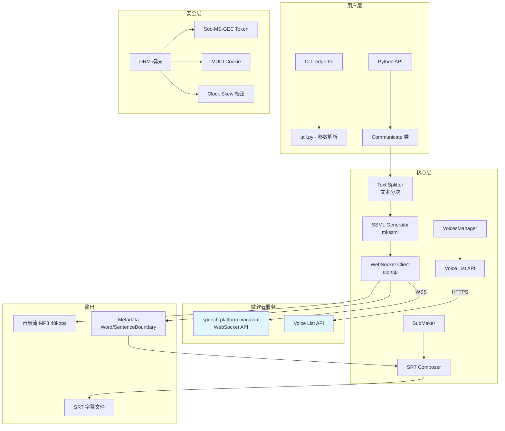
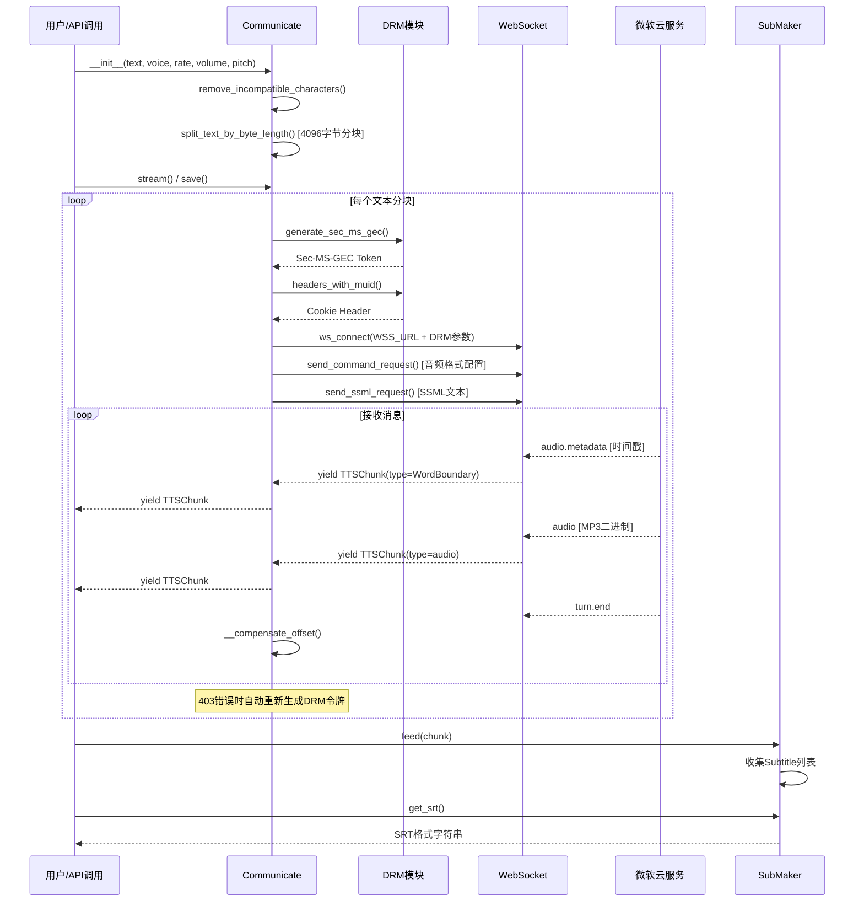
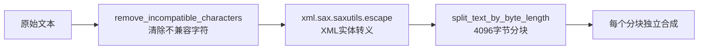

# Edge-TTS 技术学习报告

> 基于 `reference_repos/Edge-TTS` 仓库（v7.2.8）的深度源码分析

---

## 1. 项目概述

### 1.1 仓库定位

**Edge-TTS** 是一个轻量级 Python 模块，允许用户在 Python 代码中或通过命令行使用 **Microsoft Edge 的在线文本转语音服务**。与本地 TTS 引擎不同，Edge-TTS 无需加载任何本地模型，完全通过网络 API 调用微软的云端神经网络语音合成服务。

- **仓库地址**: https://github.com/rany2/edge-tts
- **许可证**: LGPLv3
- **Python 版本**: >= 3.7
- **当前版本**: 7.2.8

### 1.2 主要功能

| 功能 | 描述 |
|------|------|
| 多语言语音合成 | 支持 70+ 语言、400+ 神经网络语音 |
| 实时流式合成 | 通过 WebSocket 实现低延迟流式音频输出 |
| 字幕生成 | 自动生成 SRT 格式的 Word/Sentence Boundary 字幕 |
| 语音参数调节 | 支持语速（rate）、音量（volume）、音调（pitch）调节 |
| 同步/异步双接口 | 同时提供 `async/await` 和同步阻塞两种调用方式 |
| 命令行工具 | 提供 `edge-tts` 和 `edge-playback` CLI 命令 |
| 代理支持 | 支持 HTTP/HTTPS 代理配置 |

### 1.3 技术栈

```
核心依赖:
├── aiohttp (>=3.8.0)      # 异步 HTTP/WebSocket 客户端
├── certifi (>=2023.11.17)  # SSL 证书验证
├── tabulate (>=0.4.4)      # CLI 表格格式化输出
└── typing-extensions (>=4.1.0)  # Python 类型注解扩展

协议/标准:
├── WebSocket (RFC 6455)     # 实时双向通信
├── SSML 1.0                 # 语音合成标记语言
├── SRT                      # 字幕格式
└── SHA-256                  # DRM 令牌哈希
```

---

## 2. 核心架构分析

### 2.1 整体架构图



### 2.2 关键模块职责

| 模块文件 | 行数 | 职责 |
|----------|------|------|
| `communicate.py` | 659 | **核心模块**：WebSocket 通信、文本分块、SSML 生成、流式传输、偏移量补偿 |
| `voices.py` | 123 | 语音列表获取与筛选（支持按 Gender/Language/Locale 查找） |
| `drm.py` | 161 | DRM 令牌生成、时钟偏移校正、MUID 管理 |
| `constants.py` | 46 | API 端点、请求头、音频参数常量 |
| `data_classes.py` | 92 | TTSConfig 配置模型（含参数校验逻辑） |
| `submaker.py` | 61 | 字幕事件收集器（WordBoundary/SentenceBoundary） |
| `srt_composer.py` | 295 | SRT 字幕文件合成（排序、重索引、格式化） |
| `util.py` | 146 | CLI 入口、参数解析、主流程编排 |
| `typing.py` | 63 | 类型定义（TTSChunk、Voice、CommunicateState） |
| `exceptions.py` | 29 | 自定义异常层次结构 |

### 2.3 模块交互关系



---

## 3. 关键代码模块深度解析

### 3.1 WebSocket 通信协议（核心流程）

Edge-TTS 的核心是通过 WebSocket 与微软 Bing 语音服务通信。连接建立后，客户端发送配置请求和 SSML 请求，服务端流式返回音频数据和元数据。

#### 连接建立

```python
# communicate.py - WebSocket 连接关键代码
async with session.ws_connect(
    f"{WSS_URL}&ConnectionId={connect_id()}"
    f"&Sec-MS-GEC={DRM.generate_sec_ms_gec()}"
    f"&Sec-MS-GEC-Version={SEC_MS_GEC_VERSION}",
    compress=15,                    # 启用 deflate 压缩
    proxy=self.proxy,
    headers=DRM.headers_with_muid(WSS_HEADERS),
    ssl=_SSL_CTX,
) as websocket:
```

WSS URL 格式：`wss://speech.platform.bing.com/consumer/speech/synthesize/readaloud/edge/v1?TrustedClientToken=...`

#### 消息协议

| 消息类型 | 路径 (Path) | 方向 | 内容 |
|----------|-------------|------|------|
| 配置请求 | `speech.config` | → 服务端 | JSON 配置（音频格式、metadata选项） |
| SSML请求 | `ssml` | → 服务端 | SSML 文本 + 请求头 |
| 音频元数据 | `audio.metadata` | ← 服务端 | Word/SentenceBoundary 时间戳 |
| 音频数据 | `audio` | ← 服务端 | MP3 二进制流（48kbps CBR） |
| 轮次结束 | `turn.end` | ← 服务端 | 当前分块合成完成 |

#### 音频格式配置

```python
# 音频输出格式固定为 24kHz 48kbps 单声道 MP3
'{"context":{"synthesis":{"audio":{"metadataoptions":{'
f'"sentenceBoundaryEnabled":"{sq}","wordBoundaryEnabled":"{wd}"'
"},"outputFormat":"audio-24khz-48kbitrate-mono-mp3"}}}'
```

### 3.2 文本处理管线

文本在发送到微软服务之前需要经过多步处理：



#### 不兼容字符清理

```python
def remove_incompatible_characters(string: Union[str, bytes]) -> str:
    """清除服务不支持的控制字符（如垂直制表符，常见于OCR提取的PDF）"""
    chars: List[str] = list(string)
    for idx, char in enumerate(chars):
        code: int = ord(char)
        if (0 <= code <= 8) or (11 <= code <= 12) or (14 <= code <= 31):
            chars[idx] = " "
    return "".join(chars)
```

#### 智能文本分块（4096字节限制）

这是 Edge-TTS 最精巧的设计之一。文本需要按字节长度分块（不超过 4096 字节），同时保证：

1. **自然边界优先**：优先在换行符处分割，其次在空格处
2. **UTF-8 安全**：不在多字节字符中间切割
3. **XML 实体完整性**：不在 `&amp;` 等 XML 实体中间切割

```python
def split_text_by_byte_length(text, byte_length):
    """三层安全分块策略"""
    while len(text) > byte_length:
        # 第一层：寻找自然边界（换行 > 空格）
        split_at = _find_last_newline_or_space_within_limit(text, byte_length)
        if split_at < 0:
            # 第二层：UTF-8 安全切割点
            split_at = _find_safe_utf8_split_point(text)
        # 第三层：XML 实体完整性校验
        split_at = _adjust_split_point_for_xml_entity(text, split_at)
        yield text[:split_at].strip()
        text = text[split_at if split_at > 0 else 1:]
```

### 3.3 SSML 生成

每个文本分块被包装为 SSML 格式发送：

```xml
<speak version='1.0' xmlns='http://www.w3.org/2001/10/synthesis' xml:lang='en-US'>
  <voice name='Microsoft Server Speech Text to Speech Voice (en-US, EmmaMultilingualNeural)'>
    <prosody pitch='+0Hz' rate='+0%' volume='+0%'>
      {转义后的文本}
    </prosody>
  </voice>
</speak>
```

**注意**：微软服务仅允许单一 `<voice>` 标签内嵌套单一 `<prosody>` 标签，不支持自定义 SSML。

### 3.4 DRM 令牌生成与安全机制

Edge-TTS 通过逆向工程微软 Edge 浏览器的 DRM 机制来访问 TTS 服务：

#### Sec-MS-GEC Token 生成

```python
@staticmethod
def generate_sec_ms_gec() -> str:
    # 1. 获取当前时间戳（含时钟偏移校正）
    ticks = DRM.get_unix_timestamp()
    # 2. 转换为 Windows 文件时间纪元 (1601-01-01)
    ticks += WIN_EPOCH  # 11644473600
    # 3. 向下取整到最近5分钟
    ticks -= ticks % 300
    # 4. 转换为100纳秒间隔
    ticks *= S_TO_NS / 100
    # 5. SHA256 哈希
    str_to_hash = f"{ticks:.0f}{TRUSTED_CLIENT_TOKEN}"
    return hashlib.sha256(str_to_hash.encode("ascii")).hexdigest().upper()
```

#### 时钟偏移校正

当收到 403 错误时，DRM 模块会自动从服务器响应头中提取 `Date` 字段，计算本地时钟与服务器时钟的偏差并自动校正：

```python
@staticmethod
def handle_client_response_error(e: aiohttp.ClientResponseError) -> None:
    server_date = e.headers.get("Date")
    server_date_parsed = DRM.parse_rfc2616_date(server_date)
    client_date = DRM.get_unix_timestamp()
    DRM.adj_clock_skew_seconds(server_date_parsed - client_date)
```

### 3.5 流式合成与偏移量补偿

#### 流式传输机制

`Communicate.stream()` 方法是异步生成器，逐分块处理文本并 yield 音频/元数据：

```python
async def stream(self) -> AsyncGenerator[TTSChunk, None]:
    for self.state["partial_text"] in self.texts:
        self.state["chunk_audio_bytes"] = 0
        try:
            async for message in self.__stream():
                yield message
        except aiohttp.ClientResponseError as e:
            if e.status != 403:
                raise
            DRM.handle_client_response_error(e)  # 自动校正时钟
            async for message in self.__stream():
                yield message
```

#### CBR 偏移量补偿（关键创新）

微软的 offset 元数据在长文本上会因 AI 静音和整数溢出而产生漂移。Edge-TTS 采用基于 CBR（恒定比特率）音频字节数的精确补偿：

```python
def __compensate_offset(self) -> None:
    """
    输出格式 audio-24khz-48kbitrate-mono-mp3 是 48 kbps CBR 流。
    对于 CBR 流，字节到 tick 的转换是精确的整数算术：
    ticks = total_bytes * 8 * 10_000_000 // 48_000
    """
    self.state["cumulative_audio_bytes"] += self.state["chunk_audio_bytes"]
    self.state["offset_compensation"] = (
        self.state["cumulative_audio_bytes"]
        * 8 * TICKS_PER_SECOND // MP3_BITRATE_BPS
    )
    self.state["chunk_audio_bytes"] = 0
```

**数学原理**：
- 音频格式：48 kbps CBR MP3
- 每秒字节数：48000 / 8 = 6000 字节/秒
- 每字节对应的 tick 数：10,000,000 / 6000 ≈ 1666.67
- 精确公式：`ticks = total_bytes * 8 * 10_000_000 / 48_000`

### 3.6 同步/异步双接口

Edge-TTS 提供了优雅的同步/异步桥接方案：

```python
def stream_sync(self) -> Generator[TTSChunk, None, None]:
    """同步接口：在独立线程中运行 asyncio 事件循环"""
    queue: Queue = Queue()

    def fetch_async_items(queue):
        loop = asyncio.new_event_loop()
        asyncio.set_event_loop(loop)
        loop.run_until_complete(self._async_producer(queue))
        loop.close()

    with concurrent.futures.ThreadPoolExecutor() as executor:
        executor.submit(fetch_async_items, queue)
        while True:
            item = queue.get()
            if item is None:
                break
            yield item
```

---

## 4. 技术亮点与创新点

### 4.1 零本地模型的 TTS 方案

Edge-TTS 完全不依赖本地模型文件，通过逆向工程微软 Edge 浏览器的 TTS API 实现了云端语音合成。这意味着：

- **零 GPU 占用**：适合无 GPU 或 GPU 资源紧张的环境
- **零模型下载**：无需下载 GB 级模型文件
- **即时可用**：安装后即可使用，无需模型加载等待
- **高质量**：使用微软 Azure 级别的神经网络语音

### 4.2 智能文本分块算法

三层安全分块策略（自然边界 → UTF-8 安全 → XML 实体保护）确保了：
- 合成语句自然，不在词语中间断开
- 不会因多字节字符截断导致编码错误
- 不会破坏 XML 实体（如 `&amp;`）导致服务端解析失败

### 4.3 DRM 时钟偏移自动校正

这是一个非常精巧的容错设计：
1. 首次请求可能因本地时钟偏差返回 403
2. 从 403 响应的 `Date` 头提取服务器时间
3. 计算偏移量并自动校正后续所有请求
4. 整个过程对用户完全透明

### 4.4 CBR 精确偏移量补偿

针对微软元数据在长文本上的漂移问题，采用基于 CBR 音频字节数的精确整数算术补偿，避免了之前基于 metadata 累加的漂移问题。这是一个从「信任服务端元数据」到「自行计算精确时间」的思维转变。

### 4.5 极简架构设计

整个核心库仅约 1500 行代码（不含测试），却实现了：
- 完整的 WebSocket 通信协议
- 流式音频/元数据处理
- 多语言语音管理
- DRM 安全机制
- SRT 字幕生成
- 同步/异步双接口

### 4.6 优雅的错误恢复

```python
# 403 错误自动重试（带 DRM 校正）
async for message in self.__stream():
    yield message
except aiohttp.ClientResponseError as e:
    if e.status != 403:
        raise
    DRM.handle_client_response_error(e)  # 校正时钟
    async for message in self.__stream():  # 重试
        yield message
```

---

## 5. 可借鉴之处

### 5.1 可整合到 TTS_MultiModel 的具体技术

#### A. 作为云端 TTS 引擎集成

Edge-TTS 可以作为 TTS_MultiModel 的第三个引擎，提供**零 GPU 占用**的云端 TTS 选项：

```python
# 在 engine_interface.py 中注册 Edge-TTS 引擎
def _register_builtin_engines():
    try:
        from .engines.edge_tts_engine import EdgeTTSEngine
        engine_registry.register(
            "edge-tts",
            EdgeTTSEngine,
            display_name="Edge TTS (Cloud)",
            vram_requirement=0.0,  # 无需GPU！
        )
    except ImportError:
        pass
```

**应用场景**：
- GPU 资源被 VoxCPM2/IndexTTS2 占用时的降级方案
- 快速预览/草稿生成（无需等待本地模型加载）
- 多语言内容生成（70+ 语言支持）
- 服务器无 GPU 环境的部署选项

#### B. 流式合成架构参考

Edge-TTS 的流式传输模式可参考用于 TTS_MultiModel 的长文本处理：

```python
# TTS_MultiModel 可借鉴的流式模式
class StreamingTTSMixin:
    """流式TTS混入类"""
    
    async def generate_streaming(self, text, **kwargs):
        """流式生成，yield 音频块"""
        for chunk in split_text_by_byte_length(text, MAX_CHUNK_BYTES):
            audio_data = await self._synthesize_chunk(chunk, **kwargs)
            yield audio_data
```

#### C. 字幕生成模块（SubMaker + SRT Composer）

Edge-TTS 的字幕生成系统设计精良，可以独立复用：

```python
# 可直接复用的字幕生成功能
from edge_tts.submaker import SubMaker

# 在流式生成过程中收集字幕
submaker = SubMaker()
async for chunk in communicate.stream():
    if chunk["type"] == "audio":
        audio_file.write(chunk["data"])
    elif chunk["type"] in ("WordBoundary", "SentenceBoundary"):
        submaker.feed(chunk)

# 获取 SRT 字幕
srt_content = submaker.get_srt()
```

#### D. 文本预处理工具

`remove_incompatible_characters()` 和 `split_text_by_byte_length()` 是通用的文本预处理工具，可以复用到 TTS_MultiModel 的文本处理管线中。

### 5.2 可借鉴的架构模式

| 模式 | Edge-TTS 实现 | TTS_MultiModel 适用场景 |
|------|--------------|----------------------|
| 异步/同步桥接 | `stream_sync()` 使用 Queue + ThreadPool | 多引擎统一接口的同步适配 |
| 优雅降级 | 403 错误自动 DRM 校正重试 | 网络异常、模型加载失败的自动恢复 |
| 文本分块 | 三层安全分块（自然边界/UTF-8/XML） | 长文本分段合成 |
| 偏移量补偿 | CBR 字节计数精确补偿 | 多段音频拼接的时间对齐 |
| 配置验证 | dataclass + regex 校验 | 引擎参数校验 |

### 5.3 集成注意事项

#### 兼容性问题

| 问题 | 详情 | 解决方案 |
|------|------|---------|
| API 稳定性 | 微软可能随时更改 API 端点或协议 | 需要监控 API 变化，保留回退机制 |
| DRM 令牌 | Sec-MS-GEC 算法可能更新 | 参考 GitHub Issues 跟踪变化 |
| 网络依赖 | 需要稳定的互联网连接 | 添加离线检测和友好错误提示 |
| 音频格式 | 仅支持 MP3 48kbps CBR | 如需 WAV/PCM，需额外转码（可用 ffmpeg） |
| 速率限制 | 微软可能对高频请求限流 | 添加请求间隔控制和队列管理 |
| 隐私考虑 | 文本内容会发送到微软服务器 | 在 UI 中明确提示用户 |

#### 依赖管理

```txt
# Edge-TTS 的依赖（与 TTS_MultiModel 的兼容性）
aiohttp>=3.8.0,<4.0.0    # 已有异步 HTTP 支持
certifi>=2023.11.17        # SSL 证书（可能与现有依赖冲突）
tabulate>=0.4.4,<1.0.0    # 仅 CLI 使用，可选依赖
typing-extensions>=4.1.0   # 类型注解（通常已有）
```

---

## 6. 参考资源

### 6.1 关键代码文件索引

| 文件路径 | 用途 |
|----------|------|
| `src/edge_tts/communicate.py` | WebSocket 通信核心、文本分块、SSML 生成 |
| `src/edge_tts/voices.py` | 语音列表管理与筛选 |
| `src/edge_tts/drm.py` | DRM 令牌生成与时钟校正 |
| `src/edge_tts/submaker.py` | 字幕事件收集 |
| `src/edge_tts/srt_composer.py` | SRT 字幕文件合成 |
| `src/edge_tts/constants.py` | API 端点与协议常量 |
| `src/edge_tts/data_classes.py` | 配置数据模型与校验 |

### 6.2 文档与链接

- **项目仓库**: https://github.com/rany2/edge-tts
- **微软 TTS 文档**: https://learn.microsoft.com/azure/ai-services/speech-service/
- **SSML 规范**: https://www.w3.org/TR/speech-synthesis11/
- **WebSocket 协议**: RFC 6455 (https://datatracker.ietf.org/doc/html/rfc6455)
- **SRT 字幕格式**: https://en.wikipedia.org/wiki/SubRip
- **DRM 机制讨论**: https://github.com/rany2/edge-tts/issues/290#issuecomment-2464956570
- **微软 Edge TTS 语音列表**: https://speech.platform.bing.com/consumer/speech/synthesize/readaloud/voices/list

### 6.3 相关学术/技术背景

- **神经网络 TTS**: 基于 Microsoft Azure 的 Neural Text-to-Speech 服务
- **VITS/Transformer TTS**: 微软后端可能使用的合成架构
- **WebSocket 流式传输**: 实现低延迟实时音频传输的标准协议
- **CBR 音频编码**: 恒定比特率 MP3 编码，确保字节-时间映射的精确性

---

## 附录：Edge-TTS vs TTS_MultiModel 对比

| 维度 | Edge-TTS | TTS_MultiModel |
|------|----------|----------------|
| **架构** | 纯云端 API 调用 | 本地模型推理（VoxCPM2/IndexTTS2） |
| **GPU 需求** | 无 | 6GB+ VRAM |
| **延迟** | 取决于网络 | 取决于模型/文本长度 |
| **语音质量** | 微软 Azure 级别 | 本地模型级别（可微调） |
| **声音克隆** | 不支持 | 支持（VoxCPM2/IndexTTS2） |
| **多语言** | 70+ 语言 | 主要中文 |
| **离线可用** | 否 | 是 |
| **隐私** | 文本发送到微软 | 本地处理 |
| **定制化** | 有限（rate/volume/pitch） | 高度可定制（LoRA 微调等） |
| **部署成本** | 免费但有速率限制 | 需要 GPU 硬件 |

---

*报告生成时间：基于 Edge-TTS v7.2.8 源码分析*
*分析方法：完整源码阅读 + 架构逆向分析*
