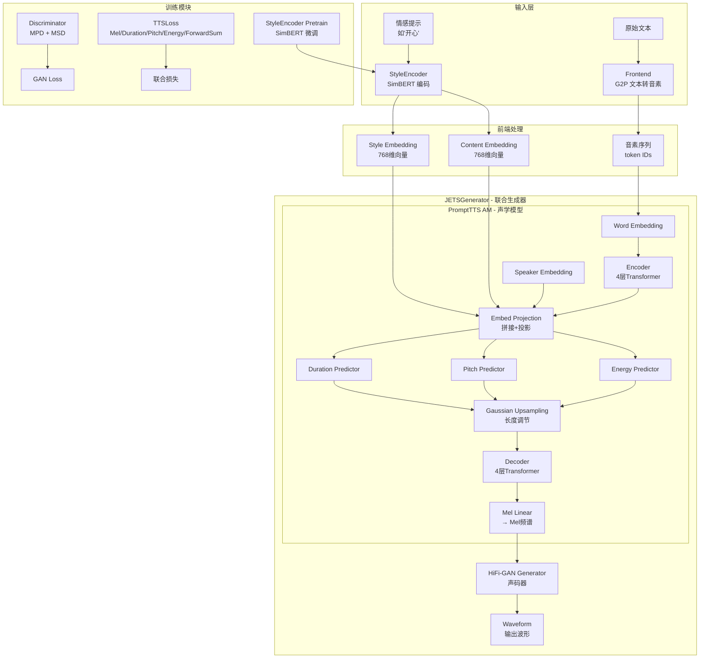
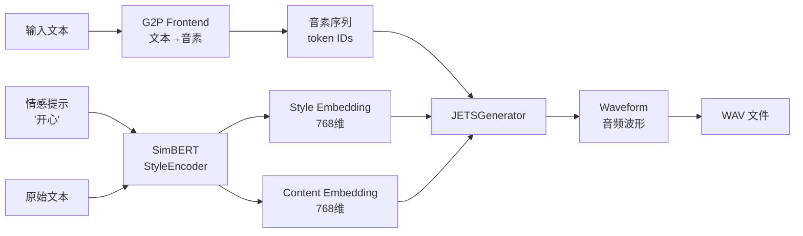

# EmotiVoice（易魔声）技术学习报告

## 1. 项目概述

### 1.1 仓库定位

EmotiVoice 是网易有道开源的 **多音色、提示控制（Prompt-Controlled）TTS 引擎**，核心定位为 **情感合成语音**。它基于 PromptTTS 论文的思想，通过自然语言文本提示（如"开心"、"悲伤"、"愤怒"）来控制合成语音的情感、风格、语速、音高和能量等属性。

- **GitHub 地址**：https://github.com/netease-youdao/EmotiVoice
- **许可证**：Apache-2.0
- **版本**：0.2.0
- **Python 版本要求**：>=3.8

### 1.2 主要功能

| 功能 | 说明 |
|------|------|
| 情感控制合成 | 通过文本提示（如"开心"、"悲伤"）控制语音情感 |
| 多音色支持 | 预训练模型包含 2000+ 种不同音色 |
| 中英文双语 | 支持中文和英文混合输入 |
| 语音克隆 | 支持用个人数据定制音色（DataBaker/LJSpeech Recipe） |
| OpenAI 兼容 API | 提供与 OpenAI TTS API 兼容的接口 |
| Web 演示界面 | 基于 Streamlit 的交互式 TTS 页面 |
| Docker 部署 | 提供 Docker 镜像一键部署 |

### 1.3 技术栈

| 层次 | 技术 |
|------|------|
| 深度学习框架 | PyTorch, torchaudio |
| 声码器 | HiFi-GAN |
| 文本前端 | g2p_en（英文）, jieba + pypinyin（中文） |
| 语义编码 | SimBERT (WangZeJun/simbert-base-chinese) |
| 模型配置 | YACS |
| Web 界面 | Streamlit |
| API 服务 | FastAPI + Uvicorn |
| 音频处理 | librosa, scipy, pyworld, soundfile |
| 训练加速 | NCCL 分布式训练, TensorBoard |

---

## 2. 核心架构分析

### 2.1 整体架构图



### 2.2 关键模块职责与交互

| 模块 | 文件位置 | 职责 |
|------|---------|------|
| **JETSGenerator** | `models/prompt_tts_modified/jets.py` | 顶层联合生成器，组合声学模型和声码器 |
| **PromptTTS (AM)** | `models/prompt_tts_modified/model_open_source.py` | 声学模型核心：文本→Mel频谱 |
| **StyleEncoder** | `models/prompt_tts_modified/simbert.py` | 基于SimBERT的风格编码器，将文本提示编码为风格向量 |
| **HiFi-GAN Generator** | `models/hifigan/models.py` | 声码器：Mel频谱→波形 |
| **Discriminator** | `models/hifigan/pretrained_discriminator.py` | 判别器：MPD + MSD |
| **AlignmentModule** | `models/prompt_tts_modified/modules/alignment.py` | 基于Beta-Binomial先验的对齐模块 |
| **Encoder** | `models/prompt_tts_modified/modules/encoder.py` | Transformer编码器/解码器（来自ESPnet） |
| **VariancePredictor** | `models/prompt_tts_modified/modules/variance.py` | 音高/能量/时长预测器 |
| **Frontend** | `frontend.py`, `frontend_cn.py`, `frontend_en.py` | 文本前端：中英文混合G2P |
| **Dataset** | `models/prompt_tts_modified/prompt_dataset.py` | 训练数据集加载与预处理 |
| **Loss** | `models/prompt_tts_modified/loss.py` | 联合损失函数 |
| **Training** | `train_am_vocoder_joint.py` | 联合训练脚本（声学模型+声码器） |
| **Inference** | `inference_am_vocoder_joint.py` | 联合推理脚本 |

---

## 3. 关键代码模块深度解析

### 3.1 模型训练流程

#### 3.1.1 训练架构：联合训练（Joint Training）

EmotiVoice 采用 **JETS（Joint End-to-End TTS and Vocoder）** 架构，将声学模型（AM）和声码器（Vocoder）端到端联合训练。

**训练入口**：`train_am_vocoder_joint.py`

```python
# 核心训练循环（简化）
for epoch in range(max(0, last_epoch), 5_000_000):
    for i, batch in enumerate(train_loader):
        # 1. 生成器前向传播
        output = generator(
            inputs_ling=phoneme_id,
            inputs_style_embedding=style_embedding,
            inputs_content_embedding=content_embedding,
            input_lengths=phoneme_lens,
            inputs_speaker=speaker,
            output_lengths=mel_lens,
            mel_targets=mel,
            pitch_targets=pitch,
            energy_targets=energy,
        )
        
        # 2. 计算 Mel 频谱（从生成的波形）
        y_hat_mel = mel_spectrogram_torch(output["wav_predictions"].squeeze(1), ...)
        
        # 3. 判别器训练
        loss_disc_all = loss_disc_s + loss_disc_f
        loss_disc_all.backward()
        optim_d.step()
        
        # 4. 生成器训练（多损失联合）
        loss_gen_all = (loss_gen_f + loss_gen_s) * 1 + \
            loss_fm + \
            dec_mel_loss * 45 + dur_loss * 1 + \
            pitch_loss * 1 + energy_loss * 1 + \
            forwardsum_loss * 2 + bin_loss * 2
        loss_gen_all.backward()
        optim_g.step()
```

#### 3.1.2 多损失函数设计

```python
# 来自 models/prompt_tts_modified/loss.py
class TTSLoss(torch.nn.Module):
    def __init__(self, loss_type="mae"):
        self.Mel_Loss = MelReconLoss()          # Mel 重建损失
        self.Prosodu_Loss = ProsodyReconLoss()   # 韵律损失（Duration/Pitch/Energy）
        self.ForwardSum_Loss = ForwardSumLoss()  # 对齐损失（CTC-based）
    
    def forward(self, outputs):
        # 返回7种损失
        return {
            "dec_mel_loss": mel_loss_,        # ×45 权重
            "postnet_mel_loss": postnet_mel_loss,
            "dur_loss": dur_loss,             # ×1 权重
            "pitch_loss": pitch_loss,         # ×1 权重
            "energy_loss": energy_loss,       # ×1 权重
            "forwardsum_loss": forwardsum_loss, # ×2 权重
            "bin_loss": bin_loss,             # ×2 权重
        }
```

**损失权重分配**：
| 损失类型 | 权重 | 说明 |
|---------|------|------|
| Mel重建损失 | 45 | 主导损失，确保频谱质量 |
| ForwardSum损失 | 2 | 对齐监督 |
| Bin损失（Viterbi） | 2 | 硬对齐监督 |
| Duration损失 | 1 | 时长预测 |
| Pitch损失 | 1 | 音高预测 |
| Energy损失 | 1 | 能量预测 |
| GAN损失 | 1 | 对抗训练 |
| Feature Matching损失 | 1 | 特征匹配 |

#### 3.1.3 分布式训练

```python
# 使用 PyTorch DDP 进行多 GPU 分布式训练
torch.distributed.init_process_group(backend="nccl", init_method="env://", world_size=args.n_gpus, rank=rank)
generator = DDP(generator, device_ids=[rank]).to(device)
discriminator = DDP(discriminator, device_ids=[rank]).to(device)

# 学习率调度
scheduler_g = torch.optim.lr_scheduler.ExponentialLR(optim_g, gamma=0.999875)
```

### 3.2 数据处理管线

#### 3.2.1 数据集格式

训练数据采用 JSONL 格式，每条记录包含：
```json
{
    "key": "唯一标识",
    "text": "音素序列",
    "wav_path": "音频文件路径",
    "speaker": "说话人ID",
    "prompt": "情感/风格提示文本（如'开心'）",
    "original_text": "原始文本"
}
```

#### 3.2.2 特征提取管线

```python
# 来自 prompt_dataset.py 的 Dataset_PromptTTS.__getitem__
def __getitem__(self, index):
    # 1. 文本 → 音素 ID
    text_int = [self.token2id[t] for t in self.datalist[index]["text"]]
    
    # 2. 音频 → Mel 频谱（使用 TacotronSTFT）
    mel, wav = get_mel(self.datalist[index]["wav_path"], self.stft, self.sampling_rate)
    
    # 3. 提取 Pitch（使用 PyWorld DIO + StoneMask）
    pitch = self.get_pitch(wav, self.pitch_stats)  # 归一化: (pitch - mean) / std
    
    # 4. 提取 Energy（STFT 幅度）
    energy = self.get_energy(wav, self.energy_stats)  # 归一化
    
    # 5. 说话人 ID
    speaker = self.speaker2id[self.datalist[index]["speaker"]]
    
    # 6. 风格嵌入（SimBERT 编码 prompt 文本）
    style_embedding = self.get_style_embedding(uttid, self.datalist[index]["prompt"], self.style_dir)
    
    # 7. 内容嵌入（SimBERT 编码原始文本）
    content_embedding = self.get_style_embedding(uttid, self.datalist[index]["original_text"], self.content_dir)
```

#### 3.2.3 Mel 频谱参数

```python
# 来自 config/joint/config.py
sampling_rate = 16_000     # 16kHz 采样率
filter_length = 1024       # FFT 大小
hop_length = 256           # 帧移（12.5ms）
win_length = 1024          # 窗口长度（50ms）
n_mel_channels = 80        # Mel 滤波器组数量
mel_fmin = 0               # 最低频率
mel_fmax = 8000            # 最高频率
```

#### 3.2.4 Pitch 和 Energy 提取

```python
# Pitch 提取（基于 PyWorld）
class Pitch:
    def _calculate_pitch(self, input, use_continuous_pitch=True, use_log_pitch=False):
        pitch, timeaxis = pyworld.dio(input, fs=self.sr, frame_period=frame_period)
        pitch = pyworld.stonemask(input, pitch, timeaxis, self.sr)  # 精细化
        if use_continuous_pitch:
            pitch = self._convert_to_continuous_pitch(pitch)  # 线性插值填补空洞
        return pitch

# Energy 提取（基于 STFT 幅度）
class Energy:
    def _calculate_energy(self, input):
        input_stft = self._stft(input)
        input_power = np.abs(input_stft)**2
        energy = np.sqrt(np.clip(np.sum(input_power, axis=0), a_min=1e-10, a_max=float('inf')))
        return energy
```

### 3.3 推理流程（从文本到语音）

#### 3.3.1 完整推理管线



#### 3.3.2 推理代码详解

```python
# 来自 inference_am_vocoder_joint.py
def main(args, config):
    # 1. 加载模型
    style_encoder = StyleEncoder(config)
    # 加载 SimBERT 预训练权重
    model_CKPT = torch.load(config.style_encoder_ckpt, map_location="cpu")
    style_encoder.load_state_dict(model_ckpt, strict=False)
    
    generator = JETSGenerator(conf).to(device)
    model_CKPT = torch.load(checkpoint_path, map_location=device)
    generator.load_state_dict(model_CKPT['generator'])
    generator.eval()
    
    # 2. 文本前端处理
    # 输入格式: speaker|prompt|phoneme|content
    # 例如: 8051|Happy|<sos/eos> [IH0] [M] ...|Emoti-Voice TTS Engine
    
    # 3. 提取风格嵌入
    style_embedding = get_style_embedding(prompt, tokenizer, style_encoder)
    content_embedding = get_style_embedding(content, tokenizer, style_encoder)
    
    # 4. 推理
    with torch.no_grad():
        infer_output = generator(
            inputs_ling=sequence,           # 音素序列
            inputs_style_embedding=style_embedding,  # 风格嵌入
            input_lengths=sequence_len,
            inputs_content_embedding=content_embedding,  # 内容嵌入
            inputs_speaker=speaker,         # 说话人ID
            alpha=1.0                       # 时长缩放因子
        )
    
    # 5. 保存音频
    audio = infer_output["wav_predictions"].squeeze() * MAX_WAV_VALUE
    sf.write(file=output_path, data=audio.astype('int16'), samplerate=config.sampling_rate)
```

#### 3.3.3 嵌入拼接机制

```python
# 来自 model_open_source.py 的 PromptTTS.forward
# 核心：将多种信息拼接后投影
x = torch.concat([
    x,                          # 文本编码 [B, T, 384]
    speaker_embedding,          # 说话人嵌入 [B, T, 384]
    inputs_style_embedding,     # 风格嵌入 [B, T, 768]
    inputs_content_embedding,   # 内容嵌入 [B, T, 768]
], dim=-1)
# 拼接后维度: 384 + 384 + 768 + 768 = 2304
x = self.embed_projection1(x)  # 投影回 384 维
# embed_projection1: Linear(2304, 384)
```

### 3.4 优化技术

#### 3.4.1 对齐模块：Beta-Binomial 先验 + MAS

```python
# 来自 alignment.py
class AlignmentModule(nn.Module):
    def forward(self, text, feats, text_lengths, feats_lengths, x_masks=None):
        # 1. 文本和特征分别通过卷积变换
        text = F.relu(self.t_conv1(text))
        feats = F.relu(self.f_conv1(feats))
        
        # 2. 计算距离矩阵
        dist = feats.unsqueeze(2) - text.unsqueeze(1)
        dist = torch.norm(dist, p=2, dim=3)
        score = -dist
        
        # 3. Log-Softmax
        log_p_attn = F.log_softmax(score, dim=-1)
        
        # 4. 添加 Beta-Binomial 先验（单调性约束）
        bb_prior = self._generate_prior(text_lengths, feats_lengths)
        log_p_attn = log_p_attn + bb_prior
        
        return log_p_attn

# Viterbi 解码获取硬对齐
def viterbi_decode(log_p_attn, text_lengths, feats_lengths):
    # 使用 numba JIT 加速的单调对齐搜索
    viterbi = _monotonic_alignment_search(cur_log_p_attn.detach().cpu().numpy())
    ds = np.bincount(viterbi)  # 获取每个音素的时长
```

#### 3.4.2 高斯上采样

```python
class GaussianUpsampling(torch.nn.Module):
    def forward(self, hs, ds, h_masks=None, d_masks=None, alpha=1.0):
        ds = ds * alpha  # alpha 控制语速
        c = ds.cumsum(dim=-1) - ds / 2  # 中心点
        energy = -1 * self.delta * (t.unsqueeze(-1) - c.unsqueeze(1)) ** 2
        p_attn = torch.softmax(energy, dim=2)  # 软对齐
        hs = torch.matmul(p_attn, hs)  # 上采样
        return hs
```

#### 3.4.3 随机片段训练（HiFi-GAN）

```python
# 来自 jets.py
if mel_targets is not None and cut_flag:
    # 训练时随机截取片段，加速训练
    z_segments, z_start_idxs, segment_size = get_random_segments(
        outputs["dec_outputs"].transpose(1,2),
        output_lengths,
        self.segment_size,  # 默认 32 帧
    )
else:
    # 推理时使用完整序列
    z_segments = outputs["dec_outputs"].transpose(1,2)

wav = self.generator(z_segments)  # HiFi-GAN 生成波形
```

#### 3.4.4 Weight Norm 和 Spectral Norm

```python
# HiFi-GAN Generator 使用 Weight Norm
self.conv_pre = weight_norm(Conv1d(h.initial_channel, h.upsample_initial_channel, 7, 1, padding=3))

# Style Encoder 使用 Spectral Norm（来自 StyleTTS）
blocks += [spectral_norm(nn.Conv2d(1, dim_in, 3, 1, 1))]
```

---

## 4. 技术亮点与创新点

### 4.1 基于 SimBERT 的情感/风格嵌入

**核心创新**：使用预训练的中文 SimBERT 模型作为风格编码器，将自然语言描述（如"开心"、"悲伤"、"非常激动"）编码为 768 维的风格向量。

```python
# SimBERT 风格编码器架构
class StyleEncoder(nn.Module):
    def __init__(self, config):
        self.bert = AutoModel.from_pretrained(config.bert_path)  # SimBERT-base
        self.pitch_clf = ClassificationHead(768, pitch_n_labels)
        self.speed_clf = ClassificationHead(768, speed_n_labels)
        self.energy_clf = ClassificationHead(768, energy_n_labels)
        self.emotion_clf = ClassificationHead(768, emotion_n_labels)
    
    def forward(self, input_ids, token_type_ids, attention_mask):
        outputs = self.bert(input_ids, attention_mask=attention_mask, token_type_ids=token_type_ids)
        pooled_output = outputs["pooler_output"]  # [CLS] token 的输出
        return {
            "pooled_output": pooled_output,        # 用于风格嵌入
            "pitch_outputs": self.pitch_clf(pooled_output),
            "speed_outputs": self.speed_clf(pooled_output),
            "energy_outputs": self.energy_clf(pooled_output),
            "emotion_outputs": self.emotion_clf(pooled_output),
        }
```

**优势**：
- 无需离散情感标签，支持连续的自然语言描述
- 利用 SimBERT 的中文语义理解能力
- 可以通过预训练任务（pitch/speed/energy/emotion 分类）微调 SimBERT

### 4.2 双嵌入分离设计（Style + Content）

EmotiVoice 将 **风格信息** 和 **内容信息** 分离为两个独立的嵌入：

- **Style Embedding**：从情感提示文本（如"开心"）编码
- **Content Embedding**：从原始文本内容编码

```python
# 推理时的双嵌入
style_embedding = get_style_embedding(prompt, tokenizer, style_encoder)  # 情感提示
content_embedding = get_style_embedding(content, tokenizer, style_encoder)  # 原始文本
```

这种设计使得情感控制和内容表达解耦，可以独立调整。

### 4.3 JETS 联合训练架构

将声学模型（PromptTTS）和声码器（HiFi-GAN）端到端联合训练，优势：

1. **梯度直通**：声码器的梯度可以反传到声学模型
2. **Mel 一致性**：训练时从生成的波形计算 Mel 频谱，避免训练/推理不一致
3. **片段训练**：随机截取波形片段训练 HiFi-GAN，提高训练效率

### 4.4 Beta-Binomial 先验对齐

```python
# 使用 Beta-Binomial 分布作为对齐先验
alpha = w * np.arange(1, T + 1, dtype=float)
beta = w * np.array([T - t + 1 for t in alpha])
k = np.arange(N)
prob = betabinom.logpmf(batched_k, N, alpha, beta)  # (N, T)
```

相比传统的单调对齐搜索（MAS），Beta-Binomial 先验提供了更强的单调性约束，加速对齐收敛。

### 4.5 多粒度判别器

```python
# 来自 hifigan/models.py
class Discriminator(nn.Module):
    def __init__(self, config):
        self.msd = MultiScaleDiscriminator()   # 多尺度判别器（3个尺度）
        self.mpd = MultiPeriodDiscriminator()  # 多周期判别器（5个周期：2,3,5,7,11）
```

总共 8 个子判别器，从不同尺度和周期捕获音频特征。

### 4.6 OpenAI 兼容 API

```python
# 来自 openaiapi.py
@app.post("/v1/audio/speech")
def text_to_speech(speechRequest: SpeechRequest):
    # 支持 speed 参数（通过 pyrubberband 时间拉伸）
    if speechRequest.speed != 1.0:
        y_stretch = pyrb.time_stretch(np_audio, config.sampling_rate, speechRequest.speed)
    
    # 支持多种输出格式（wav, mp3 等）
    return Response(content=buffer.getvalue(), media_type=f"audio/{response_format}")
```

---

## 5. 可借鉴之处

### 5.1 可整合到 TTS_MultiModel 的具体技术

#### 5.1.1 情感控制架构（高优先级）

EmotiVoice 的情感控制方案可以直接借鉴到 TTS_MultiModel：

```python
# 可复用的架构模式
# 1. SimBERT 风格编码器
# 2. 嵌入拼接投影层
# 3. 自然语言情感提示接口

# 关键参数
bert_hidden_size = 768    # SimBERT 输出维度
style_dim = 128           # 投影后的风格维度
# 嵌入拼接: text_emb(384) + speaker_emb(384) + style_emb(768) + content_emb(768) = 2304
# 投影: Linear(2304, 384)
```

**实施建议**：
- 在 `bin/integrated_app/engine_interface.py` 中添加情感控制参数
- 在 `bin/integrated_app/config_models.py` 中添加情感配置模型
- 复用现有的 `bin/integrated_app/emotion_tags.py` 与 EmotiVoice 的情感体系对接

#### 5.1.2 高斯上采样（中优先级）

EmotiVoice 的 `GaussianUpsampling` 模块比传统的线性上采样更平滑：

```python
# 可直接复用的模块
class GaussianUpsampling(torch.nn.Module):
    def __init__(self, delta=0.1):
        self.delta = delta
    
    def forward(self, hs, ds, h_masks=None, d_masks=None, alpha=1.0):
        # alpha 参数可用于控制语速
        ds = ds * alpha
        c = ds.cumsum(dim=-1) - ds / 2
        energy = -1 * self.delta * (t.unsqueeze(-1) - c.unsqueeze(1)) ** 2
        p_attn = torch.softmax(energy, dim=2)
        hs = torch.matmul(p_attn, hs)
        return hs
```

#### 5.1.3 多损失训练策略（中优先级）

EmotiVoice 的损失权重设计值得参考：

| 损失 | 权重 | 建议 |
|------|------|------|
| Mel重建 | 45 | 确保频谱质量为主 |
| ForwardSum | 2 | 对齐监督 |
| Bin(Viterbi) | 2 | 硬对齐 |
| Duration/Pitch/Energy | 各1 | 韵律控制 |
| GAN + FM | 各1 | 对抗训练 |

#### 5.1.4 OpenAI 兼容 API 模式（低优先级）

EmotiVoice 的 API 设计可以参考，但 TTS_MultiModel 已有类似的 API 架构。

### 5.2 架构模式与最佳实践

| 模式 | 说明 | 适用场景 |
|------|------|---------|
| **JETS 联合训练** | AM + Vocoder 端到端训练 | 提高训练效率和推理质量 |
| **双嵌入分离** | Style + Content 嵌入独立编码 | 情感控制与内容表达解耦 |
| **Beta-Binomial 先验** | 对齐先验加速收敛 | 所有需要对齐的 TTS 系统 |
| **SimBERT 编码** | 自然语言→风格向量 | 情感/风格控制 |
| **片段训练** | 随机截取波形片段 | HiFi-GAN 训练加速 |
| **DDP 分布式训练** | 多 GPU 并行 | 大规模训练 |
| **嵌入缓存** | 预计算并缓存 style embedding | 减少推理时重复计算 |

### 5.3 需要注意的兼容性问题

#### 5.3.1 Python 版本兼容

| EmotiVoice | TTS_MultiModel |
|------------|----------------|
| Python >= 3.8 | 需确认当前版本 |
| transformers==4.26.1 | 可能需要版本对齐 |

#### 5.3.2 模型权重加载

```python
# EmotiVoice 的权重加载有特殊处理
model_CKPT = torch.load(config.style_encoder_ckpt, map_location="cpu")
model_ckpt = {}
for key, value in model_CKPT['model'].items():
    new_key = key[7:]  # 去掉 "module." 前缀（DDP 保存的权重）
    model_ckpt[new_key] = value
style_encoder.load_state_dict(model_ckpt, strict=False)
```

#### 5.3.3 采样率差异

| 参数 | EmotiVoice | TTS_MultiModel (可能) |
|------|-----------|---------------------|
| 采样率 | 16kHz | 需确认（常见 22050/24000/44100） |
| Hop Length | 256 | 需对齐 |
| Mel Channels | 80 | 需对齐 |

#### 5.3.4 依赖冲突

- `numba==0.58.1`（EmotiVoice 训练需要，用于 JIT 加速对齐搜索）
- `pyworld`（Pitch 提取需要）
- `yacs`（配置管理）
- `transformers`（SimBERT 需要）

#### 5.3.5 内存占用

SimBERT 模型约 400MB，加上 JETS Generator 和 HiFi-GAN，推理时 GPU 内存需求约 2-4GB。

---

## 6. 参考资源

### 6.1 关键论文

| 论文 | 说明 | 链接 |
|------|------|------|
| **PromptTTS** | EmotiVoice 的核心理论基础 | https://speechresearch.github.io/prompttts/ |
| **JETS** | 联合端到端 TTS 和 Vocoder 架构 | https://arxiv.org/abs/2210.01891 |
| **HiFi-GAN** | 高保真声码器 | https://arxiv.org/abs/2010.05646 |
| **StyleTTS** | 风格编码器的灵感来源 | https://arxiv.org/abs/2210.01891 |
| **FastSpeech 2** | 方差预测器（Pitch/Energy/Duration） | https://arxiv.org/abs/2006.04558 |
| **SimBERT** | 语义 BERT，用于风格编码 | https://github.com/ZhuiyiTechnology/simbert |
| **KAN-TTS** | 损失函数设计参考 | https://github.com/alibaba-damo-academy/KAN-TTS |

### 6.2 文档链接

| 资源 | 链接 |
|------|------|
| GitHub 仓库 | https://github.com/netease-youdao/EmotiVoice |
| Wiki 页面 | https://github.com/netease-youdao/EmotiVoice/wiki |
| 预训练模型下载 | https://drive.google.com/drive/folders/1y6Xwj_GG9ulsAonca_unSGbJ4lxbNymM |
| SimBERT 模型 | https://huggingface.co/WangZeJun/simbert-base-chinese |
| 语音克隆教程 | https://github.com/netease-youdao/EmotiVoice/wiki/Voice-Cloning-with-your-personal-data |
| HTTP API 文档 | https://github.com/netease-youdao/EmotiVoice/wiki/HTTP-API |
| 音色列表 | https://github.com/netease-youdao/EmotiVoice/wiki/%F0%9F%98%8A-voice-wiki-page |
| Replicate 在线演示 | https://replicate.com/bramhooimeijer/emotivoice |

### 6.3 依赖代码来源

| 模块 | 来源 |
|------|------|
| Encoder/Decoder | ESPnet (https://github.com/espnet/espnet) |
| HiFi-GAN | https://github.com/jik876/hifi-gan |
| Style Encoder | StyleTTS (https://github.com/yl4579/StyleTTS) |
| Loss 函数 | KAN-TTS (https://github.com/alibaba-damo-academy/KAN-TTS) |
| 特征提取 | WeTTS (https://github.com/wenet-e2e/wetts) |
| 文本前端 | Tacotron (https://github.com/keithito/tacotron) |
| 音频处理 | pyworld, librosa |

---

## 附录：项目目录结构

```
EmotiVoice/
├── config/
│   ├── joint/
│   │   ├── config.py          # 训练/推理配置（Python 类）
│   │   └── config.yaml        # 模型超参数配置
│   └── template.py            # 配置模板
├── models/
│   ├── prompt_tts_modified/   # 声学模型
│   │   ├── model_open_source.py  # PromptTTS 核心模型
│   │   ├── jets.py               # JETS 联合生成器
│   │   ├── simbert.py            # SimBERT 风格编码器
│   │   ├── style_encoder.py      # 风格编码器（StyleTTS 版本）
│   │   ├── loss.py               # 联合损失函数
│   │   ├── feats.py              # 特征提取（Pitch/Energy/Mel）
│   │   ├── prompt_dataset.py     # 训练数据集
│   │   ├── modules/
│   │   │   ├── encoder.py        # Transformer 编码器/解码器
│   │   │   ├── alignment.py      # 对齐模块（Beta-Binomial + MAS）
│   │   │   ├── variance.py       # 方差预测器
│   │   │   └── initialize.py     # 权重初始化
│   │   └── ...
│   └── hifigan/                 # 声码器
│       ├── models.py             # HiFi-GAN Generator + Discriminator
│       ├── get_vocoder.py        # 声码器加载工具
│       └── ...
├── text/                        # 文本处理
│   ├── __init__.py              # 文本→序列转换
│   ├── cleaners.py              # 文本清洗
│   ├── symbols.py               # 符号表
│   └── cmudict.py               # CMU 发音词典
├── data/                        # 训练数据
│   ├── DataBaker/               # DataBaker 中文数据集
│   ├── LJspeech/                # LJSpeech 英文数据集
│   ├── youdao/                  # 有道内部数据集
│   └── inference/               # 推理示例文本
├── train_am_vocoder_joint.py    # 联合训练脚本
├── inference_am_vocoder_joint.py # 联合推理脚本
├── demo_page.py                 # Streamlit 演示页面
├── openaiapi.py                 # OpenAI 兼容 API
├── frontend.py                  # 中英文混合 G2P
├── frontend_cn.py               # 中文 G2P
├── frontend_en.py               # 英文 G2P
└── setup.py                     # 包安装配置
```

---

*报告生成时间：基于对 EmotiVoice 仓库源代码的深度分析*
*分析范围：模型架构、训练流程、推理流程、数据处理、优化技术、API 设计*
