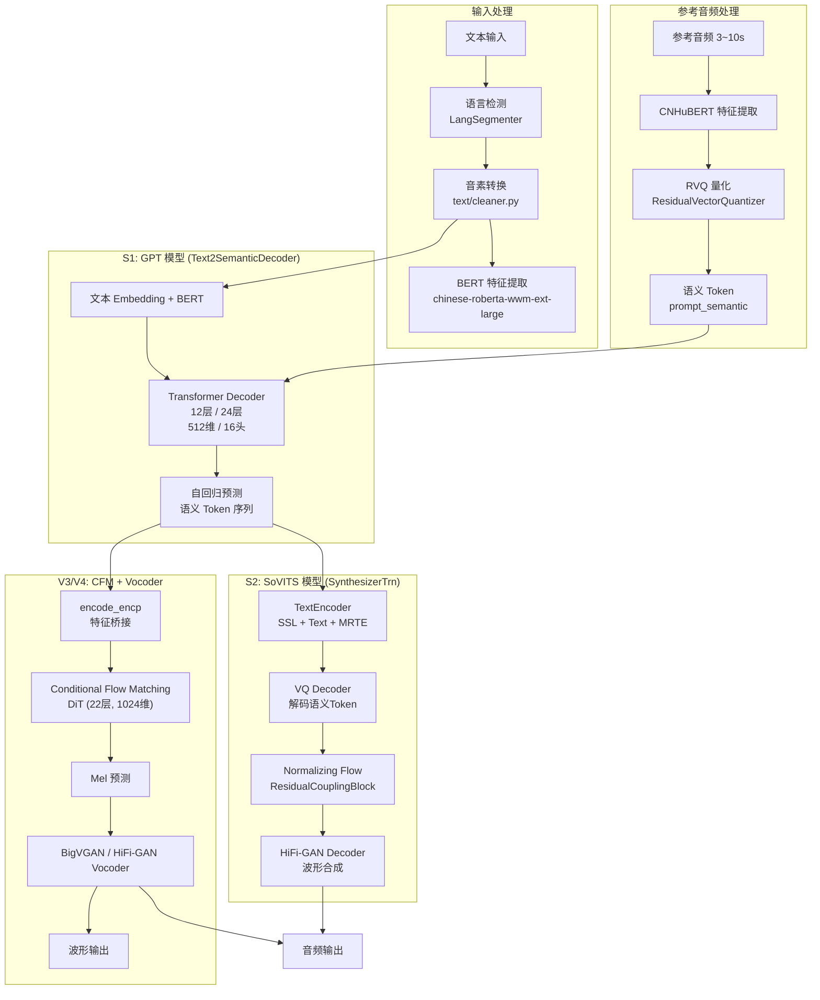
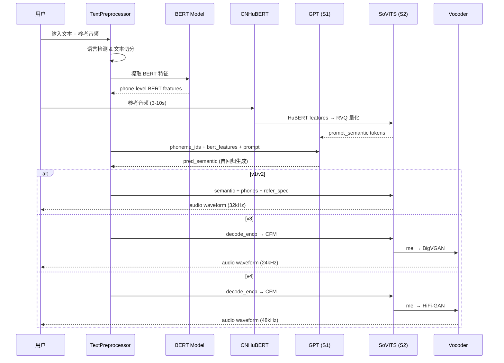

# GPT-SoVITS 技术学习报告

> 基于 `reference_repos/GPT-SoVITS` 仓库的实际代码分析
> 分析日期：2026-07-24

---

## 1. 项目概述

### 1.1 仓库定位

GPT-SoVITS 是一个强大的**少样本语音克隆与文本转语音 (TTS) WebUI**，由 RVC-Boss 开发维护。项目采用 GPT + SoVITS 双模型架构，仅需 **5 秒参考音频**即可实现零样本语音克隆，**1 分钟训练数据**即可完成少样本微调，效果显著。

- **GitHub**: https://github.com/RVC-Boss/GPT-SoVITS
- **许可证**: MIT
- **Python 版本**: 3.10 ~ 3.12
- **框架**: PyTorch 2.5+ / PyTorch Lightning

### 1.2 主要功能

| 功能 | 说明 |
|------|------|
| 零样本 TTS | 输入 5 秒参考音频，即时文本转语音 |
| 少样本 TTS | 仅需 1 分钟训练数据微调，提升音色相似度 |
| 跨语言支持 | 中文、英文、日文、韩文、粤语 |
| WebUI 工具 | UVR5 人声分离、音频切片、ASR 标注、文本校对 |
| 流式推理 | 支持流式和分段返回模式 |
| 多版本演进 | v1 → v2 → v3 → v4 → v2Pro → v2ProPlus |

### 1.3 技术栈

| 层面 | 技术 |
|------|------|
| 深度学习框架 | PyTorch, PyTorch Lightning |
| GPT 模型 | 自定义 Transformer Decoder (基于 VALL-E/SoundStorm) |
| 声码器 | VITS (v1/v2), BigVGAN (v3), HiFi-GAN (v4) |
| 特征提取 | Chinese HuBERT, Chinese-RoBERTa-WWM-Ext-Large |
| ASR | FunASR, SenseVoice, Faster Whisper |
| 文本前端 | G2PW, pypinyin, g2p_en, pyopenjtalk, g2pk2, ko_pron |
| 量化 | Residual Vector Quantization (RVQ) |
| 推理加速 | JetScript (T2SBlock), LoRA (v3) |
| Web 框架 | Gradio (WebUI), FastAPI (API) |

---

## 2. 核心架构分析

### 2.1 整体架构图



### 2.2 关键模块职责

| 模块 | 目录 | 职责 |
|------|------|------|
| **GPT 模型 (S1)** | `GPT_SoVITS/AR/models/t2s_model.py` | 文本到语义 Token 的自回归生成 |
| **SoVITS 模型 (S2)** | `GPT_SoVITS/module/models.py` | 语义 Token 到波形的声学合成 |
| **文本前端** | `GPT_SoVITS/text/` | 多语言音素转换、BERT 特征提取 |
| **推理封装** | `GPT_SoVITS/TTS_infer_pack/TTS.py` | 统一推理接口，管理完整流程 |
| **文本预处理** | `GPT_SoVITS/TTS_infer_pack/TextPreprocessor.py` | 文本切分、音素提取、BERT 编码 |
| **训练脚本** | `GPT_SoVITS/s1_train.py`, `s2_train.py` | GPT 和 SoVITS 分别训练 |
| **配置管理** | `GPT_SoVITS/config.py`, `configs/` | 版本管理、模型路径、训练参数 |
| **特征提取** | `GPT_SoVITS/feature_extractor/` | CNHuBERT 音频特征编码 |
| **VQ 量化** | `GPT_SoVITS/module/core_vq.py` | 残差向量量化，将连续特征离散化 |
| **WebUI** | `webui.py` | Gradio 交互界面 |
| **API 服务** | `api.py`, `api_v2.py` | RESTful API 接口 |

### 2.3 模块交互关系



---

## 3. 关键代码模块深度解析

### 3.1 模型训练流程

#### 3.1.1 GPT 模型训练 (S1)

**脚本**: `s1_train.py`
**框架**: PyTorch Lightning
**配置**: `configs/s1longer.yaml`

```
训练配置:
├── model:
│   ├── vocab_size: 1025          # 语义 Token 词表大小
│   ├── phoneme_vocab_size: 512   # 音素词表大小
│   ├── embedding_dim: 512        # 嵌入维度
│   ├── hidden_dim: 512           # 隐藏层维度
│   ├── head: 16                  # 注意力头数
│   ├── n_layer: 24               # Transformer 层数
│   └── EOS: 1024                 # 结束符
├── train:
│   ├── epochs: 20
│   ├── batch_size: 8
│   ├── precision: 16-mixed
│   └── gradient_clip: 1.0
└── optimizer:
    ├── lr: 0.01 → warmup → cosine decay
    └── ScaledAdam 优化器
```

**核心训练逻辑** (`Text2SemanticLightningModule`):

1. 输入 `phoneme_ids` (音素序列) + `bert_feature` (BERT 特征) + `semantic_ids` (语义 Token)
2. 文本 Embedding + BERT 投影 → 位置编码 → Transformer Decoder
3. 使用 **DPO (Direct Preference Optimization)** 损失: `loss = CE_loss + DPO_loss`
4. 每 4 步执行一次梯度更新 (gradient accumulation)
5. 监控指标: `top_3_acc` (Top-3 准确率)

**DPO 训练细节** (`t2s_model.py` L413-448):

```python
# 正样本: 原始 semantic_ids
loss_1 = F.cross_entropy(logits, targets, reduction="sum")

# DPO: 正负样本对比学习
reject_y = make_reject_y(y, y_lens)  # 生成负样本
A_logits, R_logits = get_batch_logps(logits, reject_logits, targets, reject_targets)
loss_2 = dpo_loss(A_logits, R_logits, 0, 0, 0.2, reference_free=True)

loss = loss_1 + loss_2
```

#### 3.1.2 SoVITS 模型训练 (S2)

**脚本**: `s2_train.py`
**框架**: 自定义 DDP 训练循环
**配置**: `configs/s2.json`

```
训练配置:
├── data:
│   ├── sampling_rate: 32000
│   ├── hop_length: 640
│   ├── n_mel_channels: 128
│   └── segment_size: 20480
├── model:
│   ├── inter_channels: 192
│   ├── hidden_channels: 192
│   ├── n_heads: 2
│   ├── n_layers: 6
│   ├── upsample_rates: [10, 8, 2, 2, 2]
│   ├── semantic_frame_rate: "25hz"
│   └── freeze_quantizer: true
└── train:
    ├── learning_rate: 0.0001
    ├── c_mel: 45              # Mel 损失权重
    ├── c_kl: 1.0              # KL 损失权重
    └── text_low_lr_rate: 0.4  # 文本相关层低学习率
```

**GAN 训练流程** (`s2_train.py` L318-576):

```
每个训练步骤:
1. Generator forward:
   ssl → ssl_proj → quantizer → enc_p(text+semantic+MRTE)
   → PosteriorEncoder → Flow → Decoder → y_hat

2. 判别器训练:
   net_d(y, y_hat.detach()) → loss_disc

3. 生成器训练:
   loss_gen = loss_fm + loss_mel + kl_ssl + loss_kl + loss_gan
   其中:
   - loss_fm: 特征匹配损失 (feature matching)
   - loss_mel: Mel 频谱 L1 损失 (权重 45)
   - kl_ssl: VQ commit 损失
   - kl_kl: KL 散度损失
   - loss_gan: GAN 对抗损失
```

**关键优化**: 文本相关层 (text_embedding, encoder_text, MRTE) 使用较低学习率 (`0.4 * base_lr`)，避免微调时破坏预训练的文本理解能力。

### 3.2 数据处理管线

#### 3.2.1 音频预处理

```
原始音频 (.wav)
  │
  ├── 1. UVR5 人声分离 (可选)
  │     tools/uvr5/ → 人声 + 伴奏分离
  │
  ├── 2. 音频切片 (tools/slicer2.py)
  │     音量阈值 → 静音检测 → 自动切片
  │     参数: threshold, min_length(3s), min_interval
  │
  ├── 3. 降噪 (tools/cmd-denoise.py, 可选)
  │
  ├── 4. ASR 标注
  │     ├── Fun-ASR-Nano (中/英/日/韩, 默认)
  │     ├── SenseVoice (快速转写)
  │     ├── FunASR (经典 Paraformer, 中文/粤语)
  │     └── Faster Whisper (英/日)
  │
  └── 5. 标注文件格式
        vocal_path|speaker_name|language|text
```

#### 3.2.2 训练数据格式

**S1 (GPT) 数据**:
- `name2semantic.tsv`: 文件路径 → 语义 Token 序列 (通过 CNHuBERT + RVQ 量化提取)
- `name2text.txt`: 文件路径 → 音素序列 + BERT 特征

**S2 (SoVITS) 数据**:
- `TextAudioSpeakerLoader` 加载: ssl特征 + spectrogram + waveform + text
- 使用 `DistributedBucketSampler` 按长度分桶

#### 3.2.3 文本前端处理

`TextPreprocessor.get_phones_and_bert()`:

```
输入文本
  │
  ├── 1. 语言分割 (LangSegmenter)
  │     支持: zh, en, ja, ko, yue
  │     模式: auto, all_zh, all_ja, all_ko, all_yue
  │
  ├── 2. 音素转换 (clean_text)
  │     ├── zh: G2PW + pypinyin (多音字消歧)
  │     ├── en: g2p_en
  │     ├── ja: pyopenjtalk
  │     ├── ko: g2pk2 + ko_pron
  │     └── yue: ToJyutping
  │
  ├── 3. BERT 特征提取 (仅中文)
  │     chinese-roberta-wwm-ext-large
  │     hidden_states[-3:-2] → phone_level 扩展
  │
  └── 4. 输出: phones + bert_features + norm_text
```

### 3.3 推理流程 (从文本到语音)

#### 3.3.1 完整推理流程

```python
# TTS.run() 核心流程 (TTS_infer_pack/TTS.py L998-1514)

# 1. 参考音频处理
set_ref_audio(ref_audio_path)
  → _set_prompt_semantic(): CNHuBERT → RVQ → prompt_semantic tokens
  → _set_ref_spec(): 音频 → spectrogram_torch()

# 2. 参考文本处理
TextPreprocessor.segment_and_extract_feature_for_text()
  → phones + bert_features

# 3. 目标文本处理
TextPreprocessor.preprocess()
  → 文本切分 → 音素转换 → BERT 特征

# 4. GPT 推理: 文本 → 语义 Token
t2s_model.model.infer_panel(
    all_phoneme_ids,        # 音素序列
    all_phoneme_lens,       # 音素长度
    prompt,                 # 参考语义 Token
    all_bert_features,      # BERT 特征
    top_k=15,               # Top-K 采样
    temperature=1.0,        # 温度
    repetition_penalty=1.35 # 重复惩罚
)

# 5. SoVITS 推理: 语义 Token → 波形
# v1/v2:
vits_model.decode(
    pred_semantic,     # GPT 生成的语义 Token
    phones,            # 音素序列
    refer_audio_spec,  # 参考音频频谱
    speed=speed_factor
)

# v3/v4:
using_vocoder_synthesis()
  → vits_model.decode_encp() → fea (条件特征)
  → CFM.inference() → mel 频谱
  → vocoder(mel) → 波形
```

#### 3.3.2 GPT 自回归解码细节

`Text2SemanticDecoder.infer_panel_batch_infer()` (`t2s_model.py` L583-781):

```
批量并行推理:
1. 预处理: phoneme → embedding + bert_proj + position
2. Prompt 阶段: process_prompt() → KV Cache
3. 逐步解码: decode_next_token() → topk_sampling
4. 动态批处理:
   - 已完成的序列从 batch 中移除
   - KV Cache 同步裁剪
   - 提前停止: EOS token 或 early_stop_num
5. 最多 1500 步 (50Hz × 30s)
```

#### 3.3.3 流式推理

GPT-SoVITS 支持两种流式模式:

1. **Return Fragment 模式**: 每完成一段文本立即返回音频片段
2. **Streaming Mode**: 实时流式返回，使用 SOLA (Similarity Overlap-Add) 算法拼接

```python
# SOLA 算法 (TTS.py L1783-1826)
# 通过互相关找到最佳拼接点，使用 Hann 窗平滑过渡
def sola_algorithm(audio_fragments, overlap_len, search_len=320):
    for i in range(len(audio_fragments) - 1):
        w1 = f1[-overlap_len:]     # 前一段尾部
        w2 = f2[:overlap_len+search_len]  # 后一段头部+搜索范围
        # 归一化互相关 → 找到最佳对齐位置
        corr_norm = F.conv1d(w2, w1)
        idx = (corr_norm / corr_den.sqrt()).argmax()
        # Hann 窗交叉淡入淡出
        window = torch.hann_window(overlap_len * 2)
        f2_[:overlap_len] = window[:overlap_len] * f2_[:overlap_len]
                            + window[overlap_len:] * f1[-overlap_len:]
```

### 3.4 优化技术

#### 3.4.1 JetScript 推理加速

GPT 模型使用 `@torch.jit.script` 装饰器将 Transformer Block 编译为 TorchScript:

```python
@torch.jit.script
class T2SBlock:
    """JIT 编译的 Transformer Block，避免 Python 开销"""
    def process_prompt(self, x, attn_mask, ...):
        # 预填充阶段: 处理整个 prompt
        ...
    def decode_next_token(self, x, k_cache, v_cache, ...):
        # 逐步解码: KV Cache 增量计算
        k_cache = torch.cat([k_cache, k], dim=1)
        v_cache = torch.cat([v_cache, v], dim=1)
        ...
```

#### 3.4.2 LoRA 微调 (v3)

```python
# TTS.py L569-581
lora_config = LoraConfig(
    target_modules=["to_k", "to_q", "to_v", "to_out.0"],
    r=lora_rank,
    lora_alpha=lora_rank,
    init_lora_weights=True,
)
vits_model.cfm = get_peft_model(vits_model.cfm, lora_config)
# 推理时合并 LoRA 权重
vits_model.cfm = vits_model.cfm.merge_and_unload()
```

#### 3.4.3 其他优化

- **半精度推理**: 自动检测 GPU 支持，使用 float16
- **冻结量化器**: `freeze_quantizer=true` 时冻结 VQ 和 enc_p，减少训练参数
- **分桶批处理**: `DistributedBucketSampler` 按音频长度分桶，减少 padding
- **并行批推理**: 多个文本同时生成语义 Token，动态移除已完成序列
- **TF32 加速**: `torch.backends.cuda.matmul.allow_tf32 = True`
- **音频超分**: AP-BWE 模型将 24kHz 上采样到 48kHz

---

## 4. 技术亮点与创新点

### 4.1 GPT + SoVITS 双模型解耦架构

**创新点**: 将 TTS 任务分解为两个独立子问题:
1. **GPT (S1)**: 文本 → 语义 Token (离散化表示)
2. **SoVITS (S2)**: 语义 Token → 波形

**优势**:
- 两个模型可独立训练、独立优化
- GPT 擅长捕捉语言韵律和节奏
- SoVITS 擅长音色重建和音质保真
- 支持跨语言: GPT 生成的语义 Token 与语言无关

### 4.2 MRTE (Multi-Reference Timbre Encoder)

```python
# mrte_model.py L9-44
class MRTE(nn.Module):
    """多参考音色编码器"""
    def forward(self, ssl_enc, ssl_mask, text, text_mask, ge):
        # 交叉注意力: SSL 特征 × 文本特征
        x = cross_attention(ssl_enc, text_enc, attn_mask) + ssl_enc + ge
        return c_post(x)
```

通过交叉注意力机制，将参考音频的音色信息融合到文本编码中，实现音色迁移。

### 4.3 版本化演进策略

| 版本 | 核心改进 | 输出采样率 |
|------|----------|-----------|
| v1 | 基础 GPT+SoVITS | 32kHz |
| v2 | 预训练扩展 2k→5k 小时，韩文/粤语支持 | 32kHz |
| v3 | CFM (Conditional Flow Matching) + BigVGAN | 24kHz |
| v4 | 修复 v3 金属伪影，整数倍上采样 | 48kHz |
| v2Pro | 额外 Speaker Verification 嵌入 | 32kHz |
| v2ProPlus | 更高容量的 v2Pro | 32kHz |

### 4.4 V3/V4: CFM (Conditional Flow Matching)

```python
# models.py L1100-1207
class CFM(torch.nn.Module):
    """条件流匹配模型，用于高质量 Mel 预测"""
    def forward(self, x1, x_lens, prompt_lens, mu, use_grad_ckpt):
        x0 = torch.randn_like(x1)         # 随机噪声
        vt = x1 - x0                       # 目标速度场
        xt = x0 + t * vt                   # 插值
        vt_pred = self.estimator(xt, prompt, x_lens, t, d, mu)  # DiT 预测
        loss = MSE(vt_pred, vt)

    def inference(self, mu, x_lens, prompt, n_timesteps=32):
        x = torch.randn(...)               # 从噪声开始
        for j in range(n_timesteps):
            v_pred = self.estimator(x, prompt, x_lens, t, d, mu)
            x = x + d * v_pred             # Euler 积分
        return x
```

使用 F5-TTS 的 DiT (Diffusion Transformer) 作为条件估计器，在 Mel 空间进行流匹配，配合 BigVGAN/HiFi-GAN 声码器生成高质量波形。

### 4.5 多版本预训练权重管理

```python
# config.py - 版本化权重路径
pretrained_sovits_name = {
    "v1": "GPT_SoVITS/pretrained_models/s2G488k.pth",
    "v2": "GPT_SoVITS/pretrained_models/gsv-v2final-pretrained/s2G2333k.pth",
    "v3": "GPT_SoVITS/pretrained_models/s2Gv3.pth",
    "v4": "GPT_SoVITS/pretrained_models/gsv-v4-pretrained/s2Gv4.pth",
    "v2Pro": "GPT_SoVITS/pretrained_models/v2Pro/s2Gv2Pro.pth",
    "v2ProPlus": "GPT_SoVITS/pretrained_models/v2Pro/s2Gv2ProPlus.pth",
}
```

每个版本维护独立的预训练权重和权重目录，支持无缝升级和回退。

### 4.6 智能批处理与流式切分

- **分桶批处理**: 按文本长度排序后分组，减少 padding 浪费
- **动态批移除**: 并行推理时，已完成的序列立即从 batch 中移除，节省计算
- **流式切分点**: 基于 mute token 余弦相似度检测自然停顿点，实现智能切分

---

## 5. 可借鉴之处

### 5.1 可整合到 TTS_MultiModel 的技术

#### 5.1.1 GPT-SoVITS 作为新引擎

GPT-SoVITS 可以作为第三个引擎集成到 TTS_MultiModel 的多引擎架构中:

```python
# 建议的引擎适配器结构
# bin/integrated_app/engines/gpt_sovits/engine.py

class GPTSoVITSEngine(TTSEngine):
    """GPT-SoVITS engine implementing the TTSEngine Protocol."""

    def is_ready(self) -> bool:
        return self._tts_instance is not None

    def load(self) -> None:
        from TTS_infer_pack.TTS import TTS, TTS_Config
        config = TTS_Config("configs/tts_infer.yaml")
        self._tts_instance = TTS(config)

    def unload(self) -> None:
        del self._tts_instance
        self._tts_instance = None

    def generate_voice_clone(
        self, text, reference_audio_path=None, **kwargs
    ) -> tuple:
        inputs = {
            "text": text,
            "text_lang": kwargs.get("text_lang", "auto"),
            "ref_audio_path": reference_audio_path,
            "prompt_text": kwargs.get("prompt_text", ""),
            "prompt_lang": kwargs.get("prompt_lang", "auto"),
            "top_k": kwargs.get("top_k", 15),
            "temperature": kwargs.get("temperature", 1.0),
            "speed_factor": kwargs.get("speed_factor", 1.0),
        }
        for sr, audio in self._tts_instance.run(inputs):
            return audio_path, "生成完成"
```

#### 5.1.2 少样本训练管线

GPT-SoVITS 的完整训练管线 (音频切片 → ASR → 标注 → 微调) 可以整合到 TTS_MultiModel 的训练工具中:

- **UVR5 人声分离**: 可直接复用 `tools/uvr5/`
- **自动 ASR 标注**: FunASR/SenseVoice 集成
- **一键微调**: 参考 WebUI 的自动填充流程

#### 5.1.3 多语言文本前端

GPT-SoVITS 的文本前端 (`text/` 目录) 支持 5 种语言，包含:
- G2PW 多音字消歧
- 各语言 G2P 转换器
- 自动语言检测

可以复用这些组件增强 TTS_MultiModel 的多语言能力。

### 5.2 架构模式与最佳实践

| 模式 | 说明 | 应用建议 |
|------|------|----------|
| **双模型解耦** | GPT(语言) + SoVITS(声学) 分离 | 适合需要灵活组合的场景 |
| **版本化配置** | 每个版本独立配置和权重 | TTS_MultiModel 已有 model_registry，可扩展 |
| **JIT 编译加速** | T2SBlock 使用 TorchScript | 可应用于 VoxCPM2 推理加速 |
| **DPO 训练** | 正负样本对比学习 | 提升 GPT 生成质量 |
| **冻结微调** | 冻结预训练层，只微调新层 | 适用于少样本场景 |
| **SOLA 拼接** | 互相关对齐 + Hann 窗平滑 | 流式推理拼接质量提升 |
| **分桶批处理** | 按长度分组减少 padding | 适用于批量推理场景 |

### 5.3 需要注意的兼容性问题

1. **依赖冲突**: GPT-SoVITS 使用 `gradio<5`、`peft<0.18.0`、`torchmetrics<=1.5` 等版本锁定，与 TTS_MultiModel 的依赖可能冲突
2. **CUDA 版本**: 需要 CUDA 12.4+，与现有引擎的 CUDA 要求对齐
3. **内存占用**: GPT-SoVITS 完整加载需要 ~4GB VRAM (BERT + CNHuBERT + GPT + SoVITS)，加上现有引擎会增加显存压力
4. **模型文件大小**: 预训练模型较大 (~2GB)，需考虑存储管理
5. **API 风格差异**: GPT-SoVITS 使用 yield 生成器返回音频，与 TTS_MultiModel 的同步返回模式需要适配
6. **Gradio vs FastAPI**: GPT-SoVITS 的 WebUI 基于 Gradio，需转换为 FastAPI 路由模式

---

## 6. 参考资源

### 6.1 关键论文

| 论文 | 链接 | 相关性 |
|------|------|--------|
| **VALL-E** | https://arxiv.org/abs/2301.02111 | GPT 模型的理论基础 |
| **SoundStorm** | https://github.com/yangdongchao/SoundStorm | AR 模型代码来源 |
| **VITS** | https://arxiv.org/abs/2106.06103 | SoVITS 声学模型基础 |
| **ar-vits** | https://github.com/innnky/ar-vits | GPT+VITS 结合的先驱 |
| **BigVGAN** | https://arxiv.org/abs/2206.04658 | V3 声码器 |
| **HiFi-GAN** | https://arxiv.org/abs/2010.05646 | V1/V2/V4 声码器 |
| **ContentVec** | https://arxiv.org/abs/2104.10010 | CNHuBERT 特征基础 |
| **F5-TTS** | https://github.com/SWivid/F5-TTS | DiT 架构 (V3 CFM) |
| **Shortcut Flow Matching** | https://arxiv.org/abs/2310.03660 | CFM 训练加速 |
| **DPO** | https://arxiv.org/abs/2305.18290 | GPT 训练优化 |

### 6.2 文档链接

| 资源 | 链接 |
|------|------|
| 官方中文文档 | https://www.yuque.com/baicaigongchang1145haoyuangong/ib3g1e |
| 英文用户指南 | https://rentry.co/GPT-SoVITS-guide |
| GitHub 仓库 | https://github.com/RVC-Boss/GPT-SoVITS |
| HuggingFace 模型 | https://huggingface.co/lj1995/GPT-SoVITS |
| 在线 Demo | https://lj1995-gpt-sovits-proplus.hf.space/ |
| CPU 优化版 | https://github.com/baicai-1145/GPT-SoVITS-CPUFast |
| Docker Hub | https://hub.docker.com/r/xxxxrt666/gpt-sovits |

### 6.3 依赖的预训练模型

| 模型 | 用途 | 路径 |
|------|------|------|
| chinese-hubert-base | 音频特征提取 | `pretrained_models/chinese-hubert-base` |
| chinese-roberta-wwm-ext-large | 中文 BERT 特征 | `pretrained_models/chinese-roberta-wwm-ext-large` |
| BigVGAN v2 24kHz | V3 声码器 | `pretrained_models/models--nvidia--bigvgan_v2_24khz_100band_256x` |
| G2PWModel | 多音字消歧 | `text/G2PWModel` |
| eres2netv2 | V2Pro Speaker Verification | `pretrained_models/sv/pretrained_eres2netv2w24s4ep4.ckpt` |

---

*报告基于 `reference_repos/GPT-SoVITS` 仓库实际代码分析，重点关注 GPT+SoVITS 双模型架构、少样本语音克隆、多语言支持，以及与 TTS_MultiModel 项目的集成可能性。*
