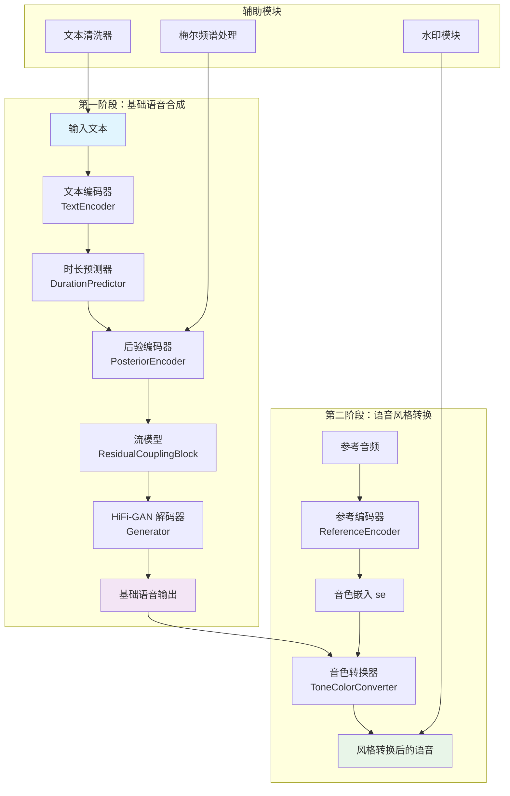

# OpenVoice 技术学习报告

> 本报告基于对 `reference_repos/OpenVoice` 仓库的深入代码分析，旨在为 TTS_MultiModel 项目提供技术参考和集成指导。

---

## 1. 项目概述

### 1.1 仓库定位

OpenVoice 是由 MyShell AI 开发的**即时语音克隆框架**，其核心特点是：
- **音色克隆**：仅需数秒参考音频即可复制说话人音色
- **风格控制**：支持情感、口音、节奏、停顿和语调的精细控制
- **跨语言支持**：零样本跨语言语音克隆，无需多语言训练数据
- **商业友好**：MIT 许可证，免费商用

### 1.2 主要功能

| 功能 | 说明 |
|------|------|
| 音色克隆 | 精确克隆参考音频的音色特征 |
| 风格控制 | 支持 whispering、cheerful、sad 等 8 种风格 |
| 跨语言生成 | 英文、中文、西班牙语、法语、日语、韩语 |
| 水印嵌入 | 可选的音频水印功能（wavmark） |
| Gradio Demo | 提供本地 Web 界面演示 |

### 1.3 技术栈

```
核心框架：PyTorch
基础架构：VITS/VITS2
文本处理：自定义文本清洗器（英文/中文）
音频处理：librosa, soundfile
水印技术：wavmark
语言检测：langid
语音分段：faster-whisper, silero-vad
Web界面：Gradio
```

---

## 2. 核心架构分析

### 2.1 整体架构图



### 2.2 关键模块职责

| 模块 | 文件 | 职责 |
|------|------|------|
| **SynthesizerTrn** | `models.py` | 核心合成器，整合所有子模块 |
| **BaseSpeakerTTS** | `api.py` | 基础说话人 TTS 接口，处理文本到语音 |
| **ToneColorConverter** | `api.py` | 音色转换器，实现跨说话人迁移 |
| **ReferenceEncoder** | `models.py` | 从参考音频提取音色嵌入向量 |
| **TextEncoder** | `models.py` | 文本特征编码，输出均值和方差 |
| **StochasticDurationPredictor** | `models.py` | 随机时长预测，基于归一化流 |
| **Generator** | `models.py` | HiFi-GAN 声码器，频谱到波形 |
| **SE Extractor** | `se_extractor.py` | 说话人嵌入提取，支持 VAD/Whisper 分段 |

### 2.3 数据流分析

#### 文本到语音流程
```
文本输入 → 文本清洗 → 符号序列 → 嵌入层 → Transformer编码器
    → 均值/方差 → 随机采样 → 随机时长预测 → 对齐扩展
    → 流模型逆变换 → HiFi-GAN解码 → 波形输出
```

#### 语音风格转换流程
```
源音频 → 梅尔频谱 → 后验编码器 → 潜在表示z
    → 流模型正变换 → z_p
    → 流模型逆变换（目标说话人）→ z_hat
    → HiFi-GAN解码 → 转换后音频
```

---

## 3. 关键代码模块深度解析

### 3.1 模型架构详解

#### 3.1.1 SynthesizerTrn 核心架构

```python
# openvoice/models.py - SynthesizerTrn 类
class SynthesizerTrn(nn.Module):
    def __init__(self, n_vocab, spec_channels, inter_channels, 
                 hidden_channels, filter_channels, n_heads, n_layers,
                 kernel_size, p_dropout, resblock, resblock_kernel_sizes,
                 resblock_dilation_sizes, upsample_rates, 
                 upsample_initial_channel, upsample_kernel_sizes,
                 n_speakers=256, gin_channels=256, zero_g=False, **kwargs):
        super().__init__()
        
        # 解码器：HiFi-GAN
        self.dec = Generator(
            inter_channels, resblock, resblock_kernel_sizes,
            resblock_dilation_sizes, upsample_rates,
            upsample_initial_channel, upsample_kernel_sizes,
            gin_channels=gin_channels
        )
        
        # 后验编码器：将频谱编码到潜在空间
        self.enc_q = PosteriorEncoder(
            spec_channels, inter_channels, hidden_channels,
            5, 1, 16, gin_channels=gin_channels
        )
        
        # 流模型：用于潜在空间变换
        self.flow = ResidualCouplingBlock(
            inter_channels, hidden_channels, 5, 1, 4,
            gin_channels=gin_channels
        )
        
        # 双模式设计
        if n_speakers == 0:
            # 音色转换模式：使用参考编码器
            self.ref_enc = ReferenceEncoder(spec_channels, gin_channels)
        else:
            # TTS模式：使用文本编码器和时长预测器
            self.enc_p = TextEncoder(...)
            self.sdp = StochasticDurationPredictor(...)
            self.dp = DurationPredictor(...)
            self.emb_g = nn.Embedding(n_speakers, gin_channels)
```

**设计亮点**：
- **双模式架构**：同一个模型支持 TTS 和音色转换两种模式
- **条件生成**：通过 `gin_channels` 实现说话人条件化
- **零初始化**：`zero_g` 选项用于消融实验

#### 3.1.2 ReferenceEncoder 音色编码器

```python
# openvoice/models.py - ReferenceEncoder 类
class ReferenceEncoder(nn.Module):
    """
    从参考音频提取音色嵌入向量
    输入: [N, Ty/r, n_mels*r] 频谱图
    输出: [N, gin_channels] 音色嵌入
    """
    def __init__(self, spec_channels, gin_channels=0, layernorm=True):
        super().__init__()
        # 6层CNN，逐步下采样
        ref_enc_filters = [32, 32, 64, 64, 128, 128]
        
        convs = [
            weight_norm(nn.Conv2d(
                filters[i], filters[i+1],
                kernel_size=(3, 3), stride=(2, 2), padding=(1, 1)
            ))
            for i in range(len(ref_enc_filters))
        ]
        self.convs = nn.ModuleList(convs)
        
        # GRU 捕获时序依赖
        self.gru = nn.GRU(
            input_size=ref_enc_filters[-1] * out_channels,
            hidden_size=128, batch_first=True
        )
        
        # 投影到目标维度
        self.proj = nn.Linear(128, gin_channels)
        
    def forward(self, inputs, mask=None):
        N = inputs.size(0)
        out = inputs.view(N, 1, -1, self.spec_channels)
        
        # CNN特征提取
        for conv in self.convs:
            out = conv(out)
            out = F.relu(out)
        
        # GRU时序建模
        out = out.transpose(1, 2)
        T = out.size(1)
        out = out.contiguous().view(N, T, -1)
        
        self.gru.flatten_parameters()
        memory, out = self.gru(out)
        
        return self.proj(out.squeeze(0))
```

**技术特点**：
- **多尺度CNN**：6层卷积逐步提取频谱特征
- **GRU时序建模**：捕获音色的时序变化特性
- **全局平均池化**：最终输出固定维度的音色向量

#### 3.1.3 StochasticDurationPredictor 随机时长预测

```python
# openvoice/models.py - StochasticDurationPredictor 类
class StochasticDurationPredictor(nn.Module):
    """
    基于归一化流的随机时长预测器
    支持训练时的负对数似然计算和推理时的采样
    """
    def __init__(self, in_channels, filter_channels, kernel_size, 
                 p_dropout, n_flows=4, gin_channels=0):
        super().__init__()
        
        # 后验流（训练时使用）
        self.post_flows = nn.ModuleList()
        self.post_flows.append(modules.ElementwiseAffine(2))
        for _ in range(4):
            self.post_flows.append(modules.ConvFlow(2, ...))
            self.post_flows.append(modules.Flip())
        
        # 先验流（推理时使用）
        self.flows = nn.ModuleList()
        self.flows.append(modules.ElementwiseAffine(2))
        for _ in range(n_flows):
            self.flows.append(modules.ConvFlow(2, ...))
            self.flows.append(modules.Flip())
        
        # DDSConv（Dilated and Depth-Separable Convolution）
        self.convs = modules.DDSConv(filter_channels, kernel_size, n_layers=3)
        
    def forward(self, x, x_mask, w=None, g=None, reverse=False, noise_scale=1.0):
        x = torch.detach(x)  # 截断梯度
        x = self.pre(x)
        
        if not reverse:
            # 训练模式：计算负对数似然
            # 1. 通过后验流编码真实时长
            # 2. 通过先验流计算似然
            # 3. 返回 NLL + KL
            ...
        else:
            # 推理模式：从先验采样
            z = torch.randn(x.size(0), 2, x.size(2)) * noise_scale
            for flow in reversed(self.flows):
                z = flow(z, x_mask, g=x, reverse=True)
            logw = z[:, 0:1, :]
            return logw
```

**创新点**：
- **归一化流**：使用可逆变换建模时长分布
- **随机性**：引入随机性使生成语音更自然
- **条件生成**：支持说话人条件 `g` 和全局条件

#### 3.1.4 流模型（Normalizing Flow）

```python
# openvoice/modules.py - ResidualCouplingLayer
class ResidualCouplingLayer(nn.Module):
    """
    残差耦合层：流模型的基本构建块
    实现仿射耦合变换
    """
    def __init__(self, channels, hidden_channels, kernel_size, 
                 dilation_rate, n_layers, gin_channels=0, mean_only=False):
        super().__init__()
        self.half_channels = channels // 2
        
        # 耦合网络：只处理一半通道
        self.pre = nn.Conv1d(self.half_channels, hidden_channels, 1)
        self.enc = WN(hidden_channels, kernel_size, dilation_rate, n_layers)
        self.post = nn.Conv1d(hidden_channels, self.half_channels * (2 - mean_only), 1)
        
    def forward(self, x, x_mask, g=None, reverse=False):
        x0, x1 = torch.split(x, [self.half_channels] * 2, 1)
        h = self.pre(x0) * x_mask
        h = self.enc(h, x_mask, g=g)
        stats = self.post(h) * x_mask
        
        if not self.mean_only:
            m, logs = torch.split(stats, [self.half_channels] * 2, 1)
        else:
            m = stats
            logs = torch.zeros_like(m)
        
        if not reverse:
            # 正向变换
            x1 = m + x1 * torch.exp(logs) * x_mask
            x = torch.cat([x0, x1], 1)
            logdet = torch.sum(logs, [1, 2])
            return x, logdet
        else:
            # 逆向变换
            x1 = (x1 - m) * torch.exp(-logs) * x_mask
            x = torch.cat([x0, x1], 1)
            return x
```

### 3.2 推理流程详解

#### 3.2.1 完整推理流程

```python
# openvoice/api.py - ToneColorConverter.convert 方法
def convert(self, audio_src_path, src_se, tgt_se, output_path=None, 
            tau=0.3, message="default"):
    # 1. 加载源音频
    audio, sample_rate = librosa.load(audio_src_path, sr=hps.data.sampling_rate)
    audio = torch.tensor(audio).float()
    
    with torch.no_grad():
        y = torch.FloatTensor(audio).to(self.device).unsqueeze(0)
        
        # 2. 计算梅尔频谱
        spec = spectrogram_torch(y, hps.data.filter_length,
                                hps.data.sampling_rate, hps.data.hop_length,
                                hps.data.win_length, center=False)
        spec_lengths = torch.LongTensor([spec.size(-1)])
        
        # 3. 执行音色转换
        audio = self.model.voice_conversion(
            spec, spec_lengths, 
            sid_src=src_se, sid_tgt=tgt_se, tau=tau
        )[0, 0].data.cpu().float().numpy()
        
        # 4. 添加水印（可选）
        audio = self.add_watermark(audio, message)
        
        if output_path is not None:
            soundfile.write(output_path, audio, hps.data.sampling_rate)
```

#### 3.2.2 voice_conversion 方法

```python
# openvoice/models.py - SynthesizerTrn.voice_conversion
def voice_conversion(self, y, y_lengths, sid_src, sid_tgt, tau=1.0):
    # 1. 后验编码：源音频 → 潜在表示
    z, m_q, logs_q, y_mask = self.enc_q(
        y, y_lengths, 
        g=sid_src if not self.zero_g else torch.zeros_like(sid_src),
        tau=tau
    )
    
    # 2. 流模型正向：z → z_p（源说话人空间）
    z_p = self.flow(z, y_mask, g=sid_src)
    
    # 3. 流模型逆向：z_p → z_hat（目标说话人空间）
    z_hat = self.flow(z_p, y_mask, g=sid_tgt, reverse=True)
    
    # 4. 解码：z_hat → 音频波形
    o_hat = self.dec(z_hat * y_mask, g=sid_tgt if not self.zero_g else torch.zeros_like(sid_tgt))
    
    return o_hat, y_mask, (z, z_p, z_hat)
```

**流程图**：
```
源音频 → [后验编码器] → z → [流模型正向] → z_p → [流模型逆向] → z_hat → [解码器] → 目标音频
         ↑                    ↑                    ↑
      源说话人g          源说话人g            目标说话人g
```

### 3.3 训练流程分析

虽然仓库中未直接提供训练脚本，但从模型结构可以推断训练流程：

```python
# 训练损失函数推断
def train_loss(model, batch):
    # 1. 重建损失（Mel频谱 L1/L2）
    spec_loss = F.l1_loss(spec_pred, spec_target)
    
    # 2. 判别器损失（GAN Loss）
    disc_loss = discriminator_loss(real_pred, fake_pred)
    
    # 3. 特征匹配损失
    feature_loss = feature_matching_loss(real_features, fake_features)
    
    # 4. KL 散度损失（VAE）
    kl_loss = kl_divergence(z_p, posterior, prior)
    
    # 5. 时长预测损失（SDP + DP）
    duration_loss = sdp_loss + dp_loss
    
    # 总损失
    total_loss = (spec_loss + disc_loss + feature_loss + 
                  kl_loss + duration_loss)
    
    return total_loss
```

---

## 4. 技术亮点与创新点

### 4.1 双阶段架构设计

**创新点**：将 TTS 和音色转换解耦为两个独立阶段

```
┌─────────────────────────────────────────────────────────┐
│  第一阶段：基础 TTS（Base Speaker）                       │
│  - 使用预训练的基础说话人模型                              │
│  - 输出具有固定音色的基础语音                              │
│  - 支持多语言、多风格                                     │
└─────────────────────────────────────────────────────────┘
                           ↓
┌─────────────────────────────────────────────────────────┐
│  第二阶段：音色转换（Tone Color Converter）               │
│  - 仅学习音色变换，不改变内容                              │
│  - 支持任意参考音频的音色克隆                              │
│  - 零样本跨语言迁移                                      │
└─────────────────────────────────────────────────────────┘
```

**优势**：
- 模块化设计，便于独立优化和扩展
- 基础说话人可替换（不同语言/风格）
- 音色转换器通用，一次训练多处使用

### 4.2 音色编码器（ReferenceEncoder）

**技术特点**：
1. **多尺度特征提取**：6层CNN逐步下采样
2. **时序建模**：GRU捕获音色的动态变化
3. **全局嵌入**：输出固定维度的音色向量
4. **多段平均**：支持多段参考音频平均以提高鲁棒性

```python
# 多段音频音色提取
def extract_se(self, ref_wav_list, se_save_path=None):
    gs = []
    for fname in ref_wav_list:
        audio_ref, sr = librosa.load(fname, sr=hps.data.sampling_rate)
        y = torch.FloatTensor(audio_ref).unsqueeze(0)
        spec = spectrogram_torch(y, ...)
        with torch.no_grad():
            g = self.model.ref_enc(spec.transpose(1, 2)).unsqueeze(-1)
            gs.append(g.detach())
    # 多段平均，提高音色稳定性
    gs = torch.stack(gs).mean(0)
    return gs
```

### 4.3 随机时长预测（Stochastic Duration Predictor）

**创新点**：使用归一化流建模时长分布

- **训练时**：计算真实时长的负对数似然
- **推理时**：从先验分布采样，引入随机性
- **效果**：生成语音的节奏更自然、更多样

### 4.4 水印技术集成

```python
# 水印嵌入流程
def add_watermark(self, audio, message):
    bits = utils.string_to_bits(message).reshape(-1)
    n_repeat = len(bits) // 32
    
    K = 16000  # 每段1秒
    for n in range(n_repeat):
        trunck = audio[(coeff * n) * K: (coeff * n + 1) * K]
        message_npy = bits[n * 32: (n + 1) * 32]
        
        # 使用wavmark模型嵌入水印
        signal_wmd = self.watermark_model.encode(signal, message_tensor)
        audio[(coeff * n) * K: (coeff * n + 1) * K] = signal_wmd
    
    return audio
```

**特点**：
- 可选功能，不影响核心性能
- 支持自定义水印消息
- 透明嵌入，人耳不可感知

### 4.5 语言标记机制

```python
# 语言标记
language_marks = {
    "english": "EN",
    "chinese": "ZH",
}

# 在文本前后添加标记
t = f'[{mark}]{t}[{mark}]'

# 示例输出
# [EN]Hello world.[EN]
# [ZH]你好世界。[ZH]
```

**作用**：
- 告诉模型输入语言
- 支持跨语言生成
- 简单有效的多语言方案

---

## 5. 可借鉴之处

### 5.1 可整合到 TTS_MultiModel 的技术

#### 5.1.1 音色转换模块

```python
# 建议整合方案
class ToneColorConverterAdapter:
    def __init__(self, openvoice_config):
        self.converter = ToneColorConverter(openvoice_config)
    
    def convert_voice(self, source_audio, target_speaker):
        # 提取目标音色
        target_se = self.extract_speaker_embedding(target_speaker)
        
        # 执行转换
        converted_audio = self.converter.convert(
            audio_src_path=source_audio,
            src_se=self.default_se,
            tgt_se=target_se
        )
        
        return converted_audio
```

#### 5.1.2 参考编码器

可借鉴 ReferenceEncoder 的设计用于：
- 说话人识别
- 说话人验证
- 说话人聚类

#### 5.1.3 随机时长预测

可整合到现有 TTS 模型中，提升韵律自然度。

### 5.2 架构模式与最佳实践

| 模式 | 描述 | 适用场景 |
|------|------|----------|
| **双阶段设计** | 将核心功能和附加功能解耦 | 多功能系统 |
| **条件生成** | 通过嵌入向量控制生成属性 | 多说话人/多风格 |
| **归一化流** | 用于潜在空间变换 | 需要精确分布建模 |
| **模块化解码器** | HiFi-GAN 作为通用声码器 | 频谱到波形转换 |
| **水印嵌入** | 透明嵌入版权信息 | 商业化产品 |

### 5.3 兼容性注意事项

#### 5.3.1 依赖兼容性

```txt
# OpenVoice 依赖
torch>=1.9.0
librosa>=0.8.1
soundfile>=0.10.3
pydub>=0.25.1
faster-whisper>=0.9.0
wavmark>=0.1.0

# TTS_MultiModel 兼容性检查
# - librosa: 已集成
# - soundfile: 已集成
# - faster-whisper: 需要评估是否替代现有ASR
# - wavmark: 可选集成
```

#### 5.3.2 模型格式兼容

```python
# Checkpoint 加载
checkpoint_dict = torch.load(ckpt_path, map_location=device)
model.load_state_dict(checkpoint_dict['model'], strict=False)

# 注意：strict=False 允许部分加载
# 需要确保关键参数匹配
```

#### 5.3.3 API 设计兼容

```python
# 建议的适配层设计
class OpenVoiceAdapter:
    def __init__(self, config_path, device='cuda:0'):
        self.model = OpenVoiceBaseClass(config_path, device)
    
    def tts(self, text, output_path, speaker, language, speed):
        # 统一接口
        return self.model.tts(text, output_path, speaker, language, speed)
    
    def voice_conversion(self, audio_path, target_speaker, output_path):
        # 音色转换接口
        return self.model.convert(audio_path, target_speaker, output_path)
```

---

## 6. 参考资源

### 6.1 关键论文

1. **OpenVoice 论文**
   - 标题：OpenVoice: Versatile Instant Voice Cloning
   - 链接：https://arxiv.org/abs/2312.01479
   - 核心贡献：音色解耦、风格控制、跨语言克隆

2. **VITS 论文**
   - 标题：Conditional Variational Autoencoder with Adversarial Learning for End-to-End Text-to-Speech
   - 链接：https://arxiv.org/abs/2106.06103
   - 核心贡献：端到端 TTS、VAE + Flow + GAN

3. **VITS2 论文**
   - 标题：VITS2: Improving Quality and Efficiency of Single-Stage Text-to-Speech with Adversarial Learning and Architecture Design
   - 链接：https://arxiv.org/abs/2307.16430
   - 核心贡献：改进的归一化流、说话人条件

4. **HiFi-GAN 论文**
   - 标题：HiFi-GAN: Generative Adversarial Networks for Efficient and High Fidelity Speech Synthesis
   - 链接：https://arxiv.org/abs/2010.05646
   - 核心贡献：高效声码器

### 6.2 项目文档

| 文档 | 链接 | 内容 |
|------|------|------|
| README | `reference_repos/OpenVoice/README.md` | 项目介绍、功能特性 |
| USAGE | `reference_repos/OpenVoice/docs/USAGE.md` | 安装和使用指南 |
| QA | `reference_repos/OpenVoice/docs/QA.md` | 常见问题解答 |
| Demo | `reference_repos/OpenVoice/demo_part1.ipynb` | 风格控制演示 |
| Demo | `reference_repos/OpenVoice/demo_part2.ipynb` | 跨语言克隆演示 |
| Demo | `reference_repos/OpenVoice/demo_part3.ipynb` | V2 版本演示 |

### 6.3 相关资源

- **HuggingFace Demo**：https://huggingface.co/spaces/myshell-ai/OpenVoice
- **GitHub 仓库**：https://github.com/myshell-ai/OpenVoice
- **项目主页**：https://research.myshell.ai/open-voice

---

## 7. 总结与建议

### 7.1 核心价值

OpenVoice 的核心价值在于：
1. **模块化设计**：TTS 和音色转换解耦，便于扩展
2. **零样本能力**：无需微调即可克隆新说话人
3. **风格可控**：支持精细的语音风格控制
4. **跨语言支持**：一次训练，多语言推理

### 7.2 集成建议

1. **短期**：集成 ToneColorConverter 作为可选的音色转换功能
2. **中期**：借鉴 ReferenceEncoder 设计说话人编码模块
3. **长期**：考虑将随机时长预测整合到核心 TTS 管线

### 7.3 注意事项

- 模型需要额外的 GPU 显存（约 2-4GB）
- 水印功能需要额外安装 wavmark 库
- 多语言支持依赖基础说话人模型的覆盖范围
- 音色转换质量受参考音频质量影响较大

---

*报告生成时间：2026-07-24*
*分析基于 OpenVoice 仓库最新版本*
