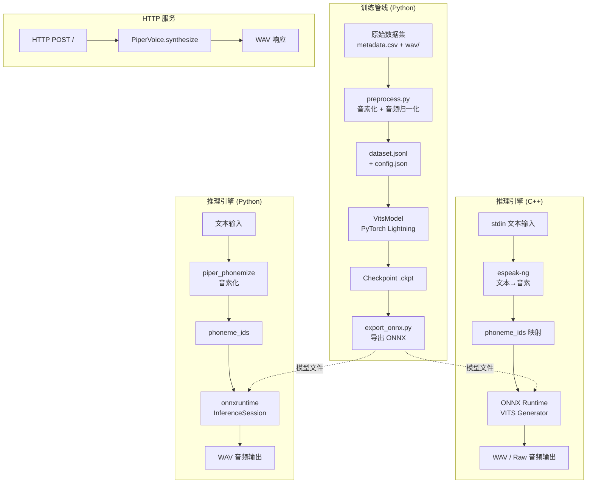

# Piper 技术学习报告

## 1. 项目概述

### 1.1 仓库定位
Piper 是由 Rhasspy（Home Assistant 生态）开发的快速、轻量级本地文本转语音（TTS）引擎。其核心设计理念是**为边缘设备和本地部署场景提供高性能、低延迟的 TTS 解决方案**。项目已迁移至 [OHF-Voice/piper1-gpl](https://github.com/OHF-Voice/piper1-gpl)。

Piper 的独特之处在于其**双语言实现架构**：
- **C++ 推理引擎**：用于生产部署，追求极致性能
- **Python 训练/推理工具链**：用于模型训练、导出和开发

### 1.2 主要功能
- **极速推理**：C++ 实现实时因子（RTF）极低，适合实时流式输出
- **多语言支持**：通过 espeak-ng 支持 50+ 种语言，预训练语音覆盖 40+ 语言
- **多说话人模型**：支持单一模型包含多个说话人（如 VCTK、lessac）
- **多质量分级**：x-low / low / medium / high 四档质量，适配不同算力
- **ONNX 导出**：统一使用 ONNX 格式部署，跨平台兼容
- **流式合成**：支持逐句流式输出到 stdout，降低首字节延迟
- **自动语音下载**：内置 HuggingFace 语音包自动下载和校验机制
- **HTTP 服务**：提供 Flask HTTP API 用于服务化部署

### 1.3 技术栈
- **推理引擎**：C++17 + ONNX Runtime + espeak-ng
- **训练框架**：Python + PyTorch + PyTorch Lightning
- **音素处理**：piper-phonemize（C++ 音素化库）
- **构建系统**：CMake（C++）、setup.py（Python）
- **日志**：spdlog（C++）、logging（Python）
- **HTTP 服务**：Flask
- **模型格式**：ONNX（推理）、PyTorch Lightning Checkpoint（训练）
- **外部依赖**：fmt（格式化）、nlohmann/json（JSON 解析）

## 2. 核心架构分析

### 2.1 整体架构图



### 2.2 关键模块职责与交互

#### 2.2.1 训练管线（`src/python/piper_train/`）
- **职责**：数据预处理、模型训练、模型导出
- **关键文件**：
  - `preprocess.py`：多进程数据预处理，支持 LJSpeech/Mycroft 格式
  - `__main__.py`：训练入口，基于 PyTorch Lightning Trainer
  - `export_onnx.py`：标准 ONNX 导出
  - `export_onnx_streaming.py`：流式 ONNX 导出（encoder/decoder 分离）
  - `vits/`：VITS 模型实现

#### 2.2.2 C++ 推理引擎（`src/cpp/`）
- **职责**：高性能文本到语音推理
- **关键文件**：
  - `main.cpp`：CLI 入口，参数解析，多种输出模式
  - `piper.cpp`：核心推理逻辑（音素化→推理→音频输出）
  - `piper.hpp`：数据结构定义（Voice、SynthesisConfig 等）
- **特点**：纯静态链接，单二进制分发，跨平台（Linux/Windows/macOS）

#### 2.2.3 Python 推理运行时（`src/python_run/piper/`）
- **职责**：Python 推理接口和 HTTP 服务
- **关键文件**：
  - `voice.py`：PiperVoice 核心类，ONNX 推理
  - `__main__.py`：CLI 入口
  - `http_server.py`：Flask HTTP API
  - `download.py`：语音模型自动下载
  - `config.py`：配置数据类

## 3. 关键代码模块深度解析

### 3.1 模型架构（VITS）

Piper 基于 **VITS（Variational Inference with adversarial learning for end-to-end Text-to-Speech）** 架构，核心模型定义在 `src/python/piper_train/vits/models.py`。

#### 3.1.1 SynthesizerTrn（训练合成器）

```python
class SynthesizerTrn(nn.Module):
    def __init__(self, n_vocab, spec_channels, segment_size, inter_channels,
                 hidden_channels, filter_channels, n_heads, n_layers, kernel_size,
                 p_dropout, resblock, resblock_kernel_sizes, resblock_dilation_sizes,
                 upsample_rates, upsample_initial_channel, upsample_kernel_sizes,
                 n_speakers=1, gin_channels=0, use_sdp=True):
        # 文本编码器：音素 → 隐表示
        self.enc_p = TextEncoder(n_vocab, inter_channels, hidden_channels,
                                  filter_channels, n_heads, n_layers, kernel_size, p_dropout)
        # 后验编码器：频谱 → 隐表示（仅训练时使用）
        self.enc_q = PosteriorEncoder(spec_channels, inter_channels, hidden_channels,
                                       5, 1, 16, gin_channels=gin_channels)
        # 流模型：连接先验和后验分布
        self.flow = ResidualCouplingBlock(inter_channels, hidden_channels, 5, 1, 4,
                                           gin_channels=gin_channels)
        # HiFi-GAN 解码器：隐表示 → 音频波形
        self.dec = Generator(inter_channels, resblock, resblock_kernel_sizes,
                              resblock_dilation_sizes, upsample_rates,
                              upsample_initial_channel, upsample_kernel_sizes,
                              gin_channels=gin_channels)
        # 时长预测器（支持 SDP 和 DP 两种模式）
        if use_sdp:
            self.dp = StochasticDurationPredictor(hidden_channels, 192, 3, 0.5, 4,
                                                   gin_channels=gin_channels)
        else:
            self.dp = DurationPredictor(hidden_channels, 256, 3, 0.5,
                                         gin_channels=gin_channels)
        # 多说话人嵌入
        if n_speakers > 1:
            self.emb_g = nn.Embedding(n_speakers, gin_channels)
```

**VITS 架构核心组件**：
1. **TextEncoder**：音素嵌入 + Transformer 编码器 → 均值/方差参数
2. **PosteriorEncoder**：WaveNet 编码器处理频谱 → 潜空间采样
3. **ResidualCouplingBlock**：4 层残差耦合流，连接先验和后验分布
4. **Generator (HiFi-GAN)**：转置卷积上采样 + 多尺度残差块
5. **StochasticDurationPredictor**：基于流的随机时长预测

#### 3.1.2 推理流程

```python
def infer(self, x, x_lengths, sid=None, noise_scale=0.667,
          length_scale=1, noise_scale_w=0.8, max_len=None):
    # 1. 文本编码
    x, m_p, logs_p, x_mask = self.enc_p(x, x_lengths)

    # 2. 多说话人条件
    if self.n_speakers > 1:
        g = self.emb_g(sid).unsqueeze(-1)
    else:
        g = None

    # 3. 随机时长预测（SDP 反向推理）
    if self.use_sdp:
        logw = self.dp(x, x_mask, g=g, reverse=True, noise_scale=noise_scale_w)
    else:
        logw = self.dp(x, x_mask, g=g)
    w = torch.exp(logw) * x_mask * length_scale
    w_ceil = torch.ceil(w)

    # 4. 生成对齐路径
    y_lengths = torch.clamp_min(torch.sum(w_ceil, [1, 2]), 1).long()
    attn = commons.generate_path(w_ceil, attn_mask)

    # 5. 扩展先验分布
    m_p = torch.matmul(attn.squeeze(1), m_p.transpose(1, 2)).transpose(1, 2)
    logs_p = torch.matmul(attn.squeeze(1), logs_p.transpose(1, 2)).transpose(1, 2)

    # 6. 采样 + 流模型反向变换
    z_p = m_p + torch.randn_like(m_p) * torch.exp(logs_p) * noise_scale
    z = self.flow(z_p, y_mask, g=g, reverse=True)

    # 7. HiFi-GAN 解码生成波形
    o = self.dec((z * y_mask)[:, :, :max_len], g=g)
    return o, attn, y_mask, (z, z_p, m_p, logs_p)
```

### 3.2 模型质量分级

Piper 通过 `ModelAudioConfig` 实现不同质量级别的模型配置：

```python
# 低质量配置（x-low / low）- 16kHz 采样率
@staticmethod
def low_quality() -> "ModelAudioConfig":
    return ModelAudioConfig(
        resblock="2",
        resblock_kernel_sizes=(3, 5, 7),
        resblock_dilation_sizes=((1, 2), (2, 6), (3, 12)),
        upsample_rates=(8, 8, 4),
        upsample_initial_channel=256,
        upsample_kernel_sizes=(16, 16, 8),
    )

# 高质量配置 - 22050Hz 采样率
@staticmethod
def high_quality() -> "ModelAudioConfig":
    return ModelAudioConfig(
        resblock="1",
        resblock_kernel_sizes=(3, 7, 11),
        resblock_dilation_sizes=((1, 3, 5), (1, 3, 5), (1, 3, 5)),
        upsample_rates=(8, 8, 2, 2),
        upsample_initial_channel=512,
        upsample_kernel_sizes=(16, 16, 4, 4),
    )
```

### 3.3 数据处理管线

#### 3.3.1 预处理流程（`preprocess.py`）

```
原始数据集 (metadata.csv + wav/) 
  → 多进程音素化 (piper_phonemize)
  → 音频归一化 (norm_audio)
  → 频谱图计算 (mel_spectrogram)
  → 输出 dataset.jsonl + config.json + .pt 缓存文件
```

**关键数据结构**：

```python
@dataclass
class Utterance:
    text: str                          # 原始文本
    audio_path: Path                   # 音频文件路径
    speaker: Optional[str] = None      # 说话人名称
    speaker_id: Optional[int] = None   # 说话人 ID
    phonemes: Optional[List[str]] = None      # 音素列表
    phoneme_ids: Optional[List[int]] = None   # 音素 ID 列表
    audio_norm_path: Optional[Path] = None    # 归一化音频路径
    audio_spec_path: Optional[Path] = None    # 频谱图路径
```

**数据集配置格式（config.json）**：

```json
{
    "dataset": "dataset_name",
    "audio": {"sample_rate": 22050, "quality": "medium"},
    "espeak": {"voice": "en-us"},
    "phoneme_type": "espeak",
    "phoneme_id_map": {"<phoneme>": [id1, id2, ...]},
    "num_symbols": 256,
    "num_speakers": 1,
    "inference": {"noise_scale": 0.667, "length_scale": 1, "noise_w": 0.8}
}
```

#### 3.3.2 音素 ID 映射规范

```
ID 0 ("_")  = PAD（填充符）
ID 1 ("^")  = BOS（句首）
ID 2 ("$")  = EOS（句末）
ID 3 (" ")  = 词间分隔符
```

### 3.4 C++ 推理流程

C++ 推理引擎的完整数据流：

```
文本输入 (stdin)
  → espeak-ng 音素化
  → 音素→ID 映射 (phoneme_id_map)
  → ONNX Runtime 推理 (VITS Generator)
  → 音频缩放 (float → int16)
  → WAV 文件 / Raw stdout
```

**核心推理函数**（`piper.cpp`）：

```cpp
void synthesize(std::vector<PhonemeId> &phonemeIds,
                SynthesisConfig &synthesisConfig, ModelSession &session,
                std::vector<int16_t> &audioBuffer, SynthesisResult &result) {
    // 构建输入张量
    std::vector<float> scales{synthesisConfig.noiseScale,
                              synthesisConfig.lengthScale,
                              synthesisConfig.noiseW};
    // input: 音素 ID 序列
    // input_lengths: 序列长度
    // scales: [noise_scale, length_scale, noise_w]
    // sid: 说话人 ID（可选）

    // ONNX Runtime 推理
    auto outputTensors = session.onnx.Run(
        Ort::RunOptions{nullptr}, inputNames.data(), inputTensors.data(),
        inputTensors.size(), outputNames.data(), outputNames.size());

    // 音频归一化：float → int16
    float audioScale = (MAX_WAV_VALUE / std::max(0.01f, maxAudioValue));
    for (int64_t i = 0; i < audioCount; i++) {
        int16_t intAudioValue = static_cast<int16_t>(
            std::clamp(audio[i] * audioScale, ...));
        audioBuffer.push_back(intAudioValue);
    }
}
```

**ONNX 模型输入输出接口**：
- **输入**：`input`（音素 ID）、`input_lengths`（长度）、`scales`（控制参数）、`sid`（说话人 ID）
- **输出**：`output`（音频波形）

### 3.5 训练流程

#### 3.5.1 PyTorch Lightning 训练

```python
# 训练入口 (__main__.py)
model = VitsModel(
    num_symbols=num_symbols,
    num_speakers=num_speakers,
    sample_rate=sample_rate,
    dataset=[dataset_path],
    **dict_args,
)
trainer.fit(model)
```

**训练步骤**：

```python
# 生成器训练步骤
def training_step_g(self, batch: Batch):
    # 1. 前向传播（含对齐和时长预测）
    (y_hat, l_length, attn, ids_slice, x_mask, z_mask,
     (z, z_p, m_p, logs_p, m_q, logs_q)) = self.model_g(
        x, x_lengths, spec, spec_lengths, speaker_ids)

    # 2. Mel 频谱损失
    mel = spec_to_mel_torch(spec, ...)
    y_mel = slice_segments(mel, ids_slice, ...)
    y_hat_mel = mel_spectrogram_torch(y_hat.squeeze(1), ...)
    loss_mel = F.l1_loss(y_mel, y_hat_mel) * self.hparams.c_mel

    # 3. KL 散度损失
    loss_kl = kl_loss(z_p, logs_q, m_p, logs_p, z_mask) * self.hparams.c_kl

    # 4. 判别器特征匹配损失
    y_d_hat_r, y_d_hat_g, fmap_r, fmap_g = self.model_d(y, y_hat)
    loss_fm = feature_loss(fmap_r, fmap_g)

    # 5. 生成器对抗损失
    loss_gen, _ = generator_loss(y_d_hat_g)

    # 6. 总损失
    loss_gen_all = loss_gen + loss_fm + loss_mel + loss_dur + loss_kl
    return loss_gen_all
```

**损失函数组成**：
- `loss_gen`：生成器对抗损失（LSGAN）
- `loss_fm`：特征匹配损失
- `loss_mel`：Mel 频谱 L1 损失（权重 c_mel=45）
- `loss_dur`：时长预测损失
- `loss_kl`：KL 散度损失（权重 c_kl=1.0）

#### 3.5.2 ONNX 导出

```python
def infer_forward(text, text_lengths, scales, sid=None):
    noise_scale = scales[0]
    length_scale = scales[1]
    noise_scale_w = scales[2]
    audio = model_g.infer(
        text, text_lengths,
        noise_scale=noise_scale, length_scale=length_scale,
        noise_scale_w=noise_scale_w, sid=sid,
    )[0].unsqueeze(1)
    return audio

# 导出配置
torch.onnx.export(
    model=model_g, args=dummy_input, f=str(args.output),
    opset_version=15,
    input_names=["input", "input_lengths", "scales", "sid"],
    output_names=["output"],
    dynamic_axes={
        "input": {0: "batch_size", 1: "phonemes"},
        "input_lengths": {0: "batch_size"},
        "output": {0: "batch_size", 1: "time"},
    },
)
```

#### 3.5.3 流式 ONNX 导出

Piper 还支持将模型拆分为 encoder 和 decoder 两部分导出：

```python
# 编码器：文本 → 隐表示 z
class VitsEncoder(nn.Module):
    def forward(self, x, x_lengths, scales, sid=None):
        # 文本编码 + 时长预测 + 对齐扩展 + 采样
        return z_p, y_mask, g

# 解码器：隐表示 z → 音频波形
class VitsDecoder(nn.Module):
    def forward(self, z, y_mask, g=None):
        z = self.gen.flow(z, y_mask, g=g, reverse=True)
        output = self.gen.dec((z * y_mask), g=g)
        return output
```

这种拆分使得**编码器可以缓存**，实现增量式流式合成。

### 3.6 语音自动下载机制

```python
URL_FORMAT = "https://huggingface.co/rhasspy/piper-voices/resolve/v1.0.0/{file}"

def ensure_voice_exists(name, data_dirs, download_dir, voices_info):
    voice_info = voices_info[name]
    for file_path, file_info in voice_info["files"].items():
        data_file_path = data_dir / Path(file_path).name
        # 检查文件是否存在、大小是否匹配、MD5 是否一致
        if not data_file_path.exists() or size_mismatch or hash_mismatch:
            # 从 HuggingFace 下载
            download_file(file_url, download_file_path)
```

## 4. 技术亮点与创新点

### 4.1 双语言推理引擎

Piper 最独特的创新是**同一模型同时支持 C++ 和 Python 两种推理实现**：

| 特性 | C++ 引擎 | Python 引擎 |
|------|---------|------------|
| 推理后端 | ONNX Runtime (C++) | onnxruntime (Python) |
| 音素化 | espeak-ng (C API) | piper_phonemize (Python 绑定) |
| 适用场景 | 生产部署、边缘设备 | 开发调试、快速原型 |
| 分发方式 | 单二进制 + 动态库 | pip 包 |
| 流式支持 | 多线程 raw output | yield 生成器 |

### 4.2 极简的部署模型

- **单文件模型**：每个语音仅需一个 `.onnx` 文件 + 一个 `.onnx.json` 配置文件
- **零依赖运行**（C++）：静态链接所有依赖，单二进制分发
- **自包含 espeak-ng**：语音数据打包在安装包中，无需系统级安装
- **HuggingFace 集成**：语音模型存储在 HuggingFace Hub，按需下载

### 4.3 多质量分级策略

通过调节模型大小和采样率，Piper 提供四个质量级别：

| 级别 | 采样率 | 模型参数量 | 上采样率 | 适用场景 |
|------|--------|-----------|---------|---------|
| x-low | 16000 Hz | ~2M | (8,8,4) | 嵌入式/IoT |
| low | 16000 Hz | ~5M | (8,8,4) | 低算力设备 |
| medium | 22050 Hz | ~15M | (8,8,4) | 通用场景 |
| high | 22050 Hz | ~40M | (8,8,2,2) | 高质量需求 |

### 4.4 音素静默控制

Piper 支持在特定音素后插入静默，实现更自然的语音节奏：

```cpp
// 在句间和音素级控制静默
struct SynthesisConfig {
    float sentenceSilenceSeconds = 0.2f;  // 句间静默
    std::optional<std::map<piper::Phoneme, float>> phonemeSilenceSeconds;  // 音素级静默
};
```

### 4.5 阿拉伯语特殊支持

集成 libtashkeel 进行阿拉伯语变音符号自动添加：

```cpp
// 阿拉伯语自动启用 Tashkeel
if (voice.phonemizeConfig.eSpeak.voice == "ar") {
    piperConfig.useTashkeel = true;
    config.tashkeelState = std::make_unique<tashkeel::State>();
    tashkeel::tashkeel_load(config.tashkeelModelPath.value(), *config.tashkeelState);
}
```

## 5. 可借鉴之处

### 5.1 可整合到 TTS_MultiModel 的具体技术

#### 5.1.1 ONNX 推理后端

**Piper 实现**：
```python
# 统一的 ONNX 推理接口
class PiperVoice:
    def synthesize_ids_to_raw(self, phoneme_ids, speaker_id=None, ...):
        phoneme_ids_array = np.expand_dims(np.array(phoneme_ids, dtype=np.int64), 0)
        scales = np.array([noise_scale, length_scale, noise_w], dtype=np.float32)
        args = {"input": phoneme_ids_array, "input_lengths": ..., "scales": scales}
        if speaker_id is not None:
            args["sid"] = np.array([speaker_id], dtype=np.int64)
        audio = self.session.run(None, args)[0].squeeze((0, 1))
        return audio_float_to_int16(audio.squeeze()).tobytes()
```

**TTS_MultiModel 整合建议**：
- 为 Piper 引擎实现 ONNX 推理后端，直接加载 `.onnx` 模型文件
- 利用 `onnxruntime` 的 CUDAExecutionProvider 实现 GPU 加速
- 参考 Piper 的 `scales` 参数设计，统一不同引擎的推理控制接口

#### 5.1.2 多质量分级机制

**Piper 实现**：
- 通过 `ModelAudioConfig` 定义不同质量级别的模型参数
- 采样率和模型大小的组合提供灵活的质量-性能权衡

**TTS_MultiModel 整合建议**：
- 为每个 TTS 引擎定义多质量配置（x-low/low/medium/high）
- 在 UI 中提供质量选择器，让用户根据设备性能选择
- 自动检测 GPU 显存，推荐合适的质量级别

#### 5.1.3 语音自动下载和校验

**Piper 实现**：
```python
# 基于 MD5 校验的语音下载
def ensure_voice_exists(name, data_dirs, download_dir, voices_info):
    # 检查文件大小和 MD5 哈希
    if expected_size != actual_size or expected_hash != actual_hash:
        # 重新下载
        download_file(file_url, download_file_path)
```

**TTS_MultiModel 整合建议**：
- 实现类似的语音模型自动下载和校验机制
- 支持从 HuggingFace Hub 下载预训练模型
- 使用 MD5/SHA256 校验确保模型完整性

#### 5.1.4 流式合成架构

**Piper 实现**：
```python
def synthesize_stream_raw(self, text, ...) -> Iterable[bytes]:
    sentence_phonemes = self.phonemize(text)
    for phonemes in sentence_phonemes:
        phoneme_ids = self.phonemes_to_ids(phonemes)
        yield self.synthesize_ids_to_raw(phoneme_ids, ...) + silence_bytes
```

**TTS_MultiModel 整合建议**：
- 为所有引擎实现逐句流式合成接口
- 支持 SSE（Server-Sent Events）流式推送
- 在前端实现渐进式音频播放

### 5.2 架构模式或最佳实践

#### 5.2.1 音素化抽象层

Piper 通过 `PhonemeType` 枚举和 `piper-phonemize` 库实现了**音素化策略的解耦**：

```python
class PhonemeType(str, Enum):
    ESPEAK = "espeak"   # 使用 espeak-ng 音素化
    TEXT = "text"        # 直接使用 UTF-8 codepoints
```

**TTS_MultiModel 建议**：
- 定义统一的音素化接口（`TextToPhoneme`）
- 支持多种音素化后端（espeak-ng、g2p、自定义）
- 在配置中指定音素化策略

#### 5.2.2 配置文件与模型文件分离

Piper 将模型权重（`.onnx`）和配置（`.onnx.json`）分离，配置文件包含：
- 音频参数（采样率）
- 音素映射表
- 推理参数（noise_scale、length_scale）
- 说话人映射表

**TTS_MultiModel 建议**：
- 采用类似的分离策略
- 配置文件使用 JSON 格式，便于人类阅读和编辑
- 支持配置文件的版本管理

#### 5.2.3 说话人嵌入架构

```python
# 多说话人嵌入设计
if n_speakers > 1:
    self.emb_g = nn.Embedding(n_speakers, gin_channels)  # gin_channels=512

# 在各组件中注入说话人条件
if self.n_speakers > 1:
    g = self.emb_g(sid).unsqueeze(-1)  # [b, h, 1]
# 生成器条件注入
if g is not None:
    x = x + self.cond(g)  # Conv1d(gin_channels, upsample_initial_channel, 1)
```

**TTS_MultiModel 建议**：
- 采用类似的条件注入架构
- 支持说话人嵌入的动态加载
- 实现说话人相似度计算

### 5.3 需要注意的兼容性问题

#### 5.3.1 espeak-ng 依赖

- Piper 强依赖 espeak-ng 进行音素化
- espeak-ng 在不同平台上的安装方式不同（apt/pip/编译）
- **注意**：espeak-ng 对中文支持有限，Piper 的中文语音质量一般

**TTS_MultiModel 建议**：
- 对中文场景使用专门的 G2P 模型（如 g2pM、g2pC）
- espeak-ng 仅用于拉丁语系语言
- 实现音素化后端的可插拔设计

#### 5.3.2 ONNX Runtime 版本兼容

- Piper 使用 ONNX Runtime 作为推理后端
- 不同版本的 ONNX Runtime 可能产生不同的推理结果
- GPU 支持需要匹配的 CUDA/cuDNN 版本

**TTS_MultiModel 建议**：
- 固定 ONNX Runtime 版本
- 提供 CPU 和 GPU 两种推理路径
- 添加模型兼容性检查

#### 5.3.3 模型格式统一

Piper 统一使用 ONNX 格式，这简化了跨平台部署。但需要注意：
- PyTorch Checkpoint → ONNX 的导出可能引入精度损失
- ONNX Opset 版本需要与 Runtime 版本匹配
- 动态轴（dynamic axes）在某些 Runtime 版本中可能不被完全支持

**TTS_MultiModel 建议**：
- 评估各引擎是否需要 ONNX 转换
- 对需要 ONNX 的引擎，固定 Opset 版本（如 Piper 使用 opset 15）
- 提供模型格式转换工具链

## 6. 参考资源

### 6.1 关键论文
1. **VITS**：Kim et al., "Conditional Variational Autoencoder with Adversarial Learning for End-to-End Text-to-Speech" (2021)
2. **HiFi-GAN**：Kong et al., "HiFi-GAN: Generative Adversarial Networks for Efficient and High Fidelity Speech Synthesis" (2020)
3. **Stochastic Duration Predictor**：Kim et al., "Conditional Variational Autoencoder with Adversarial Learning for End-to-End Text-to-Speech" (2021)

### 6.2 文档链接
- [Piper 官方仓库](https://github.com/rhasspy/piper)
- [Piper 新仓库](https://github.com/OHF-Voice/piper1-gpl)
- [预训练语音列表](https://github.com/rhasspy/piper/blob/master/VOICES.md)
- [训练指南](https://github.com/rhasspy/piper/blob/master/TRAINING.md)
- [espeak-ng](https://github.com/espeak-ng/espeak-ng)
- [piper-phonemize](https://github.com/rhasspy/piper-phonemize)
- [libtashkeel（阿拉伯语支持）](https://github.com/mush42/libtashkeel/)
- [HuggingFace 语音仓库](https://huggingface.co/rhasspy/piper-voices)

### 6.3 示例代码
- [Python 推理 Notebook](https://github.com/rhasspy/piper/blob/master/notebooks/piper_inference_(ONNX).ipynb)
- [多语言训练 Notebook](https://github.com/rhasspy/piper/blob/master/notebooks/piper_multilingual_training_notebook.ipynb)
- [模型导出 Notebook](https://github.com/rhasspy/piper/blob/master/notebooks/piper_model_exporter.ipynb)

## 总结

Piper 是一个设计精巧的轻量级 TTS 引擎，其核心价值在于**为边缘设备和本地部署场景提供极致的推理性能**。通过 C++ 推理引擎 + Python 训练工具链的双语言架构，Piper 实现了训练灵活性和部署性能的最佳平衡。

**主要借鉴点**：
1. **ONNX 推理后端**：统一的模型格式，跨平台兼容
2. **多质量分级**：灵活的质量-性能权衡策略
3. **流式合成**：逐句流式输出，降低首字节延迟
4. **语音自动下载**：HuggingFace 集成的模型分发机制
5. **音素化抽象**：支持多种音素化后端的可插拔设计

**整合建议**：
1. 为 Piper 引擎实现 ONNX 推理后端，直接复用其预训练语音
2. 采用多质量分级机制，适配不同设备的算力
3. 实现流式合成接口，提升用户体验
4. 建立类似 HuggingFace 的模型自动下载和管理机制
5. 对中文场景，替换 espeak-ng 为专门的 G2P 模型

通过整合 Piper 的轻量化设计理念和高效推理架构，TTS_MultiModel 可以在保持多引擎灵活性的同时，大幅提升边缘设备场景下的推理性能。
