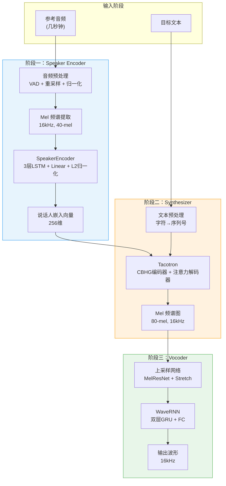
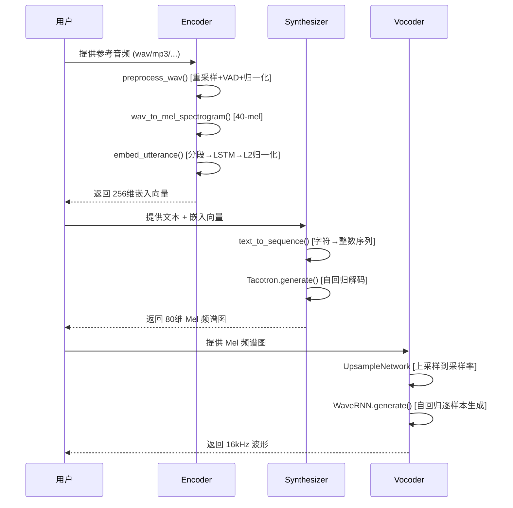
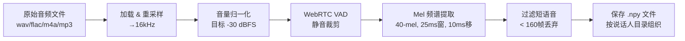

# Real-Time-Voice-Cloning 技术学习报告

> 分析日期：2026-07-24
> 仓库地址：https://github.com/CorentinJ/Real-Time-Voice-Cloning
> 基于论文：[Transfer Learning from Speaker Verification to Multispeaker Text-To-Speech Synthesis (SV2TTS)](https://arxiv.org/pdf/1806.04558.pdf)

---

## 1. 项目概述

### 1.1 仓库定位

Real-Time-Voice-Cloning 是 SV2TTS（Speaker Verification to Text-To-Speech）框架的 PyTorch 实现，由 Corentin J 盖伦（CorentinJ）作为硕士论文项目开发。该项目实现了**仅需几秒钟参考音频即可克隆任意人声**的实时语音克隆系统，是语音克隆领域的经典开源实现。

### 1.2 主要功能

- **零样本语音克隆（Zero-shot Voice Cloning）**：从几秒参考音频提取说话人嵌入向量，结合任意文本生成该说话人的语音
- **实时交互式工具箱**：基于 PyQt5 的图形界面，支持录音、浏览数据集、实时生成
- **CLI 接口**：无 GUI 的命令行推理方式，便于集成到其他项目
- **多数据集支持**：LibriSpeech、LibriTTS、VoxCeleb1/2、LJSpeech、VCTK 等

### 1.3 技术栈

| 类别 | 技术/库 |
|------|---------|
| 深度学习框架 | PyTorch 1.10 |
| 音频处理 | librosa 0.9.2, scipy, webrtcvad, soundfile |
| 语音激活检测 | WebRTC VAD |
| GUI | PyQt5 5.15 |
| 可视化 | matplotlib, umap-learn, visdom |
| 包管理 | uv (astral) |
| 预训练模型托管 | Hugging Face Hub |

### 1.4 关键论文

| 简称 | 论文 | 实现模块 |
|------|------|----------|
| **SV2TTS** | Transfer Learning from Speaker Verification to Multispeaker TTS | 整体框架 |
| **GE2E** | Generalized End-To-End Loss for Speaker Verification | Encoder (Speaker Encoder) |
| **Tacotron** | Towards End-to-End Speech Synthesis | Synthesizer (文本到频谱图) |
| **WaveRNN** | Efficient Neural Audio Synthesis | Vocoder (频谱图到波形) |

---

## 2. 核心架构分析

### 2.1 整体架构图



### 2.2 关键模块职责

| 模块 | 路径 | 核心职责 | 参数规模 |
|------|------|----------|----------|
| **Encoder** | `encoder/` | 从音频提取256维说话人嵌入向量 | ~3.9M |
| **Synthesizer** | `synthesizer/` | 文本+嵌入→80维 Mel 频谱图 | ~37M |
| **Vocoder** | `vocoder/` | Mel 频谱图→原始波形 | ~5.7M |
| **Toolbox** | `toolbox/` | PyQt5 交互式 GUI | - |
| **Utils** | `utils/` | 模型下载、参数解析、日志 | - |

### 2.3 推理数据流



---

## 3. 关键代码模块深度解析

### 3.1 Speaker Encoder（说话人编码器）

#### 3.1.1 模型架构

Speaker Encoder 采用 3 层 LSTM + 全连接层的轻量级架构：

```python
# encoder/model.py - SpeakerEncoder 核心结构
class SpeakerEncoder(nn.Module):
    def __init__(self, device, loss_device):
        super().__init__()
        self.lstm = nn.LSTM(
            input_size=mel_n_channels,   # 40 (mel滤波器组通道数)
            hidden_size=model_hidden_size,  # 256
            num_layers=model_num_layers,    # 3
            batch_first=True
        )
        self.linear = nn.Linear(model_hidden_size, model_embedding_size)  # 256→256
        self.relu = torch.nn.ReLU()

        # GE2E 损失的可学习参数
        self.similarity_weight = nn.Parameter(torch.tensor([10.]))
        self.similarity_bias = nn.Parameter(torch.tensor([-5.]))
```

**关键参数**（来自 `encoder/params_model.py`）：
- `model_hidden_size = 256`：LSTM 隐藏层维度
- `model_embedding_size = 256`：输出嵌入维度
- `model_num_layers = 3`：LSTM 层数
- `learning_rate_init = 1e-4`：初始学习率
- `speakers_per_batch = 64`：每批次说话人数
- `utterances_per_speaker = 10`：每个说话人语音数

#### 3.1.2 前向传播与 L2 归一化

```python
# encoder/model.py - forward 方法
def forward(self, utterances, hidden_init=None):
    out, (hidden, cell) = self.lstm(utterances, hidden_init)
    # 取最后一层的隐藏状态
    embeds_raw = self.relu(self.linear(hidden[-1]))
    # L2 归一化，确保嵌入向量位于单位超球面上
    embeds = embeds_raw / (torch.norm(embeds_raw, dim=1, keepdim=True) + 1e-5)
    return embeds
```

**设计要点**：
- 仅使用最后一层 LSTM 输出，避免多层信息冗余
- ReLU 激活 + L2 归一化确保嵌入向量的度量学习质量
- 添加 `1e-5` epsilon 防止除零

#### 3.1.3 GE2E 损失函数

GE2E（Generalized End-To-End）损失是该编码器的核心创新：

```python
# encoder/model.py - similarity_matrix 方法
def similarity_matrix(self, embeds):
    # 包含性质心：包含当前说话人所有语音的平均
    centroids_incl = torch.mean(embeds, dim=1, keepdim=True)
    centroids_incl = centroids_incl.clone() / (torch.norm(centroids_incl, dim=2, keepdim=True) + 1e-5)

    # 排他性质心：排除当前语音的其他语音平均
    centroids_excl = (torch.sum(embeds, dim=1, keepdim=True) - embeds)
    centroids_excl /= (utterances_per_speaker - 1)
    centroids_excl = centroids_excl.clone() / (torch.norm(centroids_excl, dim=2, keepdim=True) + 1e-5)

    # 相似度矩阵计算（带可学习的权重和偏置）
    sim_matrix = sim_matrix * self.similarity_weight + self.similarity_bias
    return sim_matrix
```

**GE2E 损失的独特设计**：
1. **包含性 vs 排他性质心**：对正样本使用排他性质心（去掉当前语音），避免信息泄漏
2. **可学习的余弦相似度缩放**：`similarity_weight` 和 `similarity_bias` 控制 softmax 温度
3. **梯度缩放**：对这两个参数的梯度乘以 0.01，防止训练不稳定

#### 3.1.4 推理流程 - 分段嵌入

```python
# encoder/inference.py - embed_utterance 方法
def embed_utterance(wav, using_partials=True, return_partials=False, **kwargs):
    # 将长音频分成 160帧（1.6秒）的片段
    wave_slices, mel_slices = compute_partial_slices(len(wav))
    # 对每个片段分别计算嵌入
    partial_embeds = embed_frames_batch(frames_batch)
    # 对所有片段嵌入取平均并再次 L2 归一化
    raw_embed = np.mean(partial_embeds, axis=0)
    embed = raw_embed / np.linalg.norm(raw_embed, 2)
    return embed
```

**关键数据参数**（来自 `encoder/params_data.py`）：
- `sampling_rate = 16000`：采样率
- `mel_n_channels = 40`：Mel 滤波器组数
- `partials_n_frames = 160`：分段帧数（1.6秒）
- `inference_n_frames = 80`：推理时帧数（0.8秒）

#### 3.1.5 音频预处理管线

```python
# encoder/audio.py - preprocess_wav 函数
def preprocess_wav(fpath_or_wav, source_sr=None, normalize=True, trim_silence=True):
    # 1. 加载音频
    wav, source_sr = librosa.load(str(fpath_or_wav), sr=None)

    # 2. 重采样到 16kHz
    if source_sr is not None and source_sr != sampling_rate:
        wav = librosa.resample(wav, source_sr, sampling_rate)

    # 3. 音量归一化（目标 -30 dBFS）
    if normalize:
        wav = normalize_volume(wav, audio_norm_target_dBFS, increase_only=True)

    # 4. WebRTC VAD 静音裁剪
    if webrtcvad and trim_silence:
        wav = trim_long_silences(wav)

    return wav
```

**VAD 实现细节**：
- 使用 WebRTC VAD（mode=3，最激进模式）
- 移动平均平滑（窗口宽度 8）
- 二值形态学膨胀（最大静音帧数 6）
- 窗口大小 30ms

### 3.2 Synthesizer（合成器 - Tacotron）

#### 3.2.1 Tacotron 模型架构

Synthesizer 基于改进的 Tacotron 架构，核心组件包括 CBHG 编码器、LSA 注意力机制和残差 LSTM 解码器：

```python
# synthesizer/models/tacotron.py - Tacotron 核心结构
class Tacotron(nn.Module):
    def __init__(self, embed_dims, num_chars, encoder_dims, decoder_dims,
                 n_mels, fft_bins, postnet_dims, encoder_K, lstm_dims,
                 postnet_K, num_highways, dropout, stop_threshold,
                 speaker_embedding_size):
        # 文本编码器（CBHG + Speaker Embedding 拼接）
        self.encoder = Encoder(embed_dims, num_chars, encoder_dims,
                               encoder_K, num_highways, dropout)
        # 编码器输出投影（编码器维度 + 说话人嵌入 → 解码器维度）
        self.encoder_proj = nn.Linear(encoder_dims + speaker_embedding_size,
                                      decoder_dims, bias=False)
        # 自回归解码器（LSA 注意力 + 双残差 LSTM）
        self.decoder = Decoder(n_mels, encoder_dims, decoder_dims, lstm_dims,
                               dropout, speaker_embedding_size)
        # 后处理网络（CBHG + 线性投影）
        self.postnet = CBHG(postnet_K, n_mels, postnet_dims,
                            [postnet_dims, fft_bins], num_highways)
        self.post_proj = nn.Linear(postnet_dims, fft_bins, bias=False)
```

**关键超参数**（来自 `synthesizer/hparams.py`）：

| 参数 | 值 | 说明 |
|------|-----|------|
| `sample_rate` | 16000 | 采样率 |
| `num_mels` | 80 | Mel 频谱维度 |
| `hop_size` | 200 | 帧移（12.5ms） |
| `win_size` | 800 | 窗口大小（50ms） |
| `tts_embed_dims` | 512 | 文本嵌入维度 |
| `tts_encoder_dims` | 256 | 编码器维度 |
| `tts_decoder_dims` | 128 | 解码器维度 |
| `tts_lstm_dims` | 1024 | LSTM 维度 |
| `tts_postnet_dims` | 512 | 后网络维度 |
| `speaker_embedding_size` | 256 | 说话人嵌入维度 |

#### 3.2.2 CBHG 编码器

CBHG（Convolution Bank + Highway network + GRU）是 Tacotron 的核心编码组件：

```python
# synthesizer/models/tacotron.py - CBHG 结构
class CBHG(nn.Module):
    def __init__(self, K, in_channels, channels, proj_channels, num_highways):
        # 卷积银行：K 个不同核大小的 1D 卷积（K=5）
        self.conv1d_bank = nn.ModuleList()
        for k in range(1, K + 1):
            conv = BatchNormConv(in_channels, channels, k)
            self.conv1d_bank.append(conv)

        self.maxpool = nn.MaxPool1d(kernel_size=2, stride=1, padding=1)

        # 卷积投影层
        self.conv_project1 = BatchNormConv(K * channels, proj_channels[0], 3)
        self.conv_project2 = BatchNormConv(proj_channels[0], proj_channels[1], 3, relu=False)

        # Highway Network（4层）
        self.highways = nn.ModuleList()
        for i in range(num_highways):
            self.highways.append(HighwayNetwork(channels))

        # 双向 GRU
        self.rnn = nn.GRU(channels, channels // 2, batch_first=True, bidirectional=True)
```

**数据流**：
1. 多尺度卷积银行提取局部特征
2. 最大池化降低维度
3. 卷积投影 + 残差连接
4. Highway Network 精炼特征
5. 双向 GRU 捕获全局上下文

#### 3.2.3 说话人嵌入注入机制

```python
# synthesizer/models/tacotron.py - Encoder.add_speaker_embedding
def add_speaker_embedding(self, x, speaker_embedding):
    # x: (batch_size, num_chars, encoder_dims)
    # speaker_embedding: (batch_size, 256)

    # 将说话人嵌入复制到每个字符位置
    e = speaker_embedding.repeat_interleave(num_chars, dim=idx)
    e = e.reshape(batch_size, speaker_embedding_size, num_chars)
    e = e.transpose(1, 2)

    # 在特征维度上拼接
    x = torch.cat((x, e), 2)  # (batch_size, num_chars, encoder_dims + 256)
    return x
```

**设计特点**：
- 采用**拼接（Concatenation）**而非加法注入说话人信息
- 说话人嵌入被广播到每个字符位置，确保全局一致性
- 编码器输出维度从 `encoder_dims` 扩展为 `encoder_dims + speaker_embedding_size`

#### 3.2.4 LSA（Location-Sensitive Attention）

```python
# synthesizer/models/tacotron.py - LSA 注意力
class LSA(nn.Module):
    def __init__(self, attn_dim, kernel_size=31, filters=32):
        self.conv = nn.Conv1d(1, filters, padding=(kernel_size - 1) // 2,
                              kernel_size=kernel_size, bias=True)
        self.L = nn.Linear(filters, attn_dim, bias=False)
        self.W = nn.Linear(attn_dim, attn_dim, bias=True)
        self.v = nn.Linear(attn_dim, 1, bias=False)
        self.cumulative = None  # 累积注意力权重

    def forward(self, encoder_seq_proj, query, t, chars):
        if t == 0: self.init_attention(encoder_seq_proj)

        processed_query = self.W(query).unsqueeze(1)

        # 位置敏感：将累积注意力权重通过卷积处理
        location = self.cumulative.unsqueeze(1)
        processed_loc = self.L(self.conv(location).transpose(1, 2))

        u = self.v(torch.tanh(processed_query + encoder_seq_proj + processed_loc))
        u = u.squeeze(-1)

        # 掩码零填充字符
        u = u * (chars != 0).float()

        scores = F.softmax(u, dim=1)
        self.attention = scores
        self.cumulative = self.cumulative + self.attention  # 累积

        return scores.unsqueeze(-1).transpose(1, 2)
```

**LSA 创新点**：
- 引入**累积注意力**作为卷积输入，隐式建模位置信息
- 使用 1D 卷积（kernel_size=31）平滑注意力分布
- 有效防止注意力跳帧和重复问题

#### 3.2.5 训练策略 - 渐进式训练

```python
# synthesizer/hparams.py - 渐进式训练调度
tts_schedule = [
    (2,  1e-3,  20_000,  12),   # r=2, lr=1e-3, 到 20k 步
    (2,  5e-4,  40_000,  12),   # r=2, lr=5e-4, 到 40k 步
    (2,  2e-4,  80_000,  12),   # r=2, lr=2e-4, 到 80k 步
    (2,  1e-4, 160_000,  12),   # r=2, lr=1e-4, 到 160k 步
    (2,  3e-5, 320_000,  12),   # r=2, lr=3e-5, 到 320k 步
    (2,  1e-5, 640_000,  12),   # r=2, lr=1e-5, 到 640k 步
]
# 格式: (r, learning_rate, max_step, batch_size)
# r = 每个解码步生成的 Mel 帧数
```

**训练特点**：
- **渐进式学习率衰减**：从 1e-3 逐步降到 1e-5
- **固定 reduction factor r=2**：每个解码步生成 2 帧 Mel
- **损失函数组合**：MSE + L1（预解码器）+ MSE（后解码器）+ BCE（停止令牌）

#### 3.2.6 训练损失

```python
# synthesizer/train.py - 损失计算
m1_loss = F.mse_loss(m1_hat, mels) + F.l1_loss(m1_hat, mels)  # 预解码器输出
m2_loss = F.mse_loss(m2_hat, mels)                              # 后解码器输出
stop_loss = F.binary_cross_entropy(stop_pred, stop)             # 停止令牌预测

loss = m1_loss + m2_loss + stop_loss
```

### 3.3 Vocoder（WaveRNN 声码器）

#### 3.3.1 WaveRNN 模型架构

WaveRNN 是一个高效的自回归神经声码器，专为实时生成设计：

```python
# vocoder/models/fatchord_version.py - WaveRNN 核心结构
class WaveRNN(nn.Module):
    def __init__(self, rnn_dims, fc_dims, bits, pad, upsample_factors,
                 feat_dims, compute_dims, res_out_dims, res_blocks,
                 hop_length, sample_rate, mode='RAW'):
        # 上采样网络：将 Mel 帧率提升到波形采样率
        self.upsample = UpsampleNetwork(feat_dims, upsample_factors,
                                         compute_dims, res_blocks, res_out_dims, pad)
        # 输入投影
        self.I = nn.Linear(feat_dims + self.aux_dims + 1, rnn_dims)
        # 双层 GRU
        self.rnn1 = nn.GRU(rnn_dims, rnn_dims, batch_first=True)
        self.rnn2 = nn.GRU(rnn_dims + self.aux_dims, rnn_dims, batch_first=True)
        # 全连接层
        self.fc1 = nn.Linear(rnn_dims + self.aux_dims, fc_dims)
        self.fc2 = nn.Linear(fc_dims + self.aux_dims, fc_dims)
        self.fc3 = nn.Linear(fc_dims, self.n_classes)
```

**关键参数**（来自 `vocoder/hparams.py`）：

| 参数 | 值 | 说明 |
|------|-----|------|
| `voc_mode` | 'RAW' | 原始模式（softmax）或 'MOL'（混合逻辑斯蒂） |
| `voc_upsample_factors` | (5, 5, 8) | 上采样因子（5×5×8=200=hop_length） |
| `voc_rnn_dims` | 512 | GRU 维度 |
| `voc_fc_dims` | 512 | 全连接层维度 |
| `voc_compute_dims` | 128 | MelResNet 计算维度 |
| `voc_res_out_dims` | 128 | 残差块输出维度 |
| `voc_res_blocks` | 10 | 残差块数量 |
| `bits` | 9 | 量化位数（512级） |

#### 3.3.2 上采样网络

```python
# vocoder/models/fatchord_version.py - UpsampleNetwork
class UpsampleNetwork(nn.Module):
    def __init__(self, feat_dims, upsample_scales, compute_dims,
                 res_blocks, res_out_dims, pad):
        total_scale = np.cumproduct(upsample_scales)[-1]  # 5*5*8 = 200
        self.indent = pad * total_scale
        # MelResNet：提取辅助特征
        self.resnet = MelResNet(res_blocks, feat_dims, compute_dims, res_out_dims, pad)
        self.resnet_stretch = Stretch2d(total_scale, 1)
        # 逐级上采样
        self.up_layers = nn.ModuleList()
        for scale in upsample_scales:
            stretch = Stretch2d(scale, 1)
            conv = nn.Conv2d(1, 1, kernel_size=(1, scale * 2 + 1),
                             padding=(0, scale), bias=False)
            conv.weight.data.fill_(1. / (scale * 2 + 1))  # 均匀初始化
            self.up_layers.append(stretch)
            self.up_layers.append(conv)
```

**上采样策略**：
- 使用 **Stretch + 平滑卷积**的组合，而非转置卷积
- 卷积权重初始化为均匀分布，实现平滑插值
- MelResNet 提取 4 组辅助特征（aux_dims = res_out_dims // 4），注入 GRU 和 FC 层

#### 3.3.3 批量推理优化

```python
# vocoder/models/fatchord_version.py - fold_with_overlap
def fold_with_overlap(self, x, target, overlap):
    """
    将长序列折叠为带重叠的批量序列，实现并行推理

    x = [[h1, h2, ... hn]]
    folded = [[h1, h2, h3, h4],      # target=2, overlap=1
              [h4, h5, h6, h7],
              [h7, h8, h9, h10]]
    """
    # 计算折叠数量和填充
    num_folds = (total_len - overlap) // (target + overlap)
    # ... 填充和切片逻辑
    return folded

def xfade_and_unfold(self, y, target, overlap):
    """等功率交叉淡入淡出 + 展开"""
    # 等功率交叉淡入淡出
    fade_in = np.sqrt(0.5 * (1 + t))   # t ∈ [-1, 1]
    fade_out = np.sqrt(0.5 * (1 - t))
    # ... 重叠相加展开
```

**实时推理优化**：
- 默认 `target=8000`（0.5秒），`overlap=400`（25ms）
- 等功率交叉淡入淡出确保过渡平滑
- 批量化处理使 GPU 利用率最大化，实现实时生成

#### 3.3.4 混合逻辑斯蒂分布（MOL 模式）

```python
# vocoder/distribution.py - discretized_mix_logistic_loss
def discretized_mix_logistic_loss(y_hat, y, num_classes=65536, log_scale_min=None):
    # 解包参数：logit_probs, means, log_scales
    nr_mix = y_hat.size(1) // 3
    logit_probs = y_hat[:, :, :nr_mix]
    means = y_hat[:, :, nr_mix:2 * nr_mix]
    log_scales = torch.clamp(y_hat[:, :, 2 * nr_mix:3 * nr_mix], min=log_scale_min)

    # 计算离散化混合逻辑斯蒂的 CDF
    centered_y = y - means
    inv_stdv = torch.exp(-log_scales)
    plus_in = inv_stdv * (centered_y + 1. / (num_classes - 1))
    cdf_plus = torch.sigmoid(plus_in)
    min_in = inv_stdv * (centered_y - 1. / (num_classes - 1))
    cdf_min = torch.sigmoid(min_in)

    # 对数概率
    log_cdf_plus = plus_in - F.softplus(plus_in)
    log_one_minus_cdf_min = -F.softplus(min_in)
    cdf_delta = cdf_plus - cdf_min

    # 边界处理
    log_probs = cond * log_cdf_plus + (1. - cond) * inner_out
    log_probs = log_probs + F.log_softmax(logit_probs, -1)
    return -torch.mean(log_sum_exp(log_probs))
```

### 3.4 数据处理管线

#### 3.4.1 Encoder 数据预处理



**并行预处理**：
- 使用 `multiprocessing.Pool(4)` 并行处理说话人
- 支持断点续传（`skip_existing` 参数）
- 输出目录结构：`<out_dir>/<speaker_name>/<utterance>.npy`

#### 3.4.2 Synthesizer 数据预处理

```python
# synthesizer/preprocess.py 核心流程（推断自代码结构）
# 1. 加载音频并重采样到 16kHz
# 2. 根据对齐信息分割长音频为子话语
# 3. 过滤过短语音（< 0.4秒静音分割，< 1.6秒丢弃）
# 4. 计算 80-mel 频谱图并保存
# 5. 使用 Encoder 预计算说话人嵌入并保存
# 6. 生成 train.txt 元数据文件
```

#### 3.4.3 Vocoder 数据预处理（GTA）

```python
# vocoder_preprocess.py - Ground Truth Aligned (GTA) 预处理
# 使用训练好的 Synthesizer 重新合成 Mel 频谱
# 确保 Vocoder 训练数据与推理时的分布一致
# 这是 SV2TTS 的重要训练技巧
```

---

## 4. 技术亮点与创新点

### 4.1 三阶段解耦架构

**核心思想**：将语音克隆分解为三个独立训练的模块，各自优化：

1. **Speaker Encoder**：学习说话人不变的嵌入表示
2. **Synthesizer**：学习文本到频谱的映射，条件化于说话人嵌入
3. **Vocoder**：学习频谱到波形的高质量转换

**优势**：
- 每个模块可独立训练、替换、升级
- Speaker Encoder 可在说话人验证数据上预训练，无需 TTS 数据
- Vocoder 可在任意高质量音频上训练，不限于特定说话人

### 4.2 GE2E 损失的创新设计

相比传统 triplet loss，GE2E 的创新：

1. **批量效率**：一次前向传播处理 64 个说话人 × 10 个语音 = 640 个样本
2. **包含性/排他性质心**：更精细的正负样本构造
3. **可学习温度参数**：`similarity_weight` 和 `similarity_bias` 自动调节 softmax 锐度
4. **梯度缩放**：对温度参数使用 0.01 的梯度缩放，稳定训练

### 4.3 实时推理优化

**WaveRNN 批量推理**：
- 将长音频折叠为带重叠的批量序列
- GPU 并行处理多个片段
- 等功率交叉淡入淡出消除片段边界伪影
- 实现 **>1kHz 生成速率**（16kHz 采样率下 > 实时）

**Encoder 分段嵌入**：
- 长音频分段（1.6秒）处理，支持任意长度输入
- 段间 50% 重叠，提高鲁棒性
- 分段嵌入取平均 + L2 归一化

### 4.4 VAD 与音频质量保障

**多层音频预处理**：
1. WebRTC VAD（mode=3）：最激进的语音检测
2. 移动平均平滑：避免 VAD 抖动
3. 形态学膨胀：保留语音边界
4. 音量归一化（-30 dBFS，仅增大）：统一响度
5. 重采样（16kHz）：统一采样率

### 4.5 LSA 注意力机制

相比标准 Bahdanau 注意力：
- 引入**累积注意力权重**作为额外输入
- 通过 1D 卷积（kernel_size=31）平滑注意力分布
- 有效防止注意力跳帧和重复
- 对齐质量更稳定，尤其在长句子上

### 4.6 说话人嵌入注入策略

采用**拼接**而非**加法**注入说话人信息：
- 拼接方式保留了说话人信息的独立性
- 不干扰文本编码器的特征学习
- 编码器投影层处理维度对齐

---

## 5. 可借鉴之处

### 5.1 可整合到 TTS_MultiModel 的具体技术

#### 5.1.1 Speaker Encoder 作为独立服务

```python
# 建议架构：将 Encoder 部署为独立微服务
class SpeakerEncoderService:
    def __init__(self, model_path):
        encoder.load_model(model_path)

    def extract_embedding(self, audio_path):
        """提取说话人嵌入，返回 256 维向量"""
        wav = encoder.preprocess_wav(audio_path)
        embed = encoder.embed_utterance(wav)
        return embed

    def extract_embedding_from_array(self, audio_array, sr):
        """从内存中的音频数组提取嵌入"""
        wav = encoder.preprocess_wav(audio_array, sr)
        embed = encoder.embed_utterance(wav)
        return embed
```

**集成建议**：
- Speaker Encoder 模型轻量（~3.9M 参数），可常驻内存
- 支持 16kHz 输入，可复用 TTS_MultiModel 的音频预处理管线
- 嵌入向量（256维）可缓存，避免重复计算

#### 5.1.2 分段嵌入策略

```python
# 从 encoder/inference.py 借鉴的分段策略
def compute_partial_slices(n_samples, partial_utterance_n_frames=160,
                           min_pad_coverage=0.75, overlap=0.5):
    """
    将长音频分成固定长度的片段
    - partial_utterance_n_frames: 每段 160 帧（1.6秒）
    - overlap: 50% 重叠
    - min_pad_coverage: 最后一段至少覆盖 75%
    """
    samples_per_frame = int((sampling_rate * mel_window_step / 1000))
    frame_step = max(int(np.round(partial_utterance_n_frames * (1 - overlap))), 1)
    # ... 切片逻辑
```

**应用场景**：
- TTS_MultiModel 的参考音频处理可采用类似分段策略
- 对长参考音频分段提取嵌入，提高鲁棒性
- 支持实时流式嵌入计算

#### 5.1.3 GTA 训练策略

Vocoder 使用 Ground Truth Aligned（GTA）频谱训练的策略值得借鉴：
- 使用训练好的 Synthesizer 重新生成 Mel 频谱
- 确保 Vocoder 训练分布与推理分布一致
- 减少合成语音的领域偏移

#### 5.1.4 渐进式训练调度

Synthesizer 的渐进式训练策略：
```python
# 从 hparams.py 借鉴的调度模式
tts_schedule = [
    (r=2, lr=1e-3,  max_step=20_000,  batch_size=12),
    (r=2, lr=5e-4,  max_step=40_000,  batch_size=12),
    (r=2, lr=2e-4,  max_step=80_000,  batch_size=12),
    (r=2, lr=1e-4,  max_step=160_000, batch_size=12),
    (r=2, lr=3e-5,  max_step=320_000, batch_size=12),
    (r=2, lr=1e-5,  max_step=640_000, batch_size=12),
]
```

**可借鉴点**：
- 分阶段调整学习率，避免训练不稳定
- 固定 reduction factor 简化训练流程
- 支持断点续训和增量训练

### 5.2 架构模式与最佳实践

#### 5.2.1 模块化推理接口

```python
# Real-Time-Voice-Cloning 的推理接口设计
# 每个模块提供统一的 load_model / infer 接口

# Encoder
encoder.load_model(weights_fpath)
embed = encoder.embed_utterance(preprocessed_wav)

# Synthesizer
synthesizer = Synthesizer(model_fpath)
specs = synthesizer.synthesize_spectrograms(texts, embeds)

# Vocoder
vocoder.load_model(weights_fpath)
wav = vocoder.infer_waveform(mel)
```

**TTS_MultiModel 可借鉴**：
- 为每个引擎定义统一的 `EngineInterface`
- 参考 `bin/integrated_app/engines/` 的现有架构
- 模块化加载/卸载，支持动态切换

#### 5.2.2 音频预处理标准化

```python
# 统一的音频预处理管线
def preprocess_audio(audio_input, target_sr=16000, normalize=True, trim_silence=True):
    """
    标准化音频预处理：
    1. 格式兼容（文件路径/内存数组）
    2. 重采样到目标采样率
    3. 音量归一化
    4. VAD 静音裁剪
    """
```

#### 5.2.3 模型自动下载

```python
# 从 utils/default_models.py 借鉴的模型管理
from huggingface_hub import hf_hub_download

def ensure_default_models(models_dir):
    """自动下载预训练模型，支持校验文件大小"""
    for model_name, expected_size in default_models.items():
        model_path = models_dir / model_name
        if not model_path.exists() or model_path.stat().st_size != expected_size:
            hf_hub_download(repo_id="...", filename=f"{model_name}.pt")
```

### 5.3 需要注意的兼容性问题

#### 5.3.1 Python 版本

Real-Time-Voice-Cloning 限定 `Python >=3.9, <3.10`，而 TTS_MultiModel 使用 Python 3.12。需要注意：
- `numpy.int` 在 Python 3.10+ 中已弃用，代码中使用了 `np.int`
- `np.complex` 同样已弃用
- `scipy.ndimage.morphology` 已移动到 `scipy.ndimage`

#### 5.3.2 PyTorch 版本

使用 PyTorch 1.10，而 TTS_MultiModel 可能使用更新版本：
- `torch.load` 的 `map_location` 参数行为可能不同
- `torch.cuda.is_available()` 的判断逻辑一致
- 推荐在集成时测试模型加载兼容性

#### 5.3.3 音频采样率

所有模块统一使用 16kHz 采样率，TTS_MultiModel 的其他引擎可能使用不同采样率（如 22050Hz、44100Hz），需要：
- 在引擎切换时进行采样率转换
- 或者统一到一个标准采样率

#### 5.3.4 模型大小

| 模型 | 文件大小 | 内存占用 |
|------|----------|----------|
| Encoder | ~17 MB | ~15 MB |
| Synthesizer | ~370 MB | ~350 MB |
| Vocoder | ~54 MB | ~50 MB |
| **总计** | **~441 MB** | **~415 MB** |

TTS_MultiModel 的集成需要考虑内存预算，尤其是在多引擎并行场景下。

---

## 6. 参考资源

### 6.1 关键论文

| 论文 | 链接 | 核心贡献 |
|------|------|----------|
| SV2TTS | https://arxiv.org/pdf/1806.04558.pdf | 三阶段语音克隆框架 |
| GE2E Loss | https://arxiv.org/pdf/1710.10467.pdf | 广义端到端说话人验证损失 |
| Tacotron | https://arxiv.org/pdf/1703.10135.pdf | 端到端文本到语音合成 |
| WaveRNN | https://arxiv.org/pdf/1802.08435.pdf | 高效神经音频合成 |

### 6.2 项目文档

- **仓库地址**：https://github.com/CorentinJ/Real-Time-Voice-Cloning
- **预训练模型**：https://huggingface.co/CorentinJ/SV2TTS
- **Wiki（训练指南）**：https://github.com/CorentinJ/Real-Time-Voice-Cloning/wiki/Training
- **作者硕士论文**：https://matheo.uliege.be/handle/2268.2/6801

### 6.3 相关开源项目

| 项目 | 说明 |
|------|------|
| [fatchord/WaveRNN](https://github.com/fatchord/WaveRNN) | WaveRNN 原始实现 |
| [CorentinJ/Chatterbox](https://github.com/resemble-ai/chatterbox) | 作者推荐的现代替代方案 |
| [Coqui-TTS](https://github.com/coqui-ai/TTS) | 支持多种 TTS 架构的框架 |

### 6.4 关键代码文件索引

| 文件 | 行数 | 核心内容 |
|------|------|----------|
| `encoder/model.py` | 136 | SpeakerEncoder 模型定义 + GE2E 损失 |
| `encoder/inference.py` | 179 | 分段嵌入 + 嵌入计算 |
| `encoder/audio.py` | 118 | VAD + 音量归一化 + Mel 提取 |
| `synthesizer/models/tacotron.py` | 520 | Tacotron 完整实现（CBHG + LSA + Decoder） |
| `synthesizer/inference.py` | 166 | Synthesizer 推理接口 |
| `synthesizer/hparams.py` | 93 | 全局超参数配置 |
| `vocoder/models/fatchord_version.py` | 435 | WaveRNN + 上采样网络 + 批量推理 |
| `vocoder/distribution.py` | 133 | 混合逻辑斯蒂损失与采样 |
| `toolbox/__init__.py` | 348 | 交互式工具箱主逻辑 |

---

> **总结**：Real-Time-Voice-Cloning 是语音克隆领域的经典实现，其三阶段解耦架构、GE2E 损失设计、实时推理优化等技术对 TTS_MultiModel 项目具有重要参考价值。建议优先借鉴其 Speaker Encoder 的嵌入提取能力、分段处理策略和模块化推理接口设计，同时注意 Python/PyTorch 版本兼容性问题。
