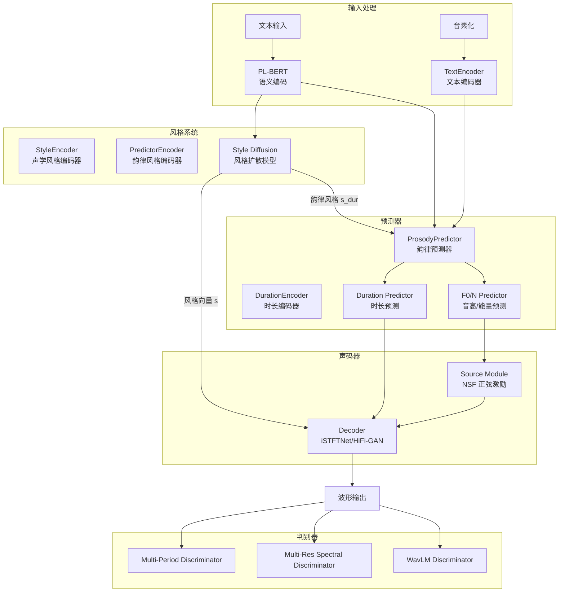
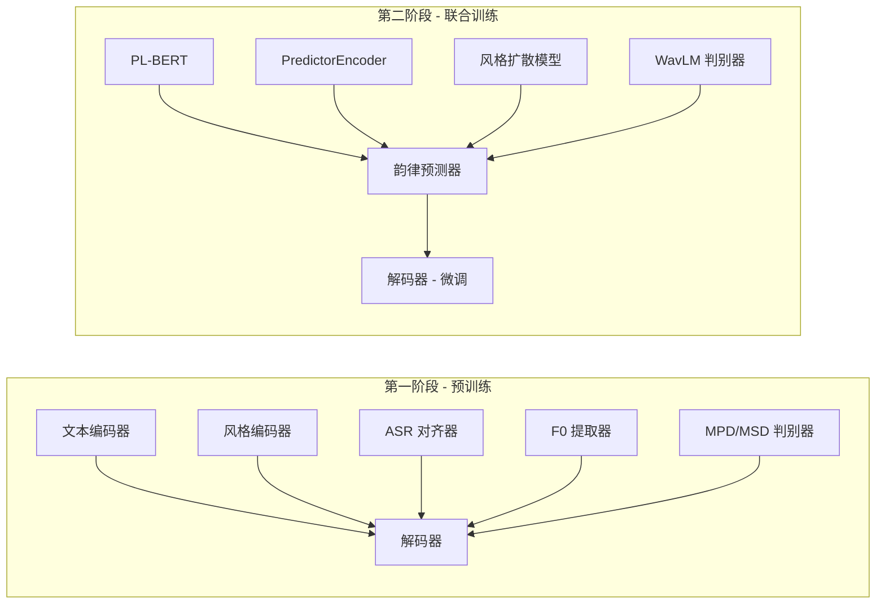
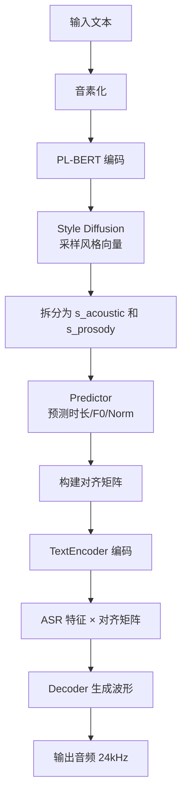

# StyleTTS2 技术学习报告

> 仓库路径: `reference_repos/StyleTTS2`
> 论文: [StyleTTS 2: Towards Human-Level Text-to-Speech through Style Diffusion and Adversarial Training with Large Speech Language Models](https://arxiv.org/abs/2306.07691)
> 作者: Yinghao Aaron Li, Cong Han, Vinay S. Raghavan, Gavin Mischler, Nima Mesgarani
> 代码许可: MIT License | 预训练模型: 自定义许可（需声明合成语音）

---

## 1. 项目概述

### 1.1 仓库定位

StyleTTS2 是一个**达到人类水平的文本到语音合成系统**，首次在单说话人（LJSpeech）和多说话人（VCTK）数据集上超越/匹敌人类录音质量。其核心创新在于将**风格建模为潜在随机变量**，通过扩散模型生成最适合文本的风格向量，无需参考语音即可完成零样本合成。

### 1.2 主要功能

| 功能 | 说明 |
|------|------|
| 单说话人 TTS | LJSpeech 数据集训练，24kHz 输出 |
| 多说话人 TTS | VCTK/LibriTTS 数据集训练，支持说话人克隆 |
| 零样本语音克隆 | 通过 PL-BERT + 风格扩散实现无需参考音频的风格生成 |
| 风格扩散生成 | 基于文本语义的隐式风格变量采样 |
| SLM 对抗训练 | 使用 WavLM 等大型语音语言模型作为判别器 |
| 微调支持 | 支持在少量数据上微调新说话人 |

### 1.3 技术栈

```
核心框架:    PyTorch
训练加速:    HuggingFace Accelerate (DDP/DP)
文本编码:    PL-BERT (预训练语言模型)
语音对齐:    ASRCNN (文本对齐器)
音高提取:    JDCNet (F0 提取器)
声码器:      iSTFTNet / HiFi-GAN (带 NSF 正弦激励)
判别器:      Multi-Period Discriminator + Multi-Resolution Spectral Discriminator + WavLM Discriminator
扩散模型:    K-Diffusion (Elucidated Diffusion, Karras et al. 2022)
调度器:      ADPM2 Sampler + Karras Schedule
```

### 1.4 依赖关系

```
torch, torchaudio, transformers (PL-BERT/WavLM)
accelerate (分布式训练)
einops, einops-exts (张量操作)
munch (配置管理)
monotonic_align (单调对齐，C扩展)
librosa, soundfile (音频处理)
phonemizer + espeak-ng (音素化，推理时)
```

---

## 2. 核心架构分析

### 2.1 整体架构图



### 2.2 两阶段训练架构



### 2.3 关键模块职责

| 模块 | 文件 | 职责 |
|------|------|------|
| **TextEncoder** | `models.py` | CNN + BiLSTM 编码音素序列，输出文本特征 |
| **StyleEncoder** | `models.py` | 2D CNN 从 mel 频谱提取声学风格向量 (dim=128) |
| **PredictorEncoder** | `models.py` | 与 StyleEncoder 结构相同，提取韵律风格向量 (dim=128) |
| **ProsodyPredictor** | `models.py` | 预测时长、F0、能量，使用 AdaIN 条件化 |
| **Style Diffusion** | `Modules/diffusion/` | Transformer-based 扩散模型，生成 256 维风格向量 |
| **Decoder** | `Modules/istftnet.py` / `hifigan.py` | 声码器，将特征转为波形，使用 NSF 正弦激励 |
| **SLM Discriminator** | `Modules/discriminators.py` | 基于 WavLM 的判别器，提升语音自然度 |
| **SLM Adversarial Loss** | `Modules/slmadv.py` | SLM 对抗训练的完整流程封装 |

---

## 3. 关键代码模块深度解析

### 3.1 模型训练流程

#### 第一阶段训练 (`train_first.py`)

第一阶段训练文本编码器、风格编码器和解码器的基础能力：

```
训练流程:
1. ASR 对齐器获取 s2s_attn (序列到序列注意力)
2. 最大路径算法得到 s2s_attn_mono (单调对齐)
3. 文本编码器编码 → 与对齐矩阵相乘 → ASR 特征
4. 随机裁剪音频片段，提取 F0 和归一化能量
5. 风格编码器提取风格向量 s
6. 解码器: decoder(asr, F0, norm, s) → 重建波形
7. TMA 训练 (epoch >= 50): 启用判别器和 SLM 损失
```

**关键训练参数**:
- 学习率: 0.0001 (通用), 0.00001 (BERT/声学模块)
- 批大小: 16
- 最大帧长: 400 帧 (约 5 秒)
- TMA 起始 epoch: 50

#### 第二阶段训练 (`train_second.py`)

第二阶段引入韵律预测器、风格扩散模型和 SLM 对抗训练：

```
训练流程:
1. 加载第一阶段模型（冻结文本编码器、风格编码器、解码器）
2. PL-BERT 编码文本 → bert_encoder 映射
3. 韵律预测器预测时长和韵律特征
4. 扩散模型训练 (epoch >= diff_epoch):
   - 从噪声采样风格向量
   - EDM 损失 + 风格重构损失
5. 联合训练 (epoch >= joint_epoch):
   - 解冻解码器和风格编码器
   - SLM 对抗训练启动
   - 可微分时长建模
```

**分阶段训练策略**:
```python
# config.yml 中的关键配置
diff_epoch: 20   # 风格扩散开始训练的 epoch
joint_epoch: 50  # 联合训练开始的 epoch
```

### 3.2 数据处理管线

#### 数据加载 (`meldataset.py`)

```python
class FilePathDataset:
    """数据集格式: filename.wav|transcription|speaker_id"""
    
    def __getitem__(self, idx):
        # 1. 加载波形 (重采样到 24kHz)
        wave, sr = sf.read(wave_path)
        wave = librosa.resample(wave, orig_sr=sr, target_sr=24000)
        
        # 2. 前后填充静音 (各 5000 样本)
        wave = np.concatenate([np.zeros([5000]), wave, np.zeros([5000])])
        
        # 3. 提取 mel 频谱 (n_fft=2048, hop=300, n_mels=80)
        mel_tensor = preprocess(wave)
        
        # 4. 音素化文本
        text = self.text_cleaner(text)
        
        # 5. 获取参考样本 (多说话人)
        ref_mel, ref_label = self._load_data(ref_data)
        
        # 6. 获取 OOD 文本 (用于 SLM 对抗训练)
        ps = self.get_random_ood_text(min_length=50)
        
        return (speaker_id, acoustic_feature, text_tensor, 
                ref_text, ref_mel, ref_label, path, wave)
```

**Mel 频谱参数**:
- 采样率: 24000 Hz
- n_fft: 2048
- win_length: 1200
- hop_length: 300 (帧率约 80 fps)
- n_mels: 80
- 归一化: `(log(mel + 1e-5) - (-4)) / 4` (范围约 [-1, 1])

### 3.3 推理流程（从文本到语音）



**推理伪代码** (基于 `train_second.py` 验证部分):

```python
# 1. 文本编码
bert_dur = model.bert(texts, attention_mask=text_mask)
d_en = model.bert_encoder(bert_dur).transpose(-1, -2)

# 2. 风格扩散采样
s_pred = sampler(
    noise=torch.randn((1, 256)).unsqueeze(1),
    embedding=bert_dur,
    embedding_scale=1,
    num_steps=5  # 仅需 3-5 步即可生成
)
s_acoustic = s_pred[:, :128]   # 声学风格
s_prosody = s_pred[:, 128:]    # 韵律风格

# 3. 韵律预测
d, _ = model.predictor(d_en, s_prosody, text_lengths, 
                        random_attn, text_mask)

# 4. 时长预测与对齐
duration = torch.sigmoid(d).sum(axis=-1)
pred_dur = torch.round(duration).clamp(min=1)
# 构建对齐矩阵 pred_aln_trg

# 5. 特征提取
t_en = model.text_encoder(texts, input_lengths, text_mask)
en = t_en @ pred_aln_trg  # 文本特征对齐

# 6. F0/Norm 预测
F0_pred, N_pred = model.predictor.F0Ntrain(en, s_prosody)

# 7. 波形生成
out = model.decoder(en, F0_pred, N_pred, s_acoustic)
```

### 3.4 优化技术

#### 3.4.1 可微分时长建模

StyleTTS2 的核心创新之一，允许通过 SLM 判别器反向传播梯度到时长预测器：

```python
# slmadv.py 中的可微分时长建模
# 使用高斯核卷积构建软对齐矩阵
for _s2s_pred, _text_length in zip(d, ref_lengths):
    _s2s_pred = torch.sigmoid(_s2s_pred_org)
    _dur_pred = _s2s_pred.sum(axis=-1)
    
    # 高斯核构建软对齐
    loc = torch.cumsum(_dur_pred, dim=0) - _dur_pred / 2
    h = torch.exp(-0.5 * torch.square(t - (l - loc.unsqueeze(-1))) / (self.sig)**2)
    
    # 1D 卷积构建注意力矩阵
    out = F.conv1d(_s2s_pred_org.unsqueeze(0), h.unsqueeze(1), 
                    padding=h.shape[-1] - 1, groups=int(_text_length))
    attn_preds.append(F.softmax(out.squeeze(), dim=0))
```

#### 3.4.2 Snake 激活函数

解码器中使用 Snake 激活函数替代 LeakyReLU，提升周期信号建模能力：

```python
# AdaINResBlock1 中的 Snake 激活
xt = xt + (1 / a1) * (torch.sin(a1 * xt) ** 2)  # Snake1D
```

#### 3.4.3 NSF 正弦激励源

使用 Neural Source Filter (NSF) 生成正弦激励波形，确保基频准确性：

```python
class SourceModuleHnNSF:
    """生成谐波正弦波 + 噪声源"""
    def forward(self, f0):
        sine_wavs, uv, _ = self.l_sin_gen(f0)
        sine_merge = self.l_tanh(self.l_linear(sine_wavs))
        noise = torch.randn_like(uv) * self.sine_amp / 3
        return sine_merge, noise, uv
```

#### 3.4.4 TPRLS 损失

引入 Topological Pairwise Ranking Loss，改善判别器训练稳定性：

```python
def discriminator_TPRLS_loss(disc_real_outputs, disc_generated_outputs):
    tau = 0.04
    m_DG = torch.median((dr - dg))
    L_rel = torch.mean((((dr - dg) - m_DG)**2)[dr < dg + m_DG])
    loss += tau - F.relu(tau - L_rel)
```

#### 3.4.5 嵌入掩码 (Embedding Masking)

训练时随机掩码 PL-BERT 嵌入，推理时使用 classifier-free guidance：

```python
# 讘练时: 10% 概率替换为固定嵌入
if embedding_mask_proba > 0.0:
    batch_mask = rand_bool(shape=(b, 1, 1), proba=embedding_mask_proba)
    embedding = torch.where(batch_mask, fixed_embedding, embedding)

# 推理时: classifier-free guidance
if embedding_scale != 1.0:
    out = self.run(x, time, embedding=embedding, features=features)
    out_masked = self.run(x, time, embedding=fixed_embedding, features=features)
    return out_masked + (out - out_masked) * embedding_scale
```

---

## 4. 技术亮点与创新点

### 4.1 风格扩散模型 (Style Diffusion)

**独特设计**: 将风格建模为潜在随机变量，通过扩散模型从文本语义中生成风格向量，而非从参考音频中提取。

**架构特点**:
- 使用 Transformer1d / StyleTransformer1d 作为去噪网络
- 256 维风格向量 = 128 维声学风格 + 128 维韵律风格
- K-Diffusion (Elucidated Diffusion) + LogNormal 分布采样
- 仅需 3-5 步即可完成采样，推理速度极快

**与传统方法对比**:
| 方法 | 风格来源 | 是否需要参考音频 | 零样本能力 |
|------|----------|------------------|------------|
| StyleTTS 1 | 参考音频提取 | 是 | 有限 |
| YourTTS | 说话人嵌入 | 是 | 有限 |
| StyleTTS 2 | 文本语义扩散 | 否 | 强 |

### 4.2 SLM 对抗训练

**创新点**: 首次将大型预训练语音语言模型 (WavLM) 用作 GAN 判别器：

```python
class WavLMLoss:
    """使用 WavLM 的隐藏状态作为特征匹配损失"""
    def forward(self, wav, y_rec):
        # 提取真实语音的 WavLM 嵌入
        wav_embeddings = self.wavlm(wav_16, output_hidden_states=True).hidden_states
        # 提取合成语音的 WavLM 嵌入
        y_rec_embeddings = self.wavlm(y_rec_16, output_hidden_states=True).hidden_states
        # 特征匹配损失
        floss = sum(mean(abs(er - eg)) for er, eg in zip(...))
        return floss
```

**优势**: WavLM 在大规模语音数据上预训练，能捕捉更高级的语音质量特征，远超传统频域判别器。

### 4.3 可微分时长建模

**问题**: 传统 TTS 中时长预测是离散的（round），无法端到端训练。

**解决方案**: 使用高斯核卷积构建软注意力矩阵，保持全流程可微分：

```python
# 传统方式 (不可微分)
pred_dur = torch.round(duration)  # 断点，梯度无法传播

# StyleTTS2 方式 (可微分)
h = torch.exp(-0.5 * (t - loc)^2 / sigma^2)  # 高斯核
attn = F.conv1d(pred, h)  # 软对齐，梯度可传播
```

### 4.4 双风格编码器

**设计**: 使用两个独立的风格编码器分别提取声学风格和韵律风格：

- `style_encoder`: 提取声学风格 (音色、共振峰等)
- `predictor_encoder`: 提取韵律风格 (语速、节奏等)

这种分离使得扩散模型可以独立控制声学和韵律特征。

### 4.5 TPRLS 损失

引入 Topological Pairwise Ranking Loss，不仅区分真假样本，还考虑样本间的相对排序关系，提升训练稳定性。

---

## 5. 可借鉴之处

### 5.1 可整合到 TTS_MultiModel 的具体技术

#### 5.1.1 风格扩散生成模块

**整合方案**: 作为新的 TTS 引擎注册到 `engine_interface.py` 的 `InMemoryEngineRegistry`。

```python
# 建议的引擎注册方式
engine_registry.register(
    "styletts2",
    StyleTTS2Engine,
    display_name="StyleTTS2",
    vram_requirement=4.0,
)

class StyleTTS2Engine(TTSEngine):
    def is_ready(self) -> bool:
        return self._model is not None
    
    def generate_voice_clone(self, text, reference_audio_path=None, **kwargs):
        # 使用 StyleTTS2 的风格扩散 + 参考音频
        ...
```

**优势**:
- 无需参考音频即可生成高质量语音
- 推理仅需 3-5 步扩散采样
- 支持零样本说话人克隆

#### 5.1.2 NSF 正弦激励声码器

**整合方案**: 将 `SourceModuleHnNSF` 和 `SineGen` 提取为独立模块，用于增强现有声码器。

**适用场景**: VoxCPM2 引擎的 F0 控制增强。

#### 5.1.3 Snake 激活函数

**整合方案**: 在解码器的残差块中使用 Snake 激活替代 LeakyReLU。

```python
# 简单替换即可
# 原始: x = F.leaky_relu(x, 0.1)
# 替换: x = x + (1/alpha) * (torch.sin(alpha * x) ** 2)
```

#### 5.1.4 SLM 判别器框架

**整合方案**: 将 WavLM 判别器作为通用语音质量评估模块。

**应用场景**:
- 生成质量实时评估
- 自动化模型选择
- 训练过程中的质量监控

### 5.2 架构模式与最佳实践

| 模式 | StyleTTS2 实现 | TTS_MultiModel 可借鉴 |
|------|---------------|----------------------|
| 两阶段训练 | 预训练 → 联合训练 | 新引擎开发的训练范式 |
| 分风格编码 | 声学 + 韵律分离 | 多维度语音控制 |
| 嵌入掩码 | 训练时 10% 掩码 | Classifier-free guidance |
| 梯度缩放 | SLM 损失的梯度缩放 | 多判别器训练稳定性 |
| 配置管理 | YAML + Munch | 统一配置体系 |

### 5.3 需要注意的兼容性问题

#### 5.3.1 依赖冲突

```
StyleTTS2 依赖:
- monotonic_align (C 扩展，需要编译)
- einops, einops-exts
- phonemizer + espeak-ng (系统级依赖)

TTS_MultiModel 已有:
- torch, torchaudio, transformers (兼容)
- 可能与 VoxCPM2/IndexTTS2 的 transformers 版本冲突
```

**建议**: 使用独立虚拟环境或 conda 环境隔离 StyleTTS2 依赖。

#### 5.3.2 模型格式差异

```
StyleTTS2: .pth 格式 (PyTorch 原生)
TTS_MultiModel: 部分引擎使用 .safetensors
```

**建议**: 在引擎加载层添加格式适配器。

#### 5.3.3 音频参数差异

| 参数 | StyleTTS2 | TTS_MultiModel (VoxCPM2) |
|------|-----------|--------------------------|
| 采样率 | 24000 Hz | 24000 Hz (一致) |
| Mel bins | 80 | 取决于引擎 |
| Hop length | 300 | 取决于引擎 |

#### 5.3.4 推理依赖

StyleTTS2 推理依赖 GPL 许可的 `phonemizer` 包，需要注意许可兼容性。可使用 MIT 许可的 `gruut` 替代，但音质可能略有下降。

#### 5.3.5 GPU 显存需求

- StyleTTS2 推理: ~3-4 GB VRAM
- StyleTTS2 训练: ~8-16 GB VRAM (取决于 batch_size)
- 与现有引擎的显存隔离需要通过 `model_manager` 的卸载/加载机制管理

---

## 6. 参考资源

### 6.1 关键论文

1. **StyleTTS 2 主论文**: [StyleTTS 2: Towards Human-Level Text-to-Speech through Style Diffusion and Adversarial Training with Large Speech Language Models](https://arxiv.org/abs/2306.07691)

2. **PL-BERT**: [PL-BERT: Pretrained Language Model for Speech Synthesis](https://arxiv.org/abs/2301.08810)

3. **K-Diffusion (Elucidated Diffusion)**: [Elucidating the Design Space of Diffusion-Based Generative Models](https://arxiv.org/abs/2206.00364)

4. **TPRLS Loss**: [Relative Perceptual Loss for GAN Training](https://dl.acm.org/doi/abs/10.1145/3573834.3574506)

5. **NSF (Neural Source Filter)**: [Neural Source Filter with Formant Excitations](https://github.com/nii-yamagishilab/project-NN-Pytorch-scripts/tree/master/project/01-nsf)

### 6.2 代码仓库

- **StyleTTS2 官方**: https://github.com/yl4579/StyleTTS2
- **StyleTTS2 (MIT 许可包)**: https://pypi.org/project/styletts2/
- **NeuralVox (GPL Fork)**: https://github.com/NeuralVox/StyleTTS2 (含导入接口和流式 API)
- **AuxiliaryASR (文本对齐器)**: https://github.com/yl4579/AuxiliaryASR
- **PitchExtractor (F0 提取器)**: https://github.com/yl4579/PitchExtractor
- **PL-BERT**: https://github.com/yl4579/PL-BERT
- **Multilingual PL-BERT**: https://huggingface.co/papercup-ai/multilingual-pl-bert (支持 14 种语言)

### 6.3 预训练模型

| 模型 | 路径 | 用途 |
|------|------|------|
| LJSpeech | https://huggingface.co/yl4579/StyleTTS2-LJSpeech | 单说话人英文 |
| LibriTTS | https://huggingface.co/yl4579/StyleTTS2-LibriTTS | 多说话人英文 |
| WavLM | microsoft/wavlm-base-plus | SLM 判别器 |
| PL-BERT | Utils/PLBERT/ | 文本语义编码 |

### 6.4 参考实现

- **HiFi-GAN**: https://github.com/jik876/hifi-gan
- **iSTFTNet**: https://github.com/rishikksh20/iSTFTNet-pytorch
- **Audio Diffusion**: https://github.com/archinetai/audio-diffusion-pytorch

---

## 附录: 文件结构速查

```
StyleTTS2/
├── Configs/
│   ├── config.yml              # 主配置 (LJSpeech)
│   ├── config_ft.yml           # 微调配置
│   └── config_libritts.yml     # LibriTTS 多说话人配置
├── Data/
│   ├── train_list.txt          # 训练数据列表
│   ├── val_list.txt            # 验证数据列表
│   └── OOD_texts.txt           # OOD 文本 (SLM 对抗训练)
├── Modules/
│   ├── diffusion/
│   │   ├── diffusion.py        # 扩散模型基类
│   │   ├── modules.py          # Transformer / Attention 模块
│   │   ├── sampler.py          # 采样器 (Karras, ADPM2, etc.)
│   │   └── utils.py            # 工具函数
│   ├── discriminators.py       # MPD + MSD + WavLM 判别器
│   ├── hifigan.py              # HiFi-GAN 声码器
│   ├── istftnet.py             # iSTFTNet 声码器 (推荐)
│   └── slmadv.py               # SLM 对抗训练封装
├── Utils/
│   ├── ASR/                    # 预训练文本对齐器
│   ├── JDC/                    # 预训练 F0 提取器
│   └── PLBERT/                 # 预训练 PL-BERT
├── models.py                   # 核心模型定义
├── losses.py                   # 损失函数
├── train_first.py              # 第一阶段训练脚本
├── train_second.py             # 第二阶段训练脚本
├── train_finetune.py           # 微调脚本
├── meldataset.py               # 数据集与数据加载
└── optimizers.py               # 优化器构建
```
