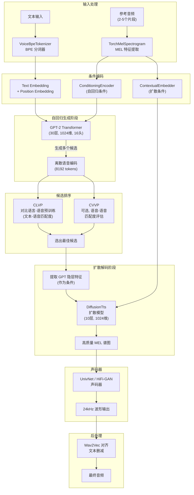

# Tortoise-TTS 技术学习报告

> 仓库地址：https://github.com/neonbjb/tortoise-tts
> 版本：v3.0.0 | 许可证：Apache 2.0
> 论文：[https://arxiv.org/abs/2305.07243](https://arxiv.org/abs/2305.07243)

---

## 1. 项目概述

### 1.1 仓库定位

TorToiSe（Tortoise TTS）是一个高质量的**多说话人文本转语音（TTS）**系统，由 James Betker 独立开发。其核心设计理念是：

1. **强大的多说话人能力**：通过参考音频片段（reference clips）实现零样本声音克隆
2. **高度真实的韵律和语调**：结合自回归解码器和扩散解码器，生成自然度极高的语音

项目灵感来源于 OpenAI 的 DALL-E，将类似的"自回归生成 + 扩散细化"架构应用于语音合成领域。

### 1.2 技术栈

| 类别 | 技术 |
|------|------|
| **深度学习框架** | PyTorch + torchaudio |
| **Transformer 基础** | HuggingFace Transformers (GPT-2) |
| **扩散模型** | 基于 Improved Diffusion (OpenAI) |
| **声码器** | UnivNet (通用神经声码器) / HiFi-GAN (快速模式) |
| **语音对齐** | Wav2Vec2 (文本-音频对齐) |
| **文本处理** | BPE Tokenizer + inflect (数字展开) |
| **推理优化** | DeepSpeed, KV Cache, FP16, 流式生成 |
| **编程语言** | Python 3.9+ |

### 1.3 核心数据

- **训练数据**：约 50,000 小时语音数据（主要来自有声读物）
- **模型权重**：8 个独立模型文件（约 2-4GB 总计）
- **采样率**：输入 22,050 Hz，输出 24,000 Hz
- **MEL 通道数**：100（扩散模型）/ 80（自回归条件编码）
- **推理速度**：0.25-0.3 RTF（4GB 显存），流式延迟 < 500ms

---

## 2. 核心架构分析

### 2.1 整体架构图



### 2.2 关键模块职责与交互

| 模块 | 文件 | 职责 |
|------|------|------|
| **UnifiedVoice** | `models/autoregressive.py` | 自回归 Transformer，将文本+条件→离散语音编码 |
| **ConditioningEncoder** | `models/autoregressive.py` | 编码参考音频为条件向量（注意力池化） |
| **GPT2InferenceModel** | `models/autoregressive.py` | GPT-2 推理包装器，支持 KV Cache |
| **CLVP** | `models/clvp.py` | 对比学习模型，评估文本-语音匹配度 |
| **CVVP** | `models/cvvp.py` | 语音-语音对比模型（可选） |
| **DiffusionTts** | `models/diffusion_decoder.py` | 扩散模型，将离散编码→MEL 谱图 |
| **UnivNetGenerator** | `models/vocoder.py` | 通用声码器，MEL→波形 |
| **HifiganGenerator** | `models/hifigan_decoder.py` | 快速声码器（流式模式使用） |
| **Wav2VecAlignment** | `utils/wav2vec_alignment.py` | 文本-音频对齐，支持 prompt 工程 |
| **VoiceBpeTokenizer** | `utils/tokenizer.py` | BPE 文本分词器 |
| **SpacedDiffusion** | `utils/diffusion.py` | 扩散过程管理（跳步采样） |
| **TextToSpeech** | `api.py` / `api_fast.py` | 主入口，协调整个生成流程 |

---

## 3. 关键代码模块深度解析

### 3.1 模型架构详解

#### 3.1.1 自回归模型 (UnifiedVoice)

自回归模型是 Tortoise 的核心，基于 GPT-2 架构构建：

```python
# models/autoregressive.py - UnifiedVoice 初始化参数
self.autoregressive = UnifiedVoice(
    max_mel_tokens=604,       # 最大 MEL token 数
    max_text_tokens=402,       # 最大文本 token 数
    max_conditioning_inputs=2, # 最大参考音频数
    layers=30,                 # GPT-2 层数
    model_dim=1024,            # 隐藏维度
    heads=16,                  # 注意力头数
    number_text_tokens=255,    # 文本词表大小
    start_text_token=255,      # 文本起始 token
    number_mel_codes=8194,     # MEL 词表大小 (8192 + start + stop + pad)
    start_mel_token=8192,      # MEL 起始 token
    stop_mel_token=8193,       # MEL 停止 token
)
```

**核心设计特点**：

1. **双嵌入融合**：文本嵌入和 MEL 嵌入分别经过独立的位置编码后拼接
2. **条件编码**：参考音频通过 `ConditioningEncoder`（6层注意力块）编码为点向量，取多个参考片段的均值
3. **GPT-2 推理优化**：通过 `GPT2InferenceModel` 封装，支持 KV Cache 加速

```python
# 自回归推理关键流程
def inference_speech(self, speech_conditioning_latent, text_inputs, **hf_generate_kwargs):
    # 1. 文本嵌入
    text_emb = self.text_embedding(text_inputs) + self.text_pos_embedding(text_inputs)
    
    # 2. 拼接条件向量
    conds = speech_conditioning_latent.unsqueeze(1)
    emb = torch.cat([conds, text_emb], dim=1)
    
    # 3. 存储 MEL 嵌入供推理模型使用
    self.inference_model.store_mel_emb(emb)
    
    # 4. 使用 HuggingFace generate API 生成
    gen = self.inference_model.generate(
        inputs, 
        bos_token_id=self.start_mel_token,
        eos_token_id=self.stop_mel_token,
        max_length=max_length,
        **hf_generate_kwargs
    )
    return gen[:, trunc_index:]
```

#### 3.1.2 扩散解码器 (DiffusionTts)

扩散模型负责将离散的语音编码转化为高质量的 MEL 谱图：

```python
# models/diffusion_decoder.py - DiffusionTts 关键组件
class DiffusionTts(nn.Module):
    def __init__(self, model_channels=1024, num_layers=10, in_channels=100, ...):
        # 代码嵌入：离散 token → 连续向量
        self.code_embedding = nn.Embedding(in_tokens, model_channels)
        self.code_converter = nn.Sequential(
            AttentionBlock(model_channels, num_heads, relative_pos_embeddings=True),
            AttentionBlock(model_channels, num_heads, relative_pos_embeddings=True),
            AttentionBlock(model_channels, num_heads, relative_pos_embeddings=True),
        )
        
        # 条件编码器：处理参考音频 MEL
        self.contextual_embedder = nn.Sequential(
            nn.Conv1d(in_channels, model_channels, 3, padding=1, stride=2),
            nn.Conv1d(model_channels, model_channels*2, 3, padding=1, stride=2),
            AttentionBlock(model_channels*2, num_heads, ...),  # 5层注意力
            # ...
        )
        
        # 时间步嵌入
        self.time_embed = nn.Sequential(
            nn.Linear(model_channels, model_channels),
            nn.SiLU(),
            nn.Linear(model_channels, model_channels),
        )
        
        # 主干网络：10层扩散层 + 3层残差块
        self.layers = nn.ModuleList([
            DiffusionLayer(model_channels, dropout, num_heads) for _ in range(num_layers)
        ] + [
            ResBlock(model_channels, model_channels, dropout, dims=1, use_scale_shift_norm=True) 
            for _ in range(3)
        ])
```

**Classifier-Free Guidance 实现**：

```python
# 在训练时随机丢弃条件（10%概率）
if self.training and self.unconditioned_percentage > 0:
    unconditioned_batches = torch.rand((B, 1, 1)) < self.unconditioned_percentage
    code_emb = torch.where(
        unconditioned_batches, 
        self.unconditioned_embedding.expand(B, -1, -1),  # 无条件嵌入
        code_emb  # 有条件嵌入
    )

# 推理时使用 classifier-free guidance
# output = cond_present_output * (cond_free_k + 1) - cond_absent_output * cond_free_k
if self.conditioning_free:
    model_output_no_conditioning = model(x, t, conditioning_free=True, **model_kwargs)
    model_output = (1 + cfk) * model_output - cfk * model_output_no_conditioning
```

#### 3.1.3 CLVP 对比学习模型

CLVP（Contrastive Language-Voice Pretraining）用于评估自回归生成的候选语音与文本的匹配度：

```python
# models/clvp.py - CLVP 核心逻辑
class CLVP(nn.Module):
    def forward(self, text, speech_tokens, return_loss=False):
        # 文本编码
        text_emb = self.text_emb(text) + self.text_pos_emb(...)
        enc_text = self.text_transformer(text_emb)
        text_latents = self.to_text_latent(masked_mean(enc_text, text_mask))
        
        # 语音编码
        speech_emb = self.speech_emb(speech_tokens) + self.speech_pos_emb(...)
        enc_speech = self.speech_transformer(speech_emb)
        speech_latents = self.to_speech_latent(masked_mean(enc_speech, voice_mask))
        
        # L2 归一化 + 余弦相似度
        text_latents, speech_latents = map(
            lambda t: F.normalize(t, p=2, dim=-1), 
            (text_latents, speech_latents)
        )
        temp = self.temperature.exp()
        sim = einsum('n d, n d -> n', text_latents, speech_latents) * temp
        return sim
```

### 3.2 推理流程（从文本到语音）

完整推理流程如下：

```python
# api.py - TextToSpeech.tts() 核心流程
def tts(self, text, voice_samples=None, ...):
    # === 阶段1: 文本处理 ===
    text_tokens = self.tokenizer.encode(text)  # BPE 分词
    
    # === 阶段2: 条件编码 ===
    if voice_samples is not None:
        auto_conditioning, diffusion_conditioning = self.get_conditioning_latents(voice_samples)
    else:
        auto_conditioning, diffusion_conditioning = self.get_random_conditioning_latents()
    
    # === 阶段3: 自回归生成 (批量) ===
    samples = []
    for b in range(num_batches):
        codes = autoregressive.inference_speech(
            auto_conditioning, text_tokens,
            do_sample=True, temperature=0.8, top_p=0.8,
            num_return_sequences=batch_size
        )
        samples.append(codes)
    
    # === 阶段4: CLVP/CVVP 排序 ===
    for batch in samples:
        # 修复自回归输出（填充静音 token）
        batch[i] = fix_autoregressive_output(batch[i], stop_mel_token)
        # 计算文本-语音匹配度
        clvp_out = clvp(text_tokens.repeat(B, 1), batch, return_loss=False)
        clip_results.append(clvp_out)
    
    # 选出最佳候选
    best_results = samples[torch.topk(clip_results, k=k).indices]
    
    # === 阶段5: 提取隐层特征 ===
    best_latents = autoregressive(
        auto_conditioning.repeat(k, 1), text_tokens.repeat(k, 1),
        ..., best_results, ..., return_latent=True
    )
    
    # === 阶段6: 扩散解码 ===
    for b in range(k):
        # 裁剪静音区域
        latents = trim_silence(codes, latents, calm_token=83)
        # 扩散生成 MEL
        mel = do_spectrogram_diffusion(diffusion, diffuser, latents, diffusion_conditioning)
        # 声码器生成波形
        wav = vocoder.inference(mel)
    
    # === 阶段7: 后处理（可选文本删减）===
    if self.enable_redaction:
        wav = self.aligner.redact(wav, text)
    
    return wav
```

### 3.3 两种推理模式

Tortoise 提供两种 API 模式：

| 特性 | 标准模式 (`api.py`) | 快速模式 (`api_fast.py`) |
|------|---------------------|--------------------------|
| **解码器** | UnivNet 声码器 + 扩散模型 | HiFi-GAN 直接解码 |
| **排序** | CLVP + 可选 CVVP | 无排序（单次生成） |
| **流式支持** | 不支持 | `tts_stream()` 支持 |
| **显存需求** | 较高（需加载多个模型） | 较低（4GB VRAM） |
| **推理速度** | 较慢（扩散迭代耗时） | 快（0.25-0.3 RTF） |
| **音质** | 最佳 | 良好 |

### 3.4 流式生成实现

`api_fast.py` 中的流式生成通过 GPT 流式解码 + HiFi-GAN 分块解码实现：

```python
def tts_stream(self, text, stream_chunk_size=40, overlap_wav_len=1024, ...):
    # 1. 准备 GPT 流式生成器
    fake_inputs = self.autoregressive.compute_embeddings(auto_conditioning, text_tokens)
    gpt_generator = self.autoregressive.get_generator(fake_inputs=fake_inputs, ...)
    
    # 2. 逐步生成并分块处理
    wav_gen_prev = None
    wav_overlap = None
    
    while not is_end:
        try:
            codes, latent = next(gpt_generator)
            all_latents += [latent]
            codes_ += [codes]
        except StopIteration:
            is_end = True
        
        # 达到 chunk 大小时解码
        if is_end or len(codes_) >= stream_chunk_size:
            gpt_latents = torch.cat(all_latents, dim=0)[None, :]
            wav_gen = self.hifi_decoder.inference(gpt_latents, auto_conditioning)
            
            # 交叉淡入淡出处理
            wav_chunk, wav_gen_prev, wav_overlap = self.handle_chunks(
                wav_gen.squeeze(), wav_gen_prev, wav_overlap, overlap_wav_len
            )
            yield wav_chunk
```

---

## 4. 技术亮点与创新点

### 4.1 自回归 + 扩散混合架构

**创新点**：将 DALL-E 的"自回归生成离散编码 + 扩散细化连续表示"架构应用于 TTS，实现了：
- 自回归模型负责语义和韵律的整体规划
- 扩散模型负责声学细节的精细还原
- 两阶段分离使得每个组件可以独立优化

### 4.2 条件编码的优雅设计

**参考音频编码**：通过 `ConditioningEncoder`（注意力池化）将多个参考片段编码为单一向量，然后取均值：

```python
def get_conditioning(self, speech_conditioning_input):
    conds = []
    for j in range(speech_conditioning_input.shape[1]):
        conds.append(self.conditioning_encoder(speech_conditioning_input[:, j]))
    conds = torch.stack(conds, dim=1)
    conds = conds.mean(dim=1)  # 多个参考片段的均值
    return conds
```

这使得：
- 支持任意数量的参考音频（2-5个最佳）
- 可以混合两个声音（取两个声音的 latent 均值）
- 支持预计算的 conditioning latents（`.pth` 文件缓存）

### 4.3 CLVP 排序机制

自回归模型生成多个候选后，使用 CLVP 进行排序：

```python
# CLVP 评估文本-语音匹配度
clvp_out = clvp(text_tokens.repeat(batch.shape[0], 1), batch, return_loss=False)
# 选出最佳候选
best_results = samples[torch.topk(clip_results, k=k).indices]
```

这种"生成多个 → 排序选最佳"的策略显著提升了输出质量，是 Tortoise 音质出色的关键因素之一。

### 4.4 Prompt 工程支持

通过 Wav2Vec2 实现文本-音频对齐，支持方括号标记的 prompt 工程：

```python
# 用户输入: "[I am really sad,] Please feed me."
# 模型会以悲伤的语气说 "Please feed me"，但不会说出括号内的内容
class Wav2VecAlignment:
    def redact(self, audio, expected_text):
        # 解析方括号标记
        # 对齐文本与音频
        # 裁剪掉括号内对应的音频段
```

### 4.5 条件无关扩散 (Classifier-Free Guidance)

在扩散解码阶段使用 classifier-free guidance，大幅提升真实感：

```python
# 推理时双前向传播
model_output_present = model(x, t, conditioning_free=False)    # 有条件
model_output_absent = model(x, t, conditioning_free=True)       # 无条件
# 融合
output = (1 + k) * present - k * absent
```

### 4.6 流式推理优化

`api_fast.py` 实现了低延迟流式推理：
- GPT 逐 token 流式生成
- HiFi-GAN 分块解码（绕过扩散模型）
- 交叉淡入淡出处理块边界
- 首包延迟约 60 tokens

### 4.7 多种推理优化

| 优化技术 | 实现方式 |
|----------|----------|
| **KV Cache** | GPT-2 推理时缓存 Key-Value |
| **FP16 半精度** | `torch.autocast` + half precision |
| **DeepSpeed** | 推理引擎注入 `deepspeed.init_inference()` |
| **跳跃步数扩散** | `SpacedDiffusion` 从 4000 步中选取子集 |
| **GPU 自动批次** | 根据可用显存自动选择 batch size |
| **JIT 编译** | 支持 `torch.jit.load` 加载 traced 模型 |

---

## 5. 可借鉴之处

### 5.1 可整合到 TTS_MultiModel 的技术

#### 5.1.1 CLVP 排序机制

**适用场景**：TTS_MultiModel 中任何生成多个候选的引擎都可以使用 CLVP 进行质量排序。

```python
# 可借鉴的模式
class CandidateRanker:
    """基于对比学习的候选排序器"""
    def __init__(self, clvp_model):
        self.clvp = clvp_model
    
    def rank(self, text_tokens, candidates):
        scores = []
        for cand in candidates:
            score = self.clvp(text_tokens, cand, return_loss=False)
            scores.append(score)
        return candidates[torch.topk(torch.stack(scores), k=1).indices]
```

#### 5.1.2 流式生成模式

**适用场景**：TTS_MultiModel 的 `generate_streaming` 接口。

Tortoise 的流式方案（`api_fast.py`）提供了一个轻量级参考：
- GPT 逐 token 生成 + HiFi-GAN 分块解码
- 交叉淡入淡出处理块边界
- 不需要扩散模型参与（牺牲少量音质换取速度）

#### 5.1.3 条件编码模式

**适用场景**：多说话人支持。

Tortoise 的条件编码设计（参考音频 → latent 向量 → 条件注入）非常优雅：
- 支持预计算的 conditioning latents（`.pth` 缓存）
- 支持多个参考片段的均值融合
- 支持随机 latent 生成（无参考音频时）

#### 5.1.4 自动批次大小选择

**适用场景**：GPU 显存自适应。

```python
# 可直接借鉴的 GPU 自适应逻辑
def pick_best_batch_size_for_gpu():
    if torch.cuda.is_available():
        _, available = torch.cuda.mem_get_info()
        availableGb = available / (1024 ** 3)
        if availableGb > 14: return 16
        elif availableGb > 10: return 8
        elif availableGb > 7: return 4
    return 1
```

### 5.2 架构模式与最佳实践

#### 5.2.1 多模型协调管理

Tortoise 的 `TextToSpeech` 类展示了如何优雅地管理多个模型：

```python
# 模型按需加载到 GPU，使用后立即释放
@contextmanager
def temporary_cuda(self, model):
    m = model.to(self.device)
    yield m
    m = model.cpu()

# 使用示例
with self.temporary_cuda(self.autoregressive) as autoregressive:
    codes = autoregressive.inference_speech(...)
# autoregressive 自动回到 CPU
```

**借鉴价值**：TTS_MultiModel 可以采用类似的"按需加载"模式管理多引擎，避免同时占用过多显存。

#### 5.2.2 预设系统设计

Tortoise 的预设系统提供了清晰的配置分层：

```python
presets = {
    'ultra_fast': {'num_autoregressive_samples': 16, 'diffusion_iterations': 30, 'cond_free': False},
    'fast': {'num_autoregressive_samples': 96, 'diffusion_iterations': 80},
    'standard': {'num_autoregressive_samples': 256, 'diffusion_iterations': 200},
    'high_quality': {'num_autoregressive_samples': 256, 'diffusion_iterations': 400},
}
settings.update(presets[preset])  # 预设作为基础
settings.update(kwargs)            # 允许用户覆盖
```

#### 5.2.3 音频后处理

Tortoise 的 `fix_autoregressive_output` 函数展示了处理自回归输出边界问题的技巧：

```python
def fix_autoregressive_output(codes, stop_token):
    """修复自回归输出与扩散模型训练数据之间的不匹配"""
    stop_token_indices = (codes == stop_token).nonzero()
    codes[stop_token_indices] = 83  # calm token
    stm = stop_token_indices.min().item()
    codes[stm:] = 83  # 用静音 token 填充
    # 特殊的结束模式
    if stm - 3 < codes.shape[0]:
        codes[-3] = 45
        codes[-2] = 45
        codes[-1] = 248
```

### 5.3 需要注意的兼容性问题

| 问题 | 说明 | 建议 |
|------|------|------|
| **transformers 版本** | 固定使用 `transformers==4.31.0`，与 TTS_MultiModel 可能冲突 | 隔离环境或版本协商 |
| **音频采样率** | Tortoise 使用 22,050Hz（输入）/ 24,000Hz（输出），与 VoxCPM2 的 16kHz 不同 | 需要采样率转换层 |
| **模型体积** | 8个模型文件总计约 2-4GB | 需要显存管理策略 |
| **MEL 参数差异** | Tortoise 使用 100 通道 MEL（扩散）/ 80 通道（条件），与其他引擎不通用 | 每个引擎独立的特征提取 |
| **Python 依赖** | 依赖 `numba`, `inflect`, `deepspeed` 等，可能与其他引擎冲突 | 考虑子进程隔离或版本兼容 |
| **CUDA 版本** | DeepSpeed 需要特定 CUDA 版本 | 作为可选依赖处理 |
| **Apple Silicon** | DeepSpeed 不支持 MPS，需要 fallback 路径 | 已在代码中处理 |

### 5.4 与 TTS_MultiModel Engine 接口的对接方案

如果要将 Tortoise-TTS 作为第三个引擎集成到 TTS_MultiModel，需要实现以下接口：

```python
# 可能的集成结构
class TortoiseTTSEngine(TTSEngine):
    """Tortoise TTS 引擎"""
    
    def is_ready(self) -> bool:
        return self._tts_instance is not None
    
    def load(self) -> None:
        # 加载 Tortoise 模型
        from tortoise.api import TextToSpeech
        self._tts_instance = TextToSpeech(
            models_dir=self._models_dir,
            kv_cache=True,
            half=True,
        )
    
    def unload(self) -> None:
        # 释放模型
        self._tts_instance = None
        torch.cuda.empty_cache()
    
    def generate_voice_design(self, text, instruction="", **kwargs):
        # Tortoise 不直接支持 voice design，可以使用 random voice
        audio = self._tts_instance.tts_with_preset(text, voice_samples=None, preset='fast')
        # 保存并返回路径
        return self._save_audio(audio), "Tortoise 生成完成"
    
    def generate_voice_clone(self, text, reference_audio_path=None, **kwargs):
        # 使用参考音频进行克隆
        ref_clips = [load_audio(reference_audio_path, 22050)]
        audio = self._tts_instance.tts_with_preset(
            text, voice_samples=ref_clips, preset='fast'
        )
        return self._save_audio(audio), "Tortoise 克隆完成"
    
    def generate_streaming(self, text, reference_audio_path=None, **kwargs):
        # 使用 api_fast 的流式模式
        from tortoise.api_fast import TextToSpeech as FastTTS
        # ... 流式生成
```

---

## 6. 参考资源

### 6.1 关键论文

| 论文 | 链接 | 关联模块 |
|------|------|----------|
| Tortoise TTS | [arxiv.org/abs/2305.07243](https://arxiv.org/abs/2305.07243) | 整体架构 |
| DALL-E (Ramesh et al.) | [arxiv.org/pdf/2102.12092](https://arxiv.org/pdf/2102.12092) | 自回归+离散VAE 架构灵感 |
| Improved Diffusion (Nichol & Dhariwal) | [arxiv.org/pdf/2102.09672](https://arxiv.org/pdf/2102.09672) | 扩散模型实现 |
| UnivNet (Jang et al.) | [arxiv.org/pdf/2106.07889](https://arxiv.org/pdf/2106.07889) | 声码器 |
| CLIP (Radford et al.) | [openai.com/research/clip](https://openai.com/research/clip) | CLVP 对比学习灵感 |
| Classifier-Free Diffusion Guidance | [arxiv.org/abs/2207.12598](https://arxiv.org/abs/2207.12598) | 条件无关扩散 |

### 6.2 文档链接

- **架构设计文档**：[nonint.com/2022/04/25/tortoise-architectural-design-doc/](https://nonint.com/2022/04/25/tortoise-architectural-design-doc/)
- **HuggingFace 模型仓库**：[huggingface.co/jbetker/tortoise-tts-v2](https://huggingface.co/jbetker/tortoise-tts-v2)
- **在线 Demo**：[huggingface.co/spaces/Manmay/tortoise-tts](https://huggingface.co/spaces/Manmay/tortoise-tts)
- **DLAS 训练框架**：[github.com/neonbjb/DL-Art-School](https://github.com/neonbjb/DL-Art-School)
- **Ocotillo 转录工具**：[github.com/neonbjb/ocotillo](http://www.github.com/neonbjb/ocotillo)

### 6.3 代码入口文件

| 文件 | 用途 |
|------|------|
| `tortoise/api.py` | 标准推理 API（含扩散模型） |
| `tortoise/api_fast.py` | 快速推理 API（HiFi-GAN 直接解码 + 流式） |
| `tortoise/do_tts.py` | 单句 TTS 命令行工具 |
| `tortoise/read.py` | 长文本阅读（标准模式） |
| `tortoise/read_fast.py` | 长文本阅读（快速模式） |
| `tortoise/tts_stream.py` | 流式 TTS 实时播放 |
| `tortoise/socket_server.py` | Socket 服务端 |
| `tortoise/get_conditioning_latents.py` | 提取声音条件 latent |
| `tortoise/is_this_from_tortoise.py` | Tortoise 检测分类器 |

---

## 7. 总结

### 7.1 Tortoise-TTS 的核心价值

1. **架构创新**：自回归 + 扩散的混合架构在 TTS 领域开创了新范式
2. **多说话人能力**：零样本声音克隆效果出色，参考音频机制设计优雅
3. **质量与灵活性**：CLVP 排序 + 多预设系统，在质量和速度间提供灵活选择
4. **生态完整**：从训练到推理、从标准到流式、从 API 到命令行，覆盖全面

### 7.2 对 TTS_MultiModel 的启示

| 方面 | 启示 |
|------|------|
| **架构设计** | 多模型协调管理、按需加载/卸载模式 |
| **质量控制** | CLVP 排序机制可用于任何多候选生成场景 |
| **用户体验** | 预设系统、prompt 工程支持 |
| **性能优化** | KV Cache、FP16、跳跃扩散步数等优化技巧 |
| **流式支持** | 交叉淡入淡出的分块解码方案 |

### 7.3 局限性

1. **推理速度**：标准模式较慢（尽管快速模式已大幅改善）
2. **英语为主**：训练数据以英语有声读物为主，中文支持有限
3. **长文本**：单次输入限制约 400 tokens，需要分句处理
4. **训练未开源**：仅提供推理代码和预训练权重
