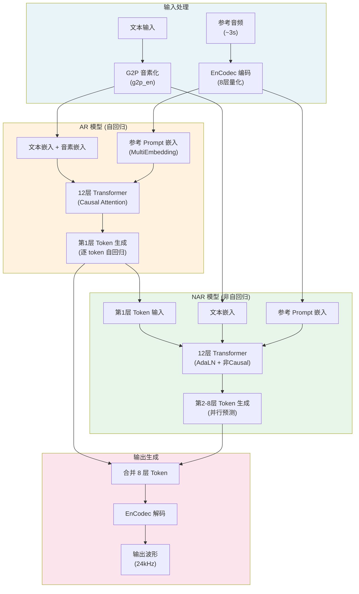

# VALL-E 技术学习报告

> 基于 [enhuiz/vall-e](https://github.com/enhuiz/vall-e) 非官方 PyTorch 实现的深度分析
> 分析日期：2026-07-24

---

## 1. 项目概述

### 1.1 仓库定位

VALL-E 是微软论文 *"Neural Codec Language Models are Zero-Shot Text to Speech Synthesizers"* (arXiv:2301.02111) 的非官方 PyTorch 实现。该项目由社区开发者 enhuiz 维护，是一个**玩具级别但架构完整**的参考实现，旨在验证 VALL-E 的核心思想：将 TTS 任务转化为**神经编解码器语言模型**问题。

### 1.2 主要功能

| 功能 | 描述 |
|------|------|
| 零样本语音合成 | 给定 3 秒参考音频即可克隆说话人并合成新语音 |
| AR 模型训练 | 自回归生成第一层（粗粒度）音频 token |
| NAR 模型训练 | 非自回归并行生成剩余 7 层（细粒度）音频 token |
| CLI 合成 | 一行命令完成文本到语音的完整推理 |

### 1.3 技术栈

| 组件 | 技术选型 |
|------|----------|
| 深度学习框架 | PyTorch ≥ 1.13.0 |
| 分布式训练 | DeepSpeed ≥ 0.7.7 |
| 音频编解码器 | EnCodec (Facebook, 24kHz, 6.0 bandwidth) |
| 文本处理 | g2p_en (英文 G2P) |
| 张量操作 | einops |
| 配置管理 | omegaconf |
| Python 版本 | 3.10.7 |

---

## 2. 核心架构分析

### 2.1 整体架构图



### 2.2 关键模块职责与交互

```
vall_e/
├── vall_e/
│   ├── __init__.py    # 模型工厂：get_model() 根据名称创建 AR/NAR 及不同规模
│   ├── base.py        # 核心基类：Base，定义 Transformer 架构、嵌入、注意力、损失计算
│   ├── ar.py          # AR 模型：自回归生成第1层 token，带 stop token
│   └── nar.py         # NAR 模型：非自回归生成第2-8层 token，带 AdaLN
├── emb/
│   ├── qnt.py         # EnCodec 量化：音频 ↔ 离散 token 的编解码
│   └── g2p.py         # 文本处理：grapheme → phoneme 转换
├── data.py            # 数据管线：VALLEDatset、采样器、DataLoader 构建
├── train.py           # 训练入口：DeepSpeed 引擎、训练循环、评估
├── config.py          # 配置管理：超参数、DeepSpeed 配置
├── export.py          # 模型导出：保存训练好的模型及符号映射
├── __main__.py        # 推理入口：CLI 命令行合成
└── sampler.py         # 平衡采样器：按说话人均衡采样
```

**模块交互流程：**

1. **数据准备阶段**：`emb/qnt.py` 将 WAV 音频编码为 8 层离散 token，`emb/g2p.py` 将文本转换为音素序列
2. **训练阶段**：`data.py` 构建训练数据集（含 prompt 采样），`train.py` 通过 DeepSpeed 驱动 AR/NAR 模型训练
3. **推理阶段**：`__main__.py` 串联完整流程 —— 文本音素化 → AR 生成第1层 → NAR 补全第2-8层 → EnCodec 解码为音频

---

## 3. 关键代码模块深度解析

### 3.1 模型训练流程

#### 3.1.1 AR 模型训练

AR 模型的核心训练逻辑在 [Base.forward()](file://c:\Users\HONOR\TTS_MultiModel\reference_repos\VALL-E\vall_e\vall_e\base.py#L402-L498) 中：

```python
# base.py 中的训练流程（简化）
# 1. 嵌入拼接：text + prompt + response，用 sep 分隔
x_list = self._samplewise_merge_tensors(
    self.text_emb(text_list),      # 文本音素嵌入
    self.proms_emb(proms_list),    # 参考音频嵌入（MultiEmbedding）
    self.resps_emb(resps_list),    # 目标音频嵌入
    sep=self.sep,                   # 分隔符嵌入
)

# 2. Transformer 前向传播
x, m = list_to_tensor(x_list)      # 填充为 batch tensor
x = self.sin_emb.add_pe(x)         # 添加正弦位置编码
for block in self.blocks:
    x = block(x, m, quant_levels)

# 3. 损失计算（teacher forcing）
# target 右移一位，预测下一个 token
targ_list[i] = targ_list[i].roll(-1, dims=0)
targ_list[i][-1] = self.stop_token  # 末尾添加停止 token
```

AR 模型的关键特性：
- **Causal Attention**：使用下三角 mask，确保只看到历史 token
- **Stop Token**：训练时在序列末尾添加停止 token `n_tokens`，推理时检测到即停止生成
- **Loss 计算**：同时对文本部分和响应部分计算损失（`resp_loss_only=False`）

#### 3.1.2 NAR 模型训练

NAR 模型在 [NAR.forward()](file://c:\Users\HONOR\TTS_MultiModel\reference_repos\VALL-E\vall_e\vall_e\nar.py#L28-L101) 中实现：

```python
# nar.py 中的训练流程（简化）
# 训练时：随机选择一个量化层级进行预测
if n_levels == self.n_resp_levels + 1:  # 8层全部给出 → 训练模式
    # 随机采样一个量化层级
    quant_levels = torch.randint(0, self.n_resp_levels, (len(resps_list),))
    
    # 给出前 l+1 层，预测第 l+1 层
    prev_list = [o[..., :l+1] for o, l in zip(resps_list, quant_levels)]
    targ_list = [o[..., l+1] for o, l in zip(resps_list, quant_levels)]
    
    # AdaLN 通过 quant_levels 参数感知当前预测层级
    super().forward(text_list, proms_list, prev_list, targ_list,
                    quant_levels=quant_levels)
```

NAR 训练的创新点：
- **Sample-wise 量化层级采样**：每个 batch 样本随机选择一个量化层级进行训练，避免层级间不平衡
- **AdaLN 条件化**：通过 Adaptive Layer Normalization 让模型感知当前预测的是第几层

### 3.2 数据处理管线

#### 3.2.1 音频量化（EnCodec 编码）

[emb/qnt.py](file://c:\Users\HONOR\TTS_MultiModel\reference_repos\VALL-E\vall_e\emb\qnt.py) 封装了 EnCodec 模型：

```python
# 关键参数
model = EncodecModel.encodec_model_24khz()  # 24kHz 采样率
model.set_target_bandwidth(6.0)              # 6.0 kbps

# 编码流程
def encode(wav, sr, device="cuda"):
    wav = convert_audio(wav, sr, model.sample_rate, model.channels)
    encoded_frames = model.encode(wav)
    qnt = torch.cat([encoded[0] for encoded in encoded_frames], dim=-1)
    # 返回: (b, q, t) — batch, quantization_levels=8, time_steps
    return qnt
```

EnCodec 配置：
- 采样率：24,000 Hz
- 带宽：6.0 kbps
- 量化层级：8 层
- Codebook 大小：1,024

#### 3.2.2 文本音素化

[emb/g2p.py](file://c:\Users\HONOR\TTS_MultiModel\reference_repos\VALL-E\vall_e\emb\g2p.py) 使用 `g2p_en` 库：

```python
def encode(graphs: str) -> list[str]:
    g2p = G2p()
    phones = g2p(graphs)
    ignored = {" ", *string.punctuation}
    return ["_" if p in ignored else p for p in phones]
```

处理逻辑：将文本中的空格和标点替换为 `"_"`，其余保留为音素符号。

#### 3.2.3 数据集构建

[data.py](file://c:\Users\HONOR\TTS_MultiModel\reference_repos\VALL-E\vall_e\data.py) 中的 `VALLEDatset` 是核心数据集类：

```python
class VALLEDatset(Dataset):
    def __getitem__(self, index):
        path = self.sampler.sample()  # 训练时使用平衡采样
        text = torch.tensor([*map(self.phone_symmap.get, _get_phones(path))])
        proms = self.sample_prompts(spkr_name, ignore=path)  # 同说话人不同语句
        resps = _load_quants(path)   # 加载 8 层量化 token
        resp = resps[..., 0]         # AR 模型只用第1层
        
        return dict(text=text, proms=proms, resps=resps, resp=resp)
```

**Prompt 采样策略**：
- 从同说话人的其他语句中随机采样 1-3 段作为参考 prompt
- `p_additional_prompt=0.8`：80% 概率追加额外 prompt（最多 3 段）

**数据集划分**：95% 训练 / 5% 验证，按说话人分组后随机划分。

### 3.3 推理流程（从文本到语音）

[完整推理入口](file://c:\Users\HONOR\TTS_MultiModel\reference_repos\VALL-E\vall_e\__main__.py)：

```python
def main():
    # 1. 加载模型
    ar = torch.load(args.ar_ckpt).to(args.device)
    nar = torch.load(args.nar_ckpt).to(args.device)
    symmap = ar.phone_symmap  # 音素→ID 映射表

    # 2. 编码参考音频为 prompt
    proms = qnt.encode_from_file(args.reference)  # (1, 8, t)
    proms = rearrange(proms, "1 l t -> t l")       # (t, 8)

    # 3. 文本音素化
    phns = torch.tensor([symmap[p] for p in g2p.encode(args.text)])

    # 4. AR 推理：生成第1层 token（自回归）
    resp_list = ar(text_list=[phns], proms_list=[proms])
    # resp_list: list of Tensor, 每个 shape (t,)

    # 5. NAR 推理：生成第2-8层 token（非自回归，逐层迭代）
    resps_list = [r.unsqueeze(-1) for r in resp_list]
    resps_list = nar(text_list=[phns], proms_list=[proms], resps_list=resps_list)
    # resps_list: list of Tensor, 每个 shape (t, 8)

    # 6. EnCodec 解码为音频波形
    qnt.decode_to_file(resps=resps_list[0], path=args.out_path)
```

**NAR 推理的迭代过程**（[nar.py L76-L99](file://c:\Users\HONOR\TTS_MultiModel\reference_repos\VALL-E\vall_e\vall_e\nar.py#L76-L99)）：

```python
# 从 1 层逐步扩展到 8 层
prev_list = resps_list  # 初始只有 AR 输出的第1层
while True:
    level = prev_list[0].shape[-1] - 1  # 当前层数
    if level >= self.n_resp_levels:      # 已达 7 层，退出
        break
    
    # 给定前 l+1 层，预测第 l+1 层
    resp_list = super().forward(text_list, proms_list, prev_list,
                                return_all_resp=True,
                                quant_levels=quant_levels)
    
    # 将新预测的层级拼接到已有层级
    prev_list = [torch.cat([rs, r.unsqueeze(-1)], dim=-1)
                 for rs, r in zip(prev_list, resp_list)]
```

### 3.4 优化技术

#### 3.4.1 梯度检查点（Gradient Checkpointing）

[base.py Block 类](file://c:\Users\HONOR\TTS_MultiModel\reference_repos\VALL-E\vall_e\vall_e\base.py#L221-L234) 中默认启用：

```python
class Block(nn.Sequential):
    def forward(self, x, m, l):
        poor_in_vram = True
        if x.requires_grad and poor_in_vram:
            x = checkpoint(self.attn, x, m, l)  # 训练时节省显存
        else:
            x = self.attn(x, m, l)
        x = self.ffn(x, m, l)
        return x
```

#### 3.4.2 DeepSpeed 训练

配置在 [config.py](file://c:\Users\HONOR\TTS_MultiModel\reference_repos\VALL-E\vall_e\config.py) 中：

```python
@property
def ds_cfg(self):
    return {
        "train_micro_batch_size_per_gpu": self.batch_size,
        "gradient_accumulation_steps": self.gradient_accumulation_steps,
        "optimizer": {"type": "Adam", "lr": self.warmup_min_lr},
        "scheduler": {
            "type": "WarmupDecayLR",
            "params": {
                "warmup_min_lr": 1e-6,
                "warmup_max_lr": 2e-4,
                "warmup_num_steps": 1_000,
                "total_num_steps": 1_000_000,
                "warmup_type": "linear",
            },
        },
        "gradient_clipping": 100,
        "fp16": {"enabled": True},
    }
```

关键优化策略：
- **FP16 混合精度训练**
- **线性 Warmup + 衰减学习率调度**
- **梯度裁剪**（max_norm=100，非常激进）
- **DeepSpeed ZeRO 优化**

---

## 4. 技术亮点与创新点

### 4.1 独特算法或架构设计

#### 4.1.1 双阶段语言模型架构

VALL-E 将 TTS 重新定义为**语言建模问题**：音频不再是连续信号，而是离散 token 序列。通过 AR + NAR 的双阶段设计，平衡了生成质量与速度：

| 阶段 | 模型 | 注意力类型 | 量化层级 | 生成方式 |
|------|------|-----------|---------|---------|
| 第一阶段 | AR | Causal | 第1层（粗粒度） | 自回归逐 token |
| 第二阶段 | NAR | Bidirectional | 第2-8层（细粒度） | 并行逐层 |

#### 4.1.2 MultiEmbedding 多层级嵌入

[base.py MultiEmbedding](file://c:\Users\HONOR\TTS_MultiModel\reference_repos\VALL-E\vall_e\vall_e\base.py#L244-L273) 是一个精巧的设计：

```python
class MultiEmbedding(nn.Module):
    """在不同量化层级上求和嵌入"""
    def __init__(self, max_n_levels, n_tokens, token_dim):
        self.weight = nn.Parameter(torch.randn(max_n_levels, n_tokens, token_dim))

    def forward(self, x_list: list[Tensor]) -> list[Tensor]:
        w = self.weight
        padded_x_list = []
        for xi in x_list:
            xi = F.one_hot(xi, num_classes=self.n_tokens)  # (t, l, k)
            xi = F.pad(xi, (0, 0, 0, w.shape[0] - xi.shape[1]))
            padded_x_list.append(xi.to(w))
        
        x = torch.cat(padded_x_list)  # (n, l, k)
        x = einsum("l k d, n l k -> n d", w, x)  # 跨层级求和
        return x_list
```

这个设计让不同量化层级的 token 共享嵌入空间但各自独立，通过参数化的层级权重实现条件化。

#### 4.1.3 AdaLN 条件化归一化

NAR 模型使用 [Adaptive Layer Normalization](file://c:\Users\HONOR\TTS_MultiModel\reference_repos\VALL-E\vall_e\vall_e\base.py#L136-L158) 让 Transformer 感知当前预测的量化层级：

```python
class AdaLN(nn.Module):
    def __init__(self, d_model, n_levels, eps=1e-5, k=0.1, c=2):
        self.emb = nn.Embedding(n_levels, d_model * 2)  # γ 和 β

    def forward(self, x, l):
        logγ, β = self.emb(l).unsqueeze(1).chunk(2, dim=-1)
        h = F.layer_norm(x, x.shape[-1:], eps=self.eps)
        h = self.c * (1 - (self.k * h).detach()) * h  # AdaNorm 变体
        y = logγ.exp() * h + β
        return y
```

AdaLN 通过可学习的缩放（γ）和平移（β）参数，根据量化层级动态调整归一化行为。作者还发现引入 AdaNorm 变体（`c * (1 - k*h) * h`）可以进一步提升效果。

### 4.2 性能优化策略

| 策略 | 实现位置 | 效果 |
|------|----------|------|
| 梯度检查点 | `base.py` Block.forward | 训练时显存减少约 50% |
| FP16 混合精度 | DeepSpeed 配置 | 训练速度提升 ~2x |
| 模型规模分级 | `__init__.py` get_model | quarter/half/full 三种规格 |
| 平衡采样 | `sampler.py` Sampler | 避免说话人数据不平衡 |
| EnCodec 缓存 | `qnt.py` @cache | 避免重复加载模型 |

### 4.3 用户体验创新

- **优雅退出**：训练中输入 `quit` 即可安全退出并保存最新 checkpoint
- **增量量化**：`qnt.py` 跳过已量化文件，支持断点续传
- **CLI 合成**：一行命令完成完整的 TTS 流程

---

## 5. 可借鉴之处

### 5.1 可整合到 TTS_MultiModel 的具体技术

#### 5.1.1 神经编解码器 TTS 范式

VALL-E 的核心思想是将 TTS 问题转化为语言建模范式。TTS_MultiModel 可以考虑：

```python
# 借鉴：将音频量化为离散 token，用语言模型生成
# 优势：天然支持零样本克隆、上下文学习、多说话人
# 实现：已有 EnCodec 集成（speech_zipenhancer 模块可复用）
```

**具体整合方案**：
1. 复用 `emb/qnt.py` 的 EnCodec 编解码逻辑
2. 将 AR + NAR 架构作为 TTS_MultiModel 的一个新引擎选项
3. 利用现有的 persona 系统作为 prompt 参考音频

#### 5.1.2 AdaLN 条件化机制

NAR 模型的 AdaLN 设计可以用于 TTS_MultiModel 的多条件生成：
- 说话人嵌入条件化
- 风格/情感条件化
- 语言/方言条件化

#### 5.1.3 平衡采样器

`sampler.py` 的层级平衡采样器可以用于 TTS_MultiModel 的多说话人训练：
- 避免某些说话人数据过多导致的偏差
- 支持按说话人 → 风格的多层级采样

#### 5.1.4 Prompt 采样策略

VALL-E 的 prompt 采样逻辑（同说话人随机采样 + 概率追加多段）可以增强 TTS_MultiModel 的 few-shot 能力。

### 5.2 架构模式或最佳实践

| 模式 | 描述 | 在 TTS_MultiModel 中的应用 |
|------|------|---------------------------|
| 工厂模式 | `get_model()` 根据名称创建不同规模模型 | 引擎注册表的动态创建 |
| 配置数据类 | `@dataclass(frozen=True)` 不可变配置 | 统一配置管理 |
| 基类抽象 | `Base` 定义接口，子类实现具体逻辑 | 引擎接口的标准化 |
| 磁盘缓存 | `@cfg.diskcache()` 缓存 DataLoader | 数据管线优化 |
| 分离训练/推理 | `export.py` 导出时附加符号映射表 | 模型部署的标准流程 |

### 5.3 需要注意的兼容性问题

| 问题 | 说明 | 建议 |
|------|------|------|
| EnCodec 许可证 | CC-BY-NC 4.0，仅限非商用 | 商用场景需替换为开源编解码器 |
| 英文 G2P 限制 | `g2p_en` 仅支持英文 | TTS_MultiModel 需扩展中文 G2P |
| 模型规模 | full 规模模型参数量大 | 优先集成 quarter 规模模型 |
| 依赖冲突 | `deepspeed` 需要 CUDA 编译器 | 确保环境与现有引擎兼容 |
| PyTorch 版本 | 测试于 Python 3.10.7 | 需验证与当前环境的兼容性 |
| 无预训练权重 | 项目未提供 LibriTTS 预训练模型 | 需自行训练或寻找社区权重 |

---

## 6. 参考资源

### 6.1 关键论文

1. **VALL-E 原论文**
   - 标题：*Neural Codec Language Models are Zero-Shot Text to Speech Synthesizers*
   - 作者：Chengyi Wang, Sanyuan Chen, Yu Wu et al. (Microsoft)
   - 链接：[arXiv:2301.02111](https://arxiv.org/abs/2301.02111)

2. **EnCodec 论文**
   - 标题：*High Fidelity Neural Audio Compression*
   - 作者：Alexandre Défossez, Jade Copet, Gabriel Synnaeve, Yossi Adi (Meta)
   - 链接：[arXiv:2210.13438](https://arxiv.org/abs/2210.13438)

3. **AdaLN 论文**
   - 标题：*Adaptive Normalization* (AdaNorm)
   - 链接：[OpenReview](https://openreview.net/pdf?id=HyxndNrxLB)

### 6.2 代码仓库

| 资源 | 链接 |
|------|------|
| VALL-E 非官方实现 | https://github.com/enhuiz/vall-e |
| EnCodec 官方实现 | https://github.com/facebookresearch/encodec |
| DeepSpeed | https://github.com/microsoft/DeepSpeed |
| pytorch-training-utils | https://github.com/enhuiz/pytorch-training-utils |
| Google Colab 示例 | https://colab.research.google.com/drive/1wEze0kQ0gt9B3bQmmbtbSXCoCTpq5vg- |

### 6.3 相关技术文档

- EnCodec API 文档：https://github.com/facebookresearch/encodec#usage
- VALL-E 官方 Demo：https://valle-demo.github.io/
- DeepSpeed 训练指南：https://www.deepspeed.ai/tutorials/

---

## 附录：模型规模对比

| 模型名称 | d_model | n_heads | n_layers | 参数量估算 |
|----------|---------|---------|----------|-----------|
| ar-quarter / nar-quarter | 256 | 4 | 12 | ~5M |
| ar-half / nar-half | 512 | 8 | 12 | ~25M |
| ar / nar (full) | 1024 | 16 | 12 | ~100M |

> 注：NAR 模型的 n_resp_levels=7（加上 AR 输出的第1层共 8 层），AR 模型的 n_resp_levels=1。
