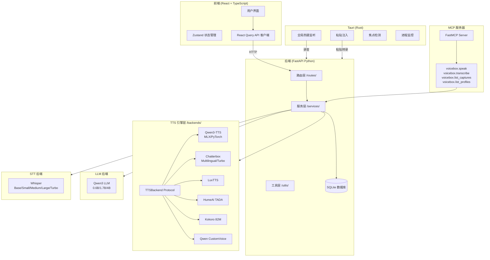

# VoiceBox 技术学习报告

> 基于 `reference_repos/VoiceBox` 仓库的深度代码分析
> 分析日期：2026-07-24

---

## 1. 项目概述

### 1.1 仓库定位

VoiceBox 是一个**本地优先的开源 AI 语音工作室**，定位为 ElevenLabs 和 WisprFlow 的开源替代方案。它将 TTS（文本转语音）和 STT（语音转文本）集成在一个应用中，所有模型和数据完全在本地运行，确保隐私安全。仓库地址：https://github.com/jamiepine/voicebox

### 1.2 主要功能

- **7 个 TTS 引擎**：Qwen3-TTS、Qwen CustomVoice、LuxTTS、Chatterbox Multilingual、Chatterbox Turbo、HumeAI TADA、Kokoro
- **23 种语言支持**：覆盖英语、中文、日语、阿拉伯语、印地语、斯瓦希里语等
- **零样本语音克隆**：通过几秒钟参考音频克隆任意音色
- **50+ 预设声音**：通过 Kokoro 和 Qwen CustomVoice 提供
- **语音输入**：全局听写热键、推送说话和切换模式、Whisper STT
- **Agent 语音输出**：MCP 协议集成，任何 AI Agent 可调用语音输出
- **语音人格系统**：本地 LLM 驱动的角色扮演和文本改写
- **无限长度生成**：自动分块 + 交叉淡入淡出，支持 50,000 字符
- **音频后处理**：8 种效果（音高变换、混响、延迟、合唱等）
- **Stories 编辑器**：多轨道时间线，支持对话、播客和叙事
- **生成版本管理**：原始版本、效果版本、多 Take 支持
- **MCP 服务器**：内置 Model Context Protocol 服务器，支持 Agent 集成

### 1.3 技术栈

| 层级 | 技术 | 用途 |
|------|------|------|
| 桌面应用 | Tauri (Rust) | 原生性能桌面包装器 |
| 前端 | React, TypeScript, Tailwind CSS | 用户界面 |
| 状态管理 | Zustand, React Query | 前端状态 |
| 后端 | FastAPI (Python) | API 服务器 |
| TTS 引擎 | Qwen3-TTS, Chatterbox, LuxTTS, TADA, Kokoro | 语音合成 |
| STT | Whisper / Whisper Turbo | 语音识别 |
| 本地 LLM | Qwen3 (0.6B/1.7B/4B) | 文本改写/人格系统 |
| MCP 服务器 | FastMCP (Streamable HTTP) | Agent 集成 |
| 原生层 | Rust (Tauri 内) | 全局热键、粘贴注入、焦点检测 |
| 音频效果 | Pedalboard (Spotify) | 专业级 DSP 效果 |
| 推理后端 | MLX (Apple Silicon) / PyTorch (CUDA/ROCm/XPU/CPU) | 跨平台 GPU 加速 |
| 数据库 | SQLite | 数据持久化 |
| 音频处理 | WaveSurfer.js, librosa | 音频可视化和处理 |

---

## 2. 核心架构分析

### 2.1 整体架构图



### 2.2 关键模块职责与交互

#### 核心模块关系图

```
VoiceBox Backend (FastAPI)
├── app.py — 应用工厂、中间件、生命周期事件
├── server.py — PyInstaller 打包入口点
├── config.py — 数据目录配置
├── models.py — Pydantic 请求/响应模型
├── database/
│   ├── models.py — ORM 模型 (VoiceProfile, Generation, Story, Capture 等)
│   ├── session.py — SQLAlchemy 会话管理
│   ├── migrations.py — 数据库迁移
│   └── seed.py — 初始数据填充
├── backends/
│   ├── __init__.py — 后端抽象层，TTSBackend/STTBackend/LLMBackend Protocol + 工厂函数
│   ├── base.py — 共享工具（模型缓存检查、设备检测、音频合并、进度跟踪）
│   ├── mlx_backend.py — MLX (Apple Silicon) TTS/STT 后端
│   ├── pytorch_backend.py — PyTorch (CUDA/ROCm/XPU) TTS/STT 后端
│   ├── qwen_custom_voice_backend.py — Qwen CustomVoice 后端
│   ├── qwen_llm_backend.py — Qwen3 LLM 后端 (MLX/PyTorch)
│   ├── chatterbox_backend.py — Chatterbox Multilingual 后端
│   ├── chatterbox_turbo_backend.py — Chatterbox Turbo 后端
│   ├── luxtts_backend.py — LuxTTS 后端
│   ├── hume_backend.py — HumeAI TADA 后端
│   └── kokoro_backend.py — Kokoro 后端
├── services/
│   ├── generation.py — 统一 TTS 生成编排 (generate/retry/regenerate)
│   ├── task_queue.py — 串行生成队列 (避免 GPU 争用)
│   ├── profiles.py — 语音配置文件管理
│   ├── tts.py — TTS 模型加载/卸载服务
│   ├── transcribe.py — Whisper STT 服务
│   ├── llm.py — LLM 模型服务
│   ├── effects.py — 音频后处理服务
│   ├── refinement.py — LLM 文本精炼服务
│   ├── personality.py — 语音人格服务
│   ├── captures.py — 语音捕获服务
│   ├── stories.py — Stories 编辑器服务
│   ├── versions.py — 生成版本管理
│   ├── history.py — 历史记录管理
│   ├── export_import.py — 配置文件导入/导出
│   ├── cuda.py — CUDA 后端自动更新
│   ├── rocm.py — ROCm 后端自动更新
│   ├── cloud.py — 云同步服务
│   ├── settings.py — 设置管理
│   └── channels.py — 音频通道管理
├── routes/
│   ├── generations.py — 生成 API
│   ├── profiles.py — 配置文件 API
│   ├── effects.py — 效果 API
│   ├── transcription.py — 转录 API
│   ├── captures.py — 捕获 API
│   ├── stories.py — Stories API
│   ├── models.py — 模型管理 API
│   ├── speak.py — Agent 语音输出 API
│   └── ... (共 21 个路由模块)
├── utils/
│   ├── chunked_tts.py — 长文本分块 + 交叉淡入淡出
│   ├── effects.py — Pedalboard 效果引擎
│   ├── audio.py — 音频工具（保存、加载、标准化、裁剪）
│   ├── platform_detect.py — 平台检测（MLX/PyTorch 选择）
│   ├── progress.py — 进度管理器
│   ├── hf_progress.py — HuggingFace 下载进度跟踪
│   ├── cache.py — 缓存管理
│   ├── dac_shim.py — DAC 轻量级替代
│   └── hf_offline_patch.py — HF 离线兼容补丁
└── mcp_server/
    ├── server.py — MCP 服务器构建
    ├── events.py — 事件发布/订阅
    └── context.py — 客户端 ID 中间件
```

| 模块 | 文件 | 职责 |
|------|------|------|
| **TTSBackend Protocol** | `backends/__init__.py` | 定义 TTS 后端接口：load_model, generate, create_voice_prompt |
| **STTBackend Protocol** | `backends/__init__.py` | 定义 STT 后端接口：load_model, transcribe |
| **LLMBackend Protocol** | `backends/__init__.py` | 定义 LLM 后端接口：load_model, generate |
| **ModelConfig** | `backends/__init__.py` | 声明式模型配置（名称、HF 仓库、大小、语言） |
| **后端工厂** | `backends/__init__.py` | `get_tts_backend_for_engine()` 按引擎名延迟创建后端实例 |
| **Generation** | `services/generation.py` | 统一生成编排，支持 generate/retry/regenerate 三种模式 |
| **TaskQueue** | `services/task_queue.py` | 串行生成队列，避免 GPU 争用 |
| **ChunkedTTS** | `utils/chunked_tts.py` | 长文本智能分块 + 交叉淡入淡出拼接 |
| **Effects** | `utils/effects.py` | 基于 Pedalboard 的 8 种音频效果引擎 |
| **Profiles** | `services/profiles.py` | 语音配置文件 CRUD + Voice Prompt 创建 |
| **MCP Server** | `mcp_server/server.py` | Model Context Protocol 服务器，暴露 speak/transcribe 工具 |

---

## 3. 关键代码模块深度解析

### 3.1 TTS 引擎抽象层

VoiceBox 的核心架构创新是其**多引擎抽象层**，通过 Python Protocol 定义统一接口，使 7 个不同的 TTS 引擎可以无缝切换。

#### 3.1.1 TTSBackend Protocol 定义

```python
# backends/__init__.py
@runtime_checkable
class TTSBackend(Protocol):
    """Protocol for TTS backend implementations."""

    async def load_model(self, model_size: str) -> None:
        """Load TTS model."""
        ...

    async def create_voice_prompt(
        self, audio_path: str, reference_text: str, use_cache: bool = True,
    ) -> Tuple[dict, bool]:
        """Create voice prompt from reference audio."""
        ...

    async def combine_voice_prompts(
        self, audio_paths: List[str], reference_texts: List[str],
    ) -> Tuple[np.ndarray, str]:
        """Combine multiple voice prompts."""
        ...

    async def generate(
        self, text: str, voice_prompt: dict, language: str = "en",
        seed: Optional[int] = None, instruct: Optional[str] = None,
    ) -> Tuple[np.ndarray, int]:
        """Generate audio from text. Returns (audio_array, sample_rate)."""
        ...

    def unload_model(self) -> None:
        """Unload model to free memory."""
        ...

    def is_loaded(self) -> bool:
        """Check if model is loaded."""
        ...
```

#### 3.1.2 声明式模型配置注册

```python
# backends/__init__.py
@dataclass
class ModelConfig:
    """Declarative config for a downloadable model variant."""
    model_name: str       # e.g. "qwen-tts-1.7B"
    display_name: str     # e.g. "Qwen TTS 1.7B"
    engine: str           # e.g. "qwen"
    hf_repo_id: str       # e.g. "Qwen/Qwen3-TTS-12Hz-1.7B-Base"
    model_size: str       # e.g. "1.7B"
    size_mb: int          # 下载大小
    needs_trim: bool      # 是否需要输出裁剪
    supports_instruct: bool  # 是否支持指令控制
    languages: list[str]  # 支持的语言

# 按引擎分组的配置
TTS_ENGINES = {
    "qwen": "Qwen TTS",
    "qwen_custom_voice": "Qwen CustomVoice",
    "luxtts": "LuxTTS",
    "chatterbox": "Chatterbox TTS",
    "chatterbox_turbo": "Chatterbox Turbo",
    "tada": "TADA",
    "kokoro": "Kokoro",
}
```

#### 3.1.3 后端工厂 + 延迟实例化

```python
# backends/__init__.py
def get_tts_backend_for_engine(engine: str) -> TTSBackend:
    """获取或创建 TTS 后端实例（线程安全，双重检查锁）"""
    global _tts_backends

    if engine in _tts_backends:
        return _tts_backends[engine]

    with _tts_backends_lock:
        if engine in _tts_backends:
            return _tts_backends[engine]

        if engine == "qwen":
            backend_type = get_backend_type()
            if backend_type == "mlx":
                from .mlx_backend import MLXTTSBackend
                backend = MLXTTSBackend()
            else:
                from .pytorch_backend import PyTorchTTSBackend
                backend = PyTorchTTSBackend()
        elif engine == "chatterbox":
            from .chatterbox_backend import ChatterboxTTSBackend
            backend = ChatterboxTTSBackend()
        elif engine == "kokoro":
            from .kokoro_backend import KokoroTTSBackend
            backend = KokoroTTSBackend()
        # ... 其他引擎

        _tts_backends[engine] = backend
        return backend
```

### 3.2 推理流程（从文本到语音）

VoiceBox 的推理流程经过精心编排，支持异步队列、长文本分块和交叉淡入淡出。

#### 3.2.1 完整推理管线

```
用户请求 (POST /generate)
  ↓
生成队列 (TaskQueue - 串行执行，避免 GPU 争用)
  ↓
run_generation() — 统一编排入口
  ├── 1. 加载引擎模型 (load_engine_model)
  ├── 2. 创建 Voice Prompt (create_voice_prompt_for_profile)
  │     ├── 克隆配置: 合并参考音频 → engine.create_voice_prompt()
  │     ├── 预设配置: 返回 preset_voice_id
  │     └── 设计配置: 返回 design_prompt
  ├── 3. 分块生成 (generate_chunked)
  │     ├── 文本分块 (split_text_into_chunks)
  │     │     ├── 按句子边界分割
  │     │     ├── 处理缩写 (Mr. Dr. 等)
  │     │     ├── 保护 [paralinguistic] 标签
  │     │     └── CJK 标点支持
  │     ├── 逐块推理 (backend.generate)
  │     │     ├── 设置随机种子 (seed + i)
  │     │     └── 异步线程执行 (asyncio.to_thread)
  │     ├── 可选裁剪 (trim_tts_output)
  │     └── 交叉淡入淡出拼接 (concatenate_audio_chunks)
  ├── 4. 音频标准化 (normalize_audio)
  ├── 5. 保存原始版本 (create_version "original")
  ├── 6. 可选效果处理 (apply_effects)
  └── 7. 更新数据库状态
```

#### 3.2.2 串行生成队列

```python
# services/task_queue.py
async def _generation_worker():
    """Worker that processes generation tasks one at a time."""
    while True:
        job = await _generation_queue.get()
        try:
            if job.generation_id in _cancelled_generation_ids:
                _cancelled_generation_ids.discard(job.generation_id)
                job.coro.close()
                continue

            task = asyncio.create_task(job.coro)
            _running_generation_tasks[job.generation_id] = task
            _queued_generation_ids.discard(job.generation_id)
            try:
                await task
            except asyncio.CancelledError:
                if not task.cancelled():
                    raise
        except Exception:
            traceback.print_exc()
            await _force_fail_if_active(...)
        finally:
            _running_generation_tasks.pop(job.generation_id, None)
            _queued_generation_ids.discard(job.generation_id)
            _generation_queue.task_done()
```

#### 3.2.3 长文本智能分块 + 交叉淡入淡出

```python
# utils/chunked_tts.py
def split_text_into_chunks(text: str, max_chars: int = 800) -> List[str]:
    """按自然边界分块：句子结束 > 子句边界 > 空格 > 硬切"""
    # 优先级：
    # 1. 句子结束 (.!? 不跟缩写，不在标签内，CJK 标点)
    # 2. 子句边界 (;:,—)
    # 3. 空格
    # 4. 硬切 (保护 [tag] 不被分割)

def concatenate_audio_chunks(
    chunks: List[np.ndarray], sample_rate: int, crossfade_ms: int = 50,
) -> np.ndarray:
    """交叉淡入淡出拼接，消除拼接处的 click 噪声"""
    crossfade_samples = int(sample_rate * crossfade_ms / 1000)
    result = np.array(chunks[0], dtype=np.float32, copy=True)
    for chunk in chunks[1:]:
        overlap = min(crossfade_samples, len(result), len(chunk))
        if overlap > 0:
            fade_out = np.linspace(1.0, 0.0, overlap)
            fade_in = np.linspace(0.0, 1.0, overlap)
            result[-overlap:] = result[-overlap:] * fade_out + chunk[:overlap] * fade_in
            result = np.concatenate([result, chunk[overlap:]])
    return result
```

### 3.3 引擎后端实现

#### 3.3.1 Chatterbox Multilingual — 零样本语音克隆

```python
# backends/chatterbox_backend.py
class ChatterboxTTSBackend:
    """Chatterbox Multilingual TTS backend — 23 种语言，零样本克隆"""

    # 每种语言的默认生成参数
    _LANG_DEFAULTS: ClassVar[dict] = {
        "he": {"exaggeration": 0.4, "cfg_weight": 0.7, "temperature": 0.65, "repetition_penalty": 2.5},
    }
    _GLOBAL_DEFAULTS: ClassVar[dict] = {
        "exaggeration": 0.5, "cfg_weight": 0.5, "temperature": 0.8, "repetition_penalty": 2.0,
    }

    async def generate(self, text, voice_prompt, language="en", seed=None, instruct=None):
        await self.load_model()
        ref_audio = voice_prompt.get("ref_audio")
        lang_defaults = self._LANG_DEFAULTS.get(language, self._GLOBAL_DEFAULTS)

        def _generate_sync():
            if seed is not None:
                manual_seed(seed, self._device)
            wav = self.model.generate(
                text,
                language_id=language,
                audio_prompt_path=ref_audio,
                exaggeration=lang_defaults["exaggeration"],
                cfg_weight=lang_defaults["cfg_weight"],
                temperature=lang_defaults["temperature"],
                repetition_penalty=lang_defaults["repetition_penalty"],
            )
            audio = wav.squeeze().cpu().numpy().astype(np.float32)
            return audio, self.model.sr

        return await asyncio.to_thread(_generate_sync)
```

#### 3.3.2 Kokoro — 轻量级预设声音引擎

```python
# backends/kokoro_backend.py
class KokoroTTSBackend:
    """Kokoro-82M — 82M 参数，CPU 实时，24kHz 输出"""

    # 50+ 预设声音，按语言/性别组织
    KOKORO_VOICES = [
        ("af_heart", "Heart", "female", "en"),
        ("am_adam", "Adam", "male", "en"),
        ("jf_alpha", "Alpha", "female", "ja"),
        ("zf_xiaobei", "Xiaobei", "female", "zh"),
        # ... 50+ voices
    ]

    async def generate(self, text, voice_prompt, language="en", seed=None, instruct=None):
        voice_name = voice_prompt.get("preset_voice_id") or KOKORO_DEFAULT_VOICE

        def _generate_sync():
            pipeline = self._get_pipeline(language)
            audio_chunks = []
            for result in pipeline(text, voice=voice_name, speed=1.0):
                if result.audio is not None:
                    audio_chunks.append(result.audio.detach().cpu().numpy().squeeze())
            return np.concatenate(audio_chunks).astype(np.float32), KOKORO_SAMPLE_RATE

        return await asyncio.to_thread(_generate_sync)
```

### 3.4 音频后处理效果引擎

```python
# utils/effects.py — 基于 Spotify Pedalboard 的专业级 DSP
EFFECT_REGISTRY = {
    "chorus": {"cls": Chorus, "params": {"rate_hz": 1.0, "depth": 0.5, ...}},
    "reverb": {"cls": Reverb, "params": {"room_size": 0.5, "damping": 0.5, ...}},
    "delay": {"cls": Delay, "params": {"delay_seconds": 0.3, "feedback": 0.3, ...}},
    "compressor": {"cls": Compressor, "params": {"threshold_db": -20.0, "ratio": 4.0, ...}},
    "gain": {"cls": Gain, "params": {"gain_db": 0.0}},
    "highpass": {"cls": HighpassFilter, "params": {"cutoff_frequency_hz": 80.0}},
    "lowpass": {"cls": LowpassFilter, "params": {"cutoff_frequency_hz": 8000.0}},
    "pitch_shift": {"cls": PitchShift, "params": {"semitones": 0.0}},
}

# 4 个内置预设
BUILTIN_PRESETS = {
    "robotic": {"name": "Robotic", "effects_chain": [chorus (slow LFO + high feedback)]},
    "radio": {"name": "Radio", "effects_chain": [highpass + lowpass + compressor + gain]},
    "echo_chamber": {"name": "Echo Chamber", "effects_chain": [reverb + delay]},
    "deep_voice": {"name": "Deep Voice", "effects_chain": [pitch_shift(-3) + lowpass + compressor]},
}
```

### 3.5 MCP 服务器集成

VoiceBox 内置 Model Context Protocol 服务器，使任何 MCP 感知的 AI Agent（Claude Code、Cursor、Cline 等）可以调用语音功能：

```typescript
// 任何 MCP 感知的 Agent 中：
await voicebox.speak({
  text: "Deploy complete.",
  profile: "Morgan",
  personality: true,  // 通过人格 LLM 改写文本
});
```

四个 MCP 工具：
- `voicebox.speak` — 语音输出
- `voicebox.transcribe` — 语音转文本
- `voicebox.list_captures` — 列出捕获
- `voicebox.list_profiles` — 列出配置文件

---

## 4. 技术亮点与创新点

### 4.1 多引擎 Protocol 抽象

VoiceBox 最核心的架构创新是使用 Python `Protocol` 定义 `TTSBackend`、`STTBackend`、`LLMBackend` 三个协议接口，配合工厂函数实现：

- **零耦合添加新引擎**：只需实现 Protocol 接口，注册到 `TTS_ENGINES` 字典
- **运行时切换**：前端可以在生成时动态选择引擎
- **平台自适应**：Qwen 引擎自动选择 MLX (Apple Silicon) 或 PyTorch (CUDA)
- **声明式配置**：`ModelConfig` 数据类统一管理模型元数据

这种设计使得 VoiceBox 能在不修改核心逻辑的情况下集成 7 个完全不同的 TTS 引擎。

### 4.2 串行生成队列 + GPU 争用避免

```python
# 生成队列确保同一时间只有一个 TTS 推理在运行
_generation_queue: asyncio.Queue  # 串行队列
_running_generation_tasks: dict[str, asyncio.Task]  # 运行中任务
_queued_generation_ids: set[str]  # 排队中的 ID
_cancelled_generation_ids: set[str]  # 已取消的 ID
```

**创新点**：
- 用户可以连续提交多个生成请求，无需等待前一个完成
- 串行执行避免 GPU 内存争用（多个模型同时加载会 OOM）
- 支持取消排队中或运行中的生成
- 崩溃恢复：启动时将上次崩溃时的 "generating" 状态标记为 "failed"

### 4.3 Voice Prompt 多级缓存

```python
# services/profiles.py
async def create_voice_prompt_for_profile(profile_id, db, use_cache=True, engine="qwen"):
    """三种配置类型的 Voice Prompt 创建"""
    if voice_type == "preset":
        return {"voice_type": "preset", "preset_engine": ..., "preset_voice_id": ...}
    if voice_type == "designed":
        return {"voice_type": "designed", "design_prompt": ...}

    # 克隆配置：合并多个参考音频样本
    if len(samples) == 1:
        return await tts_model.create_voice_prompt(audio_path, text, use_cache=use_cache)

    # 多样本合并 + 缓存
    combined_audio, combined_text = await tts_model.combine_voice_prompts(audio_paths, texts)
    # 使用 MD5 哈希缓存合并结果
    combination_hash = hashlib.md5(sample_ids_str.encode()).hexdigest()[:12]
    combined_path = cache_dir / f"combined_{profile_id}_{combination_hash}.wav"
    save_audio(combined_audio, str(combined_path), 24000)
    return await tts_model.create_voice_prompt(str(combined_path), combined_text, use_cache=use_cache)
```

### 4.4 跨平台推理自动检测

```python
# utils/platform_detect.py
def get_backend_type() -> Literal["mlx", "pytorch"]:
    """自动检测最佳后端：Apple Silicon → MLX，其他 → PyTorch"""
    if is_apple_silicon():
        try:
            import mlx.core
            return "mlx"
        except (ImportError, OSError, RuntimeError):
            return "pytorch"
    return "pytorch"
```

支持的 GPU 后端：
| 平台 | 后端 | 特点 |
|------|------|------|
| macOS (Apple Silicon) | MLX (Metal) | Neural Engine 加速 4-5x |
| Windows (NVIDIA) | PyTorch (CUDA) | 应用内自动下载 CUDA 二进制 |
| Linux (NVIDIA) | PyTorch (CUDA) | 本地/远程 Python 后端 |
| Linux (AMD) | PyTorch (ROCm) | 自动配置 HSA_OVERRIDE_GFX_VERSION |
| Windows (任意 GPU) | DirectML | 通用 Windows GPU 支持 |
| Intel Arc | IPEX/XPU | Intel 独立 GPU 加速 |
| 任意平台 | CPU | 兜底方案 |

### 4.5 生成版本管理系统

```python
# 每次生成自动创建版本链
# original → version-2 (with effects) → take-N (regenerate with new seed)
class GenerationVersion(Base):
    generation_id = Column(String, ForeignKey("generations.id"))
    label = Column(String)           # "original", "version-2", "take-3"
    audio_path = Column(String)
    effects_chain = Column(Text, nullable=True)
    source_version_id = Column(String, nullable=True)  # 版本来源追踪
    is_default = Column(Boolean, default=False)
```

**创新点**：
- 原始版本始终保留
- 效果版本从任意源版本创建
- Take 变体通过新种子生成
- 每个版本记录来源谱系

### 4.6 语音人格系统

```python
# services/personality.py — 本地 LLM 驱动的角色扮演
# 两种模式：
# 1. Compose: 生成符合角色性格的新台词
# 2. Speak in character: 将用户输入改写为角色口吻后再 TTS

# Agent 也可通过 MCP 调用人格改写
await voicebox.speak({
  text: "Deploy complete.",
  profile: "Morgan",
  personality: true,  # 路由到 personality LLM 改写
});
```

同一个 Qwen3 LLM 同时服务于：
- 语音人格改写
- 听写文本精炼（去除语气词、口吃等）
- 统一模型缓存和 GPU 内存占用

---

## 5. 可借鉴之处

### 5.1 可整合到 TTS_MultiModel 的具体技术

#### 5.1.1 多引擎 Protocol 抽象架构

VoiceBox 的 `TTSBackend` Protocol 设计可以直接复用到 TTS_MultiModel：

```python
# TTS_MultiModel 可借鉴的架构
@runtime_checkable
class TTSBackend(Protocol):
    async def load_model(self, model_size: str) -> None: ...
    async def generate(self, text: str, voice_prompt: dict, language: str = "en",
                       seed: Optional[int] = None, instruct: Optional[str] = None,
                       ) -> Tuple[np.ndarray, int]: ...
    async def create_voice_prompt(self, audio_path: str, reference_text: str,
                                   use_cache: bool = True) -> Tuple[dict, bool]: ...
    def unload_model(self) -> None: ...
    def is_loaded(self) -> bool: ...

# 工厂函数 + 双重检查锁
def get_tts_backend_for_engine(engine: str) -> TTSBackend:
    # 延迟导入，线程安全实例化
    ...
```

**优势**：TTS_MultiModel 已有类似的多引擎架构，VoiceBox 的 Protocol 设计更规范，可直接对齐。

#### 5.1.2 串行生成队列

```python
# TTS_MultiModel 可直接复用的队列模式
class GenerationQueue:
    def __init__(self):
        self._queue: asyncio.Queue = asyncio.Queue()
        self._running: dict[str, asyncio.Task] = {}
        self._queued: set[str] = set()

    async def worker(self):
        while True:
            job = await self._queue.get()
            task = asyncio.create_task(job.coro)
            self._running[job.id] = task
            try:
                await task
            finally:
                self._running.pop(job.id, None)
                self._queue.task_done()

    def enqueue(self, generation_id: str, coro):
        self._queue.put_nowait(GenerationJob(generation_id, coro))
```

**适用场景**：TTS_MultiModel 的多引擎生成也需要避免 GPU 争用。

#### 5.1.3 长文本分块 + 交叉淡入淡出

```python
# 可直接复用的分块策略
# 1. 句子边界分割 (处理缩写、CJK 标点、标签保护)
# 2. 每块独立推理 (种子递增避免相关性)
# 3. 交叉淡入淡出拼接 (消除 click 噪声)
```

TTS_MultiModel 目前的长文本处理可参考此实现。

#### 5.1.4 声明式模型配置注册

```python
@dataclass
class ModelConfig:
    model_name: str
    display_name: str
    engine: str
    hf_repo_id: str
    model_size: str
    size_mb: int
    languages: list[str]

# 按引擎分组注册
ALL_CONFIGS = _get_qwen_configs() + _get_chatterbox_configs() + ...
```

**优势**：统一管理所有引擎的模型元数据，支持前端自动渲染模型选择 UI。

#### 5.1.5 生成版本管理

VoiceBox 的版本管理设计（original → version-2 → take-N）可以增强 TTS_MultiModel 的用户体验：

- 保留原始生成
- 支持效果链叠加
- 支持多 Take 变体
- 版本来源追踪

#### 5.1.6 音频效果引擎

基于 Spotify Pedalboard 的 8 种效果 + 预设系统，可直接集成到 TTS_MultiModel：

```python
from pedalboard import Pedalboard, Chorus, Reverb, Compressor, Gain, HighpassFilter, LowpassFilter, Delay, PitchShift
```

#### 5.1.7 MCP 服务器

VoiceBox 的 MCP 服务器实现（FastMCP + Streamable HTTP）可作为 TTS_MultiModel Agent 集成的参考。

### 5.2 架构模式与最佳实践

| 模式 | VoiceBox 实现 | TTS_MultiModel 可借鉴 |
|------|-------------|----------------------|
| **引擎抽象** | Python Protocol + 工厂函数 | 统一引擎接口规范 |
| **串行队列** | asyncio.Queue + Worker | 避免 GPU 争用 |
| **平台检测** | MLX/PyTorch 自动选择 | 跨平台推理优化 |
| **模型缓存** | HuggingFace Hub 本地缓存 | 模型下载管理 |
| **配置管理** | 声明式 ModelConfig | 统一模型元数据 |
| **版本管理** | 生成版本链 + 来源追踪 | 增强用户体验 |
| **效果引擎** | Pedalboard + 预设系统 | 音频后处理管线 |
| **异步模型加载** | asyncio.to_thread + Lock | 避免阻塞事件循环 |
| **进程监控** | 父进程 watchdog + 优雅关闭 | 桌面应用生命周期 |
| **MCP 集成** | FastMCP + Streamable HTTP | Agent 语音输出 |

### 5.3 需要注意的兼容性问题

1. **许可证**：VoiceBox 使用 MIT License，非常宽松。但集成的引擎各自有不同许可：
   - Qwen3-TTS: Apache 2.0
   - Chatterbox: Resemble AI 专有许可
   - Kokoro: Apache 2.0
   - LuxTTS: MIT
   - HumeAI TADA: HumeAI 专有许可

2. **依赖冲突**：
   - `chatterbox-tts` 使用 `--no-deps` 安装（因为 pin 了 numpy<1.26 / torch==2.6）
   - `hume-tada` 使用 `--no-deps` 安装（因为 pin 了 torch>=2.7,<2.8）
   - `linacodec` 需要从 git 安装
   - `kokoro>=0.9.4` + `misaki[en,ja,zh]` 需要 spacy 模型预装
   - numpy 版本限制: `numpy>=1.24.0,<2.0`

3. **Python 版本**：VoiceBox 需要 Python 3.11+，TTS_MultiModel 需确认兼容性。

4. **模型大小**：
   - Qwen3-TTS 1.7B: ~3.5GB
   - Chatterbox Multilingual: ~3.2GB
   - Chatterbox Turbo: ~1.5GB
   - TADA 3B: ~8GB
   - Kokoro 82M: ~350MB
   - LuxTTS: ~300MB
   - Whisper Turbo: ~3GB
   - Qwen3 LLM 4B: ~8GB

5. **GPU 需求**：
   - Kokoro: CPU 即可实时
   - LuxTTS: CPU 友好（~1GB VRAM）
   - Qwen3-TTS: 推荐 4GB+ VRAM
   - Chatterbox: 推荐 6GB+ VRAM
   - TADA 3B: 推荐 12GB+ VRAM

6. **Windows 特殊处理**：
   - PyInstaller 打包需要特殊处理 stdout/stderr
   - 父进程监控使用 Windows API (kernel32.OpenProcess)
   - CUDA 二进制自动下载和运行时切换

7. **音频格式**：VoiceBox 统一使用 WAV 格式，采样率因引擎而异（24kHz-48kHz）。

---

## 6. 参考资源

### 6.1 关键论文

| 论文 | 链接 | 相关模块 |
|------|------|---------|
| VoiceBox (Meta) | [arXiv:2306.15687](https://arxiv.org/abs/2306.15687) | Flow Matching TTS 基础理论 |
| Chatterbox (Resemble AI) | [GitHub](https://github.com/ResembleAI/Chatterbox) | 多语言语音克隆 |
| Kokoro | [GitHub](https://github.com/hexgrad/kokoro) | 轻量级 82M TTS |
| LuxTTS | [GitHub](https://github.com/ysharma3501/LuxTTS) | CPU 友好 TTS |
| HumeAI TADA | [Hume AI](https://www.hume.ai/) | 语音-语言模型 |
| Qwen3-TTS | [Qwen](https://qwenlm.github.io/) | 多语言 TTS |
| Whisper | [arXiv:2212.04356](https://arxiv.org/abs/2212.04356) | 语音识别 |
| Pedalboard (Spotify) | [GitHub](https://github.com/spotify/pedalboard) | 音频 DSP 效果 |
| Tauri | [tauri.app](https://v2.tauri.app/) | 桌面应用框架 |
| FastMCP | [GitHub](https://github.com/jlowin/fastmcp) | MCP 服务器实现 |

### 6.2 项目文档

- **GitHub 仓库**: https://github.com/jamiepine/voicebox
- **官方网站**: https://voicebox.sh
- **文档站点**: https://docs.voicebox.sh
- **DeepWiki**: https://deepwiki.com/jamiepine/voicebox
- **TTS 引擎添加指南**: `docs/content/docs/developer/tts-engines.mdx`
- **项目状态文档**: `docs/PROJECT_STATUS.md`
- **贡献指南**: `CONTRIBUTING.md`

### 6.3 技术参考

- **ModelConfig 声明式配置**: `backend/backends/__init__.py` (ModelConfig dataclass + 引擎注册)
- **TTSBackend Protocol**: `backend/backends/__init__.py` (Protocol 定义 + 工厂函数)
- **串行生成队列**: `backend/services/task_queue.py` (asyncio.Queue + Worker)
- **长文本分块**: `backend/utils/chunked_tts.py` (分块 + 交叉淡入淡出)
- **音频效果引擎**: `backend/utils/effects.py` (Pedalboard 封装)
- **生成编排**: `backend/services/generation.py` (统一入口)
- **平台检测**: `backend/utils/platform_detect.py` (MLX/PyTorch 自动选择)
- **MCP 服务器**: `backend/mcp_server/` (FastMCP 实现)
- **数据库模型**: `backend/database/models.py` (SQLAlchemy ORM)
- **配置文件管理**: `backend/services/profiles.py` (Voice Prompt 创建)
- **Tauri 原生层**: `tauri/src-tauri/` (Rust 全局热键、粘贴注入)

---

## 7. 总结

VoiceBox 是一个设计精良的本地优先 AI 语音工作室，其核心创新在于：

1. **多引擎 Protocol 抽象**：通过 Python Protocol + 工厂函数，7 个 TTS 引擎可无缝切换
2. **串行生成队列**：避免 GPU 争用，支持并发提交、取消和崩溃恢复
3. **跨平台推理**：MLX (Apple Silicon) / PyTorch (CUDA/ROCm/XPU) / DirectML / CPU 自动选择
4. **长文本智能分块**：句子边界分割 + 交叉淡入淡出，支持 50,000 字符
5. **生成版本管理**：原始版本 → 效果版本 → Take 变体，完整来源追踪
6. **语音人格系统**：本地 LLM 驱动的角色扮演，统一服务于精炼和改写
7. **MCP 集成**：内置 Model Context Protocol 服务器，Agent 可直接调用语音输出
8. **声明式配置**：ModelConfig 数据类统一管理所有模型元数据

对于 TTS_MultiModel 项目，VoiceBox 最有价值的借鉴点是：

- **多引擎 Protocol 架构**：可直接对齐 TTS_MultiModel 的引擎接口设计
- **串行生成队列**：解决多引擎场景下的 GPU 争用问题
- **声明式模型配置**：统一管理引擎元数据，支持前端自动渲染
- **长文本分块 + 交叉淡入淡出**：增强长文本合成体验
- **生成版本管理**：提升用户生成体验
- **MCP 服务器模式**：为 TTS_MultiModel 提供 Agent 集成参考
- **Pedalboard 效果引擎**：专业级音频后处理能力
- **跨平台后端检测**：自动选择最优推理后端
