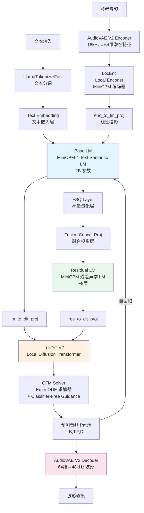
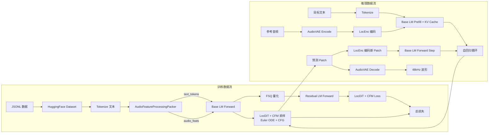

# VoxCPM 技术学习报告

> 仓库地址：[OpenBMB/VoxCPM](https://github.com/OpenBMB/VoxCPM)
> 分析日期：2026-07-24
> 报告类型：参考仓库深度技术分析

---

## 1. 项目概述

### 1.1 仓库定位

VoxCPM 是由 OpenBMB（面壁智能）和 THUHCSI（清华大学交叉信息研究院）联合开发的 **tokenizer-free 文本到语音（TTS）系统**。其核心创新在于完全绕过离散 token 化，通过端到端的**扩散自回归架构**（Diffusion Autoregressive Architecture）直接生成连续语音表示，实现高度自然和富有表现力的语音合成。

VoxCPM2 是最新主要版本——一个 **2B 参数**模型，在超过 **200 万小时**多语言语音数据上训练，支持 **30 种语言**、**Voice Design**、**可控语音克隆**和 **48kHz 录音室级音质**输出。构建于 [MiniCPM-4](https://github.com/OpenBMB/MiniCPM) 语言模型骨干之上。

### 1.2 主要功能

| 功能维度 | 详细描述 |
|---------|---------|
| **多语言 TTS** | 支持 30 种语言直接合成，无需语言标签 |
| **Voice Design** | 通过自然语言描述创建全新声音（性别、年龄、语调、情感、语速），无需参考音频 |
| **可控语音克隆** | 从短参考音频克隆音色，可选风格指导调整情感、语速、表达 |
| **Ultimate Cloning** | 提供参考音频及其转录文本，模型无缝延续，忠实保留所有声音细节 |
| **48kHz 高品质输出** | 接受 16kHz 参考音频，直接输出 48kHz 录音室级音质 |
| **上下文感知合成** | 自动从文本内容推断适当的韵律和表现力 |
| **实时流式输出** | RTF 低至 ~0.3（RTX 4090），加速后可达 ~0.13 |
| **LoRA 微调** | 支持 SFT 全参数微调和 LoRA 参数高效微调 |
| **开源商用** | Apache-2.0 许可证，完全开源 |

### 1.3 技术栈

| 层次 | 技术选型 |
|-----|---------|
| **深度学习框架** | PyTorch ≥ 2.5.0 + einops |
| **语言模型骨干** | MiniCPM-4（基于 LLaMA 架构的 Transformer Decoder） |
| **音频编解码器** | AudioVAE V2（基于 DAC 的因果卷积 VAE） |
| **扩散模型** | Unified CFM（Conditional Flow Matching） |
| **文本分词器** | LlamaTokenizerFast |
| **配置管理** | Pydantic BaseModel |
| **数据管线** | HuggingFace Datasets + argbind |
| **推理加速** | torch.compile（Triton）、Nano-vLLM、vLLM-Omni |
| **噪声抑制** | ZipEnhancer（ModelScope 声学降噪） |

### 1.4 模型版本对比

| 特性 | VoxCPM2 | VoxCPM1.5 | VoxCPM-0.5B |
|------|---------|-----------|-------------|
| **骨干参数** | 2B | 0.6B | 0.5B |
| **音频采样率** | 48kHz | 44.1kHz | 16kHz |
| **LM Token Rate** | 6.25Hz | 6.25Hz | 12.5Hz |
| **语言数** | 30 | 2（中英） | 2（中英） |
| **克隆模式** | 隔离引用 & 延续 | 仅延续 | 仅延续 |
| **Voice Design** | ✅ | — | — |
| **可控克隆** | ✅ | — | — |
| **RTF（RTX 4090）** | ~0.30 | ~0.15 | ~0.17 |
| **VRAM** | ~8 GB | ~6 GB | ~5 GB |

### 1.5 基准测试表现

| 基准测试 | VoxCPM2 表现 |
|---------|-------------|
| Seed-TTS Eval SIM（英文） | **75.3%** |
| Seed-TTS Eval SIM（中文） | **79.5%** |
| Seed-TTS Eval WER（英文） | 1.84% |
| Seed-TTS Eval WER（中文） | 0.97% |
| 内部 30 语言 ASR 平均 | **1.68%** |
| InstructTTSEval-EN（APS） | **84.2%** |
| InstructTTSEval-EN（DSD） | **83.2%** |

---

## 2. 核心架构分析

### 2.1 整体架构图



### 2.2 关键模块职责与交互

| 模块 | 职责 | 关键文件 |
|------|------|---------|
| **VoxCPM** | 顶层 API 入口，协调模型加载、预处理、生成 | [core.py](src/voxcpm/core.py) |
| **VoxCPM2Model** | 核心模型类，管理所有子模块和推理循环 | [voxcpm2.py](src/voxcpm/model/voxcpm2.py) |
| **Base LM (MiniCPM-4)** | 文本-语义语言模型，处理文本和音频嵌入的联合表示 | [model.py](src/voxcpm/modules/minicpm4/model.py) |
| **Residual LM** | 残差声学语言模型，捕获精细声学细节 | [voxcpm2.py](src/voxcpm/model/voxcpm2.py#L193-L199) |
| **LocEnc (Local Encoder)** | 音频局部编码器，将 VAE 特征编码为 LM 可消费的表示 | [local_encoder.py](src/voxcpm/modules/locenc/local_encoder.py) |
| **LocDiT V2** | 局部扩散 Transformer，作为 CFM 的噪声预测网络 | [local_dit_v2.py](src/voxcpm/modules/locdit/local_dit_v2.py) |
| **UnifiedCFM** | 条件流匹配框架，统一训练和推理的扩散过程 | [unified_cfm.py](src/voxcpm/modules/locdit/unified_cfm.py) |
| **AudioVAE V2** | 因果卷积音频编解码器，16kHz 编码 / 48kHz 解码 | [audio_vae_v2.py](src/voxcpm/modules/audiovae/audio_vae_v2.py) |
| **FSQ Layer** | 标量量化层，在 LM 和 Residual LM 之间提供离散瓶颈 | [scalar_quantization_layer.py](src/voxcpm/modules/layers/scalar_quantization_layer.py) |
| **LoRA** | 参数高效微调适配器，支持 LM/DiT/投影层 | [lora.py](src/voxcpm/modules/layers/lora.py) |
| **ZipEnhancer** | 音频降噪增强器，预处理参考音频 | [zipenhancer.py](src/voxcpm/zipenhancer.py) |

### 2.3 数据流



---

## 3. 关键代码模块深度解析

### 3.1 四阶段推理管线

VoxCPM2 的推理遵循四阶段管线：**LocEnc → TSLM → RALM → LocDiT**。

#### 阶段一：音频编码与 Prompt 构建

```python
# voxcpm2.py - _encode_wav
def _encode_wav(self, wav_path, padding_mode="right", trim_silence_vad=False):
    """加载、裁剪、填充并 VAE 编码音频文件"""
    audio, _ = librosa.load(wav_path, sr=self._encode_sample_rate, mono=True)
    audio = torch.from_numpy(audio).unsqueeze(0)
    
    # 填充到 patch_len 的整数倍
    patch_len = self.patch_size * self.chunk_size
    if audio.size(1) % patch_len != 0:
        padding_size = patch_len - audio.size(1) % patch_len
        audio = torch.nn.functional.pad(audio, (0, padding_size))
    
    # VAE 编码为潜在特征
    feat = self.audio_vae.encode(audio.to(self.device), self._encode_sample_rate).cpu()
    return feat.view(self.audio_vae.latent_dim, -1, self.patch_size).permute(1, 2, 0)
```

关键设计：
- AudioVAE 将 16kHz 音频编码为 64 维潜在特征
- 特征被 reshape 为 `(T, P, D)` 格式，其中 P=patch_size=4
- 参考音频使用右侧填充（保持开头对齐），prompt 音频使用左侧填充（保持结尾对齐）

#### 阶段二：Base LM Prefill（文本-语义语言模型）

```python
# voxcpm2.py - _inference
def _inference(self, text, text_mask, feat, feat_mask, ...):
    B, T, P, D = feat.shape
    
    # LocEnc 编码音频特征
    feat_embed = self.feat_encoder(feat)  # [b, t, h_feat]
    feat_embed = self.enc_to_lm_proj(feat_embed)
    
    # 文本嵌入
    text_embed = self.base_lm.embed_tokens(text) * scale_emb
    
    # 融合文本和音频嵌入（通过 mask 选择）
    combined_embed = text_mask.unsqueeze(-1) * text_embed + feat_mask.unsqueeze(-1) * feat_embed
    
    # Base LM 前向传播（带 KV Cache）
    enc_outputs, kv_cache_tuple = self.base_lm(
        inputs_embeds=combined_embed, is_causal=True)
    self.base_lm.kv_cache.fill_caches(kv_cache_tuple)
    
    # FSQ 量化
    enc_outputs = self.fsq_layer(enc_outputs) * feat_mask.unsqueeze(-1) + \
                  enc_outputs * text_mask.unsqueeze(-1)
    lm_hidden = enc_outputs[:, -1, :]
```

关键设计：
- **文本-音频交织**：通过 `text_mask` 和 `audio_mask` 将文本 token 和音频特征交织在同一个序列中
- **FSQ 量化层**：在 Base LM 输出上应用标量量化，提供离散瓶颈信号给 Residual LM
- **KV Cache**：Prefill 阶段一次性处理整个输入序列，缓存 KV 用于后续自回归步骤

#### 阶段三：Residual LM + 自回归循环

```python
    # Residual LM 编码
    residual_enc_inputs = self.fusion_concat_proj(
        torch.cat((enc_outputs, feat_mask.unsqueeze(-1) * feat_embed), dim=-1))
    residual_enc_outputs, residual_kv_cache_tuple = self.residual_lm(
        inputs_embeds=residual_enc_inputs, is_causal=True)
    residual_hidden = residual_enc_outputs[:, -1, :]
    
    # 自回归生成循环
    for i in range(max_len):
        # 投影到 DiT 空间
        dit_hidden_1 = self.lm_to_dit_proj(lm_hidden)
        dit_hidden_2 = self.res_to_dit_proj(residual_hidden)
        dit_hidden = torch.cat((dit_hidden_1, dit_hidden_2), dim=-1)
        
        # LocDiT + CFM 采样生成音频 Patch
        pred_feat = self.feat_decoder(
            mu=dit_hidden, patch_size=self.patch_size,
            cond=prefix_feat_cond.transpose(1, 2).contiguous(),
            n_timesteps=inference_timesteps, cfg_value=cfg_value
        ).transpose(1, 2)
        
        # 编码新生成的 Patch
        curr_embed = self.feat_encoder(pred_feat.unsqueeze(1))
        curr_embed = self.enc_to_lm_proj(curr_embed)
        
        # Stop 检测
        stop_flag = self.stop_head(self.stop_actn(self.stop_proj(lm_hidden))) \
                    .argmax(dim=-1)[0].cpu().item()
        if i > min_len and stop_flag == 1:
            break
        
        # 更新 LM 隐藏状态
        lm_hidden = self.base_lm.forward_step(
            curr_embed[:, 0, :], 
            torch.tensor([self.base_lm.kv_cache.step()], device=curr_embed.device)
        ).clone()
        lm_hidden = self.fsq_layer(lm_hidden)
        
        # 更新 Residual LM
        curr_residual_input = self.fusion_concat_proj(
            torch.cat((lm_hidden, curr_embed[:, 0, :]), dim=-1))
        residual_hidden = self.residual_lm.forward_step(
            curr_residual_input,
            torch.tensor([self.residual_lm.kv_cache.step()], device=curr_embed.device)
        ).clone()
```

关键设计：
- **双 LM 架构**：Base LM 处理高层语义，Residual LM 捕获精细声学细节
- **FSQ 瓶颈**：量化后的 hidden state 作为 Residual LM 的输入，提供离散化的语义信号
- **LocDiT 逐步生成**：每步生成一个 patch（P=4 帧），使用 CFM 采样
- **自回归 KV Cache**：`forward_step` 仅处理新 token，利用 KV Cache 增量更新

#### 阶段四：音频解码

```python
    if not streaming:
        # 拼接所有预测的 patch
        pred_feat_seq = torch.cat(pred_feat_seq, dim=1)  # b, t, p, d
        
        # VAE 解码为波形
        decode_audio = self.audio_vae.decode(latent_pred.to(torch.float32))
        
        # 裁剪掉 prompt 上下文部分
        if context_len > 0:
            decode_patch_len = self.patch_size * self._decode_chunk_size
            decode_audio = decode_audio[..., decode_patch_len * context_len :].squeeze(1).cpu()
```

### 3.2 AudioVAE V2：非对称编码/解码

AudioVAE V2 是 VoxCPM2 的核心音频编解码器，采用**非对称设计**实现 16kHz 输入 → 48kHz 输出的超分辨率。

```python
# audio_vae_v2.py
class AudioVAEConfig(BaseModel):
    encoder_dim: int = 128
    encoder_rates: List[int] = [2, 5, 8, 8]    # 总下采样 = 640
    latent_dim: int = 64
    decoder_dim: int = 2048
    decoder_rates: List[int] = [8, 6, 5, 2, 2, 2]  # 总上采样 = 1920
    sample_rate: int = 16000     # 编码器输入采样率
    out_sample_rate: int = 48000  # 解码器输出采样率
    sr_bin_boundaries: Optional[List[int]] = [20000, 30000, 40000]
```

关键设计：
- **编码器**：下采样 640 倍（16000/640 = 25 Hz 帧率），输出 64 维潜在特征
- **解码器**：上采样 1920 倍（64 × 1920 = 122880 ≈ 16000 × 7.68），配合采样率条件层实现 48kHz 输出
- **因果卷积**：`CausalConv1d` 和 `CausalTransposeConv1d` 确保流式解码的因果性
- **Snake 激活函数**：使用 `@torch.jit.script` 优化的 Snake 激活，带来 1.4x 速度提升
- **采样率条件层**：`SampleRateConditionLayer` 通过 Embedding 条件化不同输出采样率

```python
# 流式解码支持
class StreamingVAEDecoder:
    """有状态的流式 VAE 解码包装器"""
    
    def _patch_causal_conv(self, mod, pad_size):
        """修补因果卷积以支持增量解码"""
        def fwd(x, _k=key, _p=pad_size, _m=mod):
            x_pad = torch.cat([states[_k], x], dim=-1) if _k in states else F.pad(x, (_p, 0))
            if x.shape[-1] >= _p:
                states[_k] = x[:, :, -_p:].detach()
            return nn.Conv1d.forward(_m, x_pad)
        mod.forward = fwd
```

### 3.3 标量量化层（FSQ Layer）

FSQ（Finite Scalar Quantization）层在 Base LM 和 Residual LM 之间提供离散瓶颈：

```python
# scalar_quantization_layer.py
class ScalarQuantizationLayer(nn.Module):
    def __init__(self, in_dim, out_dim, latent_dim=64, scale=9):
        self.in_proj = nn.Linear(in_dim, latent_dim)
        self.out_proj = nn.Linear(latent_dim, out_dim)
    
    def forward(self, hidden):
        hidden = self.in_proj(hidden)
        hidden = torch.tanh(hidden)  # 限制到 [-1, 1]
        
        if self.training:
            # 直通估计器（Straight-Through Estimator）
            quantized = torch.round(hidden * self.scale) / self.scale
            hidden = hidden + (quantized - hidden).detach()
        else:
            hidden = torch.round(hidden * self.scale) / self.scale
        
        return self.out_proj(hidden)
```

关键设计：
- **scale=9**：将连续值量化为 `(2*9+1)=19` 个离散级别
- **直通估计器**：训练时保持梯度流动，推理时使用真实量化
- **维度压缩**：将 LM hidden_size 压缩到 512 维，再投影回原维度

### 3.4 Unified CFM：条件流匹配

```python
# unified_cfm.py
class UnifiedCFM(torch.nn.Module):
    def forward(self, mu, n_timesteps, patch_size, cond, temperature=1.0, 
                cfg_value=1.0, sway_sampling_coef=1.0, use_cfg_zero_star=True):
        b, _ = mu.shape
        t = patch_size
        z = torch.randn((b, self.in_channels, t), device=mu.device) * temperature
        
        # 时间调度：线性 + 余弦摆动
        t_span = torch.linspace(1, 0, n_timesteps + 1, device=mu.device)
        t_span = t_span + sway_sampling_coef * (torch.cos(torch.pi / 2 * t_span) - 1 + t_span)
        
        return self.solve_euler(x=z, t_span=t_span, mu=mu, cond=cond, 
                                cfg_value=cfg_value, use_cfg_zero_star=use_cfg_zero_star)
    
    def solve_euler(self, x, t_span, mu, cond, cfg_value=1.0, use_cfg_zero_star=True):
        """Euler ODE 求解器 + Classifier-Free Guidance"""
        for step in range(1, len(t_span)):
            if use_cfg_zero_star and step <= zero_init_steps:
                dphi_dt = torch.zeros_like(x)  # 初始步骤使用零速度
            else:
                # CFG：同时计算有条件和无条件预测
                b = x.size(0)
                x_in = torch.cat([x, x], dim=0)
                mu_in = torch.cat([mu, mu], dim=0)
                # ...
                dphi_dt = self.estimator(x_in, mu_in, t_in, cond_in, dt_in)
                dphi_dt, cfg_dphi_dt = torch.split(dphi_dt, [b, b], dim=0)
                
                # CFG Zero*：优化的引导缩放
                if use_cfg_zero_star:
                    st_star = self.optimized_scale(
                        dphi_dt.view(b, -1), cfg_dphi_dt.view(b, -1))
                else:
                    st_star = 1.0
                
                dphi_dt = cfg_dphi_dt * st_star + cfg_value * (dphi_dt - cfg_dphi_dt * st_star)
            
            x = x - dt * dphi_dt  # Euler 步进
        
        return sol[-1]
```

关键设计：
- **CFG Zero***：创新的引导缩放策略，初始步骤使用零速度（`zero_init_steps = max(1, int(len(t_span) * 0.04))`），后续使用优化的缩放因子
- **Sway Sampling Coefficient**：通过余弦调制的时间调度，改善采样质量
- **训练时 CFG Dropout**：`training_cfg_rate=0.1`，训练时 10% 概率将 mu 置零，学习无条件生成

### 3.5 训练流程

#### 数据处理管线

```python
# packers.py - AudioFeatureProcessingPacker
class AudioFeatureProcessingPacker:
    def process_tts_data_with_ref(self, ref_audio_token, target_audio_token, text_token):
        """
        构建带参考音频的训练序列：
        [103, ref_feats, 104, text, 101, target_feats, 102]
        
        损失仅在目标音频段上计算
        """
        # 参考音频段
        ref_feats = self.extract_audio_feats(ref_audio_token)  # [R, P, D]
        
        # 目标音频段
        tgt_feats = self.extract_audio_feats(target_audio_token)  # [A, P, D]
        
        # text_mask: 文本位置=1, 音频位置=0
        # audio_mask: 音频位置=1, 文本位置=0
        # loss_mask: 仅目标音频=1, 其余=0
```

关键设计：
- **特殊 Token**：`101`（audio_start）、`102`（audio_end）、`103`（ref_audio_start）、`104`（ref_audio_end）
- **损失掩码**：仅在目标音频段计算扩散损失，参考音频段不参与损失计算
- **最大序列长度**：8192 tokens，通过 `max_batch_tokens` 过滤超长样本

#### 训练配置

```yaml
# voxcpm_finetune_lora.yaml
pretrained_path: /path/to/VoxCPM2/
sample_rate: 16000
out_sample_rate: 48000
batch_size: 2
grad_accum_steps: 8  # effective batch size = 16
num_iters: 1000
learning_rate: 0.0001
max_batch_tokens: 8192
max_grad_norm: 1.0

lora:
  enable_lm: true    # 对 Base LM + Residual LM 应用 LoRA
  enable_dit: true   # 对 LocDiT 应用 LoRA
  enable_proj: false  # 不对投影层应用 LoRA
  r: 32
  alpha: 32
  dropout: 0.0

lambdas:
  loss/diff: 1.0   # 扩散损失权重
  loss/stop: 1.0   # 停止预测损失权重
```

#### 训练脚本核心逻辑

```python
# train_voxcpm_finetune.py
def train(...):
    accelerator = Accelerator(amp=True)
    
    # 自动检测架构版本
    with open(os.path.join(pretrained_path, "config.json")) as _f:
        _arch = json.load(_f).get("architecture", "voxcpm").lower()
    _model_cls = VoxCPM2Model if _arch == "voxcpm2" else VoxCPMModel
    
    # 加载预训练模型
    base_model = _model_cls.from_local(
        pretrained_path, optimize=False, training=True, 
        lora_config=LoRAConfig(**lora) if lora else None)
    
    # 优化器 + 调度器
    optimizer = AdamW(p for p in model.parameters() if p.requires_grad, 
                      lr=learning_rate, weight_decay=weight_decay)
    scheduler = get_cosine_schedule_with_warmup(
        optimizer, num_warmup_steps=warmup_steps, 
        num_training_steps=total_training_steps)
    
    # 训练循环（带梯度累积）
    for step in range(start_step, num_iters):
        for micro_step in range(grad_accum_steps):
            batch = get_next_batch()
            processed = batch_processor(batch)
            
            with accelerator.autocast(dtype=torch.bfloat16):
                outputs = model(
                    processed["text_tokens"], processed["text_mask"],
                    processed["audio_feats"], processed["audio_mask"],
                    processed["loss_mask"], processed["position_ids"],
                    processed["labels"], progress=step / max(1, num_iters))
            
            total_loss = sum(lambdas.get(k, 1.0) * v / grad_accum_steps 
                           for k, v in outputs.items() if k.startswith("loss/"))
            accelerator.backward(total_loss)
        
        grad_norm = torch.nn.utils.clip_grad_norm_(model.parameters(), max_norm=effective_max_norm)
        accelerator.step(optimizer)
        scheduler.step()
```

关键设计：
- **混合精度训练**：BF16 自动混合精度
- **梯度累积**：8 步累积，有效 batch size = 16
- **信号处理**：注册 SIGTERM/SIGINT 处理器，异常终止时自动保存检查点
- **进度参数**：`progress` 参数随训练推进逐渐增加，用于调度训练策略（如 `ratio_r_neq_t_range`）

### 3.6 LoRA 微调机制

```python
# lora.py
class LoRALinear(nn.Module):
    """LoRA 线性层：保持与 nn.Linear 相同的 state_dict key 结构"""
    
    def __init__(self, base: nn.Linear, r: int, alpha: float = 1.0, dropout: float = 0.0):
        # 直接持有 weight 和 bias（从原始 Linear 转移）
        self.weight = base.weight
        self.bias = base.bias
        
        # LoRA 参数
        self.lora_A = nn.Parameter(torch.zeros(r, self.in_features))
        self.lora_B = nn.Parameter(torch.zeros(self.out_features, r))
        nn.init.kaiming_uniform_(self.lora_A, a=math.sqrt(5))
        nn.init.zeros_(self.lora_B)
        
        # 使用 buffer 存储 scaling（不触发 torch.compile 重编译）
        self.register_buffer("scaling", torch.tensor(self._base_scaling), persistent=False)
    
    def forward(self, x):
        result = F.linear(x, self.weight, self.bias)
        if self.r <= 0 or self.lora_A is None:
            return result
        lora_out = F.linear(F.linear(x, self.lora_A), self.lora_B)
        return result + self.dropout(lora_out) * self.scaling
    
    def set_enabled(self, enabled: bool):
        """通过 filling buffer 值启用/禁用（兼容 torch.compile）"""
        self.scaling.fill_(self._base_scaling if enabled else 0.0)
```

关键设计：
- **State Dict 兼容**：`LoRALinear` 持有原始 `weight`/`bias`，预训练权重加载无需 key 转换
- **Buffer-based Scaling**：使用 `register_buffer` 存储 scaling，通过 `fill_()` 原地修改避免触发 `torch.compile` 重编译
- **多目标 LoRA**：支持对 LM（q/k/v/o_proj）、DiT、投影层分别应用 LoRA

---

## 4. 技术亮点与创新点

### 4.1 Tokenizer-Free 架构

**核心创新**：完全绕过离散 token 化，直接在连续潜在空间中进行语音生成。

```python
# 传统 TTS: 文本 → 离散 token → 离散 token → 波形
# VoxCPM:   文本 → 连续潜在特征 (AudioVAE) → 连续潜在特征 → 波形
```

**优势**：
- 消除离散量化带来的信息损失
- 生成的语音更加自然和富有表现力
- 避免了 VQ 码本的训练不稳定性和码本坍塌问题

### 4.2 扩散自回归（Diffusion AR）架构

将自回归生成与扩散模型结合：LM 预测均值条件（mu），CFM 在每个时间步内进行扩散采样生成音频 patch。

```python
# 每个时间步的生成过程：
dit_hidden = cat(lm_to_dit_proj(lm_hidden), res_to_dit_proj(residual_hidden))
pred_feat = CFM(mu=dit_hidden, cond=prev_feat, n_timesteps=10)  # 10 步 Euler
```

**优势**：
- LM 提供高层语义控制（文本对齐、韵律）
- CFM 提供精细声学细节（音色、情感）
- 仅需 10 步扩散采样即可生成高质量音频

### 4.3 非对称 AudioVAE V2

编码器和解码器采用不同的上/下采样率，实现 16kHz 输入 → 48kHz 输出的超分辨率：

```python
# 编码器：16kHz → 25Hz（下采样 640 倍）
encoder_rates = [2, 5, 8, 8]  # 2*5*8*8 = 640

# 解码器：25Hz → 48kHz（上采样 1920 倍）
decoder_rates = [8, 6, 5, 2, 2, 2]  # 8*6*5*2*2*2 = 1920
# 64 * 1920 = 122880 ≈ 16000 * 7.68
```

**创新点**：
- 编码器在 16kHz 上运行（节省计算），解码器直接输出 48kHz
- 采样率条件层（SampleRateConditionLayer）支持多采样率解码
- 流式解码通过修补因果卷积的 padding buffer 实现无重叠增量解码

### 4.4 双 LM 架构（Base LM + Residual LM）

```python
# Base LM: 处理文本和音频的联合表示
enc_outputs, _ = self.base_lm(inputs_embeds=combined_embed, is_causal=True)
enc_outputs = self.fsq_layer(enc_outputs)  # FSQ 量化

# Residual LM: 接收量化后的表示，捕获精细声学细节
residual_inputs = self.fusion_concat_proj(cat(enc_outputs, feat_embed))
residual_outputs, _ = self.residual_lm(inputs_embeds=residual_inputs, is_causal=True)
```

**设计哲学**：
- **Base LM（2B）**：处理高层语义信息（文本理解、韵律规划）
- **FSQ 瓶颈**：量化提供离散化的语义信号，强制 Residual LM 学习残差信息
- **Residual LM（~8层）**：仅学习 Base LM 无法表示的精细声学细节
- **融合投影**：`fusion_concat_proj` 将 Base LM 输出和音频特征拼接后投影

### 4.5 CFG Zero* 引导缩放

```python
# 优化的 CFG 缩放因子
def optimized_scale(self, positive_flat, negative_flat):
    dot_product = torch.sum(positive_flat * negative_flat, dim=1, keepdim=True)
    squared_norm = torch.sum(negative_flat**2, dim=1, keepdim=True) + 1e-8
    st_star = dot_product / squared_norm  # 最优缩放因子
    return st_star

# 应用
dphi_dt = cfg_dphi_dt * st_star + cfg_value * (dphi_dt - cfg_dphi_dt * st_star)
```

**创新点**：
- 初始步骤使用零速度（`zero_init_steps`），避免扩散过程的初始噪声放大
- `st_star` 通过正负预测的内积比自动计算最优缩放，比固定 `cfg_value=1.0` 更稳定

### 4.6 参考音频隔离机制

```python
def _make_ref_prefix(self, ref_feat, device):
    """构建 [ref_start ref_audio ref_end] 前缀段"""
    tokens = torch.cat([
        torch.tensor([self.ref_audio_start_token]),  # 103
        torch.zeros(ref_len, dtype=torch.int32),      # 音频位置用 0 填充
        torch.tensor([self.ref_audio_end_token]),      # 104
    ])
    # text_mask: [1, 0, 0, ..., 0, 1]（特殊 token 为文本，音频为音频）
    # audio_mask: [0, 1, 1, ..., 1, 0]
```

**设计**：
- 参考音频通过特殊 token（103/104）在结构上与目标音频隔离
- 参考音频段不参与损失计算（loss_mask=0）
- 支持三种模式：reference-only、continuation、ref_continuation

### 4.7 流式生成架构

```python
# 流式 VAE 解码
with self.audio_vae.streaming_decode() as vae_dec:
    for latent_pred, _, _ctx in inference_result:
        decode_audio = vae_dec.decode_chunk(latent_pred.to(torch.float32))
        decode_audio = decode_audio.squeeze(1).cpu()
        yield decode_audio
```

**设计**：
- `StreamingVAEDecoder` 通过修补因果卷积的 forward 方法实现增量解码
- 每次仅处理新生成的 patch，利用 padding buffer 保持因果性
- 避免了重叠解码的冗余计算

---

## 5. 可借鉴之处

### 5.1 可整合到 TTS_MultiModel 的具体技术

#### 5.1.1 Tokenizer-Free 连续潜在空间生成

**适用场景**：TTS_MultiModel 中需要高质量语音合成的引擎

**整合建议**：
```python
# 借鉴 VoxCPM 的连续潜在空间方法
class ContinuousLatentTTS:
    """基于连续潜在空间的 TTS 引擎"""
    
    def __init__(self):
        self.audio_vae = AudioVAE()  # 编解码器
        self.lm = MiniCPMModel()     # 语言模型
        self.dit = LocDiT()          # 扩散 Transformer
    
    def synthesize(self, text, reference_audio=None):
        # 1. 文本嵌入
        text_embed = self.lm.embed_tokens(tokenize(text))
        
        # 2. 参考音频编码（连续空间）
        if reference_audio:
            ref_feat = self.audio_vae.encode(reference_audio)
        
        # 3. 自回归生成连续潜在特征
        for step in range(max_len):
            lm_hidden = self.lm.forward_step(text_embed)
            pred_feat = self.dit(mu=lm_hidden, cond=ref_feat)
            text_embed = self.encode_patch(pred_feat)  # 编码新 patch
        
        # 4. 解码为波形
        return self.audio_vae.decode(pred_feat)
```

#### 5.1.2 AudioVAE 流式解码

**适用场景**：TTS_MultiModel 的实时 TTS 服务

**整合建议**：
```python
# 借鉴 StreamingVAEDecoder 的修补方法
class StreamingVAEDecoder:
    """有状态的流式 VAE 解码"""
    
    def _patch_causal_conv(self, mod, pad_size):
        """修补因果卷积以支持增量解码"""
        states = {}
        def fwd(x):
            x_pad = torch.cat([states.get(id(mod), torch.zeros(...)), x], dim=-1)
            states[id(mod)] = x[:, :, -pad_size:].detach()
            return nn.Conv1d.forward(mod, x_pad)
        mod.forward = fwd
```

#### 5.1.3 LoRA 微调框架

**适用场景**：TTS_MultiModel 的个性化声音微调

**整合建议**：
```python
# 借鉴 VoxCPM 的 LoRA 实现
class LoRALinear(nn.Module):
    """兼容 torch.compile 的 LoRA 层"""
    
    def __init__(self, base, r, alpha):
        self.weight = base.weight  # 直接持有原始权重
        self.bias = base.bias
        self.lora_A = nn.Parameter(torch.zeros(r, base.in_features))
        self.lora_B = nn.Parameter(torch.zeros(base.out_features, r))
        self.register_buffer("scaling", torch.tensor(alpha/r), persistent=False)
    
    def set_enabled(self, enabled):
        """通过 filling buffer 值启用/禁用"""
        self.scaling.fill_(self._base_scaling if enabled else 0.0)
```

#### 5.1.4 参考音频隔离机制

**适用场景**：TTS_MultiModel 的语音克隆功能

**整合建议**：
```python
# 借鉴 VoxCPM 的参考音频隔离设计
class ReferenceIsolation:
    """通过特殊 token 隔离参考音频"""
    
    REF_AUDIO_START = 103
    REF_AUDIO_END = 104
    AUDIO_START = 101
    AUDIO_END = 102
    
    def build_sequence(self, text_tokens, ref_feats, target_feats):
        """构建 [ref_start, ref_feats, ref_end, text, audio_start, target_feats, audio_end]"""
        return {
            "tokens": [self.REF_AUDIO_START] + [0]*len(ref_feats) + [self.REF_AUDIO_END] + 
                     text_tokens + [self.AUDIO_START] + [0]*len(target_feats) + [self.AUDIO_END],
            "text_mask": [1, 0]*len(ref_feats) + [1] + [1]*len(text_tokens) + [1] + [0]*len(target_feats) + [1],
            "audio_mask": [0, 1]*len(ref_feats) + [0] + [0]*len(text_tokens) + [0] + [1]*len(target_feats) + [0],
            "loss_mask": [0]*(len(ref_feats)+2) + [0]*len(text_tokens) + [0] + [1]*len(target_feats) + [0],
        }
```

### 5.2 架构模式与最佳实践

#### 5.2.1 四阶段管线架构

VoxCPM2 的 **LocEnc → TSLM → RALM → LocDiT** 管线模式清晰地分离了不同层次的处理：

- **LocEnc**：局部特征编码（音频 → LM 空间）
- **TSLM**：文本-语义理解（高层语义）
- **RALM**：残差声学建模（精细细节）
- **LocDiT**：扩散采样（波形生成）

**建议**：TTS_MultiModel 可采用类似的分层架构，将不同层次的处理解耦。

#### 5.2.2 FSQ 瓶颈设计

标量量化层在 Base LM 和 Residual LM 之间提供离散瓶颈，强制两个 LM 学习不同层次的信息：

```python
# 训练时的直通估计器
quantized = torch.round(hidden * self.scale) / self.scale
hidden = hidden + (quantized - hidden).detach()  # 梯度直通
```

**优势**：
- 防止两个 LM 学习冗余信息
- 提供更好的梯度流动
- 量化后的表示更易于下游任务

#### 5.2.3 CFG Zero* 策略

初始步骤使用零速度的策略避免了扩散过程的初始噪声放大：

```python
zero_init_steps = max(1, int(len(t_span) * 0.04))  # 约 4% 的步骤
if step <= zero_init_steps:
    dphi_dt = torch.zeros_like(x)  # 零速度
```

**优势**：
- 改善扩散采样的稳定性
- 减少初始步骤的噪声伪影
- 提升生成质量

### 5.3 需要注意的兼容性问题

#### 5.3.1 模型规模与显存

- VoxCPM2 有 2B 参数，VRAM 需求约 8GB（BF16）
- 推荐 GPU：NVIDIA RTX 4090（24GB）或以上
- TTS_MultiModel 需要考虑显存限制和模型分片策略

#### 5.3.2 依赖版本

```txt
# VoxCPM2 的关键依赖
torch>=2.5.0
torchaudio>=2.5.0
transformers>=4.36.2
einops
safetensors
librosa
funasr
```

**兼容性注意事项**：
- `torch.compile` 需要 Triton 支持（Windows 上有限）
- `safetensors` 优先于 `pytorch_model.bin` 加载
- `funasr` 用于文本归一化，可能需要额外安装

#### 5.3.3 许可证

- VoxCPM 使用 **Apache-2.0 许可证**
- 完全开源，可商用
- 与 TTS_MultiModel 的许可证兼容

#### 5.3.4 多语言支持

- 支持 30 种语言 + 9 种中文方言
- 无需语言标签，模型自动检测语言
- 方言支持：四川话、粤语、吴语、东北话、河南话、陕西话、山东话、天津话、闽南话

---

## 6. 参考资源

### 6.1 关键论文

| 论文 | 链接 | 说明 |
|------|------|------|
| VoxCPM2 Technical Report | [arXiv:2606.06928](https://arxiv.org/abs/2606.06928) | VoxCPM2 技术报告 |
| VoxCPM: Tokenizer-free TTS | [arXiv:2509.24650](https://arxiv.org/abs/2509.24650) | VoxCPM 初始版本技术报告（ICLR 2026） |
| DiTAR | [arXiv:2502.03930](https://arxiv.org/abs/2502.03930) | 扩散自回归骨干 |
| MiniCPM-4 | [GitHub](https://github.com/OpenBMB/MiniCPM) | 语言模型基础 |
| CosyVoice | [GitHub](https://github.com/FunAudioLLM/CosyVoice) | Flow Matching-based LocDiT 实现 |
| DAC (Descript Audio Codec) | [GitHub](https://github.com/descriptinc/descript-audio-codec) | 音频 VAE 骨干 |

### 6.2 官方文档

| 资源 | 链接 |
|------|------|
| 项目主页 | [GitHub](https://github.com/OpenBMB/VoxCPM) |
| 在线演示 | [HuggingFace Spaces](https://huggingface.co/spaces/OpenBMB/VoxCPM-Demo) |
| 完整文档 | [ReadTheDocs](https://voxcpm.readthedocs.io/en/latest/) |
| 快速开始 | [Quick Start](https://voxcpm.readthedocs.io/en/latest/quickstart.html) |
| 使用指南 | [Usage Guide](https://voxcpm.readthedocs.io/en/latest/usage_guide.html) |
| 微调指南 | [Fine-tuning Guide](https://voxcpm.readthedocs.io/en/latest/finetuning/finetune.html) |
| FAQ | [FAQ](https://voxcpm.readthedocs.io/en/latest/faq.html) |

### 6.3 模型权重

| 模型 | HuggingFace | ModelScope |
|------|-------------|------------|
| VoxCPM2 (2B) | [openbmb/VoxCPM2](https://huggingface.co/openbmb/VoxCPM2) | [OpenBMB/VoxCPM2](https://modelscope.cn/models/OpenBMB/VoxCPM2) |
| VoxCPM1.5 (0.8B) | [openbmb/VoxCPM1.5](https://huggingface.co/openbmb/VoxCPM1.5) | [OpenBMB/VoxCPM1.5](https://modelscope.cn/models/OpenBMB/VoxCPM1.5) |
| VoxCPM-0.5B | [openbmb/VoxCPM-0.5B](https://huggingface.co/openbmb/VoxCPM-0.5B) | [OpenBMB/VoxCPM-0.5B](https://modelscope.cn/models/OpenBMB/VoxCPM-0.5B) |

### 6.4 生态系统

| 项目 | 说明 |
|------|------|
| [Nano-vLLM](https://github.com/a710128/nanovllm-voxcpm) | 高吞吐量 GPU 推理引擎 |
| [vLLM-Omni](https://github.com/vllm-project/vllm-omni) | 官方 vLLM 全模态服务（PagedAttention、OpenAI 兼容 API） |
| [llama.cpp-omni](https://github.com/tc-mb/llama.cpp-omni) | 端侧 C++ 推理引擎（CPU/Metal/CUDA/Vulkan） |
| [VoxCPM.cpp](https://github.com/bluryar/VoxCPM.cpp) | GGML/GGUF 推理 |
| [VoxCPM-ONNX](https://github.com/bluryar/VoxCPM-ONNX) | ONNX 导出 |
| [ComfyUI-VoxCPM](https://github.com/wildminder/ComfyUI-VoxCPM) | ComfyUI 节点工作流 |

### 6.5 TTS_MultiModel 集成状态

TTS_MultiModel 已集成 VoxCPM2 引擎，位于 `bin/integrated_app/engines/voxcpm2/`：

| 功能模块 | 文件 | 说明 |
|---------|------|------|
| 引擎主类 | `engine.py` | 实现 TTSEngine 和 ControllableTTSEngine 协议 |
| Voice Design | `design.py` | 自然语言描述生成声音 |
| Voice Clone | `clone.py` | 参考音频克隆 |
| Ultimate Clone | `ultimate.py` | 高保真克隆 |
| Streaming | `streaming.py` | 流式生成 |
| Script | `script.py` | 多角色剧本工作室 |
| Prompt | `prompt.py` | 延续模式 |
| LoRA | `lora.py` | LoRA 权重管理 |

---

> **报告完成**：本报告基于 VoxCPM 仓库的实际代码分析，涵盖了项目概述、四阶段管线架构、AudioVAE V2、双 LM 架构、FSQ 量化、CFM 扩散采样、LoRA 微调等核心技术。重点分析了 Tokenizer-Free 架构、扩散自回归、CFG Zero* 等创新点，为 TTS_MultiModel 项目提供了具体的整合建议和兼容性注意事项。
