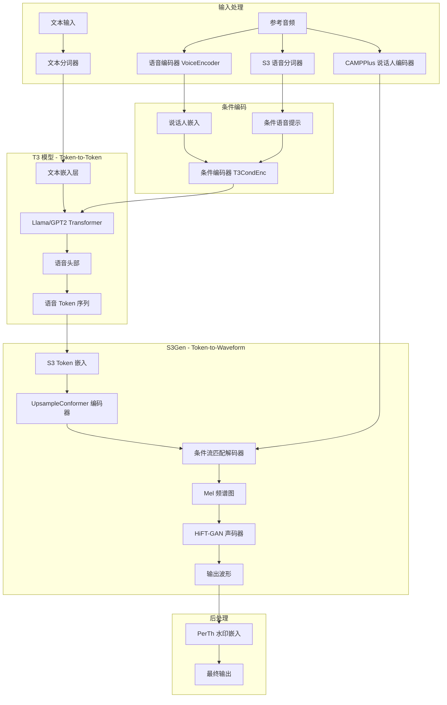

# Chatterbox TTS 技术学习报告

> 分析时间：2026-07-24  
> 分析版本：Chatterbox v0.1.7  
> 仓库地址：https://github.com/resemble-ai/chatterbox

---

## 1. 项目概述

### 1.1 仓库定位

**Chatterbox** 是由 Resemble AI 开发的**开源文本转语音（TTS）模型家族**，提供多种规模的模型以适应不同的部署场景。项目以 MIT 许可证发布，支持零样本语音克隆（Zero-shot Voice Cloning）。

### 1.2 主要功能

| 功能 | 描述 |
|------|------|
| **零样本 TTS** | 给定 5-10 秒参考音频即可克隆说话人声音 |
| **多语言支持** | V3 版本支持 23+ 种语言（含中文） |
| **副语言标签** | 原生支持 `[laugh]`、`[cough]`、`[chuckle]` 等情感标签 |
| **情绪控制** | 通过 `exaggeration` 参数控制表达夸张程度 |
| **语音转换** | 提供 Voice Conversion (VC) 功能 |
| **水印技术** | 内置 PerTh 神经网络水印，可追溯生成来源 |
| **多规模部署** | 110M (Nano)、350M (Turbo)、500M (V3) 三种规模 |

### 1.3 技术栈

```
核心框架：PyTorch 2.6.0 + torchaudio
LLM 骨干：LlamaModel / GPT2Model (HuggingFace Transformers)
音频处理：librosa, pyloudnorm
分词器：S3Tokenizer, AutoTokenizer
水印：perth (Resemble AI)
声码器：HiFT-GAN (HiFi-GAN + F0 预测器)
扩散模型：条件流匹配 (Conditional Flow Matching)
Conformer：UpsampleConformerEncoder
```

### 1.4 模型家族对比

| 模型 | 参数量 | 语言 | 核心特性 | 适用场景 |
|------|--------|------|----------|----------|
| **Chatterbox-Nano** | 110M | 英语 | CPU 3x 实时，单步解码 | 设备端/CPU 部署 |
| **Chatterbox-Turbo** | 350M | 英语 | 低延迟，副语言标签 | 语音 Agent、生产环境 |
| **Chatterbox-V3** | 500M | 23+ | 高说话人相似度，低幻觉 | 全球化应用 |
| **Single Language Pack** | 500M | 各语言独立 | 语言特化微调 | 优先语言/方言敏感应用 |

---

## 2. 核心架构分析

### 2.1 整体架构图



### 2.2 关键模块职责

| 模块 | 文件位置 | 职责 |
|------|----------|------|
| **ChatterboxTTS** | `tts.py` | 英语 TTS 主入口，协调所有子模块 |
| **ChatterboxTurboTTS** | `tts_turbo.py` | Turbo/Nano 版本入口，优化推理速度 |
| **ChatterboxMultilingualTTS** | `mtl_tts.py` | 多语言版本入口，支持 23+ 语言 |
| **T3** | `models/t3/t3.py` | Token-to-Token 核心模型，文本→语音 Token |
| **S3Gen** | `models/s3gen/s3gen.py` | Token-to-Waveform 解码器，语音 Token→波形 |
| **VoiceEncoder** | `models/voice_encoder/` | 说话人嵌入提取（基于 Real-Time-Voice-Cloning） |
| **CAMPPlus** | `models/s3gen/xvector.py` | 说话人向量编码器（来自 CosyVoice） |
| **HiFTGenerator** | `models/s3gen/hifigan.py` | 基于 HiFi-GAN 的声码器 |
| **CausalConditionalCFM** | `models/s3gen/flow_matching.py` | 条件流匹配解码器 |

### 2.3 模块交互流程

```
1. 预处理阶段 (prepare_conditionals):
   - 加载参考音频 (24kHz for S3Gen, 16kHz for T3)
   - 提取说话人嵌入 (VoiceEncoder + CAMPPlus)
   - 提取语音条件提示 Token (S3Tokenizer)
   - 封装为 T3Cond 对象

2. 推理阶段 (generate):
   - 文本标准化 (punc_norm)
   - 文本分词 (EnTokenizer / MTLTokenizer)
   - T3 模型推理: 文本 Token → 语音 Token
   - 语音 Token 后处理 (去除无效 Token)
   - S3Gen 推理: 语音 Token → Mel 频谱图
   - HiFT-GAN: Mel 频谱图 → 波形
   - 水印嵌入 (PerTh)
```

---

## 3. 关键代码模块深度解析

### 3.1 T3 模型 - Token-to-Token

#### 3.1.1 架构设计

T3 是 Chatterbox 的核心语言模型，负责将文本 Token 序列转换为语音 Token 序列。

```python
# 核心架构 (t3.py)
class T3(nn.Module):
    def __init__(self, hp=None):
        # 选择骨干网络：Llama 或 GPT2
        if self.is_gpt:
            self.tfmr = GPT2Model(self.cfg)
        else:
            self.tfmr = LlamaModel(self.cfg)
        
        # 条件编码器
        self.cond_enc = T3CondEnc(hp)
        
        # 嵌入层
        self.text_emb = nn.Embedding(hp.text_tokens_dict_size, self.dim)
        self.speech_emb = nn.Embedding(hp.speech_tokens_dict_size, self.dim)
        
        # 输出投影
        self.text_head = nn.Linear(self.cfg.hidden_size, hp.text_tokens_dict_size, bias=False)
        self.speech_head = nn.Linear(self.cfg.hidden_size, hp.speech_tokens_dict_size, bias=self.is_gpt)
```

#### 3.1.2 输入嵌入准备

```python
def prepare_input_embeds(self, *, t3_cond, text_tokens, speech_tokens, cfg_weight=0.0):
    # 条件嵌入
    cond_emb = self.prepare_conditioning(t3_cond)  # (B, len_cond, dim)
    
    # 文本嵌入
    text_emb = self.text_emb(text_tokens)  # (B, len_text, dim)
    if cfg_weight > 0.0 and not self.is_gpt:
        text_emb[1].zero_()  # CFG 无条件分支
    
    # 语音嵌入
    speech_emb = self.speech_emb(speech_tokens)
    
    # 拼接：[条件, 文本, 语音]
    embeds = torch.stack([
        torch.cat((ce, te, se))
        for ce, te, se in zip(cond_emb, text_emb, speech_emb)
    ])
    return embeds, len_cond
```

#### 3.1.3 推理流程

```python
@torch.inference_mode()
def inference(self, *, t3_cond, text_tokens, max_new_tokens=1000, 
              temperature=0.8, cfg_weight=0.5, ...):
    # 准备输入嵌入
    embeds, len_cond = self.prepare_input_embeds(...)
    
    # 使用 KV Cache 的自回归生成
    # 初始前向传播（无缓存）
    output = self.patched_model(inputs_embeds=inputs_embeds, use_cache=True)
    past = output.past_key_values
    
    # 生成循环
    for i in range(max_new_tokens):
        logits_step = output.logits[:, -1, :]
        
        # Classifier-Free Guidance
        cond = logits_step[0:1, :]
        uncond = logits_step[1:2, :]
        logits = cond + cfg_weight * (cond - uncond)
        
        # 采样策略
        logits = repetition_penalty_processor(ids, logits)
        logits = logits / temperature
        logits = min_p_warper(ids, logits)
        logits = top_p_warper(ids, logits)
        
        # 采样下一个 Token
        probs = torch.softmax(logits, dim=-1)
        next_token = torch.multinomial(probs, num_samples=1)
        
        # 使用 KV Cache 进行高效推理
        output = self.patched_model(
            inputs_embeds=next_token_embed,
            past_key_values=past,
            use_cache=True
        )
```

#### 3.1.4 Turbo 版本优化

```python
@torch.inference_mode()
def inference_turbo(self, t3_cond, text_tokens, temperature=0.8, 
                    top_k=1000, top_p=0.95, repetition_penalty=1.2):
    # 使用 HuggingFace LogitsProcessorList
    logits_processors = LogitsProcessorList()
    if temperature > 0 and temperature != 1.0:
        logits_processors.append(TemperatureLogitsWarper(temperature))
    if top_k > 0:
        logits_processors.append(TopKLogitsWarper(top_k))
    if top_p < 1.0:
        logits_processors.append(TopPLogitsWarper(top_p))
    if repetition_penalty != 1.0:
        logits_processors.append(RepetitionPenaltyLogitsProcessor(repetition_penalty))
    
    # 简化的推理流程（无 CFG）
    llm_outputs = self.tfmr(inputs_embeds=embeds, use_cache=True)
    # ... 自回归生成
```

### 3.2 S3Gen - Token-to-Waveform

#### 3.2.1 架构设计

S3Gen 将语音 Token 转换为波形，包含三个主要组件：

```python
class S3Token2Mel(torch.nn.Module):
    def __init__(self, meanflow=False):
        # S3 语音分词器
        self.tokenizer = S3Tokenizer("speech_tokenizer_v2_25hz")
        
        # 说话人编码器
        self.speaker_encoder = CAMPPlus(memory_efficient=False)
        
        # 上采样 Conformer 编码器
        encoder = UpsampleConformerEncoder(
            output_size=512,
            attention_heads=8,
            linear_units=2048,
            num_blocks=6,
        )
        
        # 条件解码器（CFM 估计器）
        estimator = ConditionalDecoder(
            in_channels=320,
            out_channels=80,
            causal=True,
            channels=[256],
            n_blocks=4,
            num_mid_blocks=12,
            num_heads=8,
        )
        
        # 条件流匹配解码器
        decoder = CausalConditionalCFM(
            spk_emb_dim=80,
            cfm_params=cfm_params,
            estimator=estimator,
        )
        
        # 流模块
        self.flow = CausalMaskedDiffWithXvec(
            encoder=encoder,
            decoder=decoder
        )
```

#### 3.2.2 条件流匹配 (CFM)

```python
class CausalConditionalCFM(ConditionalCFM):
    @torch.inference_mode()
    def forward(self, mu, mask, n_timesteps, temperature=1.0, 
                spks=None, cond=None, noised_mels=None, meanflow=False):
        B = mu.size(0)
        z = torch.randn_like(mu)  # 初始噪声
        
        # 时间步设置
        t_span = torch.linspace(0, 1, n_timesteps + 1, device=mu.device)
        if self.t_scheduler == 'cosine':
            t_span = 1 - torch.cos(t_span * 0.5 * torch.pi)
        
        if meanflow:
            # MeanFlow 模式：单步推理（蒸馏模型）
            return self.basic_euler(z, t_span=t_span, mu=mu, mask=mask, 
                                   spks=spks, cond=cond), None
        
        # 标准模式：多步 Euler 求解
        return self.solve_euler(z, t_span=t_span, mu=mu, mask=mask, 
                               spks=spks, cond=cond, meanflow=meanflow), None
    
    def solve_euler(self, x, t_span, mu, mask, spks, cond, meanflow=False):
        """固定 Euler 求解器"""
        for t, r in zip(t_span[:-1], t_span[1:]):
            # CFG：同时处理条件和无条件分支
            x_in[:B] = x_in[B:] = x
            mu_in[:B] = mu  # 条件分支有 mu
            # mu_in[B:] = 0  # 无条件分支无 mu
            
            dxdt = self.estimator.forward(
                x=x_in, mask=mask_in, mu=mu_in, t=t_in, 
                spks=spks_in, cond=cond_in, r=r_in if meanflow else None
            )
            
            # CFG 组合
            dxdt, cfg_dxdt = torch.split(dxdt, [B, B], dim=0)
            dxdt = ((1.0 + self.inference_cfg_rate) * dxdt 
                    - self.inference_cfg_rate * cfg_dxdt)
            
            # Euler 步进
            dt = r - t
            x = x + dt * dxdt
        
        return x.to(in_dtype)
```

#### 3.2.3 HiFT-GAN 声码器

```python
class S3Token2Wav(S3Token2Mel):
    def __init__(self, meanflow=False):
        super().__init__(meanflow)
        
        # F0 预测器
        f0_predictor = ConvRNNF0Predictor()
        
        # HiFT-GAN 声码器
        self.mel2wav = HiFTGenerator(
            sampling_rate=S3GEN_SR,  # 24000
            upsample_rates=[8, 5, 3],
            upsample_kernel_sizes=[16, 11, 7],
            source_resblock_kernel_sizes=[7, 7, 11],
            source_resblock_dilation_sizes=[[1, 3, 5], [1, 3, 5], [1, 3, 5]],
            f0_predictor=f0_predictor,
        )
        
        # 音频淡入处理（减少参考音频"溢出"）
        n_trim = S3GEN_SR // 50  # 20ms
        trim_fade = torch.zeros(2 * n_trim)
        trim_fade[n_trim:] = (torch.cos(torch.linspace(torch.pi, 0, n_trim)) + 1) / 2
        self.register_buffer("trim_fade", trim_fade, persistent=False)
```

### 3.3 说话人编码系统

#### 3.3.1 双编码器设计

Chatterbox 使用两个说话人编码器：

1. **VoiceEncoder** (LSTM) - 用于 T3 条件
2. **CAMPPlus** (x-vector) - 用于 S3Gen 条件

```python
# VoiceEncoder - 基于 Real-Time-Voice-Cloning
class VoiceEncoder(nn.Module):
    def __init__(self, hp=VoiceEncConfig()):
        self.lstm = nn.LSTM(self.hp.num_mels, self.hp.ve_hidden_size, 
                           num_layers=3, batch_first=True)
        self.proj = nn.Linear(self.hp.ve_hidden_size, self.hp.speaker_embed_size)
        
        # 余弦相似度缩放
        self.similarity_weight = nn.Parameter(torch.tensor([10.]))
        self.similarity_bias = nn.Parameter(torch.tensor([-5.]))
    
    def forward(self, mels):
        _, (hidden, _) = self.lstm(mels)
        raw_embeds = self.proj(hidden[-1])
        return raw_embeds / torch.linalg.norm(raw_embeds, dim=1, keepdim=True)
```

### 3.4 多语言支持

#### 3.4.1 语言特定分词器

```python
class MTLTokenizer:
    """多语言分词器，支持 23 种语言"""
    
    def text_to_tokens(self, text, language_id=None):
        # 根据语言选择分词策略
        # 支持：ar, da, de, el, en, es, fi, fr, he, hi, it, ja, ko, 
        #        ms, nl, no, pl, pt, ru, sv, sw, tr, zh
        pass
```

#### 3.4.2 语言模型版本管理

```python
MULTILINGUAL_T3_MODELS = {
    "v2": "t3_mtl23ls_v2.safetensors",
    "v3": "t3_mtl23ls_v3.safetensors",
}

def _resolve_multilingual_t3_model(t3_model: str | None) -> str:
    if t3_model is None:
        return DEFAULT_MULTILINGUAL_T3_MODEL
    if t3_model in MULTILINGUAL_T3_MODELS:
        return MULTILINGUAL_T3_MODELS[t3_model]
    if t3_model.endswith(".safetensors"):
        return t3_model
    raise ValueError(f"Unknown multilingual T3 model '{t3_model}'.")
```

---

## 4. 技术亮点与创新点

### 4.1 架构创新

#### 4.1.1 Token-to-Token + Token-to-Waveform 双阶段架构

```
传统 TTS：文本 → 音素 → 声学特征 → 波形
Chatterbox：文本 Token → 语音 Token → Mel → 波形
```

**优势**：
- 语音 Token 作为中间表示，便于跨语言迁移
- S3 Token 与语言无关，可复用相同的 S3Gen 解码器
- 支持流式生成（Token 级别）

#### 4.1.2 条件流匹配 (Conditional Flow Matching)

与传统扩散模型相比：
- **更快收敛**：支持 2 步推理（MeanFlow 模式）
- **更好的控制性**：条件引导更直接
- **训练稳定性**：避免 DDPM 的复杂噪声调度

```python
# MeanFlow 单步推理（Turbo/Nano 使用）
if meanflow:
    return self.basic_euler(z, t_span=t_span, mu=mu, mask=mask, 
                           spks=spks, cond=cond), None
```

#### 4.1.3 GPT2/Llama 混合骨干

```python
# 根据配置选择骨干网络
if self.is_gpt:
    self.tfmr = GPT2Model(self.cfg)  # Nano/Turbo
else:
    self.tfmr = LlamaModel(self.cfg)  # V3 多语言
```

**设计考量**：
- GPT2：轻量、快速，适合单语言
- Llama：更强的语言理解，适合多语言

### 4.2 性能优化

#### 4.2.1 KV Cache 推理

```python
# 初始前向传播（完整上下文）
output = self.patched_model(inputs_embeds=inputs_embeds, use_cache=True)
past = output.past_key_values

# 后续步只处理新 Token
for i in range(max_new_tokens):
    output = self.patched_model(
        inputs_embeds=next_token_embed,  # 单个 Token
        past_key_values=past,  # 使用缓存
        use_cache=True
    )
    past = output.past_key_values
```

**效果**：推理速度提升 3-5x

#### 4.2.2 Classifier-Free Guidance (CFG)

```python
# 训练时：随机丢弃条件
if self.training_cfg_rate > 0:
    cfg_mask = torch.rand(b, device=x1.device) > self.training_cfg_rate
    mu = mu * cfg_mask.view(-1, 1, 1)
    spks = spks * cfg_mask.view(-1, 1)

# 推理时：组合条件和无条件
cond = logits_step[0:1, :]
uncond = logits_step[1:2, :]
logits = cond + cfg_weight * (cond - uncond)
```

**参数调节**：
- `cfg_weight=0.5`：默认值，平衡质量和多样性
- `cfg_weight=0.0`：关闭 CFG，更快但质量略低

#### 4.2.3 多采样策略

```python
# 组合多种采样策略
logits_processors = LogitsProcessorList()
logits_processors.append(TemperatureLogitsWarper(temperature))  # 温度
logits_processors.append(TopKLogitsWarper(top_k))              # Top-K
logits_processors.append(TopPLogitsWarper(top_p))              # Top-P
logits_processors.append(MinPLogitsWarper(min_p))              # Min-P
logits_processors.append(RepetitionPenaltyLogitsProcessor(repetition_penalty))  # 重复惩罚
```

### 4.3 用户体验创新

#### 4.3.1 副语言标签支持

```python
# Turbo 模型原生支持
text = "Hi there [chuckle], have you got one minute?"
wav = model.generate(text, audio_prompt_path="ref.wav")
```

**支持的标签**：
- `[laugh]` - 笑声
- `[chuckle]` - 轻笑
- `[cough]` - 咳嗽
- 更多标签可在 Turbo 模型中使用

#### 4.3.2 情绪夸张控制

```python
# exaggeration 参数控制表达强度
# 0.0: 平静、中性
# 0.5: 默认，自然表达
# 1.0: 夸张、戏剧性
wav = model.generate(text, audio_prompt_path="ref.wav", exaggeration=0.7)
```

#### 4.3.3 响度归一化

```python
def norm_loudness(self, wav, sr, target_lufs=-27):
    """自动响度归一化"""
    meter = ln.Meter(sr)
    loudness = meter.integrated_loudness(wav)
    gain_db = target_lufs - loudness
    gain_linear = 10.0 ** (gain_db / 20.0)
    if math.isfinite(gain_linear) and gain_linear > 0.0:
        wav = wav * gain_linear
    return wav
```

### 4.4 负责任 AI

#### 4.4.1 PerTh 水印技术

```python
self.watermarker = perth.PerthImplicitWatermarker()

# 生成后自动添加水印
watermarked_wav = self.watermarker.apply_watermark(wav, sample_rate=self.sr)

# 提取水印验证
watermark = watermarker.get_watermark(audio, sample_rate=sr)
# 输出：0.0（无水印）或 1.0（有水印）
```

**特点**：
- 不可感知的神经网络水印
- 抗 MP3 压缩、音频编辑
- 近 100% 检测准确率

---

## 5. 可借鉴之处

### 5.1 可整合到 TTS_MultiModel 的技术

#### 5.1.1 S3 语音分词器

**适用场景**：替代现有 Mel 频谱图中间表示

```python
# 优势
- 离散化表示，便于序列建模
- 与语言无关，支持跨语言
- 支持流式处理

# 整合建议
1. 将 S3Tokenizer 集成到 TTS_MultiModel 的音频处理管线
2. 使用 S3 Token 作为 VITS/SoVITS 等模型的中间表示
3. 训练统一的 S3 Token 解码器
```

#### 5.1.2 条件流匹配 (CFM)

**适用场景**：替代 VAE/扩散模型的声学特征生成

```python
# 优势
- 推理速度快（2 步 vs 50+ 步）
- 训练稳定
- 条件控制精确

# 整合建议
1. 在 VITS 后端中引入 CFM 作为声码器
2. 替换 HiFi-GAN 的声码器方案
3. 实现 Turbo 模式的单步推理
```

#### 5.1.3 双说话人编码器

**适用场景**：提升语音克隆质量

```python
# VoiceEncoder (LSTM) - 用于 T3 条件
# CAMPPlus (x-vector) - 用于 S3Gen 条件

# 整合建议
1. 在 TTS_MultiModel 中实现类似的双编码器架构
2. 使用不同的编码器控制不同的生成阶段
3. 支持说话人嵌入的缓存和预计算
```

#### 5.1.4 副语言标签系统

**适用场景**：增强语音表达力

```python
# 整合建议
1. 在 TTS_MultiModel 中添加标签解析器
2. 训练支持情感标签的模型
3. 实现标签到情感参数的映射
```

### 5.2 架构模式

#### 5.2.1 模块化设计模式

```python
# Chatterbox 的模块化架构
class ChatterboxTTS:
    def __init__(self, t3, s3gen, ve, tokenizer, device, conds=None):
        self.t3 = t3              # 语言模型
        self.s3gen = s3gen        # 声码器
        self.ve = ve              # 说话人编码器
        self.tokenizer = tokenizer # 分词器
        self.conds = conds        # 条件缓存

# 建议：TTS_MultiModel 采用类似的模块化设计
# 每个引擎作为独立模块，共享公共接口
```

#### 5.2.2 条件缓存模式

```python
@dataclass
class Conditionals:
    t3: T3Cond      # T3 条件
    gen: dict        # S3Gen 条件
    
    def save(self, fpath):
        # 序列化条件
        torch.save(arg_dict, fpath)
    
    @classmethod
    def load(cls, fpath, map_location="cpu"):
        # 反序列化条件
        kwargs = torch.load(fpath, map_location=map_location)
        return cls(T3Cond(**kwargs['t3']), kwargs['gen'])

# 建议：为 TTS_MultiModel 实现类似的条件缓存
# 支持预计算和复用说话人嵌入
```

#### 5.2.3 多版本模型管理

```python
MULTILINGUAL_T3_MODELS = {
    "v2": "t3_mtl23ls_v2.safetensors",
    "v3": "t3_mtl23ls_v3.safetensors",
}

# 建议：TTS_MultiModel 实现类似的版本管理
# 支持不同版本的模型无缝切换
```

### 5.3 最佳实践

#### 5.3.1 文本预处理

```python
def punc_norm(text: str) -> str:
    """文本标准化"""
    # 1. 首字母大写
    # 2. 移除多余空格
    # 3. 替换不常见标点
    # 4. 确保句尾有标点
    return text

# 建议：统一的文本预处理管线
```

#### 5.3.2 音频后处理

```python
# 1. 响度归一化 (-27 LUFS)
# 2. 淡入处理（减少参考音频溢出）
# 3. 水印嵌入
# 4. 静音填充

# 建议：为 TTS_MultiModel 添加类似的后处理管线
```

#### 5.3.3 错误处理和回退

```python
@classmethod
def from_pretrained(cls, device, nano=False):
    try:
        local_path = snapshot_download(**download_kwargs)
    except Exception as e:
        if "xet" in str(e).lower():
            # 回退到标准下载路径
            hf_constants.HF_HUB_DISABLE_XET = True
            local_path = snapshot_download(**download_kwargs)
        else:
            raise

# 建议：实现类似的健壮性处理
```

### 5.4 兼容性注意事项

#### 5.4.1 依赖版本

```toml
# pyproject.toml 中的依赖
"torch==2.6.0"
"torchaudio==2.6.0"
"transformers==5.2.0"
"diffusers==0.29.0"
"conformer==0.3.2"

# 注意：
# 1. PyTorch 版本需要匹配 CUDA 版本
# 2. transformers 版本影响 Llama/GPT2 支持
# 3. conformer 用于 UpsampleConformerEncoder
```

#### 5.4.2 模型格式

```python
# 使用 safetensors 格式
from safetensors.torch import load_file

# 优势：
# - 更安全（无代码执行）
# - 更快的加载速度
# - 更小的文件大小

# 建议：TTS_MultiModel 统一使用 safetensors
```

#### 5.4.3 设备兼容

```python
# MPS (macOS) 支持检查
if device == "mps" and not torch.backends.mps.is_available():
    if not torch.backends.mps.is_built():
        print("MPS not available because PyTorch not built with MPS.")
    else:
        print("MPS not available because macOS < 12.3.")
    device = "cpu"

# CPU/MPS 设备映射
if device in ["cpu", "mps"]:
    map_location = torch.device('cpu')
else:
    map_location = None

# 建议：TTS_MultiModel 实现类似的设备检测和回退
```

---

## 6. 参考资源

### 6.1 关键论文

| 论文 | 相关技术 |
|------|----------|
| **Llama 2** (Meta) | T3 骨干网络 |
| **CosyVoice** (阿里) | S3Gen, Flow Matching |
| **Real-Time-Voice-Cloning** | VoiceEncoder |
| **HiFi-GAN** | 声码器 |
| **S3Tokenizer** | 语音分词器 |
| **Classifier-Free Diffusion Guidance** | CFG 技术 |
| **Flow Matching for Generative Modeling** | CFM 理论 |

### 6.2 官方资源

- **GitHub**: https://github.com/resemble-ai/chatterbox
- **HuggingFace**: https://huggingface.co/ResembleAI
- **Demo**: https://resemble-ai.github.io/chatterbox_demopage/
- **Discord**: https://discord.gg/rJq9cRJBJ6
- **文档**: https://github.com/resemble-ai/chatterbox#readme

### 6.3 模型下载

| 模型 | HuggingFace 链接 |
|------|------------------|
| Chatterbox-Turbo | https://huggingface.co/ResembleAI/chatterbox-turbo |
| Chatterbox-Nano | https://huggingface.co/ResembleAI/chatterbox-nano |
| Chatterbox-Multilingual-V3 | https://huggingface.co/ResembleAI/chatterbox |
| Chinese | https://huggingface.co/ResembleAI/Chatterbox-Multilingual-zh-cmn |

### 6.4 相关项目参考

- **CosyVoice**: https://github.com/FunAudioLLM/CosyVoice
- **Real-Time-Voice-Cloning**: https://github.com/CorentinJ/Real-Time-Voice-Cloning
- **HiFT-GAN**: https://github.com/yl4579/HiFTNet
- **S3Tokenizer**: https://github.com/xingchensong/S3Tokenizer

---

## 附录 A：文件结构

```
reference_repos/chatterbox/
├── src/chatterbox/
│   ├── __init__.py
│   ├── tts.py                    # 英语 TTS 主入口
│   ├── tts_turbo.py              # Turbo/Nano 入口
│   ├── mtl_tts.py                # 多语言入口
│   ├── vc.py                     # 语音转换
│   └── models/
│       ├── t3/
│       │   ├── t3.py             # T3 核心模型
│       │   ├── llama_configs.py  # Llama/GPT2 配置
│       │   ├── inference/        # 推理后端
│       │   └── modules/
│       │       ├── cond_enc.py   # 条件编码器
│       │       └── t3_config.py  # T3 配置
│       ├── s3gen/
│       │   ├── s3gen.py          # S3Gen 模型
│       │   ├── flow.py           # 流模块
│       │   ├── flow_matching.py  # CFM 实现
│       │   ├── decoder.py        # 条件解码器
│       │   ├── hifigan.py        # HiFT-GAN
│       │   ├── xvector.py        # CAMPPlus
│       │   └── transformer/      # Conformer 编码器
│       ├── s3tokenizer/          # S3 语音分词器
│       ├── tokenizers/           # 文本分词器
│       └── voice_encoder/        # 说话人编码器
├── pyproject.toml
└── README.md
```

## 附录 B：关键配置

```python
# T3Config (t3_config.py)
@dataclass
class T3Config:
    # 模型类型
    llama_config_name: str = "Llama3"
    
    # 词表大小
    text_tokens_dict_size: int = 128256
    speech_tokens_dict_size: int = 6561
    
    # 位置编码
    input_pos_emb: str = "learned"
    
    # 条件配置
    speech_cond_prompt_len: int = 375
    
    # 情感控制
    emotion_adv: bool = True
    
    # 特殊 Token
    start_text_token: int = 128256
    stop_text_token: int = 128257
    start_speech_token: int = 6561
    stop_speech_token: int = 6562

# CFM 配置
CFM_PARAMS = {
    "sigma_min": 1e-06,
    "solver": "euler",
    "t_scheduler": "cosine",
    "training_cfg_rate": 0.2,
    "inference_cfg_rate": 0.7,
    "reg_loss_type": "l1"
}
```

---

**报告完成时间**: 2026-07-24  
**分析深度**: 核心架构 + 关键代码  
**建议整合优先级**: 
1. S3 语音分词器（高）
2. 条件流匹配（高）
3. 双说话人编码器（中）
4. 副语言标签系统（中）
5. 条件缓存模式（低）
