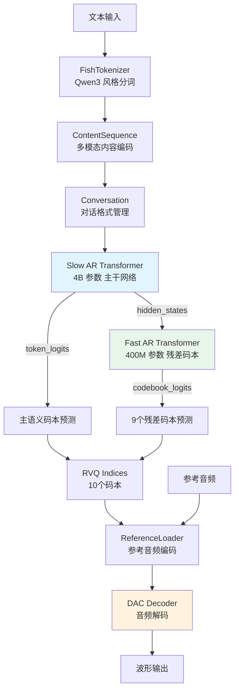
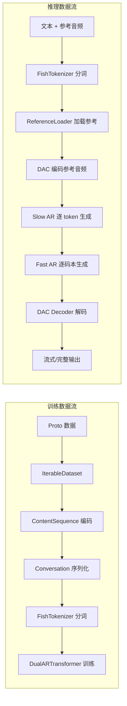

# Fish Speech 技术学习报告

> 仓库地址：[Fish Audio S2](https://github.com/fishaudio/fish-speech)
> 分析日期：2026-07-24
> 报告类型：参考仓库深度技术分析

---

## 1. 项目概述

### 1.1 仓库定位

Fish Speech（Fish Audio S2）是由 Fish Audio 开发的**业界领先的多语言文本到语音（TTS）系统**，在开源和闭源系统中均处于领先水平。其旗舰模型 S2 Pro 拥有 **4B 参数**，在超过 **1000 万小时**音频数据上训练，覆盖 **80+ 种语言**。

### 1.2 主要功能

| 功能维度 | 详细描述 |
|---------|---------|
| **文本到语音** | 高质量多语言 TTS 合成，支持 80+ 语言 |
| **语音克隆** | 使用 10-30 秒参考音频快速克隆声音（音色、风格、情感） |
| **情感控制** | 15000+ 独特情感标签（如 `[whisper]`、`[excited]`、`[angry]`），可内联嵌入文本 |
| **多说话人生成** | 原生支持多说话人对话生成，使用 `<|speaker:i|>` token 控制 |
| **多轮对话** | 支持多轮对话上下文，提升后续生成的自然度 |
| **流式输出** | 极致流式性能，RTF 0.195，TTFA ~100ms |

### 1.3 技术栈

| 层次 | 技术选型 |
|-----|---------|
| **深度学习框架** | PyTorch + PyTorch Lightning |
| **配置管理** | Hydra + OmegaConf |
| **模型架构** | Dual-AR Transformer + RVQ DAC 编解码器 |
| **分词器** | HuggingFace Transformers (Qwen3 风格) |
| **推理加速** | SGLang / vLLM / torch.compile |
| **数据格式** | Protocol Buffers (protobuf) |
| **训练策略** | GRPO (Group Relative Policy Optimization) RL 对齐 |

### 1.4 基准测试表现

| 基准测试 | Fish Audio S2 表现 |
|---------|------------------|
| Seed-TTS Eval WER（中文） | **0.54%**（最佳） |
| Seed-TTS Eval WER（英文） | **0.99%**（最佳） |
| Audio Turing Test | **0.515** 后验均值 |
| EmergentTTS-Eval Win Rate | **81.88%**（最高） |

---

## 2. 核心架构分析

### 2.1 整体架构图



### 2.2 关键模块职责与交互

| 模块 | 职责 | 关键文件 |
|------|------|---------|
| **FishTokenizer** | 文本分词 + 语义 token 映射（4096 个语义 token） | `tokenizer.py` |
| **ContentSequence** | 多模态内容序列编码（文本/VQ/音频交错） | `content_sequence.py` |
| **Conversation** | 对话格式管理，支持多轮对话和多说话人 | `conversation.py` |
| **BaseTransformer** | 慢速 AR 主干网络，处理时间轴语义 | `text2semantic/llama.py` |
| **DualARTransformer** | 双 AR 架构实现，含快速 AR 子网络 | `text2semantic/llama.py` |
| **DAC** | 深度音频编解码器，RVQ 量化 + 上/下采样 | `dac/modded_dac.py` |
| **DownsampleResidualVectorQuantize** | 下采样残差向量量化器 | `dac/rvq.py` |
| **TTSInferenceEngine** | 推理引擎，协调 LLaMA 和解码器 | `inference_engine/__init__.py` |
| **ReferenceLoader** | 参考音频加载、缓存、编码管理 | `inference_engine/reference_loader.py` |
| **VQManager** | VQ token 到音频波形的解码管理 | `inference_engine/vq_manager.py` |

### 2.3 数据流



---

## 3. 关键代码模块深度解析

### 3.1 模型训练流程

#### 训练入口 (`fish_speech/train.py`)

训练脚本基于 **Hydra + PyTorch Lightning** 构建，核心特点：

```python
# train.py 核心训练流程
@hydra.main(version_base="1.3", config_path="./configs")
def main(cfg: DictConfig) -> Optional[float]:
    train(cfg)

def train(cfg: DictConfig) -> tuple[dict, dict]:
    datamodule = hydra.utils.instantiate(cfg.data)
    model = hydra.utils.instantiate(cfg.model)
    trainer = hydra.utils.instantiate(cfg.trainer, callbacks=callbacks, logger=logger)
    
    # 自动恢复最新检查点
    resume_ckpt_path = utils.get_latest_checkpoint(cfg.paths.ckpt_dir)
    if resume_ckpt_path is not None:
        ckpt_path = resume_ckpt_path
        auto_resume = True
    
    trainer.fit(model=model, datamodule=datamodule, ckpt_path=ckpt_path)
```

关键设计：
- **自动断点续训**：自动检测并恢复最新检查点
- **权重恢复模式**：支持仅恢复权重（`resume_weights_only`）用于迁移学习
- **DDP 多卡训练**：NCCL 后端，BF16 混合精度

#### 训练配置 (`configs/text2semantic_finetune.yaml`)

```yaml
# 微调配置
trainer:
  accumulate_grad_batches: 1
  gradient_clip_val: 1.0
  max_steps: 10000
  precision: bf16-true
  val_check_interval: 100

model:
  _target_: fish_speech.models.text2semantic.lit_module.TextToSemantic
  model:
    _target_: fish_speech.models.text2semantic.llama.BaseTransformer.from_pretrained
    path: ${pretrained_ckpt_path}
    load_weights: true
  
  optimizer:
    _target_: torch.optim.AdamW
    lr: 1e-4
    betas: [0.9, 0.95]
```

### 3.2 数据处理管线

#### 数据集设计 (`datasets/semantic.py`)

`AutoTextSemanticInstructionIterableDataset` 是核心数据集类：

```python
class AutoTextSemanticInstructionIterableDataset(IterableDataset):
    """
    自动增强数据集设计：
    1. 随机拼接同一说话人的多个句子形成更长序列
    2. 自动文本归一化
    3. 交互模式：<s> [INST] [SPK: speaker] text [/INST] ... </s>
    4. 非交互模式：<s> [INST] text [/INST] ... </s>
    """
    def __init__(self, proto_files, seed=42, interactive_prob=0.5, 
                 max_length=1024, tokenizer=None, use_speaker=True):
        self.interactive_prob = interactive_prob
        self.max_length = max_length
```

关键设计特点：
- **Protobuf 数据格式**：使用 Protocol Buffers 存储训练数据
- **多 Worker 分片**：支持 DDP 多卡 + 多 Worker 的数据分片
- **动态拼接**：随机拼接同一说话人的多句话，增加序列多样性
- **交互/非交互模式切换**：通过 `interactive_prob` 控制训练时的对话格式

#### 内容序列编码 (`content_sequence.py`)

```python
@dataclass
class ContentSequence:
    """灵活的多模态交错格式"""
    parts: list[BasePart] = field(default_factory=list)
    modality: Literal["text", "voice", "interleave"] | None = None

# 支持三种内容类型
class TextPart(BasePart):    # 文本部分
    text: str | None = None
    tokens: list[int] | None = None

class VQPart(BasePart):      # VQ 码本部分
    codes: torch.Tensor

class AudioPart(BasePart):   # 音频特征部分
    features: torch.Tensor
```

### 3.3 推理流程（从文本到语音）

推理流程由 `TTSInferenceEngine` 协调，分为三个阶段：

#### 阶段一：参考音频编码

```python
# reference_loader.py
class ReferenceLoader:
    def load_by_hash(self, references, use_cache):
        """通过哈希加载参考音频并编码为 VQ tokens"""
        for ref in references:
            prompt_tokens.append(
                self.encode_reference(
                    reference_audio=ref.audio,
                    enable_reference_audio=True,
                )
            )
```

```python
# vq_manager.py
class VQManager:
    def encode_reference(self, reference_audio, enable_reference_audio):
        """将参考音频编码为 VQ tokens"""
        audios = torch.from_numpy(reference_audio_content).to(device)[None, None, :]
        prompt_tokens = self.decoder_model.encode(audios, audio_lengths)[0][0]
        return prompt_tokens
```

#### 阶段二：Slow AR 生成主语义码本

```python
# inference.py
def decode_one_token_ar(model, x, input_pos, temperature, top_p, top_k, 
                         semantic_logit_bias, audio_masks, audio_parts,
                         previous_tokens=None):
    """单步 AR 解码：Slow AR + Fast AR"""
    
    # Slow AR: 预测主语义 token
    forward_result = model.forward_generate(x, input_pos, 
                                             audio_masks=audio_masks,
                                             audio_parts=audio_parts)
    logits = forward_result.logits
    hidden_states = forward_result.hidden_states
    
    # 约束解码：仅允许语义 token + im_end
    biased_logits = logits + semantic_logit_bias
    
    # RAS (Repetition Aware Sampling): 避免重复
    main_token_normal = sample(biased_logits, temperature, top_p, top_k)[0]
    main_token_high = sample(biased_logits, high_temp, high_top_p, top_k)[0]
    
    # 如果 token 在之前窗口中重复，使用高温采样
    if previous_tokens is not None:
        in_window = (previous_tokens[0] == main_token_normal).any()
        is_semantic = (main_token_normal >= model.config.semantic_begin_id) & \
                      (main_token_normal <= model.config.semantic_end_id)
        should_use_high = in_window & is_semantic
        main_token_normal = torch.where(should_use_high, main_token_high, main_token_normal)
    
    codebooks = [main_token_normal]
```

#### 阶段三：Fast AR 生成残差码本

```python
    # Fast AR: 逐码本预测剩余 9 个残差码本
    hidden_states = model.fast_embeddings(a)
    codebooks.append(a)
    
    for codebook_idx in range(1, model.config.num_codebooks):
        input_pos = torch.tensor([codebook_idx], device=hidden_states.device)
        logits = model.forward_generate_fast(hidden_states, input_pos)
        
        # 残差码本无约束解码
        a = sample(logits, temperature, top_p, top_k)[0]
        hidden_states = model.fast_embeddings(a)
        codebooks.append(a)
    
    codebooks = torch.stack(codebooks, dim=1)
    return codebooks.T
```

#### 阶段四：DAC 解码为波形

```python
# inference_engine/__init__.py
def get_audio_segment(self, result):
    """将 VQ tokens 解码为音频波形"""
    with autocast_exclude_mps(device_type=self.decoder_model.device.type, dtype=self.precision):
        segment = self.decode_vq_tokens(codes=result.codes)
    return segment.float().cpu().numpy()

# vq_manager.py
def decode_vq_tokens(self, codes):
    """调用 DAC 模型解码 VQ tokens"""
    return self.decoder_model.from_indices(codes[None])[0].squeeze()
```

### 3.4 优化技术

#### 3.4.1 Repetition Aware Sampling (RAS)

```python
# inference.py
RAS_WIN_SIZE = 10      # 滑动窗口大小
RAS_HIGH_TEMP = 1.0    # 高温采样温度
RAS_HIGH_TOP_P = 0.9   # 高温采样 top_p

# 逻辑：如果当前 token 在之前窗口中出现过，使用高温采样避免重复
in_window = (previous_tokens[0] == main_token_normal).any()
should_use_high = in_window & is_semantic
main_token_normal = torch.where(should_use_high, main_token_high, main_token_normal)
```

#### 3.4.2 KV Cache 优化

```python
# llama.py
class KVCache(nn.Module):
    """KV 缓存用于加速自回归推理"""
    def __init__(self, max_batch_size, max_seq_len, n_heads, head_dim, dtype=torch.bfloat16):
        cache_shape = (max_batch_size, n_heads, max_seq_len, head_dim)
        self.register_buffer("k_cache", torch.zeros(cache_shape, dtype=dtype))
        self.register_buffer("v_cache", torch.zeros(cache_shape, dtype=dtype))
    
    def update(self, input_pos, k_val, v_val):
        """增量更新 KV 缓存"""
        k_out[:, :, input_pos] = k_val
        v_out[:, :, input_pos] = v_val
        return k_out[:, :, :input_pos.max() + 1, :], v_out[:, :, :input_pos.max() + 1, :]
```

#### 3.4.3 Flash Attention + SDPA

```python
# llama.py - Attention 模块
class Attention(nn.Module):
    def forward(self, x, freqs_cis, mask, input_pos=None):
        if self.use_sdpa:
            if mask is None:
                with sdpa_kernel(SDPBackend.FLASH_ATTENTION):
                    y = F.scaled_dot_product_attention(q, k, v, 
                        dropout_p=self.dropout if self.training else 0.0,
                        is_causal=True)
            else:
                y = F.scaled_dot_product_attention(q, k, v, 
                    attn_mask=mask, dropout_p=self.dropout if self.training else 0.0)
        else:
            y = self.eq_scaled_dot_product_attention(q, k, v, attn_mask=mask)
```

#### 3.4.4 梯度检查点

```python
# llama.py - BaseTransformer
for layer in self.layers:
    if self.config.use_gradient_checkpointing and self.training:
        x = checkpoint(layer, x, freqs_cis, mask, use_reentrant=True)
    else:
        x = layer(x, freqs_cis, mask)
```

---

## 4. 技术亮点与创新点

### 4.1 双自回归（Dual-AR）架构

**核心创新**：将语音生成分解为两个层次的自回归过程：

```python
# llama.py - DualARModelArgs
@dataclass
class DualARModelArgs(BaseModelArgs):
    model_type: str = "dual_ar"
    # Slow AR 参数（4B）
    n_layer: int = 32
    n_head: int = 32
    dim: int = 4096
    # Fast AR 参数（400M）
    n_fast_layer: int = 4
    fast_dim: int = 4096
    fast_n_head: int = 32
```

**架构设计**：
1. **Slow AR (4B 参数)**：沿时间轴运行，预测主语义码本（~21 Hz）
2. **Fast AR (400M 参数)**：在每个时间步内，逐层预测 9 个残差码本

**优势**：
- 主语义码本捕获高层语义信息，残差码本补充声学细节
- 非对称设计：主要计算集中在 Slow AR，Fast AR 轻量化
- 结构与标准 LLM 同构，可直接复用 SGLang/vLLM 推理优化

### 4.2 下采样残差向量量化（Downsample RVQ）

```python
# rvq.py - DownsampleResidualVectorQuantize
class DownsampleResidualVectorQuantize(nn.Module):
    def __init__(self, input_dim=1024, n_codebooks=9, codebook_dim=8,
                 codebook_size=1024, semantic_codebook_size=4096,
                 downsample_factor=(2, 2)):
        
        # 语义量化器（单独处理主码本）
        self.semantic_quantizer = ResidualVectorQuantize(
            input_dim=input_dim, n_codebooks=1,
            codebook_size=semantic_codebook_size, codebook_dim=codebook_dim)
        
        # 残差量化器（处理剩余码本）
        self.quantizer = ResidualVectorQuantize(
            input_dim=input_dim, n_codebooks=n_codebooks,
            codebook_size=codebook_size, codebook_dim=codebook_dim)
        
        # 下采样网络
        self.downsample = nn.Sequential(
            *[nn.Sequential(
                CausalConvNet(all_dims[idx], all_dims[idx+1], 
                             kernel_size=factor, stride=factor),
                ConvNeXtBlock(dim=all_dims[idx+1])
            ) for idx, factor in enumerate(downsample_factor)]
        )
    
    def forward(self, z, n_quantizers=None, semantic_len=None):
        z = self.downsample(z)
        z = self.pre_module(z)
        
        # 语义量化
        semantic_z, semantic_codes, ... = self.semantic_quantizer(z)
        residual_z = z - semantic_z
        
        # 残差量化
        residual_z, codes, ... = self.quantizer(residual_z, n_quantizers=n_quantizers)
        
        # 合并结果
        z = semantic_z + residual_z
        codes = torch.cat([semantic_codes, codes], dim=1)
```

**创新点**：
- 语义码本与残差码本分离量化，避免语义信息被声学细节淹没
- 下采样因子 `(2, 2)` 将帧率降低 4 倍，提升量化效率
- ConvNeXt 块增强局部特征提取

### 4.3 细粒度内联情感控制

支持 15000+ 独特标签，使用 `[tag]` 语法在文本任意位置嵌入情感指令：

```python
# tokenizer.py
SEMANTIC_TOKEN_TEMPLATE = "<|semantic:{i}|>"
SEMANTIC_TOKENS = [SEMANTIC_TOKEN_TEMPLATE.format(i=i) for i in range(4096)]

# 支持的标签示例
SUPPORTED_TAGS = [
    "[pause]", "[emphasis]", "[laughing]", "[whisper]", "[angry]",
    "[excited]", "[sigh]", "[screaming]", "[shouting]", "[singing]",
    "[professional broadcast tone]", "[pitch up]", "[low voice]"
]
```

**实现机制**：
- 标签被解析为语义 token，直接影响 Slow AR 的生成
- 模型在训练时学习了标签与语音特征的对应关系
- 支持自由格式文本描述，不限于固定预设

### 4.4 RL 对齐训练（GRPO）

```python
# llama.py - BaseModelArgs
@dataclass
class BaseModelArgs:
    is_reward_model: bool = False  # 支持奖励模型模式
    
    # 多维度奖励信号：
    # - 语义准确性
    # - 指令遵循度
    # - 声学偏好评分
    # - 音色相似度
```

**GRPO 优势**：
- 使用同一模型套件进行数据清洗和标注，作为奖励模型
- 完美解决预训练数据与后训练目标之间的分布不匹配问题
- 多维度奖励信号确保生成语音既自然又符合指令

### 4.5 结构化推理引擎设计

```python
# inference_engine/__init__.py
class TTSInferenceEngine(ReferenceLoader, VQManager):
    """推理引擎采用组合模式设计"""
    
    def __init__(self, llama_queue, decoder_model, precision, compile):
        super().__init__()
        self.llama_queue = llama_queue      # 队列化 LLaMA 请求
        self.decoder_model = decoder_model  # DAC 解码器
    
    @torch.inference_mode()
    def inference(self, req: ServeTTSRequest) -> Generator[InferenceResult, None, None]:
        """流式推理：yield 每个音频片段"""
        # 1. 加载参考音频
        prompt_tokens, prompt_texts = self.load_by_hash(req.references, req.use_memory_cache)
        
        # 2. 发送 LLaMA 请求
        response_queue = self.send_Llama_request(req, prompt_tokens, prompt_texts)
        
        # 3. 流式接收结果
        while True:
            wrapped_result = response_queue.get()
            segment = self.get_audio_segment(result)
            yield InferenceResult(code="segment", audio=(sample_rate, segment))
```

**设计亮点**：
- **队列化异步处理**：LLaMA 和 DAC 解码器通过队列解耦
- **流式输出**：支持逐片段 yield，降低首包延迟
- **内存管理**：推理完成后自动清理 CUDA 缓存

---

## 5. 可借鉴之处

### 5.1 可整合到 TTS_MultiModel 的具体技术

#### 5.1.1 Dual-AR 架构模式

**适用场景**：TTS_MultiModel 中需要高质量语音合成的引擎

**整合建议**：
```python
# 建议在 TTS_MultiModel 中实现类似的双 AR 架构
class DualAREngine:
    """双 AR 语音合成引擎"""
    
    def __init__(self):
        self.slow_ar = SlowARTransformer()   # 语义生成
        self.fast_ar = FastARTransformer()   # 声学细节
        self.vq_decoder = DACDecoder()       # 波形解码
    
    def synthesize(self, text, reference_audio=None):
        # 1. Slow AR 生成主语义码本
        semantic_tokens = self.slow_ar.generate(text, reference_audio)
        
        # 2. Fast AR 生成残差码本
        acoustic_tokens = self.fast_ar.generate(semantic_tokens)
        
        # 3. 解码为波形
        waveform = self.vq_decoder.decode(acoustic_tokens)
        return waveform
```

#### 5.1.2 Repetition Aware Sampling (RAS)

**适用场景**：所有自回归生成模型（TTS、LLM 等）

**整合建议**：
```python
class RepetitionAwareSampler:
    """避免重复的采样策略"""
    
    def __init__(self, window_size=10, high_temp=1.0, high_top_p=0.9):
        self.window_size = window_size
        self.high_temp = high_temp
        self.high_top_p = high_top_p
        self.previous_tokens = deque(maxlen=window_size)
    
    def sample(self, logits, temperature, top_p):
        # 正常采样
        normal_token = self._sample(logits, temperature, top_p)
        
        # 高温采样（备用）
        high_token = self._sample(logits, self.high_temp, self.high_top_p)
        
        # 检查是否在窗口中重复
        if normal_token in self.previous_tokens:
            token = high_token
        else:
            token = normal_token
        
        self.previous_tokens.append(token)
        return token
```

#### 5.1.3 下采样 RVQ 量化器

**适用场景**：TTS_MultiModel 中需要音频编码/解码的引擎

**整合建议**：
```python
# 在 TTS_MultiModel 的音频处理模块中引入下采样 RVQ
class DownsampleRVQ:
    """下采样残差向量量化器"""
    
    def __init__(self, semantic_codebook_size=4096, 
                 residual_codebook_size=1024, 
                 num_residual_codebooks=9,
                 downsample_factor=(2, 2)):
        self.semantic_quantizer = VectorQuantize(
            codebook_size=semantic_codebook_size, dim=8)
        self.residual_quantizer = ResidualVectorQuantize(
            n_codebooks=num_residual_codebooks,
            codebook_size=residual_codebook_size)
        self.downsample = DownsampleNetwork(factor=downsample_factor)
```

#### 5.1.4 流式推理架构

**适用场景**：TTS_MultiModel 的实时 TTS 服务

**整合建议**：
```python
# 借鉴 TTSInferenceEngine 的流式设计
class StreamingTTSEngine:
    """流式 TTS 推理引擎"""
    
    def __init__(self):
        self.llama_queue = Queue()
        self.decoder_model = None
    
    def inference_stream(self, request):
        """流式推理生成器"""
        # 发送请求到 LLaMA
        response_queue = self._send_request(request)
        
        # 流式接收结果
        while True:
            result = response_queue.get()
            if result.status == "done":
                break
            
            # 解码并 yield 音频片段
            audio_segment = self._decode_vq_tokens(result.codes)
            yield audio_segment
```

### 5.2 架构模式与最佳实践

#### 5.2.1 Hydra + Lightning 训练框架

**优势**：
- 配置管理清晰，支持层级覆盖
- 自动断点续训，无需手动管理
- Lightning 封装训练循环，减少样板代码

**建议**：TTS_MultiModel 可采用类似的训练框架管理多个引擎的训练。

#### 5.2.2 组合式推理引擎设计

```python
# ReferenceLoader + VQManager + TTSInferenceEngine
class TTSInferenceEngine(ReferenceLoader, VQManager):
    """通过多继承组合功能"""
```

**优势**：
- 模块化设计，易于扩展
- 职责分离，便于测试
- 复用已有组件

#### 5.2.3 队列化异步处理

```python
# LLaMA 和 DAC 通过队列解耦
response_queue = queue.Queue()
self.llama_queue.put(GenerateRequest(request=request, response_queue=response_queue))
```

**优势**：
- 解耦生产者和消费者
- 支持流式处理
- 天然支持并发

### 5.3 需要注意的兼容性问题

#### 5.3.1 模型规模

- S2 Pro 有 4B 参数，对 GPU 显存要求高（建议 24GB+ VRAM）
- TTS_MultiModel 需要考虑轻量化版本或模型分片

#### 5.3.2 依赖版本

```txt
# Fish Speech 的关键依赖
torch>=2.0.0
pytorch-lightning>=2.0.0
hydra-core>=1.3.0
safetensors>=0.3.0
torchaudio>=2.0.0
```

**兼容性注意事项**：
- `torchaudio 2.9+` 移除了 `list_audio_backends()`，需要条件导入
- `flash-attn` 需要特定 CUDA 版本支持
- `triton` 在 Windows 上支持有限

#### 5.3.3 许可证

- Fish Speech 使用 **FISH AUDIO RESEARCH LICENSE**
- 商用需要额外授权
- 需要检查与 TTS_MultiModel 许可证的兼容性

#### 5.3.4 数据格式

- 训练数据使用 Protocol Buffers 格式
- 需要 `.proto` 文件定义数据结构
- TTS_MultiModel 如需复用，需要适配数据管线

---

## 6. 参考资源

### 6.1 关键论文

| 论文 | 链接 | 说明 |
|------|------|------|
| Fish-Speech v1.4 Technical Report | [arXiv:2411.01156](https://arxiv.org/abs/2411.01156) | 初始版本技术报告 |
| Fish Audio S2 Technical Report | [arXiv:2603.08823](https://arxiv.org/abs/2603.08823) | S2 Pro 技术报告 |
| DAC (Descript Audio Codec) | [GitHub](https://github.com/descriptinc/descript-audio-codec) | 音频编解码器基础 |
| Residual Vector Quantization | [arXiv:2107.03312](https://arxiv.org/abs/2107.03312) | RVQ 基础论文 |

### 6.2 官方文档

| 资源 | 链接 |
|------|------|
| 安装指南 | [speech.fish.audio/install](https://speech.fish.audio/install/) |
| 命令行推理 | [speech.fish.audio/inference](https://speech.fish.audio/inference/#command-line-inference) |
| WebUI 推理 | [speech.fish.audio/inference#webui](https://speech.fish.audio/inference/#webui-inference) |
| 服务器推理 | [speech.fish.audio/server](https://speech.fish.audio/server/) |
| HuggingFace 模型 | [fishaudio/s2-pro](https://huggingface.co/fishaudio/s2-pro) |

### 6.3 社区资源

| 资源 | 链接 |
|------|------|
| Discord 社区 | [discord.gg/Es5qTB9BcN](https://discord.gg/Es5qTB9BcN) |
| Docker Hub | [fishaudio/fish-speech](https://hub.docker.com/r/fishaudio/fish-speech) |
| Fish Audio 官网 | [fish.audio](https://fish.audio/) |

### 6.4 相关项目

| 项目 | 说明 |
|------|------|
| [Bert-VITS2](https://github.com/fishaudio/Bert-VITS2) | Fish Audio 的早期 VITS2 项目 |
| [GPT-SoVITS](https://github.com/RVC-Boss/GPT-SoVITS) | 相关的 GPT-SoVITS 架构 |
| [SGLang-Omni](https://github.com/sgl-project/sglang-omni) | S2 Pro 的 SGLang 推理加速 |
| [vLLM-Omni](https://github.com/vllm-project/vllm-omni) | S2 Pro 的 vLLM 推理加速 |

---

> **报告完成**：本报告基于 Fish Speech 仓库的实际代码分析，涵盖了项目概述、架构设计、核心模块解析、技术亮点、可借鉴之处和参考资源。重点分析了 Dual-AR 架构、RVQ 量化、RAS 采样、流式推理等关键技术，为 TTS_MultiModel 项目提供了具体的整合建议。
